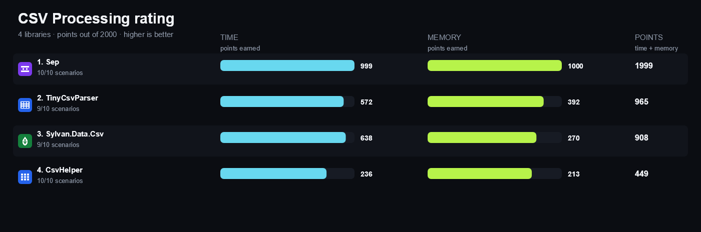
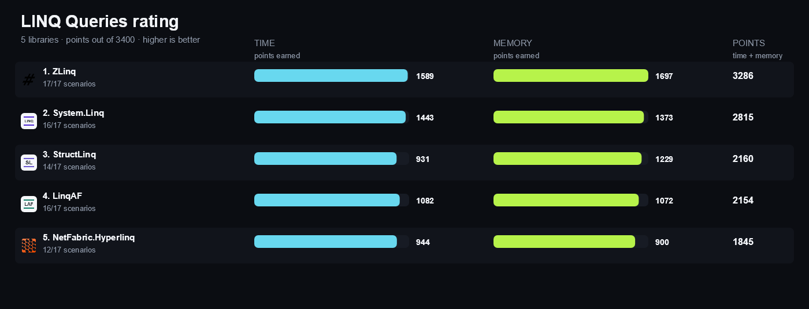

<!-- Generated by build/Templates/Readme.cshtml. Do not edit README.md directly. -->

  

<h1 align="center"><a href="https://matrix.dev-team.org/">.NET Matrix</a></h1>

  <strong>Evidence, not faith.</strong> 
  Choose .NET libraries with confidence using reproducible feature,
  execution-time and allocation comparisons.

  <a href="https://matrix.dev-team.org/"><strong>Open the interactive matrix →</strong></a>
  ·
  <a href="#how-to-read-the-results">How to read the results</a>
  ·
  <a href="docs/reproduce.md">Reproduce the results</a>
  ·
  <a href="docs/deep-linking.md">Link to a category or a library</a>

<table align="center">
<tr>
<td width="180" align="center"><strong>8</strong> CATEGORIES</td>
<td width="180" align="center"><strong>51</strong> LIBRARIES</td>
<td width="180" align="center"><strong>99</strong> SCENARIOS</td>
</tr>
</table>

## Explore the matrix

| Category | Leader | Libraries | Scenarios | Full report |
|---|---|---:|---:|---|
| [**CSV Processing**](#csv-processing) | [Sep](https://matrix.dev-team.org/?category=csv-processing&library=Sep) | 4 | 10 | [Every scenario →](reports/CsvProcessing/README.md) |
| [**Dependency Injection**](#dependency-injection) | [Pure.DI](https://matrix.dev-team.org/?category=dependency-injection&library=Pure.DI) | 22 | 15 | [Every scenario →](reports/DependencyInjection/README.md) |
| [**JSON Serialization**](#json-serialization) | [System.Text.Json](https://matrix.dev-team.org/?category=json-serialization&library=System.Text.Json) | 3 | 14 | [Every scenario →](reports/JsonSerialization/README.md) |
| [**LINQ Queries**](#linq-queries) | [ZLinq](https://matrix.dev-team.org/?category=linq-queries&library=ZLinq) | 6 | 18 | [Every scenario →](reports/LinqQueries/README.md) |
| [**Logging**](#logging) | [ZLogger](https://matrix.dev-team.org/?category=logging&library=ZLogger) | 6 | 9 | [Every scenario →](reports/Logging/README.md) |
| [**Object Mapping**](#object-mapping) | [Mapperly](https://matrix.dev-team.org/?category=object-mapping&library=Mapperly) | 4 | 10 | [Every scenario →](reports/ObjectMapping/README.md) |
| [**Validation**](#validation) | [ValidationModules](https://matrix.dev-team.org/?category=validation&library=ValidationModules) | 5 | 10 | [Every scenario →](reports/Validation/README.md) |
| [**ZIP Archives**](#zip-archives) | [SharpZipLib](https://matrix.dev-team.org/?category=zip-archives&library=SharpZipLib) | 3 | 13 | [Every scenario →](reports/ZipArchives/README.md) |

## How to read the results

- **Correctness comes first.** Every implementation is checked against the same feature contract before its benchmark results are compared.
- **Lower is better.** Overview charts show execution time and allocated memory together.
- **The rating measures distance, not placings.** In every scenario the fastest library scores 100 points and the one allocating least scores 100 more; four times slower is half the points, and an unsupported scenario scores nothing. A library's rating is the sum, so speed, economy and breadth all count and a narrow win cannot outweigh them. The exact formula is in [workflows/rating.md](workflows/rating.md); each category's full report below breaks it down scenario by scenario.
- **The Web application is the primary explorer.** Use it to select libraries and switch between overview, features, benchmarks and environment details. Chrome and Edge can install it as a desktop application, with a shortcut per category.

The README is a generated snapshot of the reports committed to this repository.

## [CSV Processing](https://matrix.dev-team.org/?category=csv-processing)

<blockquote>
<strong><a href="https://matrix.dev-team.org/?category=csv-processing&amp;library=Sep">Sep</a></strong> leads the current rating · 4 libraries · 10 scenarios
</blockquote>

<a href="reports/CsvProcessing/README.md"><strong>Full report →</strong></a> every scenario's measurements, the rating breakdown, every compared library and every benchmark chart.

## [Dependency Injection](https://matrix.dev-team.org/?category=dependency-injection)

<blockquote>
<strong><a href="https://matrix.dev-team.org/?category=dependency-injection&amp;library=Pure.DI">Pure.DI</a></strong> leads the current rating · 22 libraries · 15 scenarios
</blockquote>

<a href="reports/DependencyInjection/README.md"><strong>Full report →</strong></a> every scenario's measurements, the rating breakdown, every compared library and every benchmark chart.

## [JSON Serialization](https://matrix.dev-team.org/?category=json-serialization)

<blockquote>
<strong><a href="https://matrix.dev-team.org/?category=json-serialization&amp;library=System.Text.Json">System.Text.Json</a></strong> leads the current rating · 3 libraries · 14 scenarios
</blockquote>

<a href="reports/JsonSerialization/README.md"><strong>Full report →</strong></a> every scenario's measurements, the rating breakdown, every compared library and every benchmark chart.

## [LINQ Queries](https://matrix.dev-team.org/?category=linq-queries)

<blockquote>
<strong><a href="https://matrix.dev-team.org/?category=linq-queries&amp;library=ZLinq">ZLinq</a></strong> leads the current rating · 6 libraries · 18 scenarios
</blockquote>

<a href="reports/LinqQueries/README.md"><strong>Full report →</strong></a> every scenario's measurements, the rating breakdown, every compared library and every benchmark chart.

## [Logging](https://matrix.dev-team.org/?category=logging)

<blockquote>
<strong><a href="https://matrix.dev-team.org/?category=logging&amp;library=ZLogger">ZLogger</a></strong> leads the current rating · 6 libraries · 9 scenarios
</blockquote>

<a href="reports/Logging/README.md"><strong>Full report →</strong></a> every scenario's measurements, the rating breakdown, every compared library and every benchmark chart.

## [Object Mapping](https://matrix.dev-team.org/?category=object-mapping)

<blockquote>
<strong><a href="https://matrix.dev-team.org/?category=object-mapping&amp;library=Mapperly">Mapperly</a></strong> leads the current rating · 4 libraries · 10 scenarios
</blockquote>

<a href="reports/ObjectMapping/README.md"><strong>Full report →</strong></a> every scenario's measurements, the rating breakdown, every compared library and every benchmark chart.

## [Validation](https://matrix.dev-team.org/?category=validation)

<blockquote>
<strong><a href="https://matrix.dev-team.org/?category=validation&amp;library=ValidationModules">ValidationModules</a></strong> leads the current rating · 5 libraries · 10 scenarios
</blockquote>

<a href="reports/Validation/README.md"><strong>Full report →</strong></a> every scenario's measurements, the rating breakdown, every compared library and every benchmark chart.

## [ZIP Archives](https://matrix.dev-team.org/?category=zip-archives)

<blockquote>
<strong><a href="https://matrix.dev-team.org/?category=zip-archives&amp;library=SharpZipLib">SharpZipLib</a></strong> leads the current rating · 3 libraries · 13 scenarios
</blockquote>

<a href="reports/ZipArchives/README.md"><strong>Full report →</strong></a> every scenario's measurements, the rating breakdown, every compared library and every benchmark chart.

## Documentation

- [Reproduce the results](docs/reproduce.md) — environment requirements and the commands that rebuild reports, charts and this README.
- [Link to a category or a library](docs/deep-linking.md) — the query parameters the application reads.
- [How the rating is computed](workflows/rating.md) — the formula behind the points in every table above.
