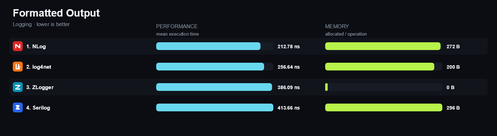

<!-- Generated by build/Templates/Readme.cshtml. Do not edit README.md directly. -->

<p align="center">
  
</p>

<h1 align="center">.NET Matrix</h1>

<p align="center">
  <strong>Evidence, not faith.</strong><br>
  Choose .NET libraries with confidence using reproducible feature,
  execution-time and allocation comparisons.
</p>

<p align="center">
  <a href="https://matrix.dev-team.org/"><strong>Open the interactive matrix →</strong></a>
  ·
  <a href="#how-to-read-the-results">How to read the results</a>
  ·
  <a href="#reproduce-the-results">Reproduce the results</a>
  ·
  <a href="#link-to-a-category-or-a-library">Link to the matrix</a>
</p>

<table align="center">
<tr>
<td width="180" align="center"><strong>7</strong><br><sub>CATEGORIES</sub></td>
<td width="180" align="center"><strong>46</strong><br><sub>LIBRARIES</sub></td>
<td width="180" align="center"><strong>81</strong><br><sub>SCENARIOS</sub></td>
</tr>
</table>

## Explore the matrix

| Category | Leader | Libraries | Scenarios |
|---|---|---:|---:|
| [**CSV Processing**](#csv-processing) | [Sep](https://matrix.dev-team.org/?category=csv-processing&library=Sep) | 4 | 10 |
| [**Dependency Injection**](#dependency-injection) | [Pure.DI](https://matrix.dev-team.org/?category=dependency-injection&library=Pure.DI) | 23 | 15 |
| [**JSON Serialization**](#json-serialization) | [System.Text.Json](https://matrix.dev-team.org/?category=json-serialization&library=System.Text.Json) | 3 | 14 |
| [**Logging**](#logging) | [Microsoft.Extensions.Logging](https://matrix.dev-team.org/?category=logging&library=Microsoft.Extensions.Logging) | 6 | 9 |
| [**Object Mapping**](#object-mapping) | [Mapperly](https://matrix.dev-team.org/?category=object-mapping&library=Mapperly) | 4 | 10 |
| [**Validation**](#validation) | [Microsoft.Extensions.Validation](https://matrix.dev-team.org/?category=validation&library=Microsoft.Extensions.Validation) | 4 | 10 |
| [**ZIP Archives**](#zip-archives) | [SharpZipLib](https://matrix.dev-team.org/?category=zip-archives&library=SharpZipLib) | 3 | 13 |

## How to read the results

- **Correctness comes first.** Every implementation is checked against the same feature contract before its benchmark results are compared.
- **Lower is better.** Overview charts show execution time and allocated memory together.
- **The rating measures distance, not placings.** In every scenario the fastest library scores 100 points and the one allocating least scores 100 more; four times slower is half the points, and an unsupported scenario scores nothing. A library's rating is the sum, so speed, economy and breadth all count and a narrow win cannot outweigh them.
- **The Web application is the primary explorer.** Use it to select libraries and switch between overview, features, benchmarks and environment details. Chrome and Edge can install it as a desktop application, with a shortcut per category.

The README is a generated snapshot of the reports committed to this repository.


## CSV Processing

<blockquote>
<strong><a href="https://matrix.dev-team.org/?category=csv-processing&amp;library=Sep">Sep</a></strong> leads the current rating · 4 libraries · 10 scenarios
</blockquote>

<p><a href="https://matrix.dev-team.org/?category=csv-processing"><strong>Explore interactively →</strong></a></p>


### Rating

In every scenario the fastest library scores 100 points and the one allocating
least scores 100 more; four times slower is half the points, and an unsupported
scenario is worth nothing. Time and memory reach **1000**
each here, so the maximum is **2000**.
See [workflows/rating.md](workflows/rating.md).

| # | Library | Scenarios | Time | Memory | Points | Group wins |
|---:|---|---:|---:|---:|---:|---|
| 1 | [**Sep**](https://matrix.dev-team.org/?category=csv-processing&library=Sep) | 10/10 | 1000 | 1000 | 2000 | gold in Correctness, gold in Read, gold in Throughput, gold in Write |
| 2 | [**TinyCsvParser**](https://matrix.dev-team.org/?category=csv-processing&library=TinyCsvParser) | 9/10 | 560 | 392 | 953 | silver in Correctness, silver in Read, bronze in Throughput |
| 3 | [**Sylvan.Data.Csv**](https://matrix.dev-team.org/?category=csv-processing&library=Sylvan.Data.Csv) | 9/10 | 619 | 270 | 889 | silver in Throughput, silver in Write, bronze in Correctness, bronze in Read |
| 4 | [**CsvHelper**](https://matrix.dev-team.org/?category=csv-processing&library=CsvHelper) | 10/10 | 236 | 212 | 448 | bronze in Write |


<details>
<summary><strong>How the points were earned</strong> — every scenario, with the measurements behind it</summary>

Each row is one scenario. `Best` is the lowest result among the rated libraries
that completed it, and the points follow from the two figures beside them:
`100 × √((best + step) / (result + step))`, with a step of 1 ns for time and 24 B
for memory. A dash means the library did not complete the scenario, and it scores
nothing for it. Add the two Points columns over every scenario and you get the
rating above. The same breakdown appears as a hint on any points value in the
[application](https://matrix.dev-team.org/?category=csv-processing).

#### 1. Sep — 2000 of 2000

| Scenario | Time | Best | Points | Memory | Best | Points |
|---|---:|---:|---:|---:|---:|---:|
| Read Simple Rows | 718.8 ns | 718.8 ns | 100 | 1.89 KB | 1.89 KB | 100 |
| Read Typed Records | 875.41 ns | 875.41 ns | 100 | 1.7 KB | 1.7 KB | 100 |
| Read Large Dataset | 1.04 ms | 1.04 ms | 100 | 1016.97 KB | 1016.97 KB | 100 |
| Quoted Fields | 609.79 ns | 609.79 ns | 100 | 1.34 KB | 1.34 KB | 100 |
| Escaped Delimiters | 554.35 ns | 554.35 ns | 100 | 1.35 KB | 1.35 KB | 100 |
| Header Mapping | 895.66 ns | 895.66 ns | 100 | 1.7 KB | 1.7 KB | 100 |
| Custom Conversion | 441.78 ns | 441.78 ns | 100 | 1.11 KB | 1.11 KB | 100 |
| Streaming Read | 806.58 μs | 806.58 μs | 100 | 1.34 KB | 1.34 KB | 100 |
| Write Rows | 536.1 ns | 536.1 ns | 100 | 1.89 KB | 1.89 KB | 100 |
| Async Read | 824.84 μs | 824.84 μs | 100 | 1.44 KB | 1.44 KB | 100 |

#### 2. TinyCsvParser — 953 of 2000

| Scenario | Time | Best | Points | Memory | Best | Points |
|---|---:|---:|---:|---:|---:|---:|
| Read Simple Rows | 1.64 μs | 718.8 ns | 66.3 | 5.56 KB | 1.89 KB | 58.5 |
| Read Typed Records | 1.83 μs | 875.41 ns | 69.2 | 5.3 KB | 1.7 KB | 56.8 |
| Read Large Dataset | 2.92 ms | 1.04 ms | 59.7 | 2.91 MB | 1016.97 KB | 58.5 |
| Quoted Fields | 1.36 μs | 609.79 ns | 66.9 | 4.87 KB | 1.34 KB | 52.9 |
| Escaped Delimiters | 1.23 μs | 554.35 ns | 67.2 | 4.98 KB | 1.35 KB | 52.4 |
| Header Mapping | 1.75 μs | 895.66 ns | 71.6 | 5.3 KB | 1.7 KB | 56.8 |
| Custom Conversion | 901.58 ns | 441.78 ns | 70 | 4.32 KB | 1.11 KB | 51.1 |
| Streaming Read | 3.21 ms | 806.58 μs | 50.1 | 2.75 MB | 1.34 KB | 2.196 |
| Write Rows | — | 536.1 ns | 0 | — | 1.89 KB | 0 |
| Async Read | 5.34 ms | 824.84 μs | 39.3 | 1.39 MB | 1.44 KB | 3.209 |

#### 3. Sylvan.Data.Csv — 889 of 2000

| Scenario | Time | Best | Points | Memory | Best | Points |
|---|---:|---:|---:|---:|---:|---:|
| Read Simple Rows | 2.36 μs | 718.8 ns | 55.2 | 35.38 KB | 1.89 KB | 23.3 |
| Read Typed Records | 2.55 μs | 875.41 ns | 58.7 | 35.11 KB | 1.7 KB | 22.1 |
| Read Large Dataset | 1.23 ms | 1.04 ms | 92 | 1.03 MB | 1016.97 KB | 98.4 |
| Quoted Fields | 2.09 μs | 609.79 ns | 54 | 34.34 KB | 1.34 KB | 19.9 |
| Escaped Delimiters | 1.67 μs | 554.35 ns | 57.7 | 34.3 KB | 1.35 KB | 20 |
| Header Mapping | 2.39 μs | 895.66 ns | 61.2 | 35.11 KB | 1.7 KB | 22.1 |
| Custom Conversion | — | 441.78 ns | 0 | — | 1.11 KB | 0 |
| Streaming Read | 864.85 μs | 806.58 μs | 96.6 | 34.75 KB | 1.34 KB | 19.8 |
| Write Rows | 1.66 μs | 536.1 ns | 56.9 | 32.78 KB | 1.89 KB | 24.2 |
| Async Read | 1.1 ms | 824.84 μs | 86.5 | 36.05 KB | 1.44 KB | 20.1 |

#### 4. CsvHelper — 448 of 2000

| Scenario | Time | Best | Points | Memory | Best | Points |
|---|---:|---:|---:|---:|---:|---:|
| Read Simple Rows | 3.42 μs | 718.8 ns | 45.9 | 21.95 KB | 1.89 KB | 29.5 |
| Read Typed Records | 852.59 μs | 875.41 ns | 3.206 | 53.52 KB | 1.7 KB | 17.9 |
| Read Large Dataset | 4.66 ms | 1.04 ms | 47.2 | 2.65 MB | 1016.97 KB | 61.3 |
| Quoted Fields | 571.4 μs | 609.79 ns | 3.269 | 40.97 KB | 1.34 KB | 18.3 |
| Escaped Delimiters | 583.48 μs | 554.35 ns | 3.085 | 40.85 KB | 1.35 KB | 18.3 |
| Header Mapping | 844.53 μs | 895.66 ns | 3.258 | 53.52 KB | 1.7 KB | 17.9 |
| Custom Conversion | 2.86 μs | 441.78 ns | 39.4 | 21.95 KB | 1.11 KB | 22.7 |
| Streaming Read | 4.09 ms | 806.58 μs | 44.4 | 2.16 MB | 1.34 KB | 2.48 |
| Write Rows | 841.59 μs | 536.1 ns | 2.526 | 40.77 KB | 1.89 KB | 21.7 |
| Async Read | 4.38 ms | 824.84 μs | 43.4 | 2.39 MB | 1.44 KB | 2.442 |

</details>

### Benchmark overview

**Read**


<details>
<summary><strong>More overview charts (3)</strong></summary>

#### Correctness


#### Throughput


#### Write


</details>

<details>
<summary><strong>Compared libraries (4)</strong></summary>

<table>
<tr>
<td width="64"></td>
<td><strong><a href="https://joshclose.github.io/CsvHelper/">CsvHelper</a></strong> 33.1.0<br>A widely used CSV library with record mapping, type conversion, and synchronous and asynchronous readers and writers.</td>
<td width="100" align="right"><a href="https://matrix.dev-team.org/?category=csv-processing&amp;library=CsvHelper">Compare →</a></td>
</tr>
<tr>
<td width="64"></td>
<td><strong><a href="https://github.com/nietras/Sep">Sep</a></strong> 0.15.1<br>A modern SIMD-accelerated separated-values reader and writer with span-based conversion and async enumeration.</td>
<td width="100" align="right"><a href="https://matrix.dev-team.org/?category=csv-processing&amp;library=Sep">Compare →</a></td>
</tr>
<tr>
<td width="64"></td>
<td><strong><a href="https://github.com/MarkPflug/Sylvan/blob/main/docs/Csv.md">Sylvan.Data.Csv</a></strong> 1.4.4<br>A high-performance forward-only CSV data reader and writer with strongly typed accessors and asynchronous I/O.</td>
<td width="100" align="right"><a href="https://matrix.dev-team.org/?category=csv-processing&amp;library=Sylvan.Data.Csv">Compare →</a></td>
</tr>
<tr>
<td width="64"></td>
<td><strong><a href="https://github.com/TinyCsvParser/TinyCsvParser">TinyCsvParser</a></strong> 3.0.11<br>A strongly typed CSV parser with declarative property mapping, custom converters, lazy streaming, and asynchronous readers.</td>
<td width="100" align="right"><a href="https://matrix.dev-team.org/?category=csv-processing&amp;library=TinyCsvParser">Compare →</a></td>
</tr>
</table>

</details>

<details>
<summary><strong>Benchmark scenarios (10)</strong></summary>

#### 01 · Read Simple Rows

Parses three CSV records and materializes every field as text.


#### 02 · Read Typed Records

Parses three CSV records and materializes typed scalar values.


#### 03 · Read Large Dataset

Parses and materializes 10,000 typed CSV records.


#### 04 · Quoted Fields

Parses doubled quote escapes inside quoted CSV fields.


#### 05 · Escaped Delimiters

Parses quoted fields containing a comma or an LF newline.


#### 06 · Header Mapping

Maps a reordered CSV header to the correct typed record members.


#### 07 · Custom Conversion

Converts sku-NNNN fields to the matrix-owned ProductCode value type.


#### 08 · Streaming Read

Aggregates 10,000 typed rows with forward-only reading and no row materialization.


#### 09 · Write Rows

Writes three records with a header to an exact LF-terminated CSV string.


#### 10 · Async Read

Asynchronously aggregates 10,000 typed CSV rows through the library async API.


</details>


## Dependency Injection

<blockquote>
<strong><a href="https://matrix.dev-team.org/?category=dependency-injection&amp;library=Pure.DI">Pure.DI</a></strong> leads the current rating · 23 libraries · 15 scenarios
</blockquote>

<p><a href="https://matrix.dev-team.org/?category=dependency-injection"><strong>Explore interactively →</strong></a></p>


### Rating

In every scenario the fastest library scores 100 points and the one allocating
least scores 100 more; four times slower is half the points, and an unsupported
scenario is worth nothing. Time and memory reach **1500**
each here, so the maximum is **3000**.
See [workflows/rating.md](workflows/rating.md).

| # | Library | Scenarios | Time | Memory | Points | Group wins |
|---:|---|---:|---:|---:|---:|---|
| 1 | [**Pure.DI**](https://matrix.dev-team.org/?category=dependency-injection&library=Pure.DI) | 14/15 | 1400 | 1394 | 2794 | gold in Basic, gold in Prepare, silver in Advanced |
| 2 | [**DryIoc**](https://matrix.dev-team.org/?category=dependency-injection&library=DryIoc) | 15/15 | 837 | 1206 | 2043 | gold in Advanced, bronze in Prepare |
| 3 | [**Grace**](https://matrix.dev-team.org/?category=dependency-injection&library=Grace) | 13/15 | 787 | 1042 | 1829 | silver in Basic |
| 4 | [**Stashbox**](https://matrix.dev-team.org/?category=dependency-injection&library=Stashbox) | 14/15 | 730 | 1092 | 1822 | bronze in Advanced, bronze in Basic |
| 5 | [**Simple Injector**](https://matrix.dev-team.org/?category=dependency-injection&library=SimpleInjector) | 12/15 | 669 | 963 | 1632 |  |
| 6 | [**LightInject**](https://matrix.dev-team.org/?category=dependency-injection&library=LightInject) | 12/15 | 595 | 930 | 1524 |  |
| 7 | [**Lamar**](https://matrix.dev-team.org/?category=dependency-injection&library=Lamar) | 12/15 | 624 | 743 | 1367 |  |
| 8 | [**Singularity**](https://matrix.dev-team.org/?category=dependency-injection&library=Singularity) | 9/15 | 485 | 710 | 1195 |  |
| 9 | [**Microsoft Extensions Dependency Injection**](https://matrix.dev-team.org/?category=dependency-injection&library=Microsoft.DI) | 9/15 | 405 | 675 | 1080 |  |
| 10 | [**Faster.Ioc**](https://matrix.dev-team.org/?category=dependency-injection&library=Faster.Ioc) | 8/15 | 407 | 608 | 1015 |  |
| 11 | [**Managed Extensibility Framework 2**](https://matrix.dev-team.org/?category=dependency-injection&library=MEF2) | 10/15 | 308 | 455 | 763 |  |
| 12 | [**Unity**](https://matrix.dev-team.org/?category=dependency-injection&library=Unity) | 13/15 | 258 | 444 | 701 |  |
| 13 | [**Maestro**](https://matrix.dev-team.org/?category=dependency-injection&library=Maestro) | 11/15 | 242 | 347 | 589 |  |
| 14 | [**StructureMap**](https://matrix.dev-team.org/?category=dependency-injection&library=StructureMap) | 13/15 | 203 | 331 | 534 |  |
| 15 | [**ZenIoc**](https://matrix.dev-team.org/?category=dependency-injection&library=ZenIoc) | 7/15 | 149 | 284 | 433 |  |
| 16 | [**Autofac**](https://matrix.dev-team.org/?category=dependency-injection&library=Autofac) | 13/15 | 156 | 243 | 399 |  |
| 17 | [**Spring.NET**](https://matrix.dev-team.org/?category=dependency-injection&library=Spring) | 10/15 | 112 | 267 | 379 |  |
| 18 | [**Castle Windsor**](https://matrix.dev-team.org/?category=dependency-injection&library=Windsor) | 13/15 | 121 | 224 | 344 |  |
| 19 | [**MvvmCross**](https://matrix.dev-team.org/?category=dependency-injection&library=MvvmCross) | 6/15 | 78 | 245 | 323 | silver in Prepare |
| 20 | [**Ninject**](https://matrix.dev-team.org/?category=dependency-injection&library=Ninject) | 12/15 | 51 | 134 | 185 |  |
| 21 | [**Visual Studio MEF**](https://matrix.dev-team.org/?category=dependency-injection&library=VS.MEF) | 9/15 | 36 | 99 | 135 |  |
| 22 | [**Catel**](https://matrix.dev-team.org/?category=dependency-injection&library=Catel) | 8/15 | 43 | 89 | 131 |  |


<details>
<summary><strong>How the points were earned</strong> — every scenario, with the measurements behind it</summary>

Each row is one scenario. `Best` is the lowest result among the rated libraries
that completed it, and the points follow from the two figures beside them:
`100 × √((best + step) / (result + step))`, with a step of 1 ns for time and 24 B
for memory. A dash means the library did not complete the scenario, and it scores
nothing for it. Add the two Points columns over every scenario and you get the
rating above. The same breakdown appears as a hint on any points value in the
[application](https://matrix.dev-team.org/?category=dependency-injection).

#### 1. Pure.DI — 2794 of 3000

| Scenario | Time | Best | Points | Memory | Best | Points |
|---|---:|---:|---:|---:|---:|---:|
| Singleton | 1.47 ns | 1.47 ns | 100 | 0 B | 0 B | 100 |
| Transient | 13.2 ns | 13.2 ns | 100 | 72 B | 72 B | 100 |
| PerResolve | 13.32 ns | 13.32 ns | 100 | 56 B | 56 B | 100 |
| Scoped | 44.02 ns | 44.02 ns | 100 | 184 B | 160 B | 94.1 |
| Combined | 35.77 ns | 35.77 ns | 100 | 168 B | 168 B | 100 |
| Complex | 89.18 ns | 89.18 ns | 100 | 360 B | 360 B | 100 |
| Property | 66.06 ns | 66.06 ns | 100 | 336 B | 336 B | 100 |
| Generics | 30.97 ns | 30.97 ns | 100 | 144 B | 144 B | 100 |
| IEnumerable | 17.22 ns | 17.22 ns | 100 | 72 B | 72 B | 100 |
| Array | 124.08 ns | 124.08 ns | 100 | 624 B | 624 B | 100 |
| Conditional | 31.08 ns | 31.08 ns | 100 | 144 B | 144 B | 100 |
| Child Container | — | 751.29 ns | 0 | — | 1.59 KB | 0 |
| Interception With Proxy | 67.86 ns | 67.86 ns | 100 | 248 B | 248 B | 100 |
| Prepare And Register | 0 ns | 0 ns | 100 | 0 B | 0 B | 100 |
| Prepare And Register And Simple Resolve | 10.17 ns | 10.17 ns | 100 | 24 B | 24 B | 100 |

#### 2. DryIoc — 2043 of 3000

| Scenario | Time | Best | Points | Memory | Best | Points |
|---|---:|---:|---:|---:|---:|---:|
| Singleton | 33.06 ns | 1.47 ns | 26.9 | 0 B | 0 B | 100 |
| Transient | 95.75 ns | 13.2 ns | 38.3 | 72 B | 72 B | 100 |
| PerResolve | 363.62 μs | 13.32 ns | 0.628 | 1.65 KB | 56 B | 21.6 |
| Scoped | 162.43 ns | 44.02 ns | 52.5 | 448 B | 160 B | 62.4 |
| Combined | 70.5 ns | 35.77 ns | 71.7 | 168 B | 168 B | 100 |
| Complex | 115.73 ns | 89.18 ns | 87.9 | 360 B | 360 B | 100 |
| Property | 100.44 ns | 66.06 ns | 81.3 | 336 B | 336 B | 100 |
| Generics | 65.43 ns | 30.97 ns | 69.4 | 144 B | 144 B | 100 |
| IEnumerable | 98.05 ns | 17.22 ns | 42.9 | 72 B | 72 B | 100 |
| Array | 156.28 ns | 124.08 ns | 89.2 | 624 B | 624 B | 100 |
| Conditional | 63.34 ns | 31.08 ns | 70.6 | 144 B | 144 B | 100 |
| Child Container | 751.29 ns | 751.29 ns | 100 | 1.59 KB | 1.59 KB | 100 |
| Interception With Proxy | 76.1 ns | 67.86 ns | 94.5 | 248 B | 248 B | 100 |
| Prepare And Register | 1.35 μs | 0 ns | 2.724 | 2.42 KB | 0 B | 9.79 |
| Prepare And Register And Simple Resolve | 1.66 μs | 10.17 ns | 8.197 | 3.04 KB | 24 B | 12.4 |

#### 3. Grace — 1829 of 3000

| Scenario | Time | Best | Points | Memory | Best | Points |
|---|---:|---:|---:|---:|---:|---:|
| Singleton | 74.97 ns | 1.47 ns | 18 | 0 B | 0 B | 100 |
| Transient | 74.69 ns | 13.2 ns | 43.3 | 72 B | 72 B | 100 |
| PerResolve | 98.17 ns | 13.32 ns | 38 | 296 B | 56 B | 50 |
| Scoped | 119.87 ns | 44.02 ns | 61 | 232 B | 160 B | 84.8 |
| Combined | 49.51 ns | 35.77 ns | 85.3 | 168 B | 168 B | 100 |
| Complex | 114.54 ns | 89.18 ns | 88.3 | 360 B | 360 B | 100 |
| Property | 79.33 ns | 66.06 ns | 91.4 | 336 B | 336 B | 100 |
| Generics | 43.44 ns | 30.97 ns | 84.8 | 144 B | 144 B | 100 |
| IEnumerable | — | 17.22 ns | 0 | — | 72 B | 0 |
| Array | 136.19 ns | 124.08 ns | 95.5 | 624 B | 624 B | 100 |
| Conditional | 44.65 ns | 31.08 ns | 83.8 | 144 B | 144 B | 100 |
| Child Container | — | 751.29 ns | 0 | — | 1.59 KB | 0 |
| Interception With Proxy | 73.83 ns | 67.86 ns | 95.9 | 248 B | 248 B | 100 |
| Prepare And Register | 10.89 μs | 0 ns | 0.958 | 21.66 KB | 0 B | 3.288 |
| Prepare And Register And Simple Resolve | 210.74 μs | 10.17 ns | 0.728 | 32.76 KB | 24 B | 3.781 |

#### 4. Stashbox — 1822 of 3000

| Scenario | Time | Best | Points | Memory | Best | Points |
|---|---:|---:|---:|---:|---:|---:|
| Singleton | 110.41 ns | 1.47 ns | 14.9 | 0 B | 0 B | 100 |
| Transient | 91.25 ns | 13.2 ns | 39.2 | 72 B | 72 B | 100 |
| PerResolve | 61.2 ns | 13.32 ns | 48 | 192 B | 56 B | 60.9 |
| Scoped | 108.62 ns | 44.02 ns | 64.1 | 304 B | 160 B | 74.9 |
| Combined | 77.82 ns | 35.77 ns | 68.3 | 168 B | 168 B | 100 |
| Complex | 191.15 ns | 89.18 ns | 68.5 | 360 B | 360 B | 100 |
| Property | 96.16 ns | 66.06 ns | 83.1 | 336 B | 336 B | 100 |
| Generics | 52.93 ns | 30.97 ns | 77 | 144 B | 144 B | 100 |
| IEnumerable | — | 17.22 ns | 0 | — | 72 B | 0 |
| Array | 148.26 ns | 124.08 ns | 91.5 | 624 B | 624 B | 100 |
| Conditional | 53.49 ns | 31.08 ns | 76.7 | 144 B | 144 B | 100 |
| Child Container | 108.67 μs | 751.29 ns | 8.32 | 7.59 KB | 1.59 KB | 46 |
| Interception With Proxy | 87.62 ns | 67.86 ns | 88.2 | 248 B | 248 B | 100 |
| Prepare And Register | 4.8 μs | 0 ns | 1.443 | 8.77 KB | 0 B | 5.164 |
| Prepare And Register And Simple Resolve | 213.25 μs | 10.17 ns | 0.724 | 14.98 KB | 24 B | 5.59 |

#### 5. Simple Injector — 1632 of 3000

| Scenario | Time | Best | Points | Memory | Best | Points |
|---|---:|---:|---:|---:|---:|---:|
| Singleton | 33.61 ns | 1.47 ns | 26.7 | 0 B | 0 B | 100 |
| Transient | 45.9 ns | 13.2 ns | 55 | 72 B | 72 B | 100 |
| PerResolve | — | 13.32 ns | 0 | — | 56 B | 0 |
| Scoped | 231.47 ns | 44.02 ns | 44 | 504 B | 160 B | 59 |
| Combined | 63.08 ns | 35.77 ns | 75.7 | 168 B | 168 B | 100 |
| Complex | 112.43 ns | 89.18 ns | 89.2 | 360 B | 360 B | 100 |
| Property | 102.48 ns | 66.06 ns | 80.5 | 336 B | 336 B | 100 |
| Generics | 56.14 ns | 30.97 ns | 74.8 | 144 B | 144 B | 100 |
| IEnumerable | 57.47 ns | 17.22 ns | 55.8 | 72 B | 72 B | 100 |
| Array | — | 124.08 ns | 0 | — | 624 B | 0 |
| Conditional | 61.49 ns | 31.08 ns | 71.6 | 144 B | 144 B | 100 |
| Child Container | — | 751.29 ns | 0 | — | 1.59 KB | 0 |
| Interception With Proxy | 76.28 ns | 67.86 ns | 94.4 | 248 B | 248 B | 100 |
| Prepare And Register | 75.97 μs | 0 ns | 0.363 | 69.3 KB | 0 B | 1.839 |
| Prepare And Register And Simple Resolve | 247.54 μs | 10.17 ns | 0.672 | 103.33 KB | 24 B | 2.13 |

#### 6. LightInject — 1524 of 3000

| Scenario | Time | Best | Points | Memory | Best | Points |
|---|---:|---:|---:|---:|---:|---:|
| Singleton | 53.17 ns | 1.47 ns | 21.4 | 0 B | 0 B | 100 |
| Transient | 80.49 ns | 13.2 ns | 41.7 | 72 B | 72 B | 100 |
| PerResolve | — | 13.32 ns | 0 | — | 56 B | 0 |
| Scoped | 246.41 ns | 44.02 ns | 42.7 | 568 B | 160 B | 55.8 |
| Combined | 87.62 ns | 35.77 ns | 64.4 | 168 B | 168 B | 100 |
| Complex | 240.87 ns | 89.18 ns | 61.1 | 360 B | 360 B | 100 |
| Property | 89.84 ns | 66.06 ns | 85.9 | 336 B | 336 B | 100 |
| Generics | 48.65 ns | 30.97 ns | 80.2 | 144 B | 144 B | 100 |
| IEnumerable | — | 17.22 ns | 0 | — | 72 B | 0 |
| Array | 142.7 ns | 124.08 ns | 93.3 | 624 B | 624 B | 100 |
| Conditional | 210.15 ns | 31.08 ns | 39 | 144 B | 144 B | 100 |
| Child Container | — | 751.29 ns | 0 | — | 1.59 KB | 0 |
| Interception With Proxy | 169.88 ns | 67.86 ns | 63.5 | 560 B | 248 B | 68.2 |
| Prepare And Register | 11.13 μs | 0 ns | 0.948 | 33.07 KB | 0 B | 2.661 |
| Prepare And Register And Simple Resolve | 664.17 μs | 10.17 ns | 0.41 | 43.45 KB | 24 B | 3.284 |

#### 7. Lamar — 1367 of 3000

| Scenario | Time | Best | Points | Memory | Best | Points |
|---|---:|---:|---:|---:|---:|---:|
| Singleton | 41.58 ns | 1.47 ns | 24.1 | 120 B | 0 B | 40.8 |
| Transient | 61.6 ns | 13.2 ns | 47.6 | 192 B | 72 B | 66.7 |
| PerResolve | — | 13.32 ns | 0 | — | 56 B | 0 |
| Scoped | 1.13 μs | 44.02 ns | 20 | 1.08 KB | 160 B | 40.4 |
| Combined | 78.22 ns | 35.77 ns | 68.1 | 288 B | 168 B | 78.4 |
| Complex | 131.64 ns | 89.18 ns | 82.5 | 480 B | 360 B | 87.3 |
| Property | 113.5 ns | 66.06 ns | 76.5 | 456 B | 336 B | 86.6 |
| Generics | 74.46 ns | 30.97 ns | 65.1 | 264 B | 144 B | 76.4 |
| IEnumerable | — | 17.22 ns | 0 | — | 72 B | 0 |
| Array | 167.46 ns | 124.08 ns | 86.2 | 744 B | 624 B | 91.9 |
| Conditional | 73.72 ns | 31.08 ns | 65.5 | 264 B | 144 B | 76.4 |
| Child Container | — | 751.29 ns | 0 | — | 1.59 KB | 0 |
| Interception With Proxy | 89.39 ns | 67.86 ns | 87.3 | 288 B | 248 B | 93.4 |
| Prepare And Register | 154.25 μs | 0 ns | 0.255 | 62.91 KB | 0 B | 1.93 |
| Prepare And Register And Simple Resolve | 157.72 μs | 10.17 ns | 0.842 | 63.65 KB | 24 B | 2.713 |

#### 8. Singularity — 1195 of 3000

| Scenario | Time | Best | Points | Memory | Best | Points |
|---|---:|---:|---:|---:|---:|---:|
| Singleton | 72.72 ns | 1.47 ns | 18.3 | 0 B | 0 B | 100 |
| Transient | 81.51 ns | 13.2 ns | 41.5 | 72 B | 72 B | 100 |
| PerResolve | — | 13.32 ns | 0 | — | 56 B | 0 |
| Scoped | 49.8 ns | 44.02 ns | 94.1 | 160 B | 160 B | 100 |
| Combined | 51.21 ns | 35.77 ns | 83.9 | 168 B | 168 B | 100 |
| Complex | 104.47 ns | 89.18 ns | 92.5 | 360 B | 360 B | 100 |
| Property | — | 66.06 ns | 0 | — | 336 B | 0 |
| Generics | 48.18 ns | 30.97 ns | 80.6 | 144 B | 144 B | 100 |
| IEnumerable | — | 17.22 ns | 0 | — | 72 B | 0 |
| Array | 241.92 ns | 124.08 ns | 71.8 | 624 B | 624 B | 100 |
| Conditional | — | 31.08 ns | 0 | — | 144 B | 0 |
| Child Container | — | 751.29 ns | 0 | — | 1.59 KB | 0 |
| Interception With Proxy | — | 67.86 ns | 0 | — | 248 B | 0 |
| Prepare And Register | 6.09 μs | 0 ns | 1.281 | 12.49 KB | 0 B | 4.327 |
| Prepare And Register And Simple Resolve | 62.62 μs | 10.17 ns | 1.336 | 15.75 KB | 24 B | 5.452 |

#### 9. Microsoft Extensions Dependency Injection — 1080 of 3000

| Scenario | Time | Best | Points | Memory | Best | Points |
|---|---:|---:|---:|---:|---:|---:|
| Singleton | 29.12 ns | 1.47 ns | 28.7 | 0 B | 0 B | 100 |
| Transient | 91.75 ns | 13.2 ns | 39.1 | 72 B | 72 B | 100 |
| PerResolve | — | 13.32 ns | 0 | — | 56 B | 0 |
| Scoped | 182.39 ns | 44.02 ns | 49.5 | 472 B | 160 B | 60.9 |
| Combined | 56.53 ns | 35.77 ns | 79.9 | 168 B | 168 B | 100 |
| Complex | 118.26 ns | 89.18 ns | 87 | 360 B | 360 B | 100 |
| Property | — | 66.06 ns | 0 | — | 336 B | 0 |
| Generics | 65.42 ns | 30.97 ns | 69.4 | 144 B | 144 B | 100 |
| IEnumerable | — | 17.22 ns | 0 | — | 72 B | 0 |
| Array | — | 124.08 ns | 0 | — | 624 B | 0 |
| Conditional | 182.17 ns | 31.08 ns | 41.8 | 144 B | 144 B | 100 |
| Child Container | — | 751.29 ns | 0 | — | 1.59 KB | 0 |
| Interception With Proxy | — | 67.86 ns | 0 | — | 248 B | 0 |
| Prepare And Register | 1.7 μs | 0 ns | 2.425 | 6.05 KB | 0 B | 6.21 |
| Prepare And Register And Simple Resolve | 2.21 μs | 10.17 ns | 7.102 | 6.8 KB | 24 B | 8.29 |

#### 10. Faster.Ioc — 1015 of 3000

| Scenario | Time | Best | Points | Memory | Best | Points |
|---|---:|---:|---:|---:|---:|---:|
| Singleton | 80.46 ns | 1.47 ns | 17.4 | 0 B | 0 B | 100 |
| Transient | 83.61 ns | 13.2 ns | 41 | 72 B | 72 B | 100 |
| PerResolve | — | 13.32 ns | 0 | — | 56 B | 0 |
| Scoped | 59.51 ns | 44.02 ns | 86.3 | 192 B | 160 B | 92.3 |
| Combined | 52.97 ns | 35.77 ns | 82.5 | 168 B | 168 B | 100 |
| Complex | 103.01 ns | 89.18 ns | 93.1 | 360 B | 360 B | 100 |
| Property | — | 66.06 ns | 0 | — | 336 B | 0 |
| Generics | 45.19 ns | 30.97 ns | 83.2 | 144 B | 144 B | 100 |
| IEnumerable | — | 17.22 ns | 0 | — | 72 B | 0 |
| Array | — | 124.08 ns | 0 | — | 624 B | 0 |
| Conditional | — | 31.08 ns | 0 | — | 144 B | 0 |
| Child Container | — | 751.29 ns | 0 | — | 1.59 KB | 0 |
| Interception With Proxy | — | 67.86 ns | 0 | — | 248 B | 0 |
| Prepare And Register | 1.1 μs | 0 ns | 3.017 | 4.36 KB | 0 B | 7.313 |
| Prepare And Register And Simple Resolve | 128.89 μs | 10.17 ns | 0.931 | 7.41 KB | 24 B | 7.939 |

#### 11. Managed Extensibility Framework 2 — 763 of 3000

| Scenario | Time | Best | Points | Memory | Best | Points |
|---|---:|---:|---:|---:|---:|---:|
| Singleton | 137.31 ns | 1.47 ns | 13.4 | 360 B | 0 B | 25 |
| Transient | 164.62 ns | 13.2 ns | 29.3 | 312 B | 72 B | 53.5 |
| PerResolve | — | 13.32 ns | 0 | — | 56 B | 0 |
| Scoped | — | 44.02 ns | 0 | — | 160 B | 0 |
| Combined | 186.03 ns | 35.77 ns | 44.3 | 528 B | 168 B | 59 |
| Complex | 385.06 ns | 89.18 ns | 48.3 | 1.05 KB | 360 B | 59 |
| Property | 475.84 ns | 66.06 ns | 37.5 | 1.15 KB | 336 B | 54.8 |
| Generics | 216.12 ns | 30.97 ns | 38.4 | 384 B | 144 B | 64.2 |
| IEnumerable | — | 17.22 ns | 0 | — | 72 B | 0 |
| Array | 433.39 ns | 124.08 ns | 53.7 | 1.27 KB | 624 B | 70.1 |
| Conditional | 180.11 ns | 31.08 ns | 42.1 | 384 B | 144 B | 64.2 |
| Child Container | — | 751.29 ns | 0 | — | 1.59 KB | 0 |
| Interception With Proxy | — | 67.86 ns | 0 | — | 248 B | 0 |
| Prepare And Register | 103.07 μs | 0 ns | 0.311 | 44.44 KB | 0 B | 2.296 |
| Prepare And Register And Simple Resolve | 248.31 μs | 10.17 ns | 0.671 | 56.67 KB | 24 B | 2.875 |

#### 12. Unity — 701 of 3000

| Scenario | Time | Best | Points | Memory | Best | Points |
|---|---:|---:|---:|---:|---:|---:|
| Singleton | 156.93 ns | 1.47 ns | 12.5 | 336 B | 0 B | 25.8 |
| Transient | 215.79 ns | 13.2 ns | 25.6 | 408 B | 72 B | 47.1 |
| PerResolve | 326.16 ns | 13.32 ns | 20.9 | 808 B | 56 B | 31 |
| Scoped | 2.02 μs | 44.02 ns | 14.9 | 4.57 KB | 160 B | 19.8 |
| Combined | 525.2 ns | 35.77 ns | 26.4 | 792 B | 168 B | 48.5 |
| Complex | 1.34 μs | 89.18 ns | 26 | 1.66 KB | 360 B | 47.1 |
| Property | 711.37 ns | 66.06 ns | 30.7 | 1.08 KB | 336 B | 56.5 |
| Generics | 2.23 μs | 30.97 ns | 12 | 1008 B | 144 B | 40.3 |
| IEnumerable | — | 17.22 ns | 0 | — | 72 B | 0 |
| Array | 2.17 μs | 124.08 ns | 24 | 9.59 KB | 624 B | 25.7 |
| Conditional | 410.94 ns | 31.08 ns | 27.9 | 624 B | 144 B | 50.9 |
| Child Container | 6.99 μs | 751.29 ns | 32.8 | 8.81 KB | 1.59 KB | 42.7 |
| Interception With Proxy | — | 67.86 ns | 0 | — | 248 B | 0 |
| Prepare And Register | 8.34 μs | 0 ns | 1.095 | 19.28 KB | 0 B | 3.484 |
| Prepare And Register And Simple Resolve | 13.75 μs | 10.17 ns | 2.85 | 21.89 KB | 24 B | 4.625 |

#### 13. Maestro — 589 of 3000

| Scenario | Time | Best | Points | Memory | Best | Points |
|---|---:|---:|---:|---:|---:|---:|
| Singleton | 220.41 ns | 1.47 ns | 10.6 | 720 B | 0 B | 18 |
| Transient | 248.52 ns | 13.2 ns | 23.9 | 648 B | 72 B | 37.8 |
| PerResolve | — | 13.32 ns | 0 | — | 56 B | 0 |
| Scoped | 818.16 ns | 44.02 ns | 23.4 | 1.63 KB | 160 B | 32.9 |
| Combined | 464.87 ns | 35.77 ns | 28.1 | 1.24 KB | 168 B | 38.5 |
| Complex | 986.38 ns | 89.18 ns | 30.2 | 2.79 KB | 360 B | 36.5 |
| Property | 755.86 ns | 66.06 ns | 29.8 | 1.8 KB | 336 B | 43.9 |
| Generics | 265.43 ns | 30.97 ns | 34.6 | 912 B | 144 B | 42.4 |
| IEnumerable | — | 17.22 ns | 0 | — | 72 B | 0 |
| Array | — | 124.08 ns | 0 | — | 624 B | 0 |
| Conditional | 398.53 ns | 31.08 ns | 28.3 | 1.01 KB | 144 B | 39.9 |
| Child Container | — | 751.29 ns | 0 | — | 1.59 KB | 0 |
| Interception With Proxy | 754.28 ns | 67.86 ns | 30.2 | 1.03 KB | 248 B | 50.2 |
| Prepare And Register | 17.27 μs | 0 ns | 0.761 | 27.62 KB | 0 B | 2.912 |
| Prepare And Register And Simple Resolve | 18.69 μs | 10.17 ns | 2.445 | 28.62 KB | 24 B | 4.046 |

#### 14. StructureMap — 534 of 3000

| Scenario | Time | Best | Points | Memory | Best | Points |
|---|---:|---:|---:|---:|---:|---:|
| Singleton | 726.97 ns | 1.47 ns | 5.828 | 2.58 KB | 0 B | 9.492 |
| Transient | 419.73 ns | 13.2 ns | 18.4 | 1.17 KB | 72 B | 28 |
| PerResolve | — | 13.32 ns | 0 | — | 56 B | 0 |
| Scoped | 6.12 μs | 44.02 ns | 8.577 | 9.67 KB | 160 B | 13.6 |
| Combined | 1.47 μs | 35.77 ns | 15.8 | 2.86 KB | 168 B | 25.5 |
| Complex | 3.3 μs | 89.18 ns | 16.5 | 4.64 KB | 360 B | 28.4 |
| Property | 1.31 μs | 66.06 ns | 22.6 | 1.64 KB | 336 B | 46 |
| Generics | 1.37 μs | 30.97 ns | 15.3 | 2.63 KB | 144 B | 24.9 |
| IEnumerable | — | 17.22 ns | 0 | — | 72 B | 0 |
| Array | 3.86 μs | 124.08 ns | 18 | 4.99 KB | 624 B | 35.5 |
| Conditional | 796.92 ns | 31.08 ns | 20.1 | 1.38 KB | 144 B | 34.2 |
| Child Container | 893.65 μs | 751.29 ns | 2.901 | 57.95 KB | 1.59 KB | 16.7 |
| Interception With Proxy | 200.31 ns | 67.86 ns | 58.5 | 624 B | 248 B | 64.8 |
| Prepare And Register | 81.78 μs | 0 ns | 0.35 | 61.88 KB | 0 B | 1.946 |
| Prepare And Register And Simple Resolve | 1.05 ms | 10.17 ns | 0.327 | 102.05 KB | 24 B | 2.143 |

#### 15. ZenIoc — 433 of 3000

| Scenario | Time | Best | Points | Memory | Best | Points |
|---|---:|---:|---:|---:|---:|---:|
| Singleton | 118.76 ns | 1.47 ns | 14.4 | 168 B | 0 B | 35.4 |
| Transient | 132.62 ns | 13.2 ns | 32.6 | 240 B | 72 B | 60.3 |
| PerResolve | — | 13.32 ns | 0 | — | 56 B | 0 |
| Scoped | — | 44.02 ns | 0 | — | 160 B | 0 |
| Combined | 308.64 ns | 35.77 ns | 34.5 | 504 B | 168 B | 60.3 |
| Complex | 758.9 ns | 89.18 ns | 34.4 | 1.17 KB | 360 B | 56 |
| Property | — | 66.06 ns | 0 | — | 336 B | 0 |
| Generics | — | 30.97 ns | 0 | — | 144 B | 0 |
| IEnumerable | — | 17.22 ns | 0 | — | 72 B | 0 |
| Array | — | 124.08 ns | 0 | — | 624 B | 0 |
| Conditional | 348.97 ns | 31.08 ns | 30.3 | 480 B | 144 B | 57.7 |
| Child Container | — | 751.29 ns | 0 | — | 1.59 KB | 0 |
| Interception With Proxy | — | 67.86 ns | 0 | — | 248 B | 0 |
| Prepare And Register | 3.59 μs | 0 ns | 1.668 | 4.48 KB | 0 B | 7.211 |
| Prepare And Register And Simple Resolve | 67.07 μs | 10.17 ns | 1.291 | 8.93 KB | 24 B | 7.235 |

#### 16. Autofac — 399 of 3000

| Scenario | Time | Best | Points | Memory | Best | Points |
|---|---:|---:|---:|---:|---:|---:|
| Singleton | 382.59 ns | 1.47 ns | 8.028 | 1.92 KB | 0 B | 11 |
| Transient | 839.19 ns | 13.2 ns | 13 | 2.44 KB | 72 B | 19.5 |
| PerResolve | — | 13.32 ns | 0 | — | 56 B | 0 |
| Scoped | 1.82 μs | 44.02 ns | 15.7 | 4.5 KB | 160 B | 19.9 |
| Combined | 2.02 μs | 35.77 ns | 13.5 | 4.48 KB | 168 B | 20.4 |
| Complex | 4.99 μs | 89.18 ns | 13.4 | 9.05 KB | 360 B | 20.3 |
| Property | 13.94 μs | 66.06 ns | 6.936 | 20.91 KB | 336 B | 13 |
| Generics | 1.77 μs | 30.97 ns | 13.4 | 3.91 KB | 144 B | 20.4 |
| IEnumerable | — | 17.22 ns | 0 | — | 72 B | 0 |
| Array | 6.47 μs | 124.08 ns | 13.9 | 8.6 KB | 624 B | 27.1 |
| Conditional | 1.58 μs | 31.08 ns | 14.2 | 3.16 KB | 144 B | 22.7 |
| Child Container | 11.52 μs | 751.29 ns | 25.6 | 16.03 KB | 1.59 KB | 31.7 |
| Interception With Proxy | 2.54 μs | 67.86 ns | 16.5 | 2.58 KB | 248 B | 32 |
| Prepare And Register | 50.39 μs | 0 ns | 0.445 | 48.75 KB | 0 B | 2.192 |
| Prepare And Register And Simple Resolve | 53.15 μs | 10.17 ns | 1.45 | 50.46 KB | 24 B | 3.047 |

#### 17. Spring.NET — 379 of 3000

| Scenario | Time | Best | Points | Memory | Best | Points |
|---|---:|---:|---:|---:|---:|---:|
| Singleton | 940.81 ns | 1.47 ns | 5.124 | 336 B | 0 B | 25.8 |
| Transient | 1.81 μs | 13.2 ns | 8.863 | 480 B | 72 B | 43.6 |
| PerResolve | — | 13.32 ns | 0 | — | 56 B | 0 |
| Scoped | — | 44.02 ns | 0 | — | 160 B | 0 |
| Combined | 5.56 μs | 35.77 ns | 8.13 | 3.02 KB | 168 B | 24.8 |
| Complex | 12.63 μs | 89.18 ns | 8.451 | 10.1 KB | 360 B | 19.2 |
| Property | 63.78 μs | 66.06 ns | 3.243 | 361.37 KB | 336 B | 3.119 |
| Generics | — | 30.97 ns | 0 | — | 144 B | 0 |
| IEnumerable | — | 17.22 ns | 0 | — | 72 B | 0 |
| Array | 15.12 μs | 124.08 ns | 9.096 | 7.08 KB | 624 B | 29.9 |
| Conditional | 4.55 μs | 31.08 ns | 8.396 | 2.58 KB | 144 B | 25.1 |
| Child Container | — | 751.29 ns | 0 | — | 1.59 KB | 0 |
| Interception With Proxy | 211.37 ns | 67.86 ns | 56.9 | 328 B | 248 B | 87.9 |
| Prepare And Register | 5.02 μs | 0 ns | 1.412 | 16.2 KB | 0 B | 3.801 |
| Prepare And Register And Simple Resolve | 15.98 μs | 10.17 ns | 2.644 | 39.66 KB | 24 B | 3.437 |

#### 18. Castle Windsor — 344 of 3000

| Scenario | Time | Best | Points | Memory | Best | Points |
|---|---:|---:|---:|---:|---:|---:|
| Singleton | 248.07 ns | 1.47 ns | 9.963 | 984 B | 0 B | 15.4 |
| Transient | 1.04 μs | 13.2 ns | 11.7 | 2.34 KB | 72 B | 19.9 |
| PerResolve | 1.78 μs | 13.32 ns | 8.965 | 3.03 KB | 56 B | 16 |
| Scoped | 4.1 μs | 44.02 ns | 10.5 | 3.79 KB | 160 B | 21.7 |
| Combined | 3.64 μs | 35.77 ns | 10.1 | 5.34 KB | 168 B | 18.7 |
| Complex | 10 μs | 89.18 ns | 9.496 | 12.42 KB | 360 B | 17.4 |
| Property | 7.3 μs | 66.06 ns | 9.584 | 9.09 KB | 336 B | 19.6 |
| Generics | 7.48 μs | 30.97 ns | 6.535 | 5.84 KB | 144 B | 16.7 |
| IEnumerable | — | 17.22 ns | 0 | — | 72 B | 0 |
| Array | 8.33 μs | 124.08 ns | 12.3 | 12.94 KB | 624 B | 22.1 |
| Conditional | 2.85 μs | 31.08 ns | 10.6 | 4.8 KB | 144 B | 18.4 |
| Child Container | — | 751.29 ns | 0 | — | 1.59 KB | 0 |
| Interception With Proxy | 1.73 μs | 67.86 ns | 20 | 2.36 KB | 248 B | 33.4 |
| Prepare And Register | 146.48 μs | 0 ns | 0.261 | 75.79 KB | 0 B | 1.758 |
| Prepare And Register And Simple Resolve | 138.53 μs | 10.17 ns | 0.898 | 78.09 KB | 24 B | 2.45 |

#### 19. MvvmCross — 323 of 3000

| Scenario | Time | Best | Points | Memory | Best | Points |
|---|---:|---:|---:|---:|---:|---:|
| Singleton | 169.33 ns | 1.47 ns | 12 | 0 B | 0 B | 100 |
| Transient | 360.93 ns | 13.2 ns | 19.8 | 360 B | 72 B | 50 |
| PerResolve | — | 13.32 ns | 0 | — | 56 B | 0 |
| Scoped | — | 44.02 ns | 0 | — | 160 B | 0 |
| Combined | 1.31 μs | 35.77 ns | 16.7 | 1.24 KB | 168 B | 38.5 |
| Complex | 3.49 μs | 89.18 ns | 16.1 | 3.47 KB | 360 B | 32.8 |
| Property | — | 66.06 ns | 0 | — | 336 B | 0 |
| Generics | — | 30.97 ns | 0 | — | 144 B | 0 |
| IEnumerable | — | 17.22 ns | 0 | — | 72 B | 0 |
| Array | — | 124.08 ns | 0 | — | 624 B | 0 |
| Conditional | — | 31.08 ns | 0 | — | 144 B | 0 |
| Child Container | — | 751.29 ns | 0 | — | 1.59 KB | 0 |
| Interception With Proxy | — | 67.86 ns | 0 | — | 248 B | 0 |
| Prepare And Register | 794.32 ns | 0 ns | 3.546 | 2.35 KB | 0 B | 9.934 |
| Prepare And Register And Simple Resolve | 1.06 μs | 10.17 ns | 10.3 | 2.6 KB | 24 B | 13.4 |

#### 20. Ninject — 185 of 3000

| Scenario | Time | Best | Points | Memory | Best | Points |
|---|---:|---:|---:|---:|---:|---:|
| Singleton | 2.07 μs | 1.47 ns | 3.456 | 2.23 KB | 0 B | 10.2 |
| Transient | 6.47 μs | 13.2 ns | 4.684 | 4.8 KB | 72 B | 13.9 |
| PerResolve | — | 13.32 ns | 0 | — | 56 B | 0 |
| Scoped | 1.08 ms | 44.02 ns | 0.645 | 1.97 MB | 160 B | 0.943 |
| Combined | 17.26 μs | 35.77 ns | 4.615 | 13.17 KB | 168 B | 11.9 |
| Complex | 40.37 μs | 89.18 ns | 4.727 | 32.25 KB | 360 B | 10.8 |
| Property | 27.44 μs | 66.06 ns | 4.944 | 20.11 KB | 336 B | 13.2 |
| Generics | 18.55 μs | 30.97 ns | 4.151 | 10.83 KB | 144 B | 12.3 |
| IEnumerable | — | 17.22 ns | 0 | — | 72 B | 0 |
| Array | 46.28 μs | 124.08 ns | 5.199 | 27.47 KB | 624 B | 15.2 |
| Conditional | 14.72 μs | 31.08 ns | 4.668 | 10.64 KB | 144 B | 12.4 |
| Child Container | — | 751.29 ns | 0 | — | 1.59 KB | 0 |
| Interception With Proxy | 4.21 μs | 67.86 ns | 12.8 | 3.48 KB | 248 B | 27.5 |
| Prepare And Register | 266.38 μs | 0 ns | 0.194 | 33.74 KB | 0 B | 2.635 |
| Prepare And Register And Simple Resolve | 519.2 μs | 10.17 ns | 0.464 | 46.83 KB | 24 B | 3.163 |

#### 21. Visual Studio MEF — 135 of 3000

| Scenario | Time | Best | Points | Memory | Best | Points |
|---|---:|---:|---:|---:|---:|---:|
| Singleton | 4.71 μs | 1.47 ns | 2.291 | 5.79 KB | 0 B | 6.35 |
| Transient | 8.46 μs | 13.2 ns | 4.098 | 7.85 KB | 72 B | 10.9 |
| PerResolve | — | 13.32 ns | 0 | — | 56 B | 0 |
| Scoped | — | 44.02 ns | 0 | — | 160 B | 0 |
| Combined | 12.77 μs | 35.77 ns | 5.366 | 9.84 KB | 168 B | 13.8 |
| Complex | 21.92 μs | 89.18 ns | 6.414 | 13.92 KB | 360 B | 16.4 |
| Property | 19.93 μs | 66.06 ns | 5.8 | 12.09 KB | 336 B | 17 |
| Generics | — | 30.97 ns | 0 | — | 144 B | 0 |
| IEnumerable | — | 17.22 ns | 0 | — | 72 B | 0 |
| Array | 28.41 μs | 124.08 ns | 6.635 | 17.48 KB | 624 B | 19 |
| Conditional | 12.65 μs | 31.08 ns | 5.035 | 9.8 KB | 144 B | 12.9 |
| Child Container | — | 751.29 ns | 0 | — | 1.59 KB | 0 |
| Interception With Proxy | — | 67.86 ns | 0 | — | 248 B | 0 |
| Prepare And Register | 676.8 μs | 0 ns | 0.122 | 179.65 KB | 0 B | 1.142 |
| Prepare And Register And Simple Resolve | 351.68 μs | 10.17 ns | 0.564 | 181.4 KB | 24 B | 1.607 |

#### 22. Catel — 131 of 3000

| Scenario | Time | Best | Points | Memory | Best | Points |
|---|---:|---:|---:|---:|---:|---:|
| Singleton | 235.12 ns | 1.47 ns | 10.2 | 304 B | 0 B | 27.1 |
| Transient | 3.81 μs | 13.2 ns | 6.103 | 5.62 KB | 72 B | 12.9 |
| PerResolve | — | 13.32 ns | 0 | — | 56 B | 0 |
| Scoped | — | 44.02 ns | 0 | — | 160 B | 0 |
| Combined | 7.94 μs | 35.77 ns | 6.806 | 12.22 KB | 168 B | 12.4 |
| Complex | 17.45 μs | 89.18 ns | 7.189 | 26.01 KB | 360 B | 12 |
| Property | — | 66.06 ns | 0 | — | 336 B | 0 |
| Generics | — | 30.97 ns | 0 | — | 144 B | 0 |
| IEnumerable | — | 17.22 ns | 0 | — | 72 B | 0 |
| Array | — | 124.08 ns | 0 | — | 624 B | 0 |
| Conditional | 4.81 μs | 31.08 ns | 8.162 | 7.01 KB | 144 B | 15.3 |
| Child Container | 1.98 ms | 751.29 ns | 1.947 | 2.28 MB | 1.59 KB | 2.628 |
| Interception With Proxy | — | 67.86 ns | 0 | — | 248 B | 0 |
| Prepare And Register | 3.3 μs | 0 ns | 1.741 | 6.8 KB | 0 B | 5.86 |
| Prepare And Register And Simple Resolve | 909.1 μs | 10.17 ns | 0.351 | 1.14 MB | 24 B | 0.634 |

</details>

### Benchmark overview

**Basic**


<details>
<summary><strong>More overview charts (2)</strong></summary>

#### Advanced


#### Prepare


</details>

<details>
<summary><strong>Compared libraries (23)</strong></summary>

<table>
<tr>
<td width="64"></td>
<td><strong><a href="https://autofac.readthedocs.io/en/latest/">Autofac</a></strong> 9.3.2<br>A flexible inversion of control container for building extensible .NET applications.</td>
<td width="100" align="right"><a href="https://matrix.dev-team.org/?category=dependency-injection&amp;library=Autofac">Compare →</a></td>
</tr>
<tr>
<td width="64"></td>
<td><strong><a href="https://github.com/castleproject/Windsor/blob/master/docs/README.md">Castle Windsor</a></strong> 6.0.0<br>The Castle Project container, with bound lifestyles and Castle DynamicProxy interception.</td>
<td width="100" align="right"><a href="https://matrix.dev-team.org/?category=dependency-injection&amp;library=Windsor">Compare →</a></td>
</tr>
<tr>
<td width="64"></td>
<td><strong><a href="https://www.catelproject.com/">Catel</a></strong> 6.2.0<br>An MVVM application framework whose service locator and type factory perform constructor injection.</td>
<td width="100" align="right"><a href="https://matrix.dev-team.org/?category=dependency-injection&amp;library=Catel">Compare →</a></td>
</tr>
<tr>
<td width="64"></td>
<td><strong><a href="https://github.com/dadhi/DryIoc/blob/master/docs/DryIoc.Docs/README.md">DryIoc</a></strong> 5.4.3<br>A fast, small and feature-rich container with expression-compiled resolution and rich reuse options.</td>
<td width="100" align="right"><a href="https://matrix.dev-team.org/?category=dependency-injection&amp;library=DryIoc">Compare →</a></td>
</tr>
<tr>
<td width="64"></td>
<td><strong><a href="https://github.com/Wsm2110/Faster.Ioc#readme">Faster.Ioc</a></strong> 5.0.0<br>A minimalistic container focused on the shortest possible resolve path.</td>
<td width="100" align="right"><a href="https://matrix.dev-team.org/?category=dependency-injection&amp;library=Faster.Ioc">Compare →</a></td>
</tr>
<tr>
<td width="64"></td>
<td><strong><a href="https://github.com/ipjohnson/Grace/wiki">Grace</a></strong> 7.2.1<br>A container with a fluent registration model, per-object-graph lifestyles and decorator support.</td>
<td width="100" align="right"><a href="https://matrix.dev-team.org/?category=dependency-injection&amp;library=Grace">Compare →</a></td>
</tr>
<tr>
<td width="64"></td>
<td><strong>Hand-coded</strong><br>Direct dependency injection written in C# without a container.</td>
<td width="100" align="right"><a href="https://matrix.dev-team.org/?category=dependency-injection&amp;library=HandCoded">Compare →</a></td>
</tr>
<tr>
<td width="64"></td>
<td><strong><a href="https://jasperfx.github.io/lamar/">Lamar</a></strong> 16.0.0<br>The successor to StructureMap, built around runtime code generation.</td>
<td width="100" align="right"><a href="https://matrix.dev-team.org/?category=dependency-injection&amp;library=Lamar">Compare →</a></td>
</tr>
<tr>
<td width="64"></td>
<td><strong><a href="https://www.lightinject.net/">LightInject</a></strong> 7.1.0<br>A lightweight container with an ultra-small API surface and its own interception package.</td>
<td width="100" align="right"><a href="https://matrix.dev-team.org/?category=dependency-injection&amp;library=LightInject">Compare →</a></td>
</tr>
<tr>
<td width="64"></td>
<td><strong><a href="https://github.com/JonasSamuelsson/Maestro#readme">Maestro</a></strong> 3.6.6<br>A small container with a fluent configuration API and pluggable activation interceptors.</td>
<td width="100" align="right"><a href="https://matrix.dev-team.org/?category=dependency-injection&amp;library=Maestro">Compare →</a></td>
</tr>
<tr>
<td width="64"></td>
<td><strong><a href="https://learn.microsoft.com/dotnet/framework/mef/">Managed Extensibility Framework 2</a></strong> 10.0.10<br>The lightweight Managed Extensibility Framework composition engine shipped as System.Composition.</td>
<td width="100" align="right"><a href="https://matrix.dev-team.org/?category=dependency-injection&amp;library=MEF2">Compare →</a></td>
</tr>
<tr>
<td width="64"></td>
<td><strong><a href="https://learn.microsoft.com/dotnet/core/extensions/dependency-injection">Microsoft Extensions Dependency Injection</a></strong> 10.0.10<br>The built-in .NET dependency injection container and its service collection abstractions.</td>
<td width="100" align="right"><a href="https://matrix.dev-team.org/?category=dependency-injection&amp;library=Microsoft.DI">Compare →</a></td>
</tr>
<tr>
<td width="64"></td>
<td><strong><a href="https://www.mvvmcross.com/documentation/">MvvmCross</a></strong> 10.1.2<br>A cross-platform MVVM framework with its own inversion of control provider.</td>
<td width="100" align="right"><a href="https://matrix.dev-team.org/?category=dependency-injection&amp;library=MvvmCross">Compare →</a></td>
</tr>
<tr>
<td width="64"></td>
<td><strong><a href="https://github.com/ninject/Ninject/wiki">Ninject</a></strong> 3.3.6<br>A container built around fluent bindings, contextual conditions and pluggable extensions.</td>
<td width="100" align="right"><a href="https://matrix.dev-team.org/?category=dependency-injection&amp;library=Ninject">Compare →</a></td>
</tr>
<tr>
<td width="64"></td>
<td><strong><a href="https://github.com/DevTeam/Pure.DI#readme">Pure.DI</a></strong> 2.5.2<br>A compile-time dependency injection framework that generates strongly typed compositions.</td>
<td width="100" align="right"><a href="https://matrix.dev-team.org/?category=dependency-injection&amp;library=Pure.DI">Compare →</a></td>
</tr>
<tr>
<td width="64"></td>
<td><strong><a href="https://docs.simpleinjector.org/">Simple Injector</a></strong> 5.6.0<br>A fast, opinionated dependency injection library that promotes explicit configuration and maintainable application design.</td>
<td width="100" align="right"><a href="https://matrix.dev-team.org/?category=dependency-injection&amp;library=SimpleInjector">Compare →</a></td>
</tr>
<tr>
<td width="64"></td>
<td><strong><a href="https://github.com/Barsonax/Singularity#readme">Singularity</a></strong> 0.18.0<br>An expression-tree based container that validates the whole object graph when the container is built.</td>
<td width="100" align="right"><a href="https://matrix.dev-team.org/?category=dependency-injection&amp;library=Singularity">Compare →</a></td>
</tr>
<tr>
<td width="64"></td>
<td><strong><a href="https://www.springframework.net/">Spring.NET</a></strong> 3.0.3<br>The Spring.NET application framework and its XML or code configured object factory.</td>
<td width="100" align="right"><a href="https://matrix.dev-team.org/?category=dependency-injection&amp;library=Spring">Compare →</a></td>
</tr>
<tr>
<td width="64"></td>
<td><strong><a href="https://z4kn4fein.github.io/stashbox/">Stashbox</a></strong> 5.20.0<br>A fast container with per-request lifetimes, conditional registrations and child containers.</td>
<td width="100" align="right"><a href="https://matrix.dev-team.org/?category=dependency-injection&amp;library=Stashbox">Compare →</a></td>
</tr>
<tr>
<td width="64"></td>
<td><strong><a href="https://structuremap.github.io/">StructureMap</a></strong> 4.7.1<br>A mature container with a fluent registry DSL, nested containers and decorators.</td>
<td width="100" align="right"><a href="https://matrix.dev-team.org/?category=dependency-injection&amp;library=StructureMap">Compare →</a></td>
</tr>
<tr>
<td width="64"></td>
<td><strong><a href="https://unitycontainer.org/">Unity</a></strong> 5.11.10<br>The Unity container, offering per-resolve lifetimes and hierarchical child containers.</td>
<td width="100" align="right"><a href="https://matrix.dev-team.org/?category=dependency-injection&amp;library=Unity">Compare →</a></td>
</tr>
<tr>
<td width="64"></td>
<td><strong><a href="https://github.com/microsoft/vs-mef/blob/main/doc/index.md">Visual Studio MEF</a></strong> 17.13.41<br>The Visual Studio composition engine, a fast attribute-driven MEF implementation.</td>
<td width="100" align="right"><a href="https://matrix.dev-team.org/?category=dependency-injection&amp;library=VS.MEF">Compare →</a></td>
</tr>
<tr>
<td width="64"></td>
<td><strong><a href="https://github.com/zenmvvm/ZenIoc#readme">ZenIoc</a></strong> 1.0.1<br>A tiny container with compiled registrations, named resolution and nested containers.</td>
<td width="100" align="right"><a href="https://matrix.dev-team.org/?category=dependency-injection&amp;library=ZenIoc">Compare →</a></td>
</tr>
</table>

</details>

<details>
<summary><strong>Benchmark scenarios (15)</strong></summary>

#### 01 · Singleton

Registers three singleton services and resolves each of them repeatedly. Every resolve of the same service must return the same instance.


#### 02 · Transient

Registers three transient services and resolves each of them repeatedly. Every resolve must create a new instance, never reusing an earlier one.


#### 03 · PerResolve

Resolves an object graph that asks for the same dependency twice. Both requests inside one resolution share an instance, while the next resolution gets a new one.


#### 04 · Scoped

Resolves scoped services inside explicit scopes. One instance per scope, different instances across scopes, and scope-owned disposables are disposed when the scope ends.


#### 05 · Combined

Resolves three roots that mix singleton and transient dependencies. The singleton is shared across every root while each transient dependency is distinct.


#### 06 · Complex

Registers and resolves three multi-level object graphs, checking that every nested dependency has the expected implementation type and lifetime.


#### 07 · Property

Resolves three roots that carry writable service properties. The container, or its intended property-injection extension, must assign them during activation.


#### 08 · Generics

Registers one open generic service mapping and resolves roots closed over int, float and object. Registering every closed type separately does not count.


#### 09 · IEnumerable

Injects a sequence of five plugin implementations and requires it to be genuinely lazy: nothing is created until enumeration, and every enumeration yields new transients.


#### 10 · Array

Resolves three roots that materialise their injected sequence of five plugins into an array while the root is being activated.


#### 11 · Conditional

Gives each of three consumers a different implementation of one contract, chosen through the metadata, key, predicate or consumer-context mechanism of the library.


#### 12 · Child Container

Creates a real nested child container that inherits the registrations of its parent and can add or override them without changing the parent.


#### 13 · Interception With Proxy

Resolves a service through the interception or activation extension point of the library. The result must be a proxy whose interceptor proceeds to the real target.


#### 14 · Prepare And Register

Measures creating the container and registering the whole prescribed graph, without resolving anything from it.


#### 15 · Prepare And Register And Simple Resolve

Measures the same setup as Prepare And Register, followed by a single resolve of one singleton root.


</details>


## JSON Serialization

<blockquote>
<strong><a href="https://matrix.dev-team.org/?category=json-serialization&amp;library=System.Text.Json">System.Text.Json</a></strong> leads the current rating · 3 libraries · 14 scenarios
</blockquote>

<p><a href="https://matrix.dev-team.org/?category=json-serialization"><strong>Explore interactively →</strong></a></p>


### Rating

In every scenario the fastest library scores 100 points and the one allocating
least scores 100 more; four times slower is half the points, and an unsupported
scenario is worth nothing. Time and memory reach **1400**
each here, so the maximum is **2800**.
See [workflows/rating.md](workflows/rating.md).

| # | Library | Scenarios | Time | Memory | Points | Group wins |
|---:|---|---:|---:|---:|---:|---|
| 1 | [**System.Text.Json**](https://matrix.dev-team.org/?category=json-serialization&library=System.Text.Json) | 14/14 | 1272 | 1249 | 2521 | gold in Advanced, gold in Basic, gold in Collections, gold in Stream, silver in Nested, silver in Prepare |
| 2 | [**ServiceStack.Text**](https://matrix.dev-team.org/?category=json-serialization&library=ServiceStack.Text) | 12/14 | 1078 | 888 | 1966 | gold in Nested, gold in Prepare, silver in Advanced, silver in Basic, silver in Collections, silver in Stream |
| 3 | [**Newtonsoft.Json**](https://matrix.dev-team.org/?category=json-serialization&library=Newtonsoft.Json) | 13/14 | 759 | 398 | 1157 | bronze in Advanced, bronze in Basic, bronze in Collections, bronze in Nested, bronze in Prepare, bronze in Stream |


<details>
<summary><strong>How the points were earned</strong> — every scenario, with the measurements behind it</summary>

Each row is one scenario. `Best` is the lowest result among the rated libraries
that completed it, and the points follow from the two figures beside them:
`100 × √((best + step) / (result + step))`, with a step of 1 ns for time and 24 B
for memory. A dash means the library did not complete the scenario, and it scores
nothing for it. Add the two Points columns over every scenario and you get the
rating above. The same breakdown appears as a hint on any points value in the
[application](https://matrix.dev-team.org/?category=json-serialization).

#### 1. System.Text.Json — 2521 of 2800

| Scenario | Time | Best | Points | Memory | Best | Points |
|---|---:|---:|---:|---:|---:|---:|
| Serialize Simple Object | 143.35 ns | 143.35 ns | 100 | 96 B | 96 B | 100 |
| Deserialize Simple Object | 200.22 ns | 151.34 ns | 87 | 64 B | 64 B | 100 |
| Serialize Nested Object | 344.24 ns | 344.24 ns | 100 | 504 B | 504 B | 100 |
| Deserialize Nested Object | 532.69 ns | 455.02 ns | 92.4 | 768 B | 320 B | 65.9 |
| Serialize Collection | 441.77 ns | 441.77 ns | 100 | 560 B | 560 B | 100 |
| Deserialize Collection | 818.55 ns | 818.55 ns | 100 | 800 B | 472 B | 77.6 |
| Serialize Dictionary | 144.57 ns | 144.57 ns | 100 | 88 B | 88 B | 100 |
| Deserialize Dictionary | 265.67 ns | 224.84 ns | 92 | 312 B | 312 B | 100 |
| Enum Round Trip | 277.2 ns | 277.2 ns | 100 | 88 B | 88 B | 100 |
| Custom Converter Round Trip | 279.11 ns | 279.11 ns | 100 | 120 B | 120 B | 100 |
| Polymorphic Round Trip | 1.52 μs | 1.52 μs | 100 | 1.32 KB | 1.32 KB | 100 |
| UTF-8 Stream Round Trip | 476.41 ns | 476.41 ns | 100 | 280 B | 280 B | 100 |
| Source Generation Round Trip | 341.81 ns | 341.81 ns | 100 | 160 B | 160 B | 100 |
| Prepare Serializer | 16.04 μs | 0 ns | 0.79 | 7.42 KB | 0 B | 5.613 |

#### 2. ServiceStack.Text — 1966 of 2800

| Scenario | Time | Best | Points | Memory | Best | Points |
|---|---:|---:|---:|---:|---:|---:|
| Serialize Simple Object | 258.47 ns | 143.35 ns | 74.6 | 336 B | 96 B | 57.7 |
| Deserialize Simple Object | 151.34 ns | 151.34 ns | 100 | 112 B | 64 B | 80.4 |
| Serialize Nested Object | 527.34 ns | 344.24 ns | 80.8 | 792 B | 504 B | 80.4 |
| Deserialize Nested Object | 455.02 ns | 455.02 ns | 100 | 320 B | 320 B | 100 |
| Serialize Collection | 830.84 ns | 441.77 ns | 73 | 1000 B | 560 B | 75.5 |
| Deserialize Collection | 828.94 ns | 818.55 ns | 99.4 | 472 B | 472 B | 100 |
| Serialize Dictionary | 190.5 ns | 144.57 ns | 87.2 | 288 B | 88 B | 59.9 |
| Deserialize Dictionary | 224.84 ns | 224.84 ns | 100 | 424 B | 312 B | 86.6 |
| Enum Round Trip | 299.58 ns | 277.2 ns | 96.2 | 336 B | 88 B | 55.8 |
| Custom Converter Round Trip | 288.55 ns | 279.11 ns | 98.4 | 392 B | 120 B | 58.8 |
| Polymorphic Round Trip | — | 1.52 μs | 0 | — | 1.32 KB | 0 |
| UTF-8 Stream Round Trip | 1.02 μs | 476.41 ns | 68.4 | 2.8 KB | 280 B | 32.4 |
| Source Generation Round Trip | — | 341.81 ns | 0 | — | 160 B | 0 |
| Prepare Serializer | 0 ns | 0 ns | 100 | 0 B | 0 B | 100 |

#### 3. Newtonsoft.Json — 1157 of 2800

| Scenario | Time | Best | Points | Memory | Best | Points |
|---|---:|---:|---:|---:|---:|---:|
| Serialize Simple Object | 365.83 ns | 143.35 ns | 62.7 | 1.41 KB | 96 B | 28.6 |
| Deserialize Simple Object | 610.12 ns | 151.34 ns | 49.9 | 2.61 KB | 64 B | 18.1 |
| Serialize Nested Object | 587.57 ns | 344.24 ns | 76.6 | 1.63 KB | 504 B | 55.9 |
| Deserialize Nested Object | 1.05 μs | 455.02 ns | 65.9 | 2.89 KB | 320 B | 34 |
| Serialize Collection | 809.34 ns | 441.77 ns | 73.9 | 1.83 KB | 560 B | 55.5 |
| Deserialize Collection | 1.48 μs | 818.55 ns | 74.3 | 2.99 KB | 472 B | 40.1 |
| Serialize Dictionary | 374.76 ns | 144.57 ns | 62.2 | 1.48 KB | 88 B | 27 |
| Deserialize Dictionary | 655.18 ns | 224.84 ns | 58.7 | 2.83 KB | 312 B | 33.9 |
| Enum Round Trip | 1.08 μs | 277.2 ns | 50.8 | 4.68 KB | 88 B | 15.2 |
| Custom Converter Round Trip | 1.02 μs | 279.11 ns | 52.3 | 4.68 KB | 120 B | 17.3 |
| Polymorphic Round Trip | 3.36 μs | 1.52 μs | 67.3 | 7.79 KB | 1.32 KB | 41.5 |
| UTF-8 Stream Round Trip | 1.18 μs | 476.41 ns | 63.5 | 4.13 KB | 280 B | 26.8 |
| Source Generation Round Trip | — | 341.81 ns | 0 | — | 160 B | 0 |
| Prepare Serializer | 41.28 μs | 0 ns | 0.492 | 11.55 KB | 0 B | 4.501 |

</details>

### Benchmark overview

**Basic**


<details>
<summary><strong>More overview charts (5)</strong></summary>

#### Nested


#### Collections


#### Advanced


#### Stream


#### Prepare


</details>

<details>
<summary><strong>Compared libraries (3)</strong></summary>

<table>
<tr>
<td width="64"></td>
<td><strong><a href="https://www.newtonsoft.com/json/help/html/Introduction.htm">Newtonsoft.Json</a></strong> 13.0.4<br>A mature JSON framework for .NET with configurable contracts, converters, and streaming readers and writers.</td>
<td width="100" align="right"><a href="https://matrix.dev-team.org/?category=json-serialization&amp;library=Newtonsoft.Json">Compare →</a></td>
</tr>
<tr>
<td width="64"></td>
<td><strong><a href="https://docs.servicestack.net/text">ServiceStack.Text</a></strong> 10.0.8<br>A high-performance text library with typed JSON, stream, collection, and type-specific serialization APIs.</td>
<td width="100" align="right"><a href="https://matrix.dev-team.org/?category=json-serialization&amp;library=ServiceStack.Text">Compare →</a></td>
</tr>
<tr>
<td width="64"></td>
<td><strong><a href="https://learn.microsoft.com/dotnet/standard/serialization/system-text-json/overview">System.Text.Json</a></strong><br>The reflection-based and source-generated JSON serializer included with .NET.</td>
<td width="100" align="right"><a href="https://matrix.dev-team.org/?category=json-serialization&amp;library=System.Text.Json">Compare →</a></td>
</tr>
</table>

</details>

<details>
<summary><strong>Benchmark scenarios (14)</strong></summary>

#### 01 · Serialize Simple Object

Serializes one scalar object to a compact JSON string.


#### 02 · Deserialize Simple Object

Deserializes one compact JSON object and validates every scalar member.


#### 03 · Serialize Nested Object

Serializes an order, customer, and address object graph.


#### 04 · Deserialize Nested Object

Deserializes and materializes an order, customer, and address object graph.


#### 05 · Serialize Collection

Serializes three ordered objects to a compact JSON array.


#### 06 · Deserialize Collection

Deserializes a compact JSON array to three ordered objects.


#### 07 · Serialize Dictionary

Serializes three ordered string and integer entries to a JSON object.


#### 08 · Deserialize Dictionary

Deserializes a JSON object to three ordinal string and integer entries.


#### 09 · Enum Round Trip

Serializes an enum as its string name and deserializes it back.


#### 10 · Custom Converter Round Trip

Serializes a strongly typed identifier as a JSON string and deserializes it back.


#### 11 · Polymorphic Round Trip

Round-trips a base-type collection through safe cat and dog discriminators.


#### 12 · UTF-8 Stream Round Trip

Serializes a simple object to a new UTF-8 memory stream and deserializes it back.


#### 13 · Source Generation Round Trip

Round-trips a simple object with compile-time generated JSON metadata.


#### 14 · Prepare Serializer

Creates fresh serializer settings and explicit type metadata without serializing data.


</details>


## Logging

<blockquote>
<strong><a href="https://matrix.dev-team.org/?category=logging&amp;library=Microsoft.Extensions.Logging">Microsoft.Extensions.Logging</a></strong> leads the current rating · 6 libraries · 9 scenarios
</blockquote>

<p><a href="https://matrix.dev-team.org/?category=logging"><strong>Explore interactively →</strong></a></p>


### Rating

In every scenario the fastest library scores 100 points and the one allocating
least scores 100 more; four times slower is half the points, and an unsupported
scenario is worth nothing. Time and memory reach **900**
each here, so the maximum is **1800**.
See [workflows/rating.md](workflows/rating.md).

| # | Library | Scenarios | Time | Memory | Points | Group wins |
|---:|---|---:|---:|---:|---:|---|
| 1 | [**Microsoft.Extensions.Logging**](https://matrix.dev-team.org/?category=logging&library=Microsoft.Extensions.Logging) | 7/9 | 544 | 638 | 1183 | gold in Structured |
| 2 | [**NLog**](https://matrix.dev-team.org/?category=logging&library=NLog) | 9/9 | 710 | 454 | 1164 | gold in Core, silver in Structured, bronze in Prepare |
| 3 | [**Serilog**](https://matrix.dev-team.org/?category=logging&library=Serilog) | 9/9 | 531 | 458 | 989 | gold in Prepare, bronze in Core |
| 4 | [**log4net**](https://matrix.dev-team.org/?category=logging&library=log4net) | 9/9 | 423 | 407 | 829 | silver in Prepare, bronze in Structured |
| 5 | [**OpenTelemetry**](https://matrix.dev-team.org/?category=logging&library=OpenTelemetry) | 8/9 | 332 | 490 | 822 | silver in Core |
| 6 | [**ZLogger**](https://matrix.dev-team.org/?category=logging&library=ZLogger) | 4/9 | 225 | 338 | 563 |  |


<details>
<summary><strong>How the points were earned</strong> — every scenario, with the measurements behind it</summary>

Each row is one scenario. `Best` is the lowest result among the rated libraries
that completed it, and the points follow from the two figures beside them:
`100 × √((best + step) / (result + step))`, with a step of 1 ns for time and 24 B
for memory. A dash means the library did not complete the scenario, and it scores
nothing for it. Add the two Points columns over every scenario and you get the
rating above. The same breakdown appears as a hint on any points value in the
[application](https://matrix.dev-team.org/?category=logging).

#### 1. Microsoft.Extensions.Logging — 1183 of 1800

| Scenario | Time | Best | Points | Memory | Best | Points |
|---|---:|---:|---:|---:|---:|---:|
| Disabled Log | 10.25 ns | 0 ns | 29.8 | 0 B | 0 B | 100 |
| Simple Message | 20.65 ns | 20.65 ns | 100 | 0 B | 0 B | 100 |
| Structured Properties | 47.58 ns | 47.58 ns | 100 | 88 B | 88 B | 100 |
| Exception | 18.89 ns | 18.89 ns | 100 | 0 B | 0 B | 100 |
| Scope Or Context | 72.98 ns | 72.98 ns | 100 | 120 B | 120 B | 100 |
| Template Rendering | 36.35 ns | 36.35 ns | 100 | 0 B | 0 B | 100 |
| Buffered Logging | — | 93.19 ns | 0 | — | 0 B | 0 |
| Create Logger | 50.01 μs | 1.07 μs | 14.7 | 21.25 KB | 3.07 KB | 38.1 |
| Formatted Output | — | 212.78 ns | 0 | — | 0 B | 0 |

#### 2. NLog — 1164 of 1800

| Scenario | Time | Best | Points | Memory | Best | Points |
|---|---:|---:|---:|---:|---:|---:|
| Disabled Log | 0 ns | 0 ns | 100 | 0 B | 0 B | 100 |
| Simple Message | 45.49 ns | 20.65 ns | 68.2 | 120 B | 0 B | 40.8 |
| Structured Properties | 78.11 ns | 47.58 ns | 78.4 | 248 B | 88 B | 64.2 |
| Exception | 46.8 ns | 18.89 ns | 64.5 | 120 B | 0 B | 40.8 |
| Scope Or Context | 93.96 ns | 72.98 ns | 88.3 | 248 B | 120 B | 72.8 |
| Template Rendering | 83.7 ns | 36.35 ns | 66.4 | 232 B | 0 B | 30.6 |
| Buffered Logging | 93.19 ns | 93.19 ns | 100 | 120 B | 0 B | 40.8 |
| Create Logger | 5.44 μs | 1.07 μs | 44.5 | 24.46 KB | 3.07 KB | 35.6 |
| Formatted Output | 212.78 ns | 212.78 ns | 100 | 272 B | 0 B | 28.5 |

#### 3. Serilog — 989 of 1800

| Scenario | Time | Best | Points | Memory | Best | Points |
|---|---:|---:|---:|---:|---:|---:|
| Disabled Log | 1.25 ns | 0 ns | 66.6 | 0 B | 0 B | 100 |
| Simple Message | 90.81 ns | 20.65 ns | 48.6 | 160 B | 0 B | 36.1 |
| Structured Properties | 198.27 ns | 47.58 ns | 49.4 | 448 B | 88 B | 48.7 |
| Exception | 94.17 ns | 18.89 ns | 45.7 | 160 B | 0 B | 36.1 |
| Scope Or Context | 228.02 ns | 72.98 ns | 56.8 | 544 B | 120 B | 50.4 |
| Template Rendering | 197.99 ns | 36.35 ns | 43.3 | 432 B | 0 B | 22.9 |
| Buffered Logging | 390.2 ns | 93.19 ns | 49.1 | 160 B | 0 B | 36.1 |
| Create Logger | 1.07 μs | 1.07 μs | 100 | 3.07 KB | 3.07 KB | 100 |
| Formatted Output | 413.66 ns | 212.78 ns | 71.8 | 296 B | 0 B | 27.4 |

#### 4. log4net — 829 of 1800

| Scenario | Time | Best | Points | Memory | Best | Points |
|---|---:|---:|---:|---:|---:|---:|
| Disabled Log | 8.51 ns | 0 ns | 32.4 | 0 B | 0 B | 100 |
| Simple Message | 112.52 ns | 20.65 ns | 43.7 | 168 B | 0 B | 35.4 |
| Structured Properties | 211.09 ns | 47.58 ns | 47.9 | 344 B | 88 B | 55.2 |
| Exception | 118.01 ns | 18.89 ns | 40.9 | 168 B | 0 B | 35.4 |
| Scope Or Context | 340.92 ns | 72.98 ns | 46.5 | 848 B | 120 B | 40.6 |
| Template Rendering | 138.77 ns | 36.35 ns | 51.7 | 280 B | 0 B | 28.1 |
| Buffered Logging | 543.91 ns | 93.19 ns | 41.6 | 848 B | 0 B | 16.6 |
| Create Logger | 14.85 μs | 1.07 μs | 26.9 | 7.86 KB | 3.07 KB | 62.6 |
| Formatted Output | 256.64 ns | 212.78 ns | 91.1 | 200 B | 0 B | 32.7 |

#### 5. OpenTelemetry — 822 of 1800

| Scenario | Time | Best | Points | Memory | Best | Points |
|---|---:|---:|---:|---:|---:|---:|
| Disabled Log | 9.7 ns | 0 ns | 30.6 | 0 B | 0 B | 100 |
| Simple Message | 121.01 ns | 20.65 ns | 42.1 | 48 B | 0 B | 57.7 |
| Structured Properties | 263.67 ns | 47.58 ns | 42.8 | 216 B | 88 B | 68.3 |
| Exception | 120.43 ns | 18.89 ns | 40.5 | 48 B | 0 B | 57.7 |
| Scope Or Context | 189.69 ns | 72.98 ns | 62.3 | 168 B | 120 B | 86.6 |
| Template Rendering | 270.66 ns | 36.35 ns | 37.1 | 112 B | 0 B | 42 |
| Buffered Logging | 190 ns | 93.19 ns | 70.2 | 48 B | 0 B | 57.7 |
| Create Logger | 230.7 μs | 1.07 μs | 6.828 | 81.26 KB | 3.07 KB | 19.5 |
| Formatted Output | — | 212.78 ns | 0 | — | 0 B | 0 |

#### 6. ZLogger — 563 of 1800

| Scenario | Time | Best | Points | Memory | Best | Points |
|---|---:|---:|---:|---:|---:|---:|
| Disabled Log | 4.06 ns | 0 ns | 44.4 | 0 B | 0 B | 100 |
| Simple Message | — | 20.65 ns | 0 | — | 0 B | 0 |
| Structured Properties | — | 47.58 ns | 0 | — | 88 B | 0 |
| Exception | — | 18.89 ns | 0 | — | 0 B | 0 |
| Scope Or Context | — | 72.98 ns | 0 | — | 120 B | 0 |
| Template Rendering | — | 36.35 ns | 0 | — | 0 B | 0 |
| Buffered Logging | 125.87 ns | 93.19 ns | 86.2 | 0 B | 0 B | 100 |
| Create Logger | 26.88 μs | 1.07 μs | 20 | 21.2 KB | 3.07 KB | 38.2 |
| Formatted Output | 386.09 ns | 212.78 ns | 74.3 | 0 B | 0 B | 100 |

</details>

### Benchmark overview

**Core**


<details>
<summary><strong>More overview charts (2)</strong></summary>

#### Structured


#### Prepare


</details>

<details>
<summary><strong>Compared libraries (6)</strong></summary>

<table>
<tr>
<td width="64"></td>
<td><strong><a href="https://logging.apache.org/log4net/">log4net</a></strong> 3.3.2<br>A mature Apache logging framework with hierarchical repositories, contextual properties, layouts, and appenders.</td>
<td width="100" align="right"><a href="https://matrix.dev-team.org/?category=logging&amp;library=log4net">Compare →</a></td>
</tr>
<tr>
<td width="64"></td>
<td><strong><a href="https://learn.microsoft.com/dotnet/core/extensions/logging">Microsoft.Extensions.Logging</a></strong> 10.0.10<br>The standard .NET logging abstraction and logger factory with providers, filtering, structured state, and scopes.</td>
<td width="100" align="right"><a href="https://matrix.dev-team.org/?category=logging&amp;library=Microsoft.Extensions.Logging">Compare →</a></td>
</tr>
<tr>
<td width="64"></td>
<td><strong><a href="https://nlog-project.org/">NLog</a></strong> 6.1.4<br>A configurable logging platform with structured events, scope context, targets, layouts, and asynchronous wrappers.</td>
<td width="100" align="right"><a href="https://matrix.dev-team.org/?category=logging&amp;library=NLog">Compare →</a></td>
</tr>
<tr>
<td width="64"></td>
<td><strong><a href="https://opentelemetry.io/docs/languages/dotnet/logs/">OpenTelemetry</a></strong> 1.17.0<br>The OpenTelemetry .NET logging provider and processing pipeline for collecting, enriching, batching, and exporting MEL log records.</td>
<td width="100" align="right"><a href="https://matrix.dev-team.org/?category=logging&amp;library=OpenTelemetry">Compare →</a></td>
</tr>
<tr>
<td width="64"></td>
<td><strong><a href="https://serilog.net/">Serilog</a></strong> 4.4.0<br>A structured event logger with message templates, contextual enrichment, and a broad sink ecosystem.</td>
<td width="100" align="right"><a href="https://matrix.dev-team.org/?category=logging&amp;library=Serilog">Compare →</a></td>
</tr>
<tr>
<td width="64"></td>
<td><strong><a href="https://github.com/Cysharp/ZLogger">ZLogger</a></strong> 2.5.10<br>A source-generated and interpolated-string logger built on Microsoft.Extensions.Logging with UTF-8 and processor APIs.</td>
<td width="100" align="right"><a href="https://matrix.dev-team.org/?category=logging&amp;library=ZLogger">Compare →</a></td>
</tr>
</table>

</details>

<details>
<summary><strong>Benchmark scenarios (9)</strong></summary>

#### 01 · Disabled Log

Submits an Information event to a logger whose minimum level is Warning.


#### 02 · Simple Message

Delivers one literal Information message to an in-memory sink.


#### 03 · Structured Properties

Delivers one event with independently queryable OrderId and ElapsedMs properties.


#### 04 · Exception

Delivers one Error event retaining the original exception metadata.


#### 05 · Scope Or Context

Creates a temporary RequestId context and captures it on one event.


#### 06 · Template Rendering

Formats amount 12.5 and customer Ada through the logger template API.


#### 07 · Buffered Logging

Enqueues one event to a library-provided async or buffering wrapper and validates delivery after flush.


#### 08 · Create Logger

Creates, verifies, and releases one Information-enabled logger with an in-memory sink.


#### 09 · Formatted Output

Formats one event synchronously into a bounded in-memory sink.



</details>


## Object Mapping

<blockquote>
<strong><a href="https://matrix.dev-team.org/?category=object-mapping&amp;library=Mapperly">Mapperly</a></strong> leads the current rating · 4 libraries · 10 scenarios
</blockquote>

<p><a href="https://matrix.dev-team.org/?category=object-mapping"><strong>Explore interactively →</strong></a></p>


### Rating

In every scenario the fastest library scores 100 points and the one allocating
least scores 100 more; four times slower is half the points, and an unsupported
scenario is worth nothing. Time and memory reach **1000**
each here, so the maximum is **2000**.
See [workflows/rating.md](workflows/rating.md).

| # | Library | Scenarios | Time | Memory | Points | Group wins |
|---:|---|---:|---:|---:|---:|---|
| 1 | [**Mapperly**](https://matrix.dev-team.org/?category=object-mapping&library=Mapperly) | 10/10 | 1000 | 1000 | 2000 | gold in Advanced, gold in Basic, gold in Prepare |
| 2 | [**Mapster**](https://matrix.dev-team.org/?category=object-mapping&library=Mapster) | 10/10 | 595 | 792 | 1387 | silver in Advanced, silver in Basic, bronze in Prepare |
| 3 | [**AutoMapper**](https://matrix.dev-team.org/?category=object-mapping&library=AutoMapper) | 10/10 | 452 | 802 | 1254 | silver in Prepare, bronze in Advanced, bronze in Basic |


<details>
<summary><strong>How the points were earned</strong> — every scenario, with the measurements behind it</summary>

Each row is one scenario. `Best` is the lowest result among the rated libraries
that completed it, and the points follow from the two figures beside them:
`100 × √((best + step) / (result + step))`, with a step of 1 ns for time and 24 B
for memory. A dash means the library did not complete the scenario, and it scores
nothing for it. Add the two Points columns over every scenario and you get the
rating above. The same breakdown appears as a hint on any points value in the
[application](https://matrix.dev-team.org/?category=object-mapping).

#### 1. Mapperly — 2000 of 2000

| Scenario | Time | Best | Points | Memory | Best | Points |
|---|---:|---:|---:|---:|---:|---:|
| Simple Object | 6.41 ns | 6.41 ns | 100 | 56 B | 56 B | 100 |
| Nested Object | 33.74 ns | 33.74 ns | 100 | 248 B | 248 B | 100 |
| Collection | 667.91 ns | 667.91 ns | 100 | 6.27 KB | 6.27 KB | 100 |
| Flattening | 7.91 ns | 7.91 ns | 100 | 56 B | 56 B | 100 |
| Map To Existing | 2.8 ns | 2.8 ns | 100 | 0 B | 0 B | 100 |
| Null Handling | 6.63 ns | 6.63 ns | 100 | 40 B | 40 B | 100 |
| Custom Conversion | 45.56 ns | 45.56 ns | 100 | 88 B | 88 B | 100 |
| Polymorphic Mapping | 25.07 ns | 25.07 ns | 100 | 144 B | 144 B | 100 |
| Prepare Configuration | 0 ns | 0 ns | 100 | 0 B | 0 B | 100 |
| Prepare And Simple Map | 6.85 ns | 6.85 ns | 100 | 56 B | 56 B | 100 |

#### 2. Mapster — 1387 of 2000

| Scenario | Time | Best | Points | Memory | Best | Points |
|---|---:|---:|---:|---:|---:|---:|
| Simple Object | 13.11 ns | 6.41 ns | 72.5 | 56 B | 56 B | 100 |
| Nested Object | 44.66 ns | 33.74 ns | 87.2 | 248 B | 248 B | 100 |
| Collection | 813.18 ns | 667.91 ns | 90.6 | 6.27 KB | 6.27 KB | 100 |
| Flattening | 14.55 ns | 7.91 ns | 75.7 | 56 B | 56 B | 100 |
| Map To Existing | 7.41 ns | 2.8 ns | 67.2 | 0 B | 0 B | 100 |
| Null Handling | 19.95 ns | 6.63 ns | 60.3 | 40 B | 40 B | 100 |
| Custom Conversion | 64.23 ns | 45.56 ns | 84.5 | 112 B | 88 B | 90.7 |
| Polymorphic Mapping | 78.72 ns | 25.07 ns | 57.2 | 144 B | 144 B | 100 |
| Prepare Configuration | 19.62 ms | 0 ns | 0.023 | 2.59 MB | 0 B | 0.297 |
| Prepare And Simple Map | 18.52 ms | 6.85 ns | 0.065 | 2.74 MB | 56 B | 0.528 |

#### 3. AutoMapper — 1254 of 2000

| Scenario | Time | Best | Points | Memory | Best | Points |
|---|---:|---:|---:|---:|---:|---:|
| Simple Object | 37.13 ns | 6.41 ns | 44.1 | 56 B | 56 B | 100 |
| Nested Object | 75.66 ns | 33.74 ns | 67.3 | 248 B | 248 B | 100 |
| Collection | 701.58 ns | 667.91 ns | 97.6 | 6.27 KB | 6.27 KB | 100 |
| Flattening | 37.8 ns | 7.91 ns | 47.9 | 56 B | 56 B | 100 |
| Map To Existing | 35.43 ns | 2.8 ns | 32.3 | 0 B | 0 B | 100 |
| Null Handling | 42.88 ns | 6.63 ns | 41.7 | 40 B | 40 B | 100 |
| Custom Conversion | 70.74 ns | 45.56 ns | 80.6 | 88 B | 88 B | 100 |
| Polymorphic Mapping | 159.49 ns | 25.07 ns | 40.3 | 144 B | 144 B | 100 |
| Prepare Configuration | 10.71 ms | 0 ns | 0.031 | 627.05 KB | 0 B | 0.611 |
| Prepare And Simple Map | 10.54 ms | 6.85 ns | 0.086 | 657.23 KB | 56 B | 1.09 |

</details>

### Benchmark overview

**Basic**


<details>
<summary><strong>More overview charts (2)</strong></summary>

#### Advanced


#### Prepare


</details>

<details>
<summary><strong>Compared libraries (4)</strong></summary>

<table>
<tr>
<td width="64"></td>
<td><strong><a href="https://docs.automapper.io/">AutoMapper</a></strong> 16.2.0<br>A convention-based object-object mapper with runtime configuration and compiled mapping plans.</td>
<td width="100" align="right"><a href="https://matrix.dev-team.org/?category=object-mapping&amp;library=AutoMapper">Compare →</a></td>
</tr>
<tr>
<td width="64"></td>
<td><strong>Hand-coded</strong><br>Direct object mapping written in C# without a mapping library.</td>
<td width="100" align="right"><a href="https://matrix.dev-team.org/?category=object-mapping&amp;library=HandCoded">Compare →</a></td>
</tr>
<tr>
<td width="64"></td>
<td><strong><a href="https://mapperly.riok.app/">Mapperly</a></strong> 4.3.1<br>A source generator that creates readable object mapping code at compile time.</td>
<td width="100" align="right"><a href="https://matrix.dev-team.org/?category=object-mapping&amp;library=Mapperly">Compare →</a></td>
</tr>
<tr>
<td width="64"></td>
<td><strong><a href="https://github.com/MapsterMapper/Mapster/wiki">Mapster</a></strong> 10.0.11<br>An object mapper with runtime configuration, expression compilation, and projection support.</td>
<td width="100" align="right"><a href="https://matrix.dev-team.org/?category=object-mapping&amp;library=Mapster">Compare →</a></td>
</tr>
</table>

</details>

<details>
<summary><strong>Benchmark scenarios (10)</strong></summary>

#### 01 · Simple Object

Maps one object with scalar values to a newly allocated destination object.


#### 02 · Nested Object

Maps an order with nested customer and address objects to a new destination graph.


#### 03 · Collection

Maps an array of 100 objects while preserving count, order and member values.


#### 04 · Flattening

Maps nested customer values into a flat order summary through member-path configuration.


#### 05 · Map To Existing

Overwrites a supplied destination object and returns that same instance.


#### 06 · Null Handling

Preserves null text, nested object and collection members in the destination.


#### 07 · Custom Conversion

Maps string values through registered code and invariant decimal conversions.


#### 08 · Polymorphic Mapping

Maps a base array containing cats and dogs to matching destination runtime types.


#### 09 · Prepare Configuration

Creates the complete mapper configuration and eagerly prepares its runtime mapping plans.


#### 10 · Prepare And Simple Map

Creates the complete mapper configuration and maps one simple object.


</details>


## Validation

<blockquote>
<strong><a href="https://matrix.dev-team.org/?category=validation&amp;library=Microsoft.Extensions.Validation">Microsoft.Extensions.Validation</a></strong> leads the current rating · 4 libraries · 10 scenarios
</blockquote>

<p><a href="https://matrix.dev-team.org/?category=validation"><strong>Explore interactively →</strong></a></p>


### Rating

In every scenario the fastest library scores 100 points and the one allocating
least scores 100 more; four times slower is half the points, and an unsupported
scenario is worth nothing. Time and memory reach **1000**
each here, so the maximum is **2000**.
See [workflows/rating.md](workflows/rating.md).

| # | Library | Scenarios | Time | Memory | Points | Group wins |
|---:|---|---:|---:|---:|---:|---|
| 1 | [**Microsoft.Extensions.Validation**](https://matrix.dev-team.org/?category=validation&library=Microsoft.Extensions.Validation) | 8/10 | 758 | 791 | 1549 | gold in Basic, gold in Object Graph, silver in Prepare, bronze in Rules |
| 2 | [**DataAnnotations**](https://matrix.dev-team.org/?category=validation&library=DataAnnotations) | 9/10 | 748 | 734 | 1482 | gold in Prepare, gold in Rules |
| 3 | [**MiniValidation**](https://matrix.dev-team.org/?category=validation&library=MiniValidation) | 8/10 | 741 | 720 | 1460 | silver in Basic, silver in Object Graph, bronze in Prepare |
| 4 | [**FluentValidation**](https://matrix.dev-team.org/?category=validation&library=FluentValidation) | 10/10 | 761 | 667 | 1428 | silver in Rules, bronze in Basic, bronze in Object Graph |


<details>
<summary><strong>How the points were earned</strong> — every scenario, with the measurements behind it</summary>

Each row is one scenario. `Best` is the lowest result among the rated libraries
that completed it, and the points follow from the two figures beside them:
`100 × √((best + step) / (result + step))`, with a step of 1 ns for time and 24 B
for memory. A dash means the library did not complete the scenario, and it scores
nothing for it. Add the two Points columns over every scenario and you get the
rating above. The same breakdown appears as a hint on any points value in the
[application](https://matrix.dev-team.org/?category=validation).

#### 1. Microsoft.Extensions.Validation — 1549 of 2000

| Scenario | Time | Best | Points | Memory | Best | Points |
|---|---:|---:|---:|---:|---:|---:|
| Valid Object | 588.91 ns | 221.65 ns | 61.4 | 592 B | 592 B | 100 |
| Single Failure | 884.9 ns | 884.9 ns | 100 | 984 B | 984 B | 100 |
| Multiple Failures | 1.37 μs | 1.37 μs | 100 | 1.37 KB | 1.37 KB | 100 |
| Nested Object | 1.09 μs | 1.09 μs | 100 | 1.55 KB | 1.55 KB | 100 |
| Collection | 2.7 μs | 2.6 μs | 98.2 | 3.32 KB | 2.77 KB | 91.5 |
| Conditional Rule | 352.37 ns | 337.91 ns | 97.9 | 864 B | 864 B | 100 |
| Custom Rule | 608.59 ns | 608.59 ns | 100 | 896 B | 896 B | 100 |
| Stop On First Failure | — | 390.71 ns | 0 | — | 576 B | 0 |
| Async Validation | — | 3.27 μs | 0 | — | 2.68 KB | 0 |
| Prepare Validator | 0 ns | 0 ns | 100 | 0 B | 0 B | 100 |

#### 2. DataAnnotations — 1482 of 2000

| Scenario | Time | Best | Points | Memory | Best | Points |
|---|---:|---:|---:|---:|---:|---:|
| Valid Object | 1.2 μs | 221.65 ns | 43 | 1.8 KB | 592 B | 57.4 |
| Single Failure | 1.29 μs | 884.9 ns | 82.8 | 1.88 KB | 984 B | 71.9 |
| Multiple Failures | 1.98 μs | 1.37 μs | 83.3 | 2.41 KB | 1.37 KB | 75.5 |
| Nested Object | 1.55 μs | 1.09 μs | 83.8 | 2.31 KB | 1.55 KB | 82 |
| Collection | 3.64 μs | 2.6 μs | 84.5 | 5.27 KB | 2.77 KB | 72.7 |
| Conditional Rule | 498.1 ns | 337.91 ns | 82.4 | 1.2 KB | 864 B | 84.4 |
| Custom Rule | 785.35 ns | 608.59 ns | 88 | 1.08 KB | 896 B | 90.3 |
| Stop On First Failure | 390.71 ns | 390.71 ns | 100 | 576 B | 576 B | 100 |
| Async Validation | — | 3.27 μs | 0 | — | 2.68 KB | 0 |
| Prepare Validator | 0 ns | 0 ns | 100 | 0 B | 0 B | 100 |

#### 3. MiniValidation — 1460 of 2000

| Scenario | Time | Best | Points | Memory | Best | Points |
|---|---:|---:|---:|---:|---:|---:|
| Valid Object | 503.42 ns | 221.65 ns | 66.4 | 760 B | 592 B | 88.6 |
| Single Failure | 910.59 ns | 884.9 ns | 98.6 | 1.34 KB | 984 B | 85.1 |
| Multiple Failures | 1.66 μs | 1.37 μs | 91.1 | 2.16 KB | 1.37 KB | 79.7 |
| Nested Object | 1.26 μs | 1.09 μs | 92.9 | 1.86 KB | 1.55 KB | 91.3 |
| Collection | 2.6 μs | 2.6 μs | 100 | 2.77 KB | 2.77 KB | 100 |
| Conditional Rule | 337.91 ns | 337.91 ns | 100 | 1008 B | 864 B | 92.8 |
| Custom Rule | 725.23 ns | 608.59 ns | 91.6 | 1.31 KB | 896 B | 82 |
| Stop On First Failure | — | 390.71 ns | 0 | — | 576 B | 0 |
| Async Validation | — | 3.27 μs | 0 | — | 2.68 KB | 0 |
| Prepare Validator | 0 ns | 0 ns | 100 | 0 B | 0 B | 100 |

#### 4. FluentValidation — 1428 of 2000

| Scenario | Time | Best | Points | Memory | Best | Points |
|---|---:|---:|---:|---:|---:|---:|
| Valid Object | 221.65 ns | 221.65 ns | 100 | 632 B | 592 B | 96.9 |
| Single Failure | 936.5 ns | 884.9 ns | 97.2 | 1.76 KB | 984 B | 74.3 |
| Multiple Failures | 3.21 μs | 1.37 μs | 65.5 | 6.02 KB | 1.37 KB | 48 |
| Nested Object | 1.25 μs | 1.09 μs | 93.3 | 2.38 KB | 1.55 KB | 80.8 |
| Collection | 3.64 μs | 2.6 μs | 84.5 | 6.57 KB | 2.77 KB | 65.1 |
| Conditional Rule | 826.06 ns | 337.91 ns | 64 | 1.77 KB | 864 B | 69.6 |
| Custom Rule | 825.78 ns | 608.59 ns | 85.9 | 1.85 KB | 896 B | 69.2 |
| Stop On First Failure | 831.05 ns | 390.71 ns | 68.6 | 1.76 KB | 576 B | 57.4 |
| Async Validation | 3.27 μs | 3.27 μs | 100 | 2.68 KB | 2.68 KB | 100 |
| Prepare Validator | 2.96 μs | 0 ns | 1.837 | 6.33 KB | 0 B | 6.075 |

</details>

### Benchmark overview

**Basic**


<details>
<summary><strong>More overview charts (3)</strong></summary>

#### Object Graph


#### Rules


#### Prepare


</details>

<details>
<summary><strong>Compared libraries (4)</strong></summary>

<table>
<tr>
<td width="64"></td>
<td><strong><a href="https://learn.microsoft.com/dotnet/api/system.componentmodel.dataannotations">DataAnnotations</a></strong><br>The validation attributes and validation APIs included with the .NET framework.</td>
<td width="100" align="right"><a href="https://matrix.dev-team.org/?category=validation&amp;library=DataAnnotations">Compare →</a></td>
</tr>
<tr>
<td width="64"></td>
<td><strong><a href="https://docs.fluentvalidation.net/">FluentValidation</a></strong> 12.1.1<br>A strongly typed validation library with fluent rules, nested validators, cascade modes, and asynchronous validation.</td>
<td width="100" align="right"><a href="https://matrix.dev-team.org/?category=validation&amp;library=FluentValidation">Compare →</a></td>
</tr>
<tr>
<td width="64"></td>
<td><strong><a href="https://learn.microsoft.com/aspnet/core/validation/overview">Microsoft.Extensions.Validation</a></strong> 10.0.10<br>The official source-generated validation infrastructure for DataAnnotations-based object graph validation outside ASP.NET Core.</td>
<td width="100" align="right"><a href="https://matrix.dev-team.org/?category=validation&amp;library=Microsoft.Extensions.Validation">Compare →</a></td>
</tr>
<tr>
<td width="64"></td>
<td><strong><a href="https://github.com/DamianEdwards/MiniValidation">MiniValidation</a></strong> 0.10.0<br>A minimal DataAnnotations-based validator with recursive object graph traversal and cycle detection.</td>
<td width="100" align="right"><a href="https://matrix.dev-team.org/?category=validation&amp;library=MiniValidation">Compare →</a></td>
</tr>
</table>

</details>

<details>
<summary><strong>Benchmark scenarios (10)</strong></summary>

#### 01 · Valid Object

Validates one object whose scalar properties satisfy every rule.


#### 02 · Single Failure

Validates one object and returns its single property failure.


#### 03 · Multiple Failures

Validates one object and materializes three independent property failures.


#### 04 · Nested Object

Traverses a nested object and reports the complete failing property path.


#### 05 · Collection

Traverses three collection elements and reports an indexed failure path.


#### 06 · Conditional Rule

Applies a tax ID rule only when the input represents a business.


#### 07 · Custom Rule

Applies a custom predicate that accepts only even integer codes.


#### 08 · Stop On First Failure

Stops validation after the first failing rule in the declared order.


#### 09 · Async Validation

Runs a deterministic asynchronous availability rule through the library async API.


#### 10 · Prepare Validator

Creates the complete scalar validator or rule graph without validating an input.


</details>


## ZIP Archives

<blockquote>
<strong><a href="https://matrix.dev-team.org/?category=zip-archives&amp;library=SharpZipLib">SharpZipLib</a></strong> leads the current rating · 3 libraries · 13 scenarios
</blockquote>

<p><a href="https://matrix.dev-team.org/?category=zip-archives"><strong>Explore interactively →</strong></a></p>


### Rating

In every scenario the fastest library scores 100 points and the one allocating
least scores 100 more; four times slower is half the points, and an unsupported
scenario is worth nothing. Time and memory reach **1300**
each here, so the maximum is **2600**.
See [workflows/rating.md](workflows/rating.md).

| # | Library | Scenarios | Time | Memory | Points | Group wins |
|---:|---|---:|---:|---:|---:|---|
| 1 | [**SharpZipLib**](https://matrix.dev-team.org/?category=zip-archives&library=SharpZipLib) | 13/13 | 1122 | 1058 | 2180 | gold in Advanced, gold in Metadata, silver in Read, silver in Write |
| 2 | [**System.IO.Compression**](https://matrix.dev-team.org/?category=zip-archives&library=System.IO.Compression) | 12/13 | 1170 | 968 | 2138 | gold in Read, gold in Write, silver in Metadata, bronze in Advanced |
| 3 | [**SharpCompress**](https://matrix.dev-team.org/?category=zip-archives&library=SharpCompress) | 13/13 | 885 | 886 | 1771 | silver in Advanced, bronze in Metadata, bronze in Read, bronze in Write |


<details>
<summary><strong>How the points were earned</strong> — every scenario, with the measurements behind it</summary>

Each row is one scenario. `Best` is the lowest result among the rated libraries
that completed it, and the points follow from the two figures beside them:
`100 × √((best + step) / (result + step))`, with a step of 1 ns for time and 24 B
for memory. A dash means the library did not complete the scenario, and it scores
nothing for it. Add the two Points columns over every scenario and you get the
rating above. The same breakdown appears as a hint on any points value in the
[application](https://matrix.dev-team.org/?category=zip-archives).

#### 1. SharpZipLib — 2180 of 2600

| Scenario | Time | Best | Points | Memory | Best | Points |
|---|---:|---:|---:|---:|---:|---:|
| List Entries | 237.84 μs | 194.02 μs | 90.3 | 305.15 KB | 305.15 KB | 100 |
| Find Entry By Name | 240.86 μs | 182.81 μs | 87.1 | 305.23 KB | 305.23 KB | 100 |
| Read Stored Entry | 15.5 ms | 15.32 ms | 99.4 | 1.02 KB | 1.02 KB | 100 |
| Decompress Entry | 16.12 ms | 15.48 ms | 98 | 41.05 KB | 5.38 KB | 36.3 |
| Extract Many Small Entries | 17.8 ms | 16.13 ms | 95.2 | 35.98 MB | 987.53 KB | 16.4 |
| Create Stored Archive | 383.92 μs | 242.7 μs | 79.5 | 957.7 KB | 645.86 KB | 82.1 |
| Create Deflate Fast Archive | 2.31 ms | 669.02 μs | 53.8 | 622.91 KB | 329.69 KB | 72.8 |
| Create Deflate Optimal Archive | 2.74 ms | 1.24 ms | 67.3 | 621.27 KB | 193.67 KB | 55.8 |
| Create Many Small Entries | 6.82 ms | 4.98 ms | 85.4 | 13.99 MB | 12.66 MB | 95.1 |
| Append Entry | 248.57 μs | 236.92 μs | 97.6 | 398.18 KB | 394.87 KB | 99.6 |
| Sequential Non-Seekable Read | 18.24 ms | 18.16 ms | 99.8 | 458.67 KB | 458.67 KB | 100 |
| Read Zip64 Archive | 31.35 ms | 31.35 ms | 100 | 19.5 MB | 19.5 MB | 100 |
| Read AES Encrypted Entry | 3.44 ms | 1.6 ms | 68.1 | 43.93 KB | 43.93 KB | 100 |

#### 2. System.IO.Compression — 2138 of 2600

| Scenario | Time | Best | Points | Memory | Best | Points |
|---|---:|---:|---:|---:|---:|---:|
| List Entries | 194.02 μs | 194.02 μs | 100 | 659.41 KB | 305.15 KB | 68 |
| Find Entry By Name | 182.81 μs | 182.81 μs | 100 | 659.37 KB | 305.23 KB | 68 |
| Read Stored Entry | 15.32 ms | 15.32 ms | 100 | 5.12 KB | 1.02 KB | 45.1 |
| Decompress Entry | 15.48 ms | 15.48 ms | 100 | 5.38 KB | 5.38 KB | 100 |
| Extract Many Small Entries | 16.13 ms | 16.13 ms | 100 | 987.53 KB | 987.53 KB | 100 |
| Create Stored Archive | 242.7 μs | 242.7 μs | 100 | 645.86 KB | 645.86 KB | 100 |
| Create Deflate Fast Archive | 669.02 μs | 669.02 μs | 100 | 329.69 KB | 329.69 KB | 100 |
| Create Deflate Optimal Archive | 1.24 ms | 1.24 ms | 100 | 193.67 KB | 193.67 KB | 100 |
| Create Many Small Entries | 4.98 ms | 4.98 ms | 100 | 12.66 MB | 12.66 MB | 100 |
| Append Entry | 236.92 μs | 236.92 μs | 100 | 394.87 KB | 394.87 KB | 100 |
| Sequential Non-Seekable Read | 19.37 ms | 18.16 ms | 96.8 | 16.84 MB | 458.67 KB | 16.3 |
| Read Zip64 Archive | 58.73 ms | 31.35 ms | 73.1 | 39.39 MB | 19.5 MB | 70.4 |
| Read AES Encrypted Entry | — | 1.6 ms | 0 | — | 43.93 KB | 0 |

#### 3. SharpCompress — 1771 of 2600

| Scenario | Time | Best | Points | Memory | Best | Points |
|---|---:|---:|---:|---:|---:|---:|
| List Entries | 840.3 μs | 194.02 μs | 48.1 | 660.69 KB | 305.15 KB | 68 |
| Find Entry By Name | 839.81 μs | 182.81 μs | 46.7 | 660.58 KB | 305.23 KB | 68 |
| Read Stored Entry | 15.37 ms | 15.32 ms | 99.9 | 67.85 KB | 1.02 KB | 12.4 |
| Decompress Entry | 16.07 ms | 15.48 ms | 98.2 | 33.56 KB | 5.38 KB | 40.1 |
| Extract Many Small Entries | 18.15 ms | 16.13 ms | 94.3 | 2.27 MB | 987.53 KB | 65.2 |
| Create Stored Archive | 1.15 ms | 242.7 μs | 45.9 | 646.26 KB | 645.86 KB | 100 |
| Create Deflate Fast Archive | 3.16 ms | 669.02 μs | 46 | 345.05 KB | 329.69 KB | 97.7 |
| Create Deflate Optimal Archive | 3.65 ms | 1.24 ms | 58.4 | 344.59 KB | 193.67 KB | 75 |
| Create Many Small Entries | 23.49 ms | 4.98 ms | 46 | 12.69 MB | 12.66 MB | 99.9 |
| Append Entry | 1.17 ms | 236.92 μs | 45 | 721.34 KB | 394.87 KB | 74 |
| Sequential Non-Seekable Read | 18.16 ms | 18.16 ms | 100 | 2.28 MB | 458.67 KB | 44.3 |
| Read Zip64 Archive | 98.46 ms | 31.35 ms | 56.4 | 38.07 MB | 19.5 MB | 71.6 |
| Read AES Encrypted Entry | 1.6 ms | 1.6 ms | 100 | 89.79 KB | 43.93 KB | 70 |

</details>

### Benchmark overview

**Metadata**


<details>
<summary><strong>More overview charts (3)</strong></summary>

#### Read


#### Write


#### Advanced


</details>

<details>
<summary><strong>Compared libraries (3)</strong></summary>

<table>
<tr>
<td width="64"></td>
<td><strong><a href="https://github.com/adamhathcock/sharpcompress/blob/master/docs/USAGE.md">SharpCompress</a></strong> 0.50.3<br>A fully managed archive library with random-access, forward-only, non-seekable, encrypted, and asynchronous ZIP APIs.</td>
<td width="100" align="right"><a href="https://matrix.dev-team.org/?category=zip-archives&amp;library=SharpCompress">Compare →</a></td>
</tr>
<tr>
<td width="64"></td>
<td><strong><a href="https://icsharpcode.github.io/SharpZipLib/">SharpZipLib</a></strong> 1.4.2<br>A mature managed compression library supporting ZIP, Zip64, stored and deflate entries, streaming, and AES encryption.</td>
<td width="100" align="right"><a href="https://matrix.dev-team.org/?category=zip-archives&amp;library=SharpZipLib">Compare →</a></td>
</tr>
<tr>
<td width="64"></td>
<td><strong><a href="https://learn.microsoft.com/dotnet/api/system.io.compression">System.IO.Compression</a></strong><br>The ZIP implementation included with .NET, exposing ZipArchive, ZipArchiveEntry, and ZipFile APIs.</td>
<td width="100" align="right"><a href="https://matrix.dev-team.org/?category=zip-archives&amp;library=System.IO.Compression">Compare →</a></td>
</tr>
</table>

</details>

<details>
<summary><strong>Benchmark scenarios (13)</strong></summary>

#### 01 · List Entries

Opens a ZIP archive and enumerates 1,000 entry names and sizes.


#### 02 · Find Entry By Name

Opens a 1,000-entry ZIP archive and locates its final entry by exact name.


#### 03 · Read Stored Entry

Opens and reads one uncompressed 4 MiB ZIP entry.


#### 04 · Decompress Entry

Opens and inflates one 4 MiB deflated ZIP entry.


#### 05 · Extract Many Small Entries

Opens and reads all 1,000 small entries from a ZIP archive.


#### 06 · Create Stored Archive

Creates a stored ZIP archive containing a deterministic mixed corpus.


#### 07 · Create Deflate Fast Archive

Creates a Deflate level 1 ZIP archive containing the deterministic mixed corpus.


#### 08 · Create Deflate Optimal Archive

Creates a Deflate level 6 ZIP archive containing the deterministic mixed corpus.


#### 09 · Create Many Small Entries

Creates a stored ZIP archive containing 1,000 small files.


#### 10 · Append Entry

Opens an existing ZIP archive for update and appends one stored entry.


#### 11 · Sequential Non-Seekable Read

Reads all entries through a forward-only ZIP API from a non-seekable stream.


#### 12 · Read Zip64 Archive

Opens and enumerates a Zip64 archive containing 65,536 entries.


#### 13 · Read AES Encrypted Entry

Opens and decrypts one AES-256 encrypted ZIP entry.


</details>


## Reproduce the results

### Environment requirements

The complete workflow requires:

- a 64-bit operating system supported by the .NET 10 SDK;
- the .NET 10 SDK available as `dotnet` on `PATH`;
- access to the configured NuGet sources on the first run, or a populated local
  package cache;
- a writable repository checkout and several GB of free space for build,
  BenchmarkDotNet, report, and Web artifacts;
- at least 8 GB of RAM as a practical minimum.

For meaningful performance comparisons, run on an otherwise idle machine,
connected to power, without a debugger, with a fixed performance-oriented power
profile. Do not combine results produced by different frameworks, runtimes,
operating systems, architectures, or processors without reviewing the recorded
benchmark environment.

Run the complete reproducible workflow:

```powershell
dotnet run --project .\build -- reproduce
```

The target validates and benchmarks every library, regenerates reports, charts,
metadata, README, and Rider configurations, and starts the local Web application
on an automatically selected available port. Use `--no-browser` to suppress
automatic browser opening. Press `Ctrl+C` to stop the local application.

To use the reports already on disk and go directly to artifact generation and
the local application:

```powershell
dotnet run --project .\build -- reproduce --skip-benchmarks
```

Child-process output is saved under `artifacts/logs`; the console shows concise
progress and prints the relevant log tail if an operation fails.

 The **Run .NET Matrix Reports** GitHub Actions workflow produces one
`matrix-reports` archive containing every category report, the raw
BenchmarkDotNet evidence, summaries, a manifest, and SHA-256 checksums. Download
that archive and import the complete verified snapshot manually with:

```powershell
dotnet run --project .\build -- import-reports --archive .\matrix-reports.zip
```

Repository report JSON files and their evidence are updated under `reports` from
the same archive. Evidence is committed with the report, so a Git tag preserves
the measurements and their provenance together.

To regenerate source-controlled artifacts without starting the local application:

```powershell
dotnet run --project .\build -- finalize-commit
```

> Running the complete benchmark matrix can take a long time. Use
> `dotnet run --project .\build -- --help` to find commands for a single category
> or library.

## Link to a category or a library

The application reads five optional query parameters, so a page about a library can
link straight to the relevant comparison instead of the front page:

| Link | Opens |
|---|---|
| [https://matrix.dev-team.org/](https://matrix.dev-team.org/) | the default category, newest reports |
| [https://matrix.dev-team.org/?category=csv-processing](https://matrix.dev-team.org/?category=csv-processing) | that category |
| [https://matrix.dev-team.org/?library=CsvHelper](https://matrix.dev-team.org/?library=CsvHelper) | the library overview, in its own category |
| [https://matrix.dev-team.org/?version=latest&library=CsvHelper](https://matrix.dev-team.org/?version=latest&library=CsvHelper) | the same overview, newest release named explicitly |
| [https://matrix.dev-team.org/?category=csv-processing&libraries=CsvHelper](https://matrix.dev-team.org/?category=csv-processing&libraries=CsvHelper) | that category, narrowed to one library |
| [https://matrix.dev-team.org/?category=csv-processing&features=ReadSimpleRows](https://matrix.dev-team.org/?category=csv-processing&features=ReadSimpleRows) | that category, narrowed to one scenario |

The five are independent and combine freely; the links in the tables above are the
same thing with the values filled in.

### `category`

Accepts the category id or its displayed name, for example `?category=csv-processing`.
Matching ignores case, spaces and punctuation.

### `library`

Accepts the library id, its displayed name or its NuGet package id, and finds the
category on its own, so `?library=CsvHelper` needs no `category` beside it.
Add `category` only to break a tie between two categories that use the same library
id. The library overview opens as a dialog over the matrix.

### `libraries`

Narrows the comparison to the libraries you name, for example
`?libraries=CsvHelper`. Ids, displayed names and NuGet package ids all
work, separated by commas and matched the same forgiving way as `category`. Start the
list with `-` to name what to leave out instead, as in `?libraries=-CsvHelper`, and
use `none` for an empty comparison.

This one changes the numbers, which is why it is in the address at all: points are
measured against the best result **among the compared libraries**, so a link that
dropped the selection would show a different rating under the same names. Leave it
out for the whole category — that is the default view, and the reason it carries no
parameter. Ticking boxes in the application writes it for you, taking whichever list
is shorter.

### `features`

Narrows the comparison to the scenarios you name, for example
`?features=ReadSimpleRows`. Scenario ids and displayed names both work,
separated by commas and matched the same forgiving way as `category`. Start the list
with `-` to name what to leave out instead, and use `none` for an empty comparison —
the same spelling as `libraries`.

It changes the numbers for the same reason `libraries` does: a score is the sum over
the scenarios compared, so dropping the ones a project does not need reranks the
libraries around the ones it does. The feature matrix, the benchmark charts, the
overview groups and the rating all read the one selection, and a group left without
scenarios disappears rather than being drawn empty. Leave the parameter out for every
scenario of the category — that is the default view.

### `version`

Pins the reports to one release. It takes a release name exactly as the picker shows
it, for example `?version=1.2.0`, or the word `latest`. Unlike the other two, the
value is matched exactly: dropping punctuation would make `1.2.3` and `12.3`
indistinguishable.

Leave it out to follow every new release — a link without it always shows the newest
reports, which is what a page about a library normally wants. Use it when the link
has to keep showing the numbers it was written against, for example next to a quoted
result in an article.

The release picker in the application writes the parameter into the address, and the
copy buttons follow the same rule: the release appears in the copied link only while
an older one is being viewed.

An unknown value of any of them falls back to the default view rather than to an
error, so a typo in a link published elsewhere still lands the reader in the matrix.
