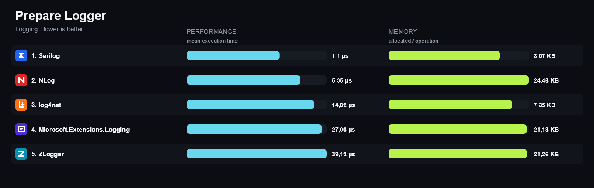

# .NET Matrix

> [**Open the interactive .NET Matrix →**](https://matrix.dev-team.org/)

Evidence-based feature and performance comparisons for .NET libraries.

## CSV Processing

### Rating

A gold, silver and bronze star for the first three places of every benchmark overview.

| # | Library | 🥇 | 🥈 | 🥉 | Won |
|---|---|---|---|---|---|
| 1 | Sep | 4 |  |  | gold in Correctness, gold in Read, gold in Throughput, gold in Write |
| 2 | Sylvan.Data.Csv |  | 4 |  | silver in Correctness, silver in Read, silver in Throughput, silver in Write |
| 3 | CsvHelper |  |  | 4 | bronze in Correctness, bronze in Read, bronze in Throughput, bronze in Write |

### Benchmark overview

Performance and allocated memory are shown together. Lower values are better.

### Libraries

<table>
<tr>
<td width="64"></td>
<td><strong><a href="https://joshclose.github.io/CsvHelper/">CsvHelper</a></strong> 33.1.0 A widely used CSV library with record mapping, type conversion, and synchronous and asynchronous readers and writers.</td>
</tr>
<tr>
<td width="64"></td>
<td><strong><a href="https://github.com/nietras/Sep">Sep</a></strong> 0.15.1 A modern SIMD-accelerated separated-values reader and writer with span-based conversion and async enumeration.</td>
</tr>
<tr>
<td width="64"></td>
<td><strong><a href="https://github.com/MarkPflug/Sylvan/blob/main/docs/Csv.md">Sylvan.Data.Csv</a></strong> 1.4.4 A high-performance forward-only CSV data reader and writer with strongly typed accessors and asynchronous I/O.</td>
</tr>
</table>

### Benchmark scenarios

<strong>01 · Read Simple Rows</strong>

Parses three CSV records and materializes every field as text.

<strong>02 · Read Typed Records</strong>

Parses three CSV records and materializes typed scalar values.

<strong>03 · Read Large Dataset</strong>

Parses and materializes 10,000 typed CSV records.

<strong>04 · Quoted Fields</strong>

Parses doubled quote escapes inside quoted CSV fields.

<strong>05 · Escaped Delimiters</strong>

Parses quoted fields containing a comma or an LF newline.

<strong>06 · Header Mapping</strong>

Maps a reordered CSV header to the correct typed record members.

<strong>07 · Custom Conversion</strong>

Converts sku-NNNN fields to the matrix-owned ProductCode value type.

<strong>08 · Streaming Read</strong>

Aggregates 10,000 typed rows with forward-only reading and no row materialization.

<strong>09 · Write Rows</strong>

Writes three records with a header to an exact LF-terminated CSV string.

<strong>10 · Async Read</strong>

Asynchronously aggregates 10,000 typed CSV rows through the library async API.

## Dependency Injection

### Rating

A gold, silver and bronze star for the first three places of every benchmark overview.

| # | Library | 🥇 | 🥈 | 🥉 | Won |
|---|---|---|---|---|---|
| 1 | Pure.DI | 3 |  |  | gold in Advanced, gold in Basic, gold in Prepare |
| 2 | Grace |  | 1 | 1 | silver in Advanced, bronze in Basic |
| 3 | MvvmCross |  | 1 |  | silver in Prepare |
| 4 | Simple Injector |  | 1 |  | silver in Basic |
| 5 | DryIoc |  |  | 1 | bronze in Prepare |
| 6 | Stashbox |  |  | 1 | bronze in Advanced |

### Benchmark overview

Performance and allocated memory are shown together. Lower values are better.

### Libraries

<table>
<tr>
<td width="64"></td>
<td><strong><a href="https://autofac.readthedocs.io/en/latest/">Autofac</a></strong> 9.3.1 A flexible inversion of control container for building extensible .NET applications.</td>
</tr>
<tr>
<td width="64"></td>
<td><strong><a href="https://github.com/castleproject/Windsor/blob/master/docs/README.md">Castle Windsor</a></strong> 6.0.0 The Castle Project container, with bound lifestyles and Castle DynamicProxy interception.</td>
</tr>
<tr>
<td width="64"></td>
<td><strong><a href="https://www.catelproject.com/">Catel</a></strong> 6.2.0 An MVVM application framework whose service locator and type factory perform constructor injection.</td>
</tr>
<tr>
<td width="64"></td>
<td><strong><a href="https://github.com/dadhi/DryIoc/blob/master/docs/DryIoc.Docs/README.md">DryIoc</a></strong> 5.4.3 A fast, small and feature-rich container with expression-compiled resolution and rich reuse options.</td>
</tr>
<tr>
<td width="64"></td>
<td><strong><a href="https://github.com/Wsm2110/Faster.Ioc#readme">Faster.Ioc</a></strong> 5.0.0 A minimalistic container focused on the shortest possible resolve path.</td>
</tr>
<tr>
<td width="64"></td>
<td><strong><a href="https://github.com/ipjohnson/Grace/wiki">Grace</a></strong> 7.2.1 A container with a fluent registration model, per-object-graph lifestyles and decorator support.</td>
</tr>
<tr>
<td width="64"></td>
<td><strong>Hand-coded</strong> Direct dependency injection written in C# without a container.</td>
</tr>
<tr>
<td width="64"></td>
<td><strong><a href="https://jasperfx.github.io/lamar/">Lamar</a></strong> 16.0.0 The successor to StructureMap, built around runtime code generation.</td>
</tr>
<tr>
<td width="64"></td>
<td><strong><a href="https://www.lightinject.net/">LightInject</a></strong> 7.1.0 A lightweight container with an ultra-small API surface and its own interception package.</td>
</tr>
<tr>
<td width="64"></td>
<td><strong><a href="https://github.com/JonasSamuelsson/Maestro#readme">Maestro</a></strong> 3.6.6 A small container with a fluent configuration API and pluggable activation interceptors.</td>
</tr>
<tr>
<td width="64"></td>
<td><strong><a href="https://learn.microsoft.com/dotnet/framework/mef/">Managed Extensibility Framework 2</a></strong> 10.0.10 The lightweight Managed Extensibility Framework composition engine shipped as System.Composition.</td>
</tr>
<tr>
<td width="64"></td>
<td><strong><a href="https://learn.microsoft.com/dotnet/core/extensions/dependency-injection">Microsoft Extensions Dependency Injection</a></strong> 10.0.10 The built-in .NET dependency injection container and its service collection abstractions.</td>
</tr>
<tr>
<td width="64"></td>
<td><strong><a href="https://www.mvvmcross.com/documentation/">MvvmCross</a></strong> 10.1.2 A cross-platform MVVM framework with its own inversion of control provider.</td>
</tr>
<tr>
<td width="64"></td>
<td><strong><a href="https://github.com/ninject/Ninject/wiki">Ninject</a></strong> 3.3.6 A container built around fluent bindings, contextual conditions and pluggable extensions.</td>
</tr>
<tr>
<td width="64"></td>
<td><strong><a href="https://github.com/DevTeam/Pure.DI#readme">Pure.DI</a></strong> 2.5.2 A compile-time dependency injection framework that generates strongly typed compositions.</td>
</tr>
<tr>
<td width="64"></td>
<td><strong><a href="https://docs.simpleinjector.org/">Simple Injector</a></strong> 5.6.0 A fast, opinionated dependency injection library that promotes explicit configuration and maintainable application design.</td>
</tr>
<tr>
<td width="64"></td>
<td><strong><a href="https://github.com/Barsonax/Singularity#readme">Singularity</a></strong> 0.18.0 An expression-tree based container that validates the whole object graph when the container is built.</td>
</tr>
<tr>
<td width="64"></td>
<td><strong><a href="https://www.springframework.net/">Spring.NET</a></strong> 3.0.3 The Spring.NET application framework and its XML or code configured object factory.</td>
</tr>
<tr>
<td width="64"></td>
<td><strong><a href="https://z4kn4fein.github.io/stashbox/">Stashbox</a></strong> 5.20.0 A fast container with per-request lifetimes, conditional registrations and child containers.</td>
</tr>
<tr>
<td width="64"></td>
<td><strong><a href="https://structuremap.github.io/">StructureMap</a></strong> 4.7.1 A mature container with a fluent registry DSL, nested containers and decorators.</td>
</tr>
<tr>
<td width="64"></td>
<td><strong><a href="https://unitycontainer.org/">Unity</a></strong> 5.11.10 The Unity container, offering per-resolve lifetimes and hierarchical child containers.</td>
</tr>
<tr>
<td width="64"></td>
<td><strong><a href="https://github.com/microsoft/vs-mef/blob/main/doc/index.md">Visual Studio MEF</a></strong> 17.13.41 The Visual Studio composition engine, a fast attribute-driven MEF implementation.</td>
</tr>
<tr>
<td width="64"></td>
<td><strong><a href="https://github.com/zenmvvm/ZenIoc#readme">ZenIoc</a></strong> 1.0.1 A tiny container with compiled registrations, named resolution and nested containers.</td>
</tr>
</table>

### Benchmark scenarios

<strong>01 · Singleton</strong>

Registers three singleton services and resolves each of them repeatedly. Every resolve of the same service must return the same instance.

<strong>02 · Transient</strong>

Registers three transient services and resolves each of them repeatedly. Every resolve must create a new instance, never reusing an earlier one.

<strong>03 · PerResolve</strong>

Resolves an object graph that asks for the same dependency twice. Both requests inside one resolution share an instance, while the next resolution gets a new one.

<strong>04 · Scoped</strong>

Resolves scoped services inside explicit scopes. One instance per scope, different instances across scopes, and scope-owned disposables are disposed when the scope ends.

<strong>05 · Combined</strong>

Resolves three roots that mix singleton and transient dependencies. The singleton is shared across every root while each transient dependency is distinct.

<strong>06 · Complex</strong>

Registers and resolves three multi-level object graphs, checking that every nested dependency has the expected implementation type and lifetime.

<strong>07 · Property</strong>

Resolves three roots that carry writable service properties. The container, or its intended property-injection extension, must assign them during activation.

<strong>08 · Generics</strong>

Registers one open generic service mapping and resolves roots closed over int, float and object. Registering every closed type separately does not count.

<strong>09 · IEnumerable</strong>

Injects a sequence of five plugin implementations and requires it to be genuinely lazy: nothing is created until enumeration, and every enumeration yields new transients.

<strong>10 · Array</strong>

Resolves three roots that materialise their injected sequence of five plugins into an array while the root is being activated.

<strong>11 · Conditional</strong>

Gives each of three consumers a different implementation of one contract, chosen through the metadata, key, predicate or consumer-context mechanism of the library.

<strong>12 · Child Container</strong>

Creates a real nested child container that inherits the registrations of its parent and can add or override them without changing the parent.

<strong>13 · Interception With Proxy</strong>

Resolves a service through the interception or activation extension point of the library. The result must be a proxy whose interceptor proceeds to the real target.

<strong>14 · Prepare And Register</strong>

Measures creating the container and registering the whole prescribed graph, without resolving anything from it.

<strong>15 · Prepare And Register And Simple Resolve</strong>

Measures the same setup as Prepare And Register, followed by a single resolve of one singleton root.

## JSON Serialization

### Rating

A gold, silver and bronze star for the first three places of every benchmark overview.

| # | Library | 🥇 | 🥈 | 🥉 | Won |
|---|---|---|---|---|---|
| 1 | ServiceStack.Text | 5 |  |  | gold in Basic, gold in Collections, gold in Nested, gold in Prepare, gold in Stream |
| 2 | Newtonsoft.Json | 1 | 5 |  | gold in Advanced, silver in Basic, silver in Collections, silver in Nested, silver in Prepare, silver in Stream |

### Benchmark overview

Performance and allocated memory are shown together. Lower values are better.

### Libraries

<table>
<tr>
<td width="64"></td>
<td><strong><a href="https://www.newtonsoft.com/json/help/html/Introduction.htm">Newtonsoft.Json</a></strong> 13.0.4 A mature JSON framework for .NET with configurable contracts, converters, and streaming readers and writers.</td>
</tr>
<tr>
<td width="64"></td>
<td><strong><a href="https://docs.servicestack.net/text">ServiceStack.Text</a></strong> 10.0.8 A high-performance text library with typed JSON, stream, collection, and type-specific serialization APIs.</td>
</tr>
<tr>
<td width="64"></td>
<td><strong><a href="https://learn.microsoft.com/dotnet/standard/serialization/system-text-json/overview">System.Text.Json</a></strong> The reflection-based and source-generated JSON serializer included with .NET.</td>
</tr>
</table>

### Benchmark scenarios

<strong>01 · Serialize Simple Object</strong>

Serializes one scalar object to a compact JSON string.

<strong>02 · Deserialize Simple Object</strong>

Deserializes one compact JSON object and validates every scalar member.

<strong>03 · Serialize Nested Object</strong>

Serializes an order, customer, and address object graph.

<strong>04 · Deserialize Nested Object</strong>

Deserializes and materializes an order, customer, and address object graph.

<strong>05 · Serialize Collection</strong>

Serializes three ordered objects to a compact JSON array.

<strong>06 · Deserialize Collection</strong>

Deserializes a compact JSON array to three ordered objects.

<strong>07 · Serialize Dictionary</strong>

Serializes three ordered string and integer entries to a JSON object.

<strong>08 · Deserialize Dictionary</strong>

Deserializes a JSON object to three ordinal string and integer entries.

<strong>09 · Enum Round Trip</strong>

Serializes an enum as its string name and deserializes it back.

<strong>10 · Custom Converter Round Trip</strong>

Serializes a strongly typed identifier as a JSON string and deserializes it back.

<strong>11 · Polymorphic Round Trip</strong>

Round-trips a base-type collection through safe cat and dog discriminators.

<strong>12 · UTF-8 Stream Round Trip</strong>

Serializes a simple object to a new UTF-8 memory stream and deserializes it back.

<strong>13 · Source Generation Round Trip</strong>

Round-trips a simple object with compile-time generated JSON metadata.

<strong>14 · Prepare Serializer</strong>

Creates fresh serializer settings and explicit type metadata without serializing data.

## Logging

### Rating

A gold, silver and bronze star for the first three places of every benchmark overview.

| # | Library | 🥇 | 🥈 | 🥉 | Won |
|---|---|---|---|---|---|
| 1 | NLog | 2 | 1 |  | gold in Core, gold in Structured, silver in Prepare |
| 2 | Serilog | 1 | 2 |  | gold in Prepare, silver in Core, silver in Structured |
| 3 | log4net |  |  | 3 | bronze in Core, bronze in Prepare, bronze in Structured |

### Benchmark overview

Performance and allocated memory are shown together. Lower values are better.

### Libraries

<table>
<tr>
<td width="64"></td>
<td><strong><a href="https://logging.apache.org/log4net/">log4net</a></strong> 3.3.2 A mature Apache logging framework with hierarchical repositories, contextual properties, layouts, and appenders.</td>
</tr>
<tr>
<td width="64"></td>
<td><strong><a href="https://learn.microsoft.com/dotnet/core/extensions/logging">Microsoft.Extensions.Logging</a></strong> 10.0.10 The standard .NET logging abstraction and logger factory with providers, filtering, structured state, and scopes.</td>
</tr>
<tr>
<td width="64"></td>
<td><strong><a href="https://nlog-project.org/">NLog</a></strong> 6.1.4 A configurable logging platform with structured events, scope context, targets, layouts, and asynchronous wrappers.</td>
</tr>
<tr>
<td width="64"></td>
<td><strong><a href="https://serilog.net/">Serilog</a></strong> 4.4.0 A structured event logger with message templates, contextual enrichment, and a broad sink ecosystem.</td>
</tr>
<tr>
<td width="64"></td>
<td><strong><a href="https://github.com/Cysharp/ZLogger">ZLogger</a></strong> 2.5.10 A source-generated and interpolated-string logger built on Microsoft.Extensions.Logging with UTF-8 and processor APIs.</td>
</tr>
</table>

### Benchmark scenarios

<strong>01 · Disabled Log</strong>

Submits an Information event to a logger whose minimum level is Warning.

<strong>02 · Simple Message</strong>

Delivers one literal Information message to an in-memory sink.

<strong>03 · Structured Properties</strong>

Delivers one event with independently queryable OrderId and ElapsedMs properties.

<strong>04 · Exception</strong>

Delivers one Error event retaining the original exception metadata.

<strong>05 · Scope Or Context</strong>

Creates a temporary RequestId context and captures it on one event.

<strong>06 · Template Rendering</strong>

Formats amount 12.5 and customer Ada through the logger template API.

<strong>07 · Buffered Logging</strong>

Enqueues one event to a library-provided async or buffering wrapper and validates delivery after flush.

<strong>08 · Prepare Logger</strong>

Creates, verifies, and releases one Information-enabled logger with an in-memory sink.

## Object Mapping

### Rating

A gold, silver and bronze star for the first three places of every benchmark overview.

| # | Library | 🥇 | 🥈 | 🥉 | Won |
|---|---|---|---|---|---|
| 1 | Mapperly | 3 |  |  | gold in Advanced, gold in Basic, gold in Prepare |
| 2 | Mapster |  | 2 | 1 | silver in Advanced, silver in Basic, bronze in Prepare |
| 3 | AutoMapper |  | 1 | 2 | silver in Prepare, bronze in Advanced, bronze in Basic |

### Benchmark overview

Performance and allocated memory are shown together. Lower values are better.

### Libraries

<table>
<tr>
<td width="64"></td>
<td><strong><a href="https://docs.automapper.io/">AutoMapper</a></strong> 16.2.0 A convention-based object-object mapper with runtime configuration and compiled mapping plans.</td>
</tr>
<tr>
<td width="64"></td>
<td><strong>Hand-coded</strong> Direct object mapping written in C# without a mapping library.</td>
</tr>
<tr>
<td width="64"></td>
<td><strong><a href="https://mapperly.riok.app/">Mapperly</a></strong> 4.3.1 A source generator that creates readable object mapping code at compile time.</td>
</tr>
<tr>
<td width="64"></td>
<td><strong><a href="https://github.com/MapsterMapper/Mapster/wiki">Mapster</a></strong> 10.0.11 An object mapper with runtime configuration, expression compilation, and projection support.</td>
</tr>
</table>

### Benchmark scenarios

<strong>01 · Simple Object</strong>

Maps one object with scalar values to a newly allocated destination object.

<strong>02 · Nested Object</strong>

Maps an order with nested customer and address objects to a new destination graph.

<strong>03 · Collection</strong>

Maps an array of 100 objects while preserving count, order and member values.

<strong>04 · Flattening</strong>

Maps nested customer values into a flat order summary through member-path configuration.

<strong>05 · Map To Existing</strong>

Overwrites a supplied destination object and returns that same instance.

<strong>06 · Null Handling</strong>

Preserves null text, nested object and collection members in the destination.

<strong>07 · Custom Conversion</strong>

Maps string values through registered code and invariant decimal conversions.

<strong>08 · Polymorphic Mapping</strong>

Maps a base array containing cats and dogs to matching destination runtime types.

<strong>09 · Prepare Configuration</strong>

Creates the complete mapper configuration and eagerly prepares its runtime mapping plans.

<strong>10 · Prepare And Simple Map</strong>

Creates the complete mapper configuration and maps one simple object.

## Validation

### Rating

A gold, silver and bronze star for the first three places of every benchmark overview.

| # | Library | 🥇 | 🥈 | 🥉 | Won |
|---|---|---|---|---|---|
| 1 | MiniValidation | 3 |  |  | gold in Basic, gold in Object Graph, gold in Prepare |
| 2 | FluentValidation | 1 | 3 |  | gold in Rules, silver in Basic, silver in Object Graph, silver in Prepare |

### Benchmark overview

Performance and allocated memory are shown together. Lower values are better.

### Libraries

<table>
<tr>
<td width="64"></td>
<td><strong><a href="https://learn.microsoft.com/dotnet/api/system.componentmodel.dataannotations">DataAnnotations</a></strong> The validation attributes and validation APIs included with the .NET framework.</td>
</tr>
<tr>
<td width="64"></td>
<td><strong><a href="https://docs.fluentvalidation.net/">FluentValidation</a></strong> 12.1.1 A strongly typed validation library with fluent rules, nested validators, cascade modes, and asynchronous validation.</td>
</tr>
<tr>
<td width="64"></td>
<td><strong><a href="https://github.com/DamianEdwards/MiniValidation">MiniValidation</a></strong> 0.10.0 A minimal DataAnnotations-based validator with recursive object graph traversal and cycle detection.</td>
</tr>
</table>

### Benchmark scenarios

<strong>01 · Valid Object</strong>

Validates one object whose scalar properties satisfy every rule.

<strong>02 · Single Failure</strong>

Validates one object and returns its single property failure.

<strong>03 · Multiple Failures</strong>

Validates one object and materializes three independent property failures.

<strong>04 · Nested Object</strong>

Traverses a nested object and reports the complete failing property path.

<strong>05 · Collection</strong>

Traverses three collection elements and reports an indexed failure path.

<strong>06 · Conditional Rule</strong>

Applies a tax ID rule only when the input represents a business.

<strong>07 · Custom Rule</strong>

Applies a custom predicate that accepts only even integer codes.

<strong>08 · Stop On First Failure</strong>

Stops validation after the first failing rule in the declared order.

<strong>09 · Async Validation</strong>

Runs a deterministic asynchronous availability rule through the library async API.

<strong>10 · Prepare Validator</strong>

Creates the complete scalar validator or rule graph without validating an input.

