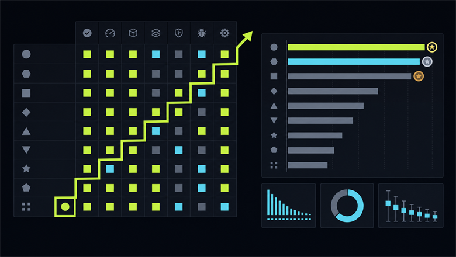

# .NET Matrix: picking a library on evidence, not on GitHub stars



**.NET Matrix** is a new open-source project that compares .NET libraries within a single category along three axes: **features**, **speed** and **memory usage**. Every comparison is reproducible: the scenarios, the scenario tests, the reports and the recorded environment all live in the repository, and a complete run takes one command.

The principle behind the project is *Evidence, not faith*.

- Interactive matrix: [matrix.dev-team.org](https://matrix.dev-team.org/)
- Repository: [github.com/DevTeam/dotnet-matrix](https://github.com/DevTeam/dotnet-matrix) (MIT)

The matrix currently holds **8 categories, 53 libraries and 99 scenarios**.

This article is for .NET developers who:

- need to choose a library and justify the choice with something better than "that is what we already use";
- care not only about "who is faster", but about **what the library actually does** — and what it does not;
- might want to take part: add a favourite library, add their own, or even add a whole new category.

---

## How libraries usually get picked, and why it does not work

The process often looks like this:

- check the GitHub stars and the NuGet download count;
- find a benchmark on somebody's blog;
- read a thread where five people confidently name five different libraries;
- go with whatever the team next door already uses.

Every one of those steps has a weakness:

- **Popularity is inert.** A download count says nothing about whether the library fits *your* scenario.
- **Benchmarks are not comparable with each other.** Different authors, different hardware, different runtime versions, and different — usually unspecified — scenarios. Two benchmarks of the very same pair of libraries routinely reach opposite conclusions, and both are "true" in their own environment.
- **Benchmarks go stale.** A post from 2019 knows nothing about the new library versions or the new runtimes, yet it keeps ranking in search results and keeps being quoted as an authority when somebody picks a library.
- **"Feature support" gets verified by method name.** A checkmark appears in the table because the library has a method with a plausible-looking name. A similar name is not evidence that the scenario is supported.

.NET Matrix tries to close exactly those gaps: identical scenarios for every library in a category, behaviour verified by scenario tests, measurement through BenchmarkDotNet, a recorded environment, and reproducibility.

---

## What .NET Matrix is

The project was inspired by [IocPerformance](https://github.com/danielpalme/IocPerformance) — a comparison of .NET IoC containers that **Daniel Palme** ([palmmedia.de](https://www.palmmedia.de)) started with a blog post back in 2011 and maintained for over ten years. It had support tables for basic and advanced features, plus single-threaded and multi-threaded run times in milliseconds for several dozen containers.

To my mind the idea was sound and is still relevant, but the project has stopped: the repository is **archived on GitHub, last updated on 20 July 2023**. Library versions moved on, .NET went through several major versions, and the tables stayed exactly as they were.

.NET Matrix continues that idea and extends it:

- not just DI, but **any category of libraries**;
- instead of a checkmark — a **feature contract** and a scenario test for every feature;
- instead of a hand-rolled benchmark — **BenchmarkDotNet**;
- **memory statistics** alongside time, which for many workloads is the deciding factor;
- an interactive application instead of a static table, which makes comparing and choosing easier;
- **the whole set of results reproducible with one command** on your own machine.

The IocPerformance heritage is obvious from the list of Dependency Injection participants: Faster.Ioc, Maestro, Singularity, ZenIoc, MvvmCross, Catel, Spring, VS.MEF. Most of its libraries were carried over, except for a few that had not been updated in a long time and look abandoned.

For every category, .NET Matrix answers three questions that matter.

**1. What the library can do.** A feature matrix where every "library × feature" pair carries one of four statuses:

-  `Supported` — the implementation passed every check in the scenario;
-  `Unsupported` — the library has no matching semantics and no extension point;
-  `NotApplicable` — the feature has no meaningful equivalent for this library;
-  `Failed` — support is claimed, but the checks did not pass.

**2. What it costs in time.** Two statistics go into the report:

- the **sample mean** — the average time of a single operation across all iterations. It is a point estimate of the true mean time, not the true value itself;
- the **standard error of the mean** (SEM) — an estimate of how far the sample mean may sit from the true one. It is computed as `s / √n`, where `s` is the sample standard deviation and `n` is the number of iterations. The application shows it as a `±` next to the mean.

Why the distinction matters in practice: the standard deviation describes the spread of the individual measurements, whereas the standard error describes how precise the resulting estimate of the mean is. So if two results differ by less than a few standard errors, there is most likely no difference at all — it is within the measurement noise. And for the same reason iterations cannot be cut indefinitely: SEM only shrinks as `1 / √n`.

**3. What it costs in memory.** Allocations per operation.

The order matters: **correctness first, benchmarks second.** If the scenario tests fail, no benchmarks are published for that category at all — only the feature matrix goes out, with an explicit note that the benchmarks were skipped. A fast but incorrect implementation never reaches the results or the rating.

Results add up into an overall rating: scenarios are collected into groups (for CSV those are `Read`, `Correctness`, `Throughput` and `Write`; for DI they are `Basic`, `Advanced` and `Prepare`), and the top three places in every group earn 🥇, 🥈 and 🥉. In some categories a hand-coded implementation sets the point of reference — a baseline — without competing for medals.

---

## Current results

| Category | Rating leader | Libraries | Scenarios |
|---|---|---:|---:|
| CSV Processing | Sep | 4 | 10 |
| Dependency Injection | Pure.DI | 23 | 15 |
| JSON Serialization | System.Text.Json | 3 | 14 |
| LINQ Queries | ZLinq | 6 | 18 |
| Logging | Microsoft.Extensions.Logging | 6 | 9 |
| Object Mapping | Mapperly | 4 | 10 |
| Validation | Microsoft.Extensions.Validation | 4 | 10 |
| ZIP Archives | SharpZipLib | 3 | 13 |

The measured numbers are deliberately left out of this article: they are tied to specific package versions and to the environment the tests ran in, and they go stale quickly. For current figures, charts and the feature matrix, use the application: [matrix.dev-team.org](https://matrix.dev-team.org/).

The **baselines** deserve a separate word. Several categories include a "zero option" alongside the libraries: `HandCoded` — code written by hand — in Dependency Injection, LINQ Queries and Object Mapping, and `System.Linq`, `System.Text.Json`, `DataAnnotations`, `System.IO.Compression` and `Microsoft.Extensions.Logging`, which the platform already ships. It is a genuinely useful data point, because it answers the question of **how much you are paying for the library** and whether it is worth taking at all. And sometimes the answer is a surprise: in Validation and JSON Serialization the rating is currently led by the platform options — `Microsoft.Extensions.Validation` and `System.Text.Json`.

---

## Why this data can be trusted

### Scenario tests back every support claim

Every feature of a category is described up front in a contract — one Markdown document per category of libraries. The contract fixes what the scenario does, what goes in, which result counts as correct, what happens before the measurement and what happens inside it, and under which condition the feature counts as properly supported.

Every feature of every library has a **scenario test**: the test drives the library's real API, and the result is compared against the reference from the contract — not "it did not throw", but exact values. In the CSV *Custom Conversion* scenario, for instance, a field shaped like `sku-NNNN` has to turn into a domain value, and the concrete numbers 42 and 73 are asserted. The contract also spells out what does *not* count as support: parsing the line with your own code and then calling the conversion is not allowed; wrapping a synchronous parser in `Task.Run` and calling it an async API is not allowed; an API with a similar name is not evidence that the scenario is supported.

That leads to an important property: **the empty cells of the matrix are results too.** A feature the library does not implement must be declared unavailable, with a reason, or the scenario test run fails. Quietly forgetting a feature and ending up with a dash is not an option.

Running the scenario tests is a mandatory step before the benchmarks, both locally and in CI.

### BenchmarkDotNet does the measuring

Time and memory are measured by [BenchmarkDotNet](https://github.com/dotnet/BenchmarkDotNet) — an open-source library under the .NET Foundation umbrella and the de facto standard for benchmarking in .NET: the performance measurements of .NET itself, in the [dotnet/performance](https://github.com/dotnet/performance) repository, are built on it.

Here is why its results deserve more trust than a `Stopwatch` of your own:

- the measurements run in a **separate generated process** for the configuration in question, not inside your application or test runner;
- a **warm-up** comes first, so that JIT compilation and cold code paths stay out of the result;
- the number of operations per iteration is chosen by a **pilot stage** rather than guessed;
- **statistics across iterations** are computed — the sample mean and the standard error of the mean, with outliers discarded — so every number comes with a known margin;
- **allocations** are measured by a dedicated diagnoser instead of a crude `GC.GetTotalMemory` difference;
- the **benchmark environment** (OS, runtime version, SDK version, processor, logical core count, and the version of the tool itself) is recorded in the report, so numbers from different environments cannot get mixed together by accident.

BenchmarkDotNet's author and maintainer is **Andrey Akinshin**, who also wrote the book **"Pro .NET Benchmarking: The Art of Performance Measurement"** (Apress, 2019) — the tool comes from someone who devoted an entire book to the methodology of measuring performance correctly on .NET, including all the traps that hand-rolled benchmarks usually fall into. .NET Matrix currently uses BenchmarkDotNet 0.15.8.

---

## How to use it

The main tool is the interactive application at [matrix.dev-team.org](https://matrix.dev-team.org/). It lets you:

- select the libraries you care about and drop the rest from the comparison;
- switch between the overview, the feature matrix, the benchmarks and the environment details;
- pick the version of the reports: data is loaded from the repository at the commit of the selected version, so you can look at a published release, at the current state of the branch, and at the history of the results — for different library versions, for example.

The `README.md` in the repository is a generated snapshot of the same reports: ratings, charts for every scenario group, library descriptions and the scenario list. The README and the application share one scale, so the same result never reads differently in the two places.

How to read the results when choosing a library for your project:

1. **The feature matrix first.** If the library does not implement the feature you need, its place in the rating is irrelevant.
2. **Then the scenario group that resembles your requirements.** The overall rating is a sum of medals across groups, while you usually care about one particular group: throughput, configuration setup, or correctness in edge cases.
3. **Allocations next.** On a hot path and in a high-load service, memory often matters more than the mean execution time.
4. **And only then the timing statistics**, together with the environment they were obtained in.

---

## Do not take my word for it — produce the numbers yourself

The complete cycle — scenario tests, benchmarks and the preparation of every artefact — runs with one command:

```powershell
dotnet run --project .\build -- reproduce
```

It runs the scenario tests and the benchmarks for every library, regenerates the reports, charts, metadata and README, then brings up the local application on an automatically chosen free port and opens it in a browser. Add `--no-browser` if you do not want the browser; `Ctrl+C` stops the application.

If you do not need to run the benchmarks and the reports already on disk are enough:

```powershell
dotnet run --project .\build -- reproduce --skip-benchmarks
```

Individual categories have their own commands, for example for CSV:

```powershell
dotnet run --project .\build -- csv-processing-validate
dotnet run --project .\build -- csv-processing-benchmarks
```

What a full run needs: a 64-bit OS, the .NET 10 SDK on `PATH`, several gigabytes of free space, and 8 GB of RAM as a practical minimum. And, more important than the technical requirements, an otherwise idle machine, connected to power, without a debugger and with a fixed performance power profile. The complete benchmark matrix takes a long time to compute; that is normal.

The reports and the recorded environment are in the repository, so you can compare your own numbers with the published ones and see where they diverge.

---

## On the conflict of interest — openly

Better to say this first than to say it in reply to a comment.

.NET Matrix was built by [me](https://github.com/NikolayPianikov). I am also the author of [Pure.DI](https://github.com/DevTeam/Pure.DI), the library that currently leads the Dependency Injection category. On top of that, Pure.DI is used inside the project itself as its compile-time DI. "Measured it myself, won it myself" invites suspicion, and that is a healthy reaction.

So the project is arranged to let anyone check the result instead of taking it on trust:

- **The rules are shared and in the open.** A category's feature contract is the same for every participant, it lives in the repository, and it was written before the implementations.
- **The scenarios are identical.** No "special" benchmark for one participant: everyone implements the same scenario and passes the same scenario tests.
- **Dependency Injection has 23 participants right now**, including the hand-coded implementation that shows the "physical" limit — what this would cost with no library at all.
- **Everything reproduces with one command** on your hardware, and the reports are committed together with their environment.
- **Disagreements are settled by pull request.** If a scenario looks odd to you, a competitor's implementation looks suboptimal, or a measurement looks wrong, that gets fixed in code and discussed on the [dotnet-matrix repository](https://github.com/DevTeam/dotnet-matrix).

If you find an incorrect scenario or an inefficient implementation, open an issue and/or send a PR. For a project whose entire value rests on trust in its data, a corrected scenario is worth more than any flattering rating.

---

## How to add a library

The process is described in [workflows/add-library.md](https://github.com/DevTeam/dotnet-matrix/blob/master/workflows/add-library.md). In short:

**1. Read the whole category contract** — `workflows/feature-contracts/<module-id>.md`. This is not a formality: it states what counts as support for each feature.

**2. Map every feature to the library's real API.** Before writing code, not after.

**3. Add one annotated `PackageReference`** to the category project. The package metadata *is* the record of the library; there is no separate JSON file to maintain:

```xml
<PackageReference Include="Sep" Version="0.15.1">
    <MatrixLibraryId>Sep</MatrixLibraryId>
    <MatrixLibraryName>Sep</MatrixLibraryName>
    <MatrixCodeName>Sep</MatrixCodeName>
    <MatrixDescription>A modern SIMD-accelerated separated-values reader and writer with span-based conversion and async enumeration.</MatrixDescription>
    <MatrixDocumentationUrl>https://github.com/nietras/Sep</MatrixDocumentationUrl>
    <MatrixRepositoryUrl>https://github.com/nietras/Sep</MatrixRepositoryUrl>
    <MatrixLogo>logos/sep.svg</MatrixLogo>
</PackageReference>
```

The version is an exact literal — no ranges, no wildcards, no MSBuild properties: a comparison has to be pinned to one concrete version. If a required piece of metadata is missing, the build fails with a clear message, and the same metadata generates the helper code — the library catalog constants.

**4. Put the logo** in `metadata/<Category>/logos/` and refresh the metadata by running the `generate-metadata` build target.

**5. Implement one file per feature** — `Benchmarks/<CodeName>/NN_Feature.cs`. A single file holds both the measured method and the result check, which is exactly the scenario test. Inside the measured method there is a direct, strongly typed call into the library's API.

**6. Declare explicitly that a scenario is not implemented**, with a reason — otherwise the scenario test fails.

**7. Run the scenario tests** for your library only, to save your own time:

```powershell
dotnet run --project .\build -- csv-processing-validate --libraries Sep
```

A separate word on **what must never be hand-edited**: `libraries.json`, `features.json`, `benchmarks.json`, the charts under `reports/*/charts/`, `README.md` and the run configurations in `.run/` are all generated from the sources and the reports. Edits there are lost on the next regeneration.

---

## How to add a category

This is a bigger piece of work, described in [workflows/add-category.md](https://github.com/DevTeam/dotnet-matrix/blob/master/workflows/add-category.md). The order is not negotiable: **the feature contract first, the code second.**

1. Write `workflows/feature-contracts/<module-id>.md`: the feature list, the inputs, the expected results, the boundary between preparation and measurement, the conditions for `Supported` / `Unsupported` / `NotApplicable`, and rating participation.
2. Settle the identity of the category: the `Matrix.<Category>` project, a stable module ID (`object-mapping`, for example), the display name, the run configuration prefix, the report directory. These values become data keys, so they must not change later.
3. Create the executable project with its scenarios, implementations and checks, register it in `dotnet-matrix.slnx` and import the shared `Matrix.Module.targets`.

From there the category is discovered on its own; the build project needs no edits. The automatic chain looks like this:

```text
Matrix.<Category>.csproj
  -> embedded into the assembly as a resource
  -> module and library metadata are read from it
  -> the build discovers the module
  -> scenario test and benchmark reports
  -> the shared renderers: PNG, README, Web
```

The shared part — report models, module discovery, filtering, ratings, charts and the web catalog — lives in `src/Matrix`, while each category owns only its own semantics: the data models for the tests, and the scenarios.

---

## What the project needs right now

The most valuable contribution is new data. There are three levels of entry, from the easy one up.

**Add a library to an existing category.** The lowest barrier, and the benefit shows immediately: CSV Processing, JSON Serialization and Validation have only three libraries each at the moment. The candidates are obvious — SpanJson for JSON, Validot for Validation, and a few more mappers and loggers.

**Implement a new category.** The ideas are in the [roadmap](https://github.com/DevTeam/dotnet-matrix/blob/master/workflows/category-roadmap.md):

- Binary Serialization (MessagePack, MemoryPack, protobuf-net) — payload size probably has to become a metric of its own;
- Mediator / Message Dispatch;
- CLI Parsing — deterministic and free of infrastructure;
- Template Engines — compilation and rendering;
- Caching — in-memory to begin with;
- and the riskier ones after that: HTTP Clients, Data Access / ORM, Resilience.

**Challenge a scenario, or the way a library implements it.** If you know a particular library well, the most useful thing you can do is check whether the matrix uses it the way its author intended. A suboptimal implementation of a competitor is a bug in the project, and it gets fixed like a bug.

Worth knowing before you start: the benchmarks run locally and they take a long time, but the scenario tests are fast. So an implementation can be brought to "every feature is correct" without hours of measurement, and the full matrix — or a partial one, for a few selected libraries — can be computed once at the end.

---

## Conclusion

Choosing a library is an engineering decision, and it deserves the same kind of justification as every other engineering decision: a reproducible experiment with a stated method, rather than GitHub stars or a benchmark from a five-year-old blog post.

The goal of .NET Matrix is to make that experiment shared and permanently up to date: one feature contract per category, a scenario test for every feature, BenchmarkDotNet for the measurements, a recorded run environment, and full reproduction with a single command. The project is young — six categories and forty libraries — which is exactly why now is a good moment to join: even one added library changes the picture noticeably.

- Matrix: [matrix.dev-team.org](https://matrix.dev-team.org/)
- Repository: [github.com/DevTeam/dotnet-matrix](https://github.com/DevTeam/dotnet-matrix)
- Add a library: [workflows/add-library.md](https://github.com/DevTeam/dotnet-matrix/blob/master/workflows/add-library.md)
- Add a category: [workflows/add-category.md](https://github.com/DevTeam/dotnet-matrix/blob/master/workflows/add-category.md)
- Roadmap: [workflows/category-roadmap.md](https://github.com/DevTeam/dotnet-matrix/blob/master/workflows/category-roadmap.md)

And if your library does something the contract does not cover, that is a reason to open an issue too: the matrix may be missing an entire feature.
