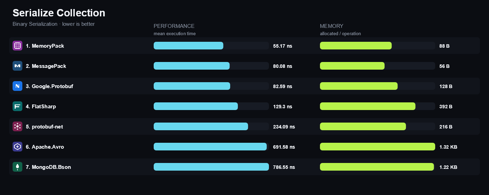

<!-- Generated by build/Templates/CategoryReport.cshtml. Do not edit this file directly. -->

[← .NET Matrix](../../README.md) · [Open the interactive matrix →](https://matrix.dev-team.org/?category=binary-serialization)

# Binary Serialization

<blockquote>
<strong><a href="https://matrix.dev-team.org/?category=binary-serialization&amp;library=MemoryPack">MemoryPack</a></strong> leads the current rating · 8 libraries · 7 scenarios
</blockquote>

## Rating

In every scenario the fastest library scores 100 points and the one allocating
least scores 100 more; four times slower is half the points, and an unsupported
scenario is worth nothing. Time and memory reach **700**
each here, so the maximum is **1400**.
See [workflows/rating.md](../../workflows/rating.md).

| # | Library | Scenarios | Time | Memory | Points | Group wins |
|---:|---|---:|---:|---:|---:|---|
| 1 | [**MemoryPack**](https://matrix.dev-team.org/?category=binary-serialization&library=MemoryPack) | 7/7 | 661 | 654 | 1315 | gold in Deserialize, gold in Round Trip, gold in Serialize |
| 2 | [**MessagePack**](https://matrix.dev-team.org/?category=binary-serialization&library=MessagePack) | 7/7 | 502 | 695 | 1197 | silver in Serialize, bronze in Deserialize, bronze in Round Trip |
| 3 | [**FlatSharp**](https://matrix.dev-team.org/?category=binary-serialization&library=FlatSharp) | 7/7 | 526 | 501 | 1027 | silver in Deserialize |
| 4 | [**Google.Protobuf**](https://matrix.dev-team.org/?category=binary-serialization&library=Google.Protobuf) | 7/7 | 507 | 482 | 989 | bronze in Serialize |
| 5 | [**protobuf-net**](https://matrix.dev-team.org/?category=binary-serialization&library=protobuf-net) | 7/7 | 336 | 493 | 829 |  |
| 6 | [**HyperSerializer**](https://matrix.dev-team.org/?category=binary-serialization&library=HyperSerializer) | 3/7 | 300 | 258 | 558 | silver in Round Trip |
| 7 | [**Apache.Avro**](https://matrix.dev-team.org/?category=binary-serialization&library=Apache.Avro) | 7/7 | 241 | 310 | 550 |  |
| 8 | [**MongoDB.Bson**](https://matrix.dev-team.org/?category=binary-serialization&library=MongoDB.Bson) | 7/7 | 201 | 232 | 433 |  |

<strong>How the points were earned</strong> — every scenario, with the measurements behind it

Each row is one scenario. `Best` is the lowest result among the rated libraries
that completed it, and the points follow from the two figures beside them:
`100 × √((best + step) / (result + step))`, with a step of 1 ns for time and 24 B
for memory. A dash means the library did not complete the scenario, and it scores
nothing for it. Add the two Points columns over every scenario and you get the
rating above. The same breakdown appears as a hint on any points value in the
[application](https://matrix.dev-team.org/?category=binary-serialization).

#### 1. MemoryPack — 1315 of 1400

| Scenario | Time | Best | Points | Memory | Best | Points |
|---|---:|---:|---:|---:|---:|---:|
| Serialize Simple Object | 30.17 ns | 19.04 ns | 80.2 | 48 B | 32 B | 88.2 |
| Deserialize Simple Object | 23.71 ns | 17.44 ns | 86.4 | 64 B | 64 B | 100 |
| Serialize Nested Object | 45.33 ns | 45.33 ns | 100 | 72 B | 48 B | 86.6 |
| Deserialize Nested Object | 86.85 ns | 78.85 ns | 95.3 | 296 B | 264 B | 94.9 |
| Serialize Collection | 55.17 ns | 55.17 ns | 100 | 88 B | 56 B | 84.5 |
| Deserialize Collection | 101.77 ns | 101.77 ns | 100 | 328 B | 328 B | 100 |
| Enum Round Trip | 23.28 ns | 22.86 ns | 99.1 | 56 B | 56 B | 100 |

#### 2. MessagePack — 1197 of 1400

| Scenario | Time | Best | Points | Memory | Best | Points |
|---|---:|---:|---:|---:|---:|---:|
| Serialize Simple Object | 38.01 ns | 19.04 ns | 71.7 | 32 B | 32 B | 100 |
| Deserialize Simple Object | 55.06 ns | 17.44 ns | 57.4 | 64 B | 64 B | 100 |
| Serialize Nested Object | 67.62 ns | 45.33 ns | 82.2 | 48 B | 48 B | 100 |
| Deserialize Nested Object | 147.54 ns | 78.85 ns | 73.3 | 296 B | 264 B | 94.9 |
| Serialize Collection | 80.08 ns | 55.17 ns | 83.2 | 56 B | 56 B | 100 |
| Deserialize Collection | 177.04 ns | 101.77 ns | 76 | 328 B | 328 B | 100 |
| Enum Round Trip | 68.57 ns | 22.86 ns | 58.6 | 56 B | 56 B | 100 |

#### 3. FlatSharp — 1027 of 1400

| Scenario | Time | Best | Points | Memory | Best | Points |
|---|---:|---:|---:|---:|---:|---:|
| Serialize Simple Object | 46.47 ns | 19.04 ns | 65 | 152 B | 32 B | 56.4 |
| Deserialize Simple Object | 37.08 ns | 17.44 ns | 69.6 | 80 B | 64 B | 92 |
| Serialize Nested Object | 97.61 ns | 45.33 ns | 68.5 | 304 B | 48 B | 46.9 |
| Deserialize Nested Object | 78.85 ns | 78.85 ns | 100 | 264 B | 264 B | 100 |
| Serialize Collection | 129.3 ns | 55.17 ns | 65.7 | 392 B | 56 B | 43.9 |
| Deserialize Collection | 119.82 ns | 101.77 ns | 92.2 | 400 B | 328 B | 91.1 |
| Enum Round Trip | 55.95 ns | 22.86 ns | 64.7 | 136 B | 56 B | 70.7 |

#### 4. Google.Protobuf — 989 of 1400

| Scenario | Time | Best | Points | Memory | Best | Points |
|---|---:|---:|---:|---:|---:|---:|
| Serialize Simple Object | 32.85 ns | 19.04 ns | 77 | 104 B | 32 B | 66.1 |
| Deserialize Simple Object | 59.08 ns | 17.44 ns | 55.4 | 240 B | 64 B | 57.7 |
| Serialize Nested Object | 72.17 ns | 45.33 ns | 79.6 | 112 B | 48 B | 72.8 |
| Deserialize Nested Object | 116.76 ns | 78.85 ns | 82.3 | 392 B | 264 B | 83.2 |
| Serialize Collection | 82.59 ns | 55.17 ns | 82 | 128 B | 56 B | 72.5 |
| Deserialize Collection | 188.54 ns | 101.77 ns | 73.6 | 536 B | 328 B | 79.3 |
| Enum Round Trip | 71.37 ns | 22.86 ns | 57.4 | 296 B | 56 B | 50 |

#### 5. protobuf-net — 829 of 1400

| Scenario | Time | Best | Points | Memory | Best | Points |
|---|---:|---:|---:|---:|---:|---:|
| Serialize Simple Object | 102.58 ns | 19.04 ns | 44 | 192 B | 32 B | 50.9 |
| Deserialize Simple Object | 113.46 ns | 17.44 ns | 40.1 | 152 B | 64 B | 70.7 |
| Serialize Nested Object | 193.39 ns | 45.33 ns | 48.8 | 200 B | 48 B | 56.7 |
| Deserialize Nested Object | 238.75 ns | 78.85 ns | 57.7 | 288 B | 264 B | 96.1 |
| Serialize Collection | 234.09 ns | 55.17 ns | 48.9 | 216 B | 56 B | 57.7 |
| Deserialize Collection | 373.17 ns | 101.77 ns | 52.4 | 424 B | 328 B | 88.6 |
| Enum Round Trip | 124.52 ns | 22.86 ns | 43.6 | 128 B | 56 B | 72.5 |

#### 6. HyperSerializer — 558 of 1400

| Scenario | Time | Best | Points | Memory | Best | Points |
|---|---:|---:|---:|---:|---:|---:|
| Serialize Simple Object | 19.04 ns | 19.04 ns | 100 | 80 B | 32 B | 73.4 |
| Deserialize Simple Object | 17.44 ns | 17.44 ns | 100 | 64 B | 64 B | 100 |
| Serialize Nested Object | — | 45.33 ns | 0 | — | 48 B | 0 |
| Deserialize Nested Object | — | 78.85 ns | 0 | — | 264 B | 0 |
| Serialize Collection | — | 55.17 ns | 0 | — | 56 B | 0 |
| Deserialize Collection | — | 101.77 ns | 0 | — | 328 B | 0 |
| Enum Round Trip | 22.86 ns | 22.86 ns | 100 | 88 B | 56 B | 84.5 |

#### 7. Apache.Avro — 550 of 1400

| Scenario | Time | Best | Points | Memory | Best | Points |
|---|---:|---:|---:|---:|---:|---:|
| Serialize Simple Object | 166.7 ns | 19.04 ns | 34.6 | 456 B | 32 B | 34.2 |
| Deserialize Simple Object | 197.28 ns | 17.44 ns | 30.5 | 280 B | 64 B | 53.8 |
| Serialize Nested Object | 287.12 ns | 45.33 ns | 40.1 | 568 B | 48 B | 34.9 |
| Deserialize Nested Object | 448.89 ns | 78.85 ns | 42.1 | 648 B | 264 B | 65.5 |
| Serialize Collection | 691.58 ns | 55.17 ns | 28.5 | 1.32 KB | 56 B | 24.1 |
| Deserialize Collection | 1.21 μs | 101.77 ns | 29.1 | 1.48 KB | 328 B | 47.9 |
| Enum Round Trip | 184.55 ns | 22.86 ns | 35.9 | 304 B | 56 B | 49.4 |

#### 8. MongoDB.Bson — 433 of 1400

| Scenario | Time | Best | Points | Memory | Best | Points |
|---|---:|---:|---:|---:|---:|---:|
| Serialize Simple Object | 296.29 ns | 19.04 ns | 26 | 1008 B | 32 B | 23.3 |
| Deserialize Simple Object | 308.56 ns | 17.44 ns | 24.4 | 736 B | 64 B | 34 |
| Serialize Nested Object | 476.77 ns | 45.33 ns | 31.1 | 1.02 KB | 48 B | 26 |
| Deserialize Nested Object | 571.73 ns | 78.85 ns | 37.3 | 1008 B | 264 B | 52.8 |
| Serialize Collection | 786.55 ns | 55.17 ns | 26.7 | 1.22 KB | 56 B | 25.1 |
| Deserialize Collection | 1.04 μs | 101.77 ns | 31.5 | 1.45 KB | 328 B | 48.4 |
| Enum Round Trip | 407.37 ns | 22.86 ns | 24.2 | 1.6 KB | 56 B | 21.9 |

## Benchmark overview

**Serialize**

<strong>More overview charts (2)</strong>

#### Deserialize

#### Round Trip

## Compared libraries (8)

<table>
<tr>
<td width="64"></td>
<td><strong><a href="https://avro.apache.org/docs/">Apache.Avro</a></strong> 1.12.2 Apache Avro for .NET with schema-driven generic, specific, and reflection-based binary encoding.</td>
<td width="100" align="right"><a href="https://matrix.dev-team.org/?category=binary-serialization&amp;library=Apache.Avro">Compare →</a></td>
</tr>
<tr>
<td width="64"></td>
<td><strong><a href="https://github.com/jamescourtney/FlatSharp">FlatSharp</a></strong> 7.5.1 A FlatBuffers implementation with compile-time generated serializers and zero-copy reads over the buffer.</td>
<td width="100" align="right"><a href="https://matrix.dev-team.org/?category=binary-serialization&amp;library=FlatSharp">Compare →</a></td>
</tr>
<tr>
<td width="64"></td>
<td><strong><a href="https://protobuf.dev/getting-started/csharptutorial/">Google.Protobuf</a></strong> 3.36.2 The reference Protocol Buffers runtime for .NET, driven by C# code generated from a .proto schema.</td>
<td width="100" align="right"><a href="https://matrix.dev-team.org/?category=binary-serialization&amp;library=Google.Protobuf">Compare →</a></td>
</tr>
<tr>
<td width="64"></td>
<td><strong><a href="https://github.com/replaysMike/HyperSerializer">HyperSerializer</a></strong> 1.6.0 A small source-generated binary serializer focused on minimal allocations for simple contracts.</td>
<td width="100" align="right"><a href="https://matrix.dev-team.org/?category=binary-serialization&amp;library=HyperSerializer">Compare →</a></td>
</tr>
<tr>
<td width="64"></td>
<td><strong><a href="https://github.com/Cysharp/MemoryPack">MemoryPack</a></strong> 1.22.0 A source-generated binary serializer that writes directly into memory instead of intermediate buffers.</td>
<td width="100" align="right"><a href="https://matrix.dev-team.org/?category=binary-serialization&amp;library=MemoryPack">Compare →</a></td>
</tr>
<tr>
<td width="64"></td>
<td><strong><a href="https://github.com/MessagePack-CSharp/MessagePack-CSharp">MessagePack</a></strong> 3.1.12 A compact binary serializer with attribute-driven contracts, contractless mode, and LZ4 compression support.</td>
<td width="100" align="right"><a href="https://matrix.dev-team.org/?category=binary-serialization&amp;library=MessagePack">Compare →</a></td>
</tr>
<tr>
<td width="64"></td>
<td><strong><a href="https://www.mongodb.com/docs/drivers/csharp/">MongoDB.Bson</a></strong> 3.14.1 The BSON document serializer used by the MongoDB .NET driver, usable independently of a database.</td>
<td width="100" align="right"><a href="https://matrix.dev-team.org/?category=binary-serialization&amp;library=MongoDB.Bson">Compare →</a></td>
</tr>
<tr>
<td width="64"></td>
<td><strong><a href="https://protobuf-net.github.io/protobuf-net/">protobuf-net</a></strong> 3.4.40 A contract-first Protocol Buffers implementation for .NET driven by attributes instead of generated code.</td>
<td width="100" align="right"><a href="https://matrix.dev-team.org/?category=binary-serialization&amp;library=protobuf-net">Compare →</a></td>
</tr>
</table>

## Benchmark scenarios (7)

### 01 · Serialize Simple Object

Serializes one scalar object to a binary payload.

### 02 · Deserialize Simple Object

Deserializes one scalar object from a binary payload produced by the same library.

### 03 · Serialize Nested Object

Serializes an order with a nested customer and address to a binary payload.

### 04 · Deserialize Nested Object

Deserializes an order with a nested customer and address from a binary payload.

### 05 · Serialize Collection

Serializes three ordered objects to a binary payload.

### 06 · Deserialize Collection

Deserializes three ordered objects from a binary payload.

### 07 · Enum Round Trip

Round-trips one enum member through the library's binary representation.

