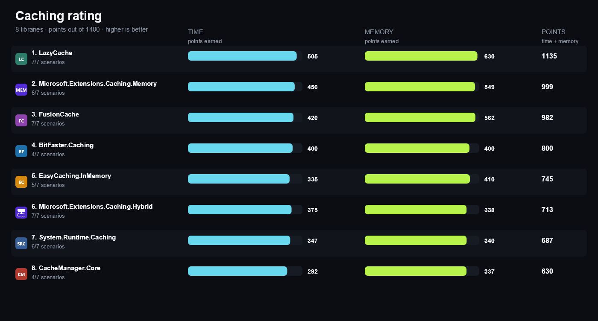
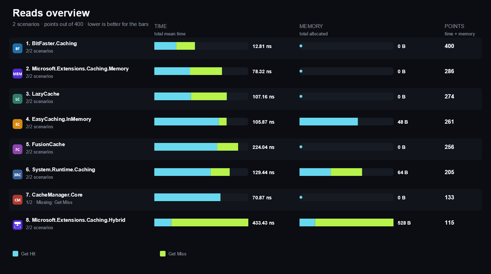
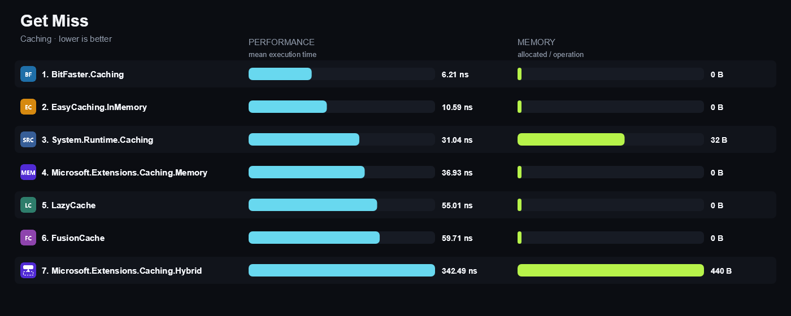
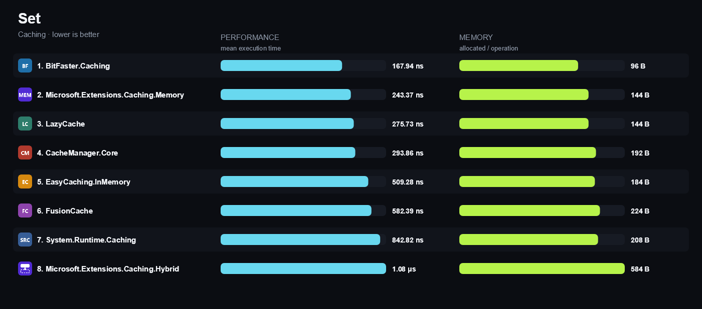
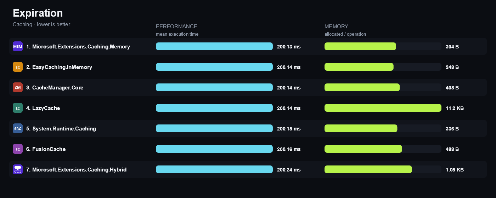
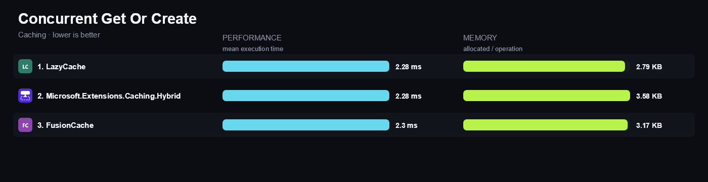

<!-- Generated by build/Templates/CategoryReport.cshtml. Do not edit this file directly. -->

[← .NET Matrix](../../README.md) · [Open the interactive matrix →](https://matrix.dev-team.org/?category=caching)

# Caching

<blockquote>
<strong><a href="https://matrix.dev-team.org/?category=caching&amp;library=LazyCache">LazyCache</a></strong> leads the current rating · 8 libraries · 8 scenarios
</blockquote>

## Rating

In every scenario the fastest library scores 100 points and the one allocating
least scores 100 more; four times slower is half the points, and an unsupported
scenario is worth nothing. Time and memory reach **700**
each here, so the maximum is **1400**.
See [workflows/rating.md](../../workflows/rating.md).

| # | Library | Scenarios | Time | Memory | Points | Group wins |
|---:|---|---:|---:|---:|---:|---|
| 1 | [**LazyCache**](https://matrix.dev-team.org/?category=caching&library=LazyCache) | 7/7 | 534 | 630 | 1164 | gold in Read Through, bronze in Lifetime |
| 2 | [**Microsoft.Extensions.Caching.Memory**](https://matrix.dev-team.org/?category=caching&library=Microsoft.Extensions.Caching.Memory) | 6/7 | 470 | 549 | 1019 | silver in Lifetime, silver in Reads, bronze in Writes |
| 3 | [**FusionCache**](https://matrix.dev-team.org/?category=caching&library=ZiggyCreatures.FusionCache) | 7/7 | 448 | 563 | 1011 | silver in Read Through |
| 4 | [**BitFaster.Caching**](https://matrix.dev-team.org/?category=caching&library=BitFaster.Caching) | 4/7 | 382 | 400 | 782 | gold in Reads, gold in Writes |
| 5 | [**EasyCaching.InMemory**](https://matrix.dev-team.org/?category=caching&library=EasyCaching.InMemory) | 5/7 | 366 | 410 | 776 | gold in Lifetime, bronze in Reads |
| 6 | [**System.Runtime.Caching**](https://matrix.dev-team.org/?category=caching&library=System.Runtime.Caching) | 6/7 | 360 | 393 | 753 |  |
| 7 | [**Microsoft.Extensions.Caching.Hybrid**](https://matrix.dev-team.org/?category=caching&library=Microsoft.Extensions.Caching.Hybrid) | 7/7 | 408 | 337 | 746 | bronze in Read Through |
| 8 | [**CacheManager.Core**](https://matrix.dev-team.org/?category=caching&library=CacheManager.Core) | 4/7 | 316 | 337 | 653 | silver in Writes |

<strong>How the points were earned</strong> — every scenario, with the measurements behind it

Each row is one scenario. `Best` is the lowest result among the rated libraries
that completed it, and the points follow from the two figures beside them:
`100 × √((best + step) / (result + step))`, with a step of 1 ns for time and 24 B
for memory. A dash means the library did not complete the scenario, and it scores
nothing for it. Add the two Points columns over every scenario and you get the
rating above. The same breakdown appears as a hint on any points value in the
[application](https://matrix.dev-team.org/?category=caching).

#### 1. LazyCache — 1164 of 1400

| Scenario | Time | Best | Points | Memory | Best | Points |
|---|---:|---:|---:|---:|---:|---:|
| Get Hit | 46.02 ns | 8.98 ns | 46.1 | 0 B | 0 B | 100 |
| Get Miss | 43.26 ns | 5.51 ns | 38.4 | 0 B | 0 B | 100 |
| Set | 193.23 ns | 166.65 ns | 92.9 | 144 B | 96 B | 84.5 |
| Get Or Create | 170.1 ns | 116.31 ns | 82.8 | 232 B | 144 B | 81 |
| Expiration | 200.19 ms | 200.17 ms | 100 | 304 B | 240 B | 89.7 |
| Invalidate | 192.36 ns | 106.06 ns | 74.4 | 192 B | 96 B | 74.5 |
| Concurrent Get Or Create | 2.38 ms | 2.36 ms | 99.5 | 2.84 KB | 2.84 KB | 100 |

#### 2. Microsoft.Extensions.Caching.Memory — 1019 of 1400

| Scenario | Time | Best | Points | Memory | Best | Points |
|---|---:|---:|---:|---:|---:|---:|
| Get Hit | 38.22 ns | 8.98 ns | 50.5 | 0 B | 0 B | 100 |
| Get Miss | 34.02 ns | 5.51 ns | 43.1 | 0 B | 0 B | 100 |
| Set | 175.19 ns | 166.65 ns | 97.5 | 144 B | 96 B | 84.5 |
| Get Or Create | 116.31 ns | 116.31 ns | 100 | 144 B | 144 B | 100 |
| Expiration | 200.18 ms | 200.17 ms | 100 | 304 B | 240 B | 89.7 |
| Invalidate | 172.01 ns | 106.06 ns | 78.7 | 192 B | 96 B | 74.5 |
| Concurrent Get Or Create | — | 2.36 ms | 0 | — | 2.84 KB | 0 |

#### 3. FusionCache — 1011 of 1400

| Scenario | Time | Best | Points | Memory | Best | Points |
|---|---:|---:|---:|---:|---:|---:|
| Get Hit | 113.48 ns | 8.98 ns | 29.5 | 0 B | 0 B | 100 |
| Get Miss | 44.93 ns | 5.51 ns | 37.7 | 0 B | 0 B | 100 |
| Set | 403.03 ns | 166.65 ns | 64.4 | 224 B | 96 B | 69.6 |
| Get Or Create | 338.94 ns | 116.31 ns | 58.7 | 392 B | 144 B | 63.5 |
| Expiration | 200.23 ms | 200.17 ms | 100 | 488 B | 240 B | 71.8 |
| Invalidate | 310.46 ns | 106.06 ns | 58.6 | 272 B | 96 B | 63.7 |
| Concurrent Get Or Create | 2.38 ms | 2.36 ms | 99.4 | 3.19 KB | 2.84 KB | 94.4 |

#### 4. BitFaster.Caching — 782 of 1400

| Scenario | Time | Best | Points | Memory | Best | Points |
|---|---:|---:|---:|---:|---:|---:|
| Get Hit | 8.98 ns | 8.98 ns | 100 | 0 B | 0 B | 100 |
| Get Miss | 8.8 ns | 5.51 ns | 81.5 | 0 B | 0 B | 100 |
| Set | 166.65 ns | 166.65 ns | 100 | 96 B | 96 B | 100 |
| Get Or Create | — | 116.31 ns | 0 | — | 144 B | 0 |
| Expiration | — | 200.17 ms | 0 | — | 240 B | 0 |
| Invalidate | 106.06 ns | 106.06 ns | 100 | 96 B | 96 B | 100 |
| Concurrent Get Or Create | — | 2.36 ms | 0 | — | 2.84 KB | 0 |

#### 5. EasyCaching.InMemory — 776 of 1400

| Scenario | Time | Best | Points | Memory | Best | Points |
|---|---:|---:|---:|---:|---:|---:|
| Get Hit | 80.77 ns | 8.98 ns | 34.9 | 48 B | 0 B | 57.7 |
| Get Miss | 5.51 ns | 5.51 ns | 100 | 0 B | 0 B | 100 |
| Set | 383.46 ns | 166.65 ns | 66 | 184 B | 96 B | 76 |
| Get Or Create | — | 116.31 ns | 0 | — | 144 B | 0 |
| Expiration | 200.17 ms | 200.17 ms | 100 | 240 B | 240 B | 100 |
| Invalidate | 252.1 ns | 106.06 ns | 65 | 184 B | 96 B | 76 |
| Concurrent Get Or Create | — | 2.36 ms | 0 | — | 2.84 KB | 0 |

#### 6. System.Runtime.Caching — 753 of 1400

| Scenario | Time | Best | Points | Memory | Best | Points |
|---|---:|---:|---:|---:|---:|---:|
| Get Hit | 87.49 ns | 8.98 ns | 33.6 | 32 B | 0 B | 65.5 |
| Get Miss | 22.08 ns | 5.51 ns | 53.1 | 32 B | 0 B | 65.5 |
| Set | 606.12 ns | 166.65 ns | 52.5 | 208 B | 96 B | 71.9 |
| Get Or Create | 157.15 ns | 116.31 ns | 86.1 | 176 B | 144 B | 91.7 |
| Expiration | 200.21 ms | 200.17 ms | 100 | 336 B | 240 B | 85.6 |
| Invalidate | 896.54 ns | 106.06 ns | 34.5 | 6.64 KB | 96 B | 13.3 |
| Concurrent Get Or Create | — | 2.36 ms | 0 | — | 2.84 KB | 0 |

#### 7. Microsoft.Extensions.Caching.Hybrid — 746 of 1400

| Scenario | Time | Best | Points | Memory | Best | Points |
|---|---:|---:|---:|---:|---:|---:|
| Get Hit | 59.85 ns | 8.98 ns | 40.5 | 88 B | 0 B | 46.3 |
| Get Miss | 254.15 ns | 5.51 ns | 16 | 440 B | 0 B | 22.7 |
| Set | 578.85 ns | 166.65 ns | 53.8 | 584 B | 96 B | 44.4 |
| Get Or Create | 364.37 ns | 116.31 ns | 56.7 | 584 B | 144 B | 52.6 |
| Expiration | 200.3 ms | 200.17 ms | 100 | 1.05 KB | 240 B | 48.9 |
| Invalidate | 625.75 ns | 106.06 ns | 41.3 | 984 B | 96 B | 34.5 |
| Concurrent Get Or Create | 2.36 ms | 2.36 ms | 100 | 3.67 KB | 2.84 KB | 88 |

#### 8. CacheManager.Core — 653 of 1400

| Scenario | Time | Best | Points | Memory | Best | Points |
|---|---:|---:|---:|---:|---:|---:|
| Get Hit | 65.98 ns | 8.98 ns | 38.6 | 0 B | 0 B | 100 |
| Get Miss | — | 5.51 ns | 0 | — | 0 B | 0 |
| Set | 250.18 ns | 166.65 ns | 81.7 | 192 B | 96 B | 74.5 |
| Get Or Create | — | 116.31 ns | 0 | — | 144 B | 0 |
| Expiration | 200.18 ms | 200.17 ms | 100 | 408 B | 240 B | 78.2 |
| Invalidate | 115.92 ns | 106.06 ns | 95.7 | 144 B | 96 B | 84.5 |
| Concurrent Get Or Create | — | 2.36 ms | 0 | — | 2.84 KB | 0 |

## Benchmark overview

**Reads**

<strong>More overview charts (3)</strong>

#### Writes

#### Read Through

#### Lifetime

## Compared libraries (8)

<table>
<tr>
<td width="64"></td>
<td><strong><a href="https://bitfaster.github.io/BitFaster.Caching/">BitFaster.Caching</a></strong> 2.6.1 A high-throughput concurrent cache library with bounded LRU and time-based eviction policies and low contention.</td>
<td width="100" align="right"><a href="https://matrix.dev-team.org/?category=caching&amp;library=BitFaster.Caching">Compare →</a></td>
</tr>
<tr>
<td width="64"></td>
<td><strong><a href="https://github.com/MichalStrehovsky/CacheManager">CacheManager.Core</a></strong> 3.0.0 A cache abstraction with multiple layered handles, regions, per-item expiration, and pluggable backends.</td>
<td width="100" align="right"><a href="https://matrix.dev-team.org/?category=caching&amp;library=CacheManager.Core">Compare →</a></td>
</tr>
<tr>
<td width="64"></td>
<td><strong><a href="https://easycaching.readthedocs.io/">EasyCaching.InMemory</a></strong> 1.9.2 The in-memory provider of the EasyCaching stack, offering a provider abstraction, prefix queries, and per-call retriever functions.</td>
<td width="100" align="right"><a href="https://matrix.dev-team.org/?category=caching&amp;library=EasyCaching.InMemory">Compare →</a></td>
</tr>
<tr>
<td width="64"></td>
<td><strong><a href="https://github.com/ZiggyCreatures/FusionCache">FusionCache</a></strong> 2.10.0 An in-memory cache with read-through, stampede protection, fail-safe stale values, and optional distributed backing.</td>
<td width="100" align="right"><a href="https://matrix.dev-team.org/?category=caching&amp;library=ZiggyCreatures.FusionCache">Compare →</a></td>
</tr>
<tr>
<td width="64"></td>
<td><strong><a href="https://github.com/alastairtree/LazyCache">LazyCache</a></strong> 2.4.0 A small caching service that makes Microsoft.Extensions.Caching.Memory thread-safe for lazy get-or-add by wrapping values in Lazy.</td>
<td width="100" align="right"><a href="https://matrix.dev-team.org/?category=caching&amp;library=LazyCache">Compare →</a></td>
</tr>
<tr>
<td width="64"></td>
<td><strong><a href="https://learn.microsoft.com/dotnet/api/microsoft.extensions.caching.hybrid.hybridcache">Microsoft.Extensions.Caching.Hybrid</a></strong> 11.0.1 The .NET two-level cache that serves reads from a fast in-process copy in front of an optional serialized distributed store, with stampede-protected read-through.</td>
<td width="100" align="right"><a href="https://matrix.dev-team.org/?category=caching&amp;library=Microsoft.Extensions.Caching.Hybrid">Compare →</a></td>
</tr>
<tr>
<td width="64"></td>
<td><strong><a href="https://learn.microsoft.com/dotnet/core/extensions/caching">Microsoft.Extensions.Caching.Memory</a></strong> 11.0.0 The general-purpose in-memory cache shipped with .NET, with absolute, sliding, and size-limited eviction policies.</td>
<td width="100" align="right"><a href="https://matrix.dev-team.org/?category=caching&amp;library=Microsoft.Extensions.Caching.Memory">Compare →</a></td>
</tr>
<tr>
<td width="64"></td>
<td><strong><a href="https://learn.microsoft.com/dotnet/api/system.runtime.caching">System.Runtime.Caching</a></strong> 11.0.0 The classic MemoryCache from the .NET Framework lineage, still the default in-memory cache for older application models.</td>
<td width="100" align="right"><a href="https://matrix.dev-team.org/?category=caching&amp;library=System.Runtime.Caching">Compare →</a></td>
</tr>
</table>

## Benchmark scenarios (8)

### 01 · Get Hit

Reads a key that is already present and returns the entry the cache holds.

### 02 · Get Miss

Reads a key that is absent and reports the absence without allocating an entry.

### 03 · Set

Stores one entry under a fresh key with a ten-minute lifetime.

### 04 · Get Or Create

Reads a present key through the read-through API, so the value factory must not run.

### 05 · Expiration

Stores an entry with a fifty-millisecond lifetime, waits for it to elapse, then reads it.

### 06 · Invalidate

Removes a present key and confirms the entry is gone.

### 07 · Concurrent Get Or Create

Eight threads ask for one absent key at the same time; the value factory must run exactly once.

### 08 · Fail Safe

Serves the last known value when the value factory throws after the entry expired.

*Not rated: With this few rated entrants, the reference is a library's own result, not a result earned against a competitor, so the full 200 points would not reflect a win. (1 of 8 rated libraries support this.)*

