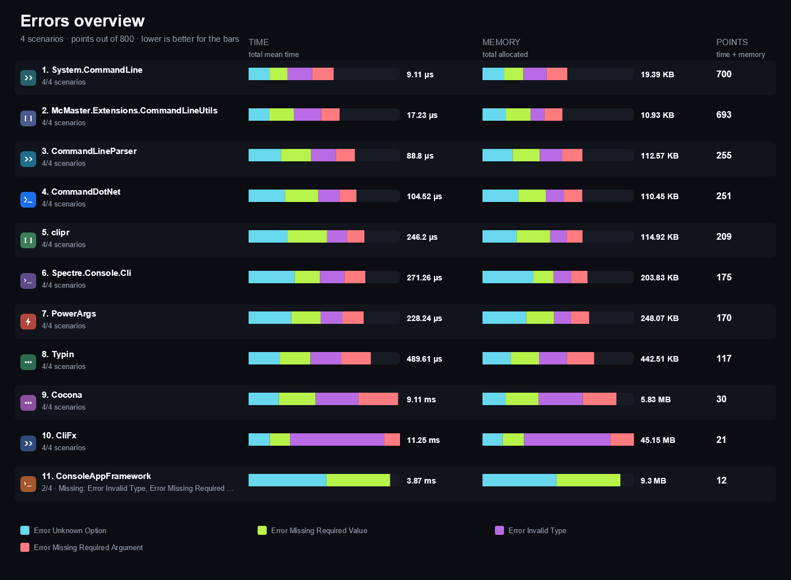
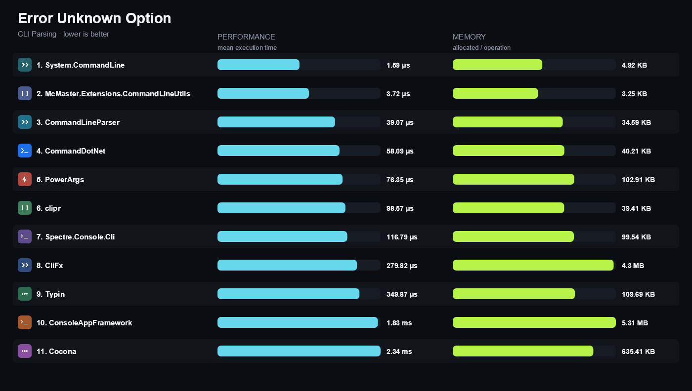
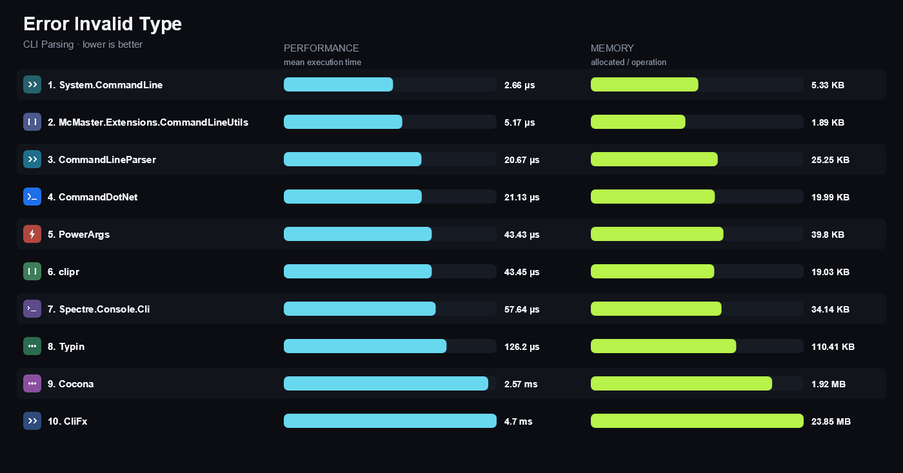

<!-- Generated by build/Templates/CategoryReport.cshtml. Do not edit this file directly. -->

[← .NET Matrix](../../README.md) · [Open the interactive matrix →](https://matrix.dev-team.org/?category=cli-parsing)

# CLI Parsing

<blockquote>
<strong><a href="https://matrix.dev-team.org/?category=cli-parsing&amp;library=McMaster.Extensions.CommandLineUtils">McMaster.Extensions.CommandLineUtils</a></strong> leads the current rating · 11 libraries · 10 scenarios
</blockquote>

## Rating

In every scenario the fastest library scores 100 points and the one allocating
least scores 100 more; four times slower is half the points, and an unsupported
scenario is worth nothing. Time and memory reach **1000**
each here, so the maximum is **2000**.
See [workflows/rating.md](../../workflows/rating.md).

| # | Library | Scenarios | Time | Memory | Points | Group wins |
|---:|---|---:|---:|---:|---:|---|
| 1 | [**McMaster.Extensions.CommandLineUtils**](https://matrix.dev-team.org/?category=cli-parsing&library=McMaster.Extensions.CommandLineUtils) | 10/10 | 600 | 767 | 1366 | gold in Parse, silver in Errors, silver in Help, silver in Options |
| 2 | [**System.CommandLine**](https://matrix.dev-team.org/?category=cli-parsing&library=System.CommandLine) | 10/10 | 701 | 561 | 1262 | gold in Errors, gold in Options, silver in Parse, bronze in Help |
| 3 | [**ConsoleAppFramework**](https://matrix.dev-team.org/?category=cli-parsing&library=ConsoleAppFramework) | 5/10 | 307 | 306 | 613 | gold in Help, bronze in Options, bronze in Parse |
| 4 | [**CommandDotNet**](https://matrix.dev-team.org/?category=cli-parsing&library=CommandDotNet) | 10/10 | 187 | 256 | 442 | bronze in Errors |
| 5 | [**clipr**](https://matrix.dev-team.org/?category=cli-parsing&library=clipr) | 10/10 | 115 | 254 | 369 |  |
| 6 | [**CommandLineParser**](https://matrix.dev-team.org/?category=cli-parsing&library=CommandLineParser) | 9/10 | 153 | 206 | 359 |  |
| 7 | [**Spectre.Console.Cli**](https://matrix.dev-team.org/?category=cli-parsing&library=Spectre.Console.Cli) | 10/10 | 133 | 207 | 339 |  |
| 8 | [**PowerArgs**](https://matrix.dev-team.org/?category=cli-parsing&library=PowerArgs) | 9/10 | 127 | 145 | 272 |  |
| 9 | [**CliFx**](https://matrix.dev-team.org/?category=cli-parsing&library=CliFx) | 10/10 | 114 | 93 | 207 |  |
| 10 | [**Typin**](https://matrix.dev-team.org/?category=cli-parsing&library=Typin) | 10/10 | 63 | 132 | 195 |  |
| 11 | [**Cocona**](https://matrix.dev-team.org/?category=cli-parsing&library=Cocona) | 10/10 | 21 | 63 | 85 |  |

<strong>How the points were earned</strong> — every scenario, with the measurements behind it

Each row is one scenario. `Best` is the lowest result among the rated libraries
that completed it, and the points follow from the two figures beside them:
`100 × √((best + step) / (result + step))`, with a step of 1 ns for time and 24 B
for memory. A dash means the library did not complete the scenario, and it scores
nothing for it. Add the two Points columns over every scenario and you get the
rating above. The same breakdown appears as a hint on any points value in the
[application](https://matrix.dev-team.org/?category=cli-parsing).

#### 1. McMaster.Extensions.CommandLineUtils — 1366 of 2000

| Scenario | Time | Best | Points | Memory | Best | Points |
|---|---:|---:|---:|---:|---:|---:|
| Parse Option Value | 3.49 μs | 66.05 ns | 13.9 | 3.94 KB | 96 B | 17.2 |
| Parse Positional Argument | 1.75 μs | 1.75 μs | 100 | 2.3 KB | 2.3 KB | 100 |
| Parse Repeated Option | 4.81 μs | 3.38 μs | 83.9 | 5.27 KB | 5.27 KB | 100 |
| Parse Switch | 7.37 μs | 119.33 ns | 12.8 | 8.27 KB | 144 B | 14.1 |
| Bind Typed Model | 1.72 μs | 1.72 μs | 100 | 2.3 KB | 2.3 KB | 100 |
| Generate Help | 2.76 μs | 146.28 ns | 23.1 | 5.39 KB | 672 B | 35.4 |
| Error Unknown Option | 4.77 μs | 2.37 μs | 70.5 | 3.25 KB | 3.25 KB | 100 |
| Error Missing Required Value | 5.92 μs | 2.08 μs | 59.2 | 3.39 KB | 3.39 KB | 100 |
| Error Invalid Type | 6.19 μs | 2.65 μs | 65.4 | 1.95 KB | 1.95 KB | 100 |
| Error Missing Required Argument | 4.47 μs | 2.25 μs | 70.9 | 2.47 KB | 2.47 KB | 100 |

#### 2. System.CommandLine — 1262 of 2000

| Scenario | Time | Best | Points | Memory | Best | Points |
|---|---:|---:|---:|---:|---:|---:|
| Parse Option Value | 2.64 μs | 66.05 ns | 15.9 | 5.71 KB | 96 B | 14.3 |
| Parse Positional Argument | 2.76 μs | 1.75 μs | 79.7 | 5.68 KB | 2.3 KB | 63.8 |
| Parse Repeated Option | 3.38 μs | 3.38 μs | 100 | 6.6 KB | 5.27 KB | 89.4 |
| Parse Switch | 5.59 μs | 119.33 ns | 14.7 | 11.47 KB | 144 B | 11.9 |
| Bind Typed Model | 2.62 μs | 1.72 μs | 80.9 | 5.68 KB | 2.3 KB | 63.8 |
| Generate Help | 16.72 μs | 146.28 ns | 9.385 | 26.84 KB | 672 B | 15.9 |
| Error Unknown Option | 2.37 μs | 2.37 μs | 100 | 4.92 KB | 3.25 KB | 81.4 |
| Error Missing Required Value | 2.08 μs | 2.08 μs | 100 | 4.45 KB | 3.39 KB | 87.4 |
| Error Invalid Type | 2.65 μs | 2.65 μs | 100 | 5.34 KB | 1.95 KB | 60.7 |
| Error Missing Required Argument | 2.25 μs | 2.25 μs | 100 | 4.71 KB | 2.47 KB | 72.6 |

#### 3. ConsoleAppFramework — 613 of 2000

| Scenario | Time | Best | Points | Memory | Best | Points |
|---|---:|---:|---:|---:|---:|---:|
| Parse Option Value | 66.05 ns | 66.05 ns | 100 | 96 B | 96 B | 100 |
| Parse Positional Argument | — | 1.75 μs | 0 | — | 2.3 KB | 0 |
| Parse Repeated Option | — | 3.38 μs | 0 | — | 5.27 KB | 0 |
| Parse Switch | 119.33 ns | 119.33 ns | 100 | 144 B | 144 B | 100 |
| Bind Typed Model | — | 1.72 μs | 0 | — | 2.3 KB | 0 |
| Generate Help | 146.28 ns | 146.28 ns | 100 | 672 B | 672 B | 100 |
| Error Unknown Option | 1.76 ms | 2.37 μs | 3.665 | 3.51 MB | 3.25 KB | 3.02 |
| Error Missing Required Value | 1.83 ms | 2.08 μs | 3.373 | 4.77 MB | 3.39 KB | 2.645 |
| Error Invalid Type | — | 2.65 μs | 0 | — | 1.95 KB | 0 |
| Error Missing Required Argument | — | 2.25 μs | 0 | — | 2.47 KB | 0 |

#### 4. CommandDotNet — 442 of 2000

| Scenario | Time | Best | Points | Memory | Best | Points |
|---|---:|---:|---:|---:|---:|---:|
| Parse Option Value | 45.36 μs | 66.05 ns | 3.845 | 32.2 KB | 96 B | 6.031 |
| Parse Positional Argument | 25.66 μs | 1.75 μs | 26.2 | 21.4 KB | 2.3 KB | 32.9 |
| Parse Repeated Option | 48.61 μs | 3.38 μs | 26.4 | 34.55 KB | 5.27 KB | 39.1 |
| Parse Switch | 121.14 μs | 119.33 ns | 3.152 | 65.1 KB | 144 B | 5.019 |
| Bind Typed Model | 49.31 μs | 1.72 μs | 18.7 | 23.25 KB | 2.3 KB | 31.6 |
| Generate Help | 47.54 μs | 146.28 ns | 5.566 | 38.17 KB | 672 B | 13.3 |
| Error Unknown Option | 49.11 μs | 2.37 μs | 22 | 40.05 KB | 3.25 KB | 28.6 |
| Error Missing Required Value | 44.13 μs | 2.08 μs | 21.7 | 30.98 KB | 3.39 KB | 33.2 |
| Error Invalid Type | 32.01 μs | 2.65 μs | 28.8 | 20.46 KB | 1.95 KB | 31.1 |
| Error Missing Required Argument | 24.34 μs | 2.25 μs | 30.4 | 20.59 KB | 2.47 KB | 34.8 |

#### 5. clipr — 369 of 2000

| Scenario | Time | Best | Points | Memory | Best | Points |
|---|---:|---:|---:|---:|---:|---:|
| Parse Option Value | 138.18 μs | 66.05 ns | 2.203 | 38.88 KB | 96 B | 5.488 |
| Parse Positional Argument | 61.16 μs | 1.75 μs | 16.9 | 18.21 KB | 2.3 KB | 35.7 |
| Parse Repeated Option | 159.79 μs | 3.38 μs | 14.6 | 43.16 KB | 5.27 KB | 35 |
| Parse Switch | 237.88 μs | 119.33 ns | 2.249 | 78.35 KB | 144 B | 4.575 |
| Bind Typed Model | 67.25 μs | 1.72 μs | 16 | 18.21 KB | 2.3 KB | 35.7 |
| Generate Help | 166.6 μs | 146.28 ns | 2.973 | 59.37 KB | 672 B | 10.7 |
| Error Unknown Option | 159.29 μs | 2.37 μs | 12.2 | 39.84 KB | 3.25 KB | 28.7 |
| Error Missing Required Value | 136.1 μs | 2.08 μs | 12.4 | 38.94 KB | 3.39 KB | 29.6 |
| Error Invalid Type | 83.07 μs | 2.65 μs | 17.9 | 19.41 KB | 1.95 KB | 31.9 |
| Error Missing Required Argument | 74.04 μs | 2.25 μs | 17.4 | 18.7 KB | 2.47 KB | 36.5 |

#### 6. CommandLineParser — 359 of 2000

| Scenario | Time | Best | Points | Memory | Best | Points |
|---|---:|---:|---:|---:|---:|---:|
| Parse Option Value | 52.04 μs | 66.05 ns | 3.589 | 33.11 KB | 96 B | 5.947 |
| Parse Positional Argument | 26.08 μs | 1.75 μs | 25.9 | 24.57 KB | 2.3 KB | 30.7 |
| Parse Repeated Option | — | 3.38 μs | 0 | — | 5.27 KB | 0 |
| Parse Switch | 125.31 μs | 119.33 ns | 3.099 | 69.03 KB | 144 B | 4.874 |
| Bind Typed Model | 26.45 μs | 1.72 μs | 25.5 | 24.69 KB | 2.3 KB | 30.6 |
| Generate Help | 157.94 μs | 146.28 ns | 3.054 | 70.92 KB | 672 B | 9.788 |
| Error Unknown Option | 55.32 μs | 2.37 μs | 20.7 | 34.59 KB | 3.25 KB | 30.8 |
| Error Missing Required Value | 66.78 μs | 2.08 μs | 17.6 | 31.09 KB | 3.39 KB | 33.1 |
| Error Invalid Type | 34.93 μs | 2.65 μs | 27.6 | 25.87 KB | 1.95 KB | 27.6 |
| Error Missing Required Argument | 34.66 μs | 2.25 μs | 25.5 | 23.12 KB | 2.47 KB | 32.8 |

#### 7. Spectre.Console.Cli — 339 of 2000

| Scenario | Time | Best | Points | Memory | Best | Points |
|---|---:|---:|---:|---:|---:|---:|
| Parse Option Value | 62.03 μs | 66.05 ns | 3.288 | 37.7 KB | 96 B | 5.574 |
| Parse Positional Argument | 72.63 μs | 1.75 μs | 15.5 | 30.32 KB | 2.3 KB | 27.7 |
| Parse Repeated Option | 65.41 μs | 3.38 μs | 22.7 | 42.47 KB | 5.27 KB | 35.3 |
| Parse Switch | 125.15 μs | 119.33 ns | 3.101 | 76.3 KB | 144 B | 4.636 |
| Bind Typed Model | 47.67 μs | 1.72 μs | 19 | 30.31 KB | 2.3 KB | 27.7 |
| Generate Help | 706.74 μs | 146.28 ns | 1.444 | 154.29 KB | 672 B | 6.637 |
| Error Unknown Option | 134.12 μs | 2.37 μs | 13.3 | 99.53 KB | 3.25 KB | 18.1 |
| Error Missing Required Value | 79.02 μs | 2.08 μs | 16.2 | 39.48 KB | 3.39 KB | 29.4 |
| Error Invalid Type | 72.75 μs | 2.65 μs | 19.1 | 34.53 KB | 1.95 KB | 23.9 |
| Error Missing Required Argument | 62.59 μs | 2.25 μs | 19 | 31.93 KB | 2.47 KB | 27.9 |

#### 8. PowerArgs — 272 of 2000

| Scenario | Time | Best | Points | Memory | Best | Points |
|---|---:|---:|---:|---:|---:|---:|
| Parse Option Value | 76.11 μs | 66.05 ns | 2.968 | 88.21 KB | 96 B | 3.644 |
| Parse Positional Argument | 38.65 μs | 1.75 μs | 21.3 | 42.87 KB | 2.3 KB | 23.3 |
| Parse Repeated Option | — | 3.38 μs | 0 | — | 5.27 KB | 0 |
| Parse Switch | 161.92 μs | 119.33 ns | 2.726 | 191.39 KB | 144 B | 2.928 |
| Bind Typed Model | 38.48 μs | 1.72 μs | 21.1 | 42.87 KB | 2.3 KB | 23.3 |
| Generate Help | 684.73 μs | 146.28 ns | 1.467 | 326.51 KB | 672 B | 4.562 |
| Error Unknown Option | 100.28 μs | 2.37 μs | 15.4 | 102.9 KB | 3.25 KB | 17.8 |
| Error Missing Required Value | 66.73 μs | 2.08 μs | 17.6 | 65.45 KB | 3.39 KB | 22.8 |
| Error Invalid Type | 49.43 μs | 2.65 μs | 23.2 | 40.28 KB | 1.95 KB | 22.1 |
| Error Missing Required Argument | 47.69 μs | 2.25 μs | 21.7 | 42.29 KB | 2.47 KB | 24.3 |

#### 9. CliFx — 207 of 2000

| Scenario | Time | Best | Points | Memory | Best | Points |
|---|---:|---:|---:|---:|---:|---:|
| Parse Option Value | 29.86 μs | 66.05 ns | 4.738 | 52.47 KB | 96 B | 4.725 |
| Parse Positional Argument | 28.4 μs | 1.75 μs | 24.9 | 51.24 KB | 2.3 KB | 21.3 |
| Parse Repeated Option | 31.11 μs | 3.38 μs | 33 | 54.45 KB | 5.27 KB | 31.2 |
| Parse Switch | 59.29 μs | 119.33 ns | 4.505 | 105.42 KB | 144 B | 3.944 |
| Bind Typed Model | 28.59 μs | 1.72 μs | 24.5 | 51.24 KB | 2.3 KB | 21.3 |
| Generate Help | 1.33 ms | 146.28 ns | 1.053 | 10.14 MB | 672 B | 0.809 |
| Error Unknown Option | 433.59 μs | 2.37 μs | 7.392 | 3.13 MB | 3.25 KB | 3.197 |
| Error Missing Required Value | 530.98 μs | 2.08 μs | 6.255 | 3.43 MB | 3.39 KB | 3.116 |
| Error Invalid Type | 5.79 ms | 2.65 μs | 2.141 | 26.81 MB | 1.95 KB | 0.848 |
| Error Missing Required Argument | 632.93 μs | 2.25 μs | 5.96 | 4.19 MB | 2.47 KB | 2.411 |

#### 10. Typin — 195 of 2000

| Scenario | Time | Best | Points | Memory | Best | Points |
|---|---:|---:|---:|---:|---:|---:|
| Parse Option Value | 368.86 μs | 66.05 ns | 1.348 | 94.78 KB | 96 B | 3.516 |
| Parse Positional Argument | 215.82 μs | 1.75 μs | 9.018 | 95.29 KB | 2.3 KB | 15.6 |
| Parse Repeated Option | 375.18 μs | 3.38 μs | 9.496 | 100.45 KB | 5.27 KB | 23 |
| Parse Switch | 938.98 μs | 119.33 ns | 1.132 | 195.32 KB | 144 B | 2.898 |
| Bind Typed Model | 222.27 μs | 1.72 μs | 8.787 | 95.29 KB | 2.3 KB | 15.6 |
| Generate Help | 436.2 μs | 146.28 ns | 1.838 | 109.74 KB | 672 B | 7.869 |
| Error Unknown Option | 458.59 μs | 2.37 μs | 7.187 | 108.89 KB | 3.25 KB | 17.3 |
| Error Missing Required Value | 322.46 μs | 2.08 μs | 8.026 | 112.08 KB | 3.39 KB | 17.5 |
| Error Invalid Type | 457.88 μs | 2.65 μs | 7.611 | 107.74 KB | 1.95 KB | 13.5 |
| Error Missing Required Argument | 312.05 μs | 2.25 μs | 8.488 | 108.19 KB | 2.47 KB | 15.2 |

#### 11. Cocona — 85 of 2000

| Scenario | Time | Best | Points | Memory | Best | Points |
|---|---:|---:|---:|---:|---:|---:|
| Parse Option Value | 2.18 ms | 66.05 ns | 0.555 | 296.02 KB | 96 B | 1.99 |
| Parse Positional Argument | 2.76 ms | 1.75 μs | 2.522 | 292.11 KB | 2.3 KB | 8.912 |
| Parse Repeated Option | 2.26 ms | 3.38 μs | 3.87 | 296.84 KB | 5.27 KB | 13.4 |
| Parse Switch | 5.55 ms | 119.33 ns | 0.466 | 591.05 KB | 144 B | 1.666 |
| Bind Typed Model | 2.22 ms | 1.72 μs | 2.781 | 292.08 KB | 2.3 KB | 8.913 |
| Generate Help | 3.48 ms | 146.28 ns | 0.651 | 367.1 KB | 672 B | 4.303 |
| Error Unknown Option | 2.98 ms | 2.37 μs | 2.822 | 537.49 KB | 3.25 KB | 7.804 |
| Error Missing Required Value | 3.58 ms | 2.08 μs | 2.408 | 798.94 KB | 3.39 KB | 6.537 |
| Error Invalid Type | 3.38 ms | 2.65 μs | 2.8 | 1.12 MB | 1.95 KB | 4.156 |
| Error Missing Required Argument | 3.3 ms | 2.25 μs | 2.611 | 782.71 KB | 2.47 KB | 5.643 |

## Benchmark overview

**Parse**

<strong>More overview charts (3)</strong>

#### Options

#### Help

#### Errors

## Compared libraries (11)

<table>
<tr>
<td width="64"></td>
<td><strong><a href="https://github.com/Tyrrrz/CliFx">CliFx</a></strong> 3.0.1 A declarative command-line framework with typed command classes, argument attributes, and generated help.</td>
<td width="100" align="right"><a href="https://matrix.dev-team.org/?category=cli-parsing&amp;library=CliFx">Compare →</a></td>
</tr>
<tr>
<td width="64"></td>
<td><strong><a href="https://github.com/nemec/clipr">clipr</a></strong> 1.6.1 A small attribute-based parser that converts command-line tokens into a strongly typed object.</td>
<td width="100" align="right"><a href="https://matrix.dev-team.org/?category=cli-parsing&amp;library=clipr">Compare →</a></td>
</tr>
<tr>
<td width="64"></td>
<td><strong><a href="https://github.com/mayuki/Cocona">Cocona</a></strong> 2.2.0 A micro CLI framework that maps method parameters and attributes to commands, options, and arguments.</td>
<td width="100" align="right"><a href="https://matrix.dev-team.org/?category=cli-parsing&amp;library=Cocona">Compare →</a></td>
</tr>
<tr>
<td width="64"></td>
<td><strong><a href="https://github.com/bilal-fazlani/commanddotnet">CommandDotNet</a></strong> 8.1.1 A command-line application framework that binds arguments to annotated command classes and executes them, with generated help and usage validation.</td>
<td width="100" align="right"><a href="https://matrix.dev-team.org/?category=cli-parsing&amp;library=CommandDotNet">Compare →</a></td>
</tr>
<tr>
<td width="64"></td>
<td><strong><a href="https://github.com/commandlineparser/commandline/wiki">CommandLineParser</a></strong> 2.9.1 A widely used attribute-based parser that maps verbs and options onto a typed options class.</td>
<td width="100" align="right"><a href="https://matrix.dev-team.org/?category=cli-parsing&amp;library=CommandLineParser">Compare →</a></td>
</tr>
<tr>
<td width="64"></td>
<td><strong><a href="https://github.com/Cysharp/ConsoleAppFramework">ConsoleAppFramework</a></strong> 5.8.1 A source-generated minimal CLI framework that turns method signatures into commands with generated help and binding.</td>
<td width="100" align="right"><a href="https://matrix.dev-team.org/?category=cli-parsing&amp;library=ConsoleAppFramework">Compare →</a></td>
</tr>
<tr>
<td width="64"></td>
<td><strong><a href="https://natemcmaster.github.io/CommandLineUtils/">McMaster.Extensions.CommandLineUtils</a></strong> 5.1.0 A command-line utility library with attribute-based model binding, subcommands, validators, and help text generation.</td>
<td width="100" align="right"><a href="https://matrix.dev-team.org/?category=cli-parsing&amp;library=McMaster.Extensions.CommandLineUtils">Compare →</a></td>
</tr>
<tr>
<td width="64"></td>
<td><strong><a href="https://github.com/adamabdelhamed/PowerArgs">PowerArgs</a></strong> 4.0.3 An attribute-driven argument parser with typed properties, argument validators, and usage generation.</td>
<td width="100" align="right"><a href="https://matrix.dev-team.org/?category=cli-parsing&amp;library=PowerArgs">Compare →</a></td>
</tr>
<tr>
<td width="64"></td>
<td><strong><a href="https://spectreconsole.net/cli/">Spectre.Console.Cli</a></strong> 0.57.2 A command-line parser built on Spectre.Console that binds arguments to typed settings classes and renders rich help.</td>
<td width="100" align="right"><a href="https://matrix.dev-team.org/?category=cli-parsing&amp;library=Spectre.Console.Cli">Compare →</a></td>
</tr>
<tr>
<td width="64"></td>
<td><strong><a href="https://learn.microsoft.com/dotnet/standard/commandline/">System.CommandLine</a></strong> 3.0.0 The command-line parsing library maintained by the .NET team, with commands, options, argument arity, and built-in help generation.</td>
<td width="100" align="right"><a href="https://matrix.dev-team.org/?category=cli-parsing&amp;library=System.CommandLine">Compare →</a></td>
</tr>
<tr>
<td width="64"></td>
<td><strong><a href="https://github.com/adambajguz/Typin">Typin</a></strong> 3.1.0 A framework for interactive and non-interactive console applications with typed commands and argument binding.</td>
<td width="100" align="right"><a href="https://matrix.dev-team.org/?category=cli-parsing&amp;library=Typin">Compare →</a></td>
</tr>
</table>

## Benchmark scenarios (10)

### 01 · Parse Option Value

Parses an option with a value and one positional argument, and returns both values.

### 02 · Parse Positional Argument

Parses a required positional argument together with an option, and returns the positional value.

### 03 · Parse Repeated Option

Parses three occurrences of the same option and returns their values in the order they were supplied.

### 04 · Parse Switch

Parses a boolean switch on one command line and its absence on another, returning the switch state.

### 05 · Bind Typed Model

Binds the command line to a typed model, including conversion of an integer option.

### 06 · Generate Help

Builds the help text of the command, without writing it to a device.

### 07 · Error Unknown Option

Parses a command line containing an undeclared option and returns the failure the library reports.

### 08 · Error Missing Required Value

Parses a command line without a required option and returns the failure the library reports.

### 09 · Error Invalid Type

Parses a non-numeric value for an integer option and returns the failure the library reports.

### 10 · Error Missing Required Argument

Parses a command line without a required positional argument and returns the failure the library reports.

