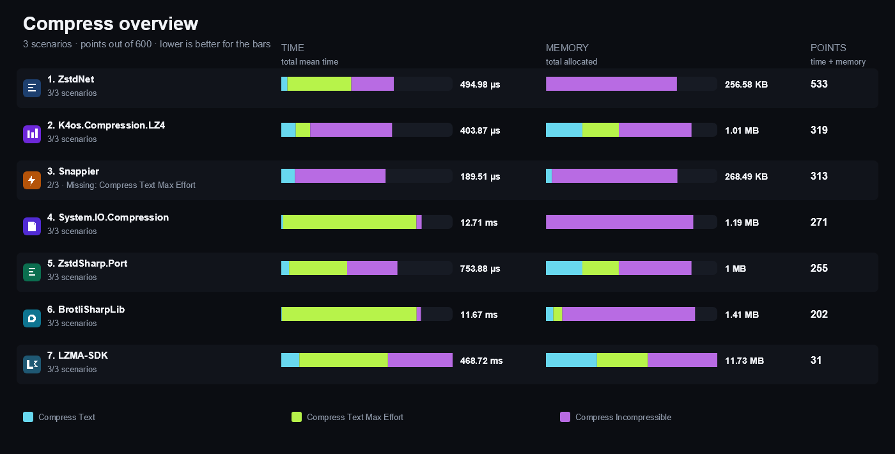
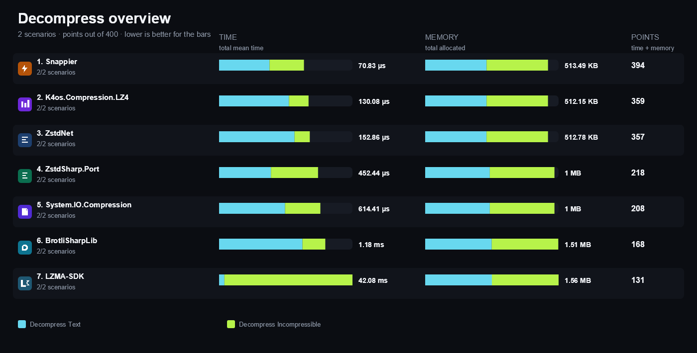
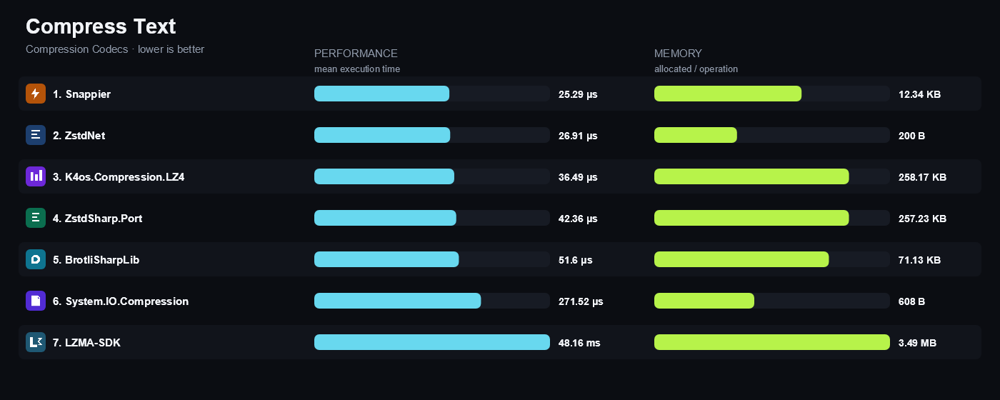
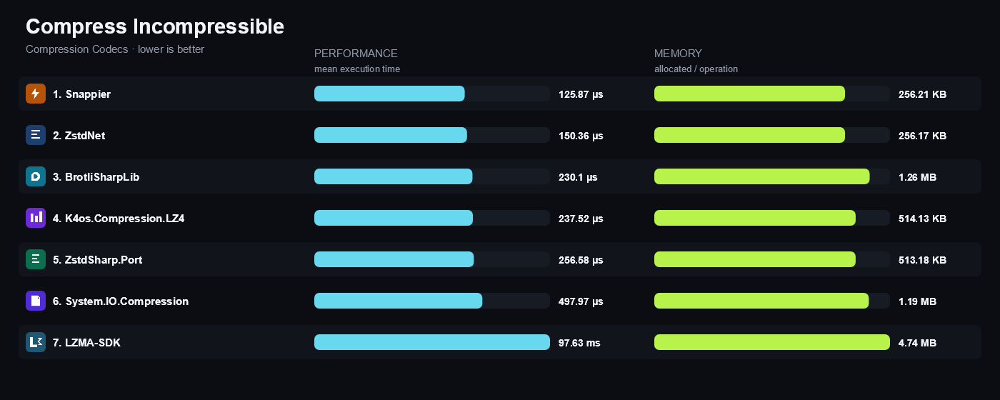
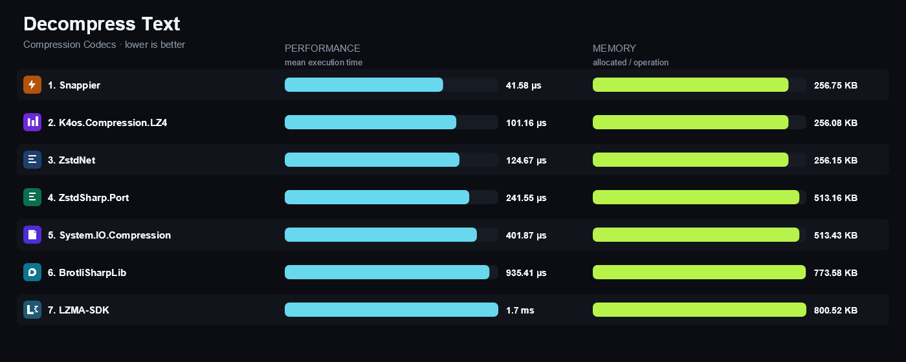

<!-- Generated by build/Templates/CategoryReport.cshtml. Do not edit this file directly. -->

[← .NET Matrix](../../README.md) · [Open the interactive matrix →](https://matrix.dev-team.org/?category=compression-codecs)

# Compression Codecs

<blockquote>
<strong><a href="https://matrix.dev-team.org/?category=compression-codecs&amp;library=ZstdNet">ZstdNet</a></strong> leads the current rating · 7 libraries · 6 scenarios
</blockquote>

## Rating

In every scenario the fastest library scores 100 points and the one allocating
least scores 100 more; four times slower is half the points, and an unsupported
scenario is worth nothing. Time and memory reach **600**
each here, so the maximum is **1200**.
See [workflows/rating.md](../../workflows/rating.md).

| # | Library | Scenarios | Time | Memory | Points | Group wins |
|---:|---|---:|---:|---:|---:|---|
| 1 | [**ZstdNet**](https://matrix.dev-team.org/?category=compression-codecs&library=ZstdNet) | 6/6 | 423 | 600 | 1023 | gold in Compress, bronze in Decompress, bronze in Round Trip |
| 2 | [**Snappier**](https://matrix.dev-team.org/?category=compression-codecs&library=Snappier) | 5/6 | 490 | 413 | 903 | gold in Decompress, gold in Round Trip, bronze in Compress |
| 3 | [**K4os.Compression.LZ4**](https://matrix.dev-team.org/?category=compression-codecs&library=K4os.Compression.LZ4) | 6/6 | 471 | 353 | 825 | silver in Compress, silver in Decompress, silver in Round Trip |
| 4 | [**ZstdSharp.Port**](https://matrix.dev-team.org/?category=compression-codecs&library=ZstdSharp.Port) | 6/6 | 305 | 272 | 577 |  |
| 5 | [**System.IO.Compression**](https://matrix.dev-team.org/?category=compression-codecs&library=System.IO.Compression) | 6/6 | 202 | 366 | 568 |  |
| 6 | [**BrotliSharpLib**](https://matrix.dev-team.org/?category=compression-codecs&library=BrotliSharpLib) | 6/6 | 223 | 180 | 403 |  |
| 7 | [**LZMA-SDK**](https://matrix.dev-team.org/?category=compression-codecs&library=LZMA-SDK) | 6/6 | 28 | 139 | 168 |  |

<strong>How the points were earned</strong> — every scenario, with the measurements behind it

Each row is one scenario. `Best` is the lowest result among the rated libraries
that completed it, and the points follow from the two figures beside them:
`100 × √((best + step) / (result + step))`, with a step of 1 ns for time and 24 B
for memory. A dash means the library did not complete the scenario, and it scores
nothing for it. Add the two Points columns over every scenario and you get the
rating above. The same breakdown appears as a hint on any points value in the
[application](https://matrix.dev-team.org/?category=compression-codecs).

#### 1. ZstdNet — 1023 of 1200

| Scenario | Time | Best | Points | Memory | Best | Points |
|---|---:|---:|---:|---:|---:|---:|
| Compress Text | 27.01 μs | 24.99 μs | 96.2 | 200 B | 200 B | 100 |
| Compress Text Max Effort | 281.15 μs | 52.71 μs | 43.3 | 200 B | 200 B | 100 |
| Compress Incompressible | 186.82 μs | 164.52 μs | 93.8 | 256.19 KB | 256.19 KB | 100 |
| Decompress Text | 161.02 μs | 61.87 μs | 62 | 256.17 KB | 256.1 KB | 100 |
| Decompress Incompressible | 39.11 μs | 39.11 μs | 100 | 256.59 KB | 256.08 KB | 99.9 |
| Round Trip Small | 6.02 μs | 474.34 ns | 28.1 | 1.27 KB | 1.27 KB | 100 |

#### 2. Snappier — 903 of 1200

| Scenario | Time | Best | Points | Memory | Best | Points |
|---|---:|---:|---:|---:|---:|---:|
| Compress Text | 24.99 μs | 24.99 μs | 100 | 12.3 KB | 200 B | 13.3 |
| Compress Text Max Effort | — | 52.71 μs | 0 | — | 200 B | 0 |
| Compress Incompressible | 164.52 μs | 164.52 μs | 100 | 256.19 KB | 256.19 KB | 100 |
| Decompress Text | 61.87 μs | 61.87 μs | 100 | 256.71 KB | 256.1 KB | 99.9 |
| Decompress Incompressible | 47.97 μs | 39.11 μs | 90.3 | 256.67 KB | 256.08 KB | 99.9 |
| Round Trip Small | 474.34 ns | 474.34 ns | 100 | 1.28 KB | 1.27 KB | 99.7 |

#### 3. K4os.Compression.LZ4 — 825 of 1200

| Scenario | Time | Best | Points | Memory | Best | Points |
|---|---:|---:|---:|---:|---:|---:|
| Compress Text | 52.82 μs | 24.99 μs | 68.8 | 258.19 KB | 200 B | 2.911 |
| Compress Text Max Effort | 52.71 μs | 52.71 μs | 100 | 258.22 KB | 200 B | 2.91 |
| Compress Incompressible | 298.33 μs | 164.52 μs | 74.3 | 514.18 KB | 256.19 KB | 70.6 |
| Decompress Text | 141.48 μs | 61.87 μs | 66.1 | 256.1 KB | 256.1 KB | 100 |
| Decompress Incompressible | 39.24 μs | 39.11 μs | 99.8 | 256.08 KB | 256.08 KB | 100 |
| Round Trip Small | 1.22 μs | 474.34 ns | 62.4 | 2.16 KB | 1.27 KB | 77 |

#### 4. ZstdSharp.Port — 577 of 1200

| Scenario | Time | Best | Points | Memory | Best | Points |
|---|---:|---:|---:|---:|---:|---:|
| Compress Text | 50.45 μs | 24.99 μs | 70.4 | 257.25 KB | 200 B | 2.916 |
| Compress Text Max Effort | 377.01 μs | 52.71 μs | 37.4 | 257.25 KB | 200 B | 2.916 |
| Compress Incompressible | 326.42 μs | 164.52 μs | 71 | 513.23 KB | 256.19 KB | 70.7 |
| Decompress Text | 302.51 μs | 61.87 μs | 45.2 | 513.2 KB | 256.1 KB | 70.6 |
| Decompress Incompressible | 269.55 μs | 39.11 μs | 38.1 | 513.2 KB | 256.08 KB | 70.6 |
| Round Trip Small | 2.61 μs | 474.34 ns | 42.6 | 4.36 KB | 1.27 KB | 54.4 |

#### 5. System.IO.Compression — 568 of 1200

| Scenario | Time | Best | Points | Memory | Best | Points |
|---|---:|---:|---:|---:|---:|---:|
| Compress Text | 170.68 μs | 24.99 μs | 38.3 | 608 B | 200 B | 59.5 |
| Compress Text Max Effort | 12.07 ms | 52.71 μs | 6.609 | 575 B | 200 B | 61.2 |
| Compress Incompressible | 470.73 μs | 164.52 μs | 59.1 | 1.19 MB | 256.19 KB | 45.9 |
| Decompress Text | 500.85 μs | 61.87 μs | 35.1 | 513.48 KB | 256.1 KB | 70.6 |
| Decompress Incompressible | 272.25 μs | 39.11 μs | 37.9 | 513.48 KB | 256.08 KB | 70.6 |
| Round Trip Small | 7.35 μs | 474.34 ns | 25.4 | 3.85 KB | 1.27 KB | 57.9 |

#### 6. BrotliSharpLib — 403 of 1200

| Scenario | Time | Best | Points | Memory | Best | Points |
|---|---:|---:|---:|---:|---:|---:|
| Compress Text | 48.44 μs | 24.99 μs | 71.8 | 71.14 KB | 200 B | 5.544 |
| Compress Text Max Effort | 11.27 ms | 52.71 μs | 6.84 | 87.4 KB | 200 B | 5.002 |
| Compress Incompressible | 356.85 μs | 164.52 μs | 67.9 | 1.26 MB | 256.19 KB | 44.6 |
| Decompress Text | 937.29 μs | 61.87 μs | 25.7 | 773.86 KB | 256.1 KB | 57.5 |
| Decompress Incompressible | 346.12 μs | 39.11 μs | 33.6 | 773.8 KB | 256.08 KB | 57.5 |
| Round Trip Small | 16.08 μs | 474.34 ns | 17.2 | 141.91 KB | 1.27 KB | 9.559 |

#### 7. LZMA-SDK — 168 of 1200

| Scenario | Time | Best | Points | Memory | Best | Points |
|---|---:|---:|---:|---:|---:|---:|
| Compress Text | 49.39 ms | 24.99 μs | 2.249 | 3.49 MB | 200 B | 0.782 |
| Compress Text Max Effort | 242.48 ms | 52.71 μs | 1.474 | 3.49 MB | 200 B | 0.782 |
| Compress Incompressible | 176.85 ms | 164.52 μs | 3.05 | 4.74 MB | 256.19 KB | 23 |
| Decompress Text | 2.12 ms | 61.87 μs | 17.1 | 800.58 KB | 256.1 KB | 56.6 |
| Decompress Incompressible | 61.73 ms | 39.11 μs | 2.517 | 800.44 KB | 256.08 KB | 56.6 |
| Round Trip Small | 1.57 ms | 474.34 ns | 1.741 | 3.78 MB | 1.27 KB | 1.832 |

## Benchmark overview

**Compress**

<strong>More overview charts (2)</strong>

#### Decompress

#### Round Trip

## Compared libraries (7)

<table>
<tr>
<td width="64"></td>
<td><strong><a href="https://github.com/master131/BrotliSharpLib">BrotliSharpLib</a></strong> 0.3.3 A fully managed port of the Brotli codec published as a portable library.</td>
<td width="100" align="right"><a href="https://matrix.dev-team.org/?category=compression-codecs&amp;library=BrotliSharpLib">Compare →</a></td>
</tr>
<tr>
<td width="64"></td>
<td><strong><a href="https://github.com/MiloszKrajewski/K4os.Compression.LZ4">K4os.Compression.LZ4</a></strong> 1.3.8 A managed LZ4 block codec exposing fast and high-compression levels.</td>
<td width="100" align="right"><a href="https://matrix.dev-team.org/?category=compression-codecs&amp;library=K4os.Compression.LZ4">Compare →</a></td>
</tr>
<tr>
<td width="64"></td>
<td><strong><a href="https://www.7-zip.org/sdk.html">LZMA-SDK</a></strong> 22.1.1 The official 7-Zip LZMA SDK sources published as a managed .NET assembly.</td>
<td width="100" align="right"><a href="https://matrix.dev-team.org/?category=compression-codecs&amp;library=LZMA-SDK">Compare →</a></td>
</tr>
<tr>
<td width="64"></td>
<td><strong><a href="https://github.com/brantburnett/Snappier">Snappier</a></strong> 1.3.2 A managed implementation of Google Snappy aimed at very fast compression and decompression.</td>
<td width="100" align="right"><a href="https://matrix.dev-team.org/?category=compression-codecs&amp;library=Snappier">Compare →</a></td>
</tr>
<tr>
<td width="64"></td>
<td><strong><a href="https://learn.microsoft.com/dotnet/api/system.io.compression.brotlistream">System.IO.Compression</a></strong> The Brotli stream included with .NET, used here as the platform codec baseline.</td>
<td width="100" align="right"><a href="https://matrix.dev-team.org/?category=compression-codecs&amp;library=System.IO.Compression">Compare →</a></td>
</tr>
<tr>
<td width="64"></td>
<td><strong><a href="https://github.com/skbkontur/ZstdNet">ZstdNet</a></strong> 1.5.7 A Zstandard binding that ships the native libzstd binary for every supported runtime inside the package.</td>
<td width="100" align="right"><a href="https://matrix.dev-team.org/?category=compression-codecs&amp;library=ZstdNet">Compare →</a></td>
</tr>
<tr>
<td width="64"></td>
<td><strong><a href="https://github.com/oleg-st/ZstdSharp">ZstdSharp.Port</a></strong> 0.8.8 A fully managed port of the Zstandard codec with no native binary dependency.</td>
<td width="100" align="right"><a href="https://matrix.dev-team.org/?category=compression-codecs&amp;library=ZstdSharp.Port">Compare →</a></td>
</tr>
</table>

## Benchmark scenarios (6)

### 01 · Compress Text

Compresses the deterministic 256 KiB repetitive text corpus at the codec's own fastest level.

### 02 · Compress Text Max Effort

Compresses the same 256 KiB text corpus at the codec's own maximum general-purpose level, showing what the extra effort costs.

### 03 · Compress Incompressible

Compresses the deterministic 256 KiB random corpus, where no codec can win by finding redundancy.

### 04 · Decompress Text

Decompresses a payload produced beforehand, so only the decoder is measured.

### 05 · Decompress Incompressible

Decompresses a pre-made payload whose content is random, so the decoder cannot expand quickly by copying runs.

### 06 · Round Trip Small

Compresses and decompresses a 1 KiB payload, the shape most individual messages take.

