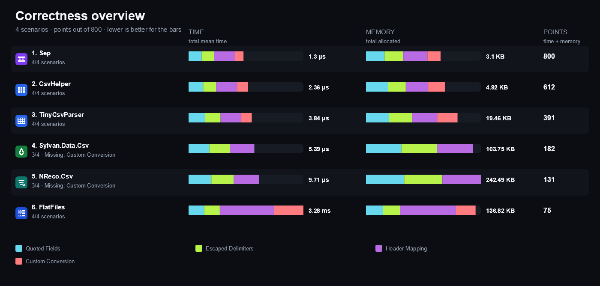
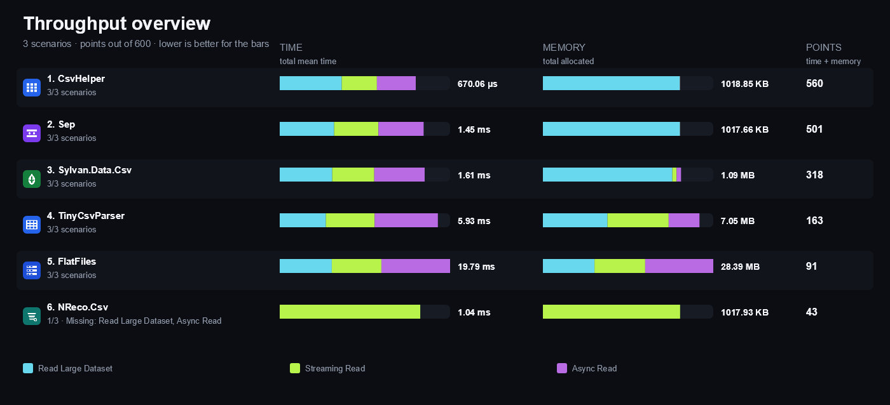
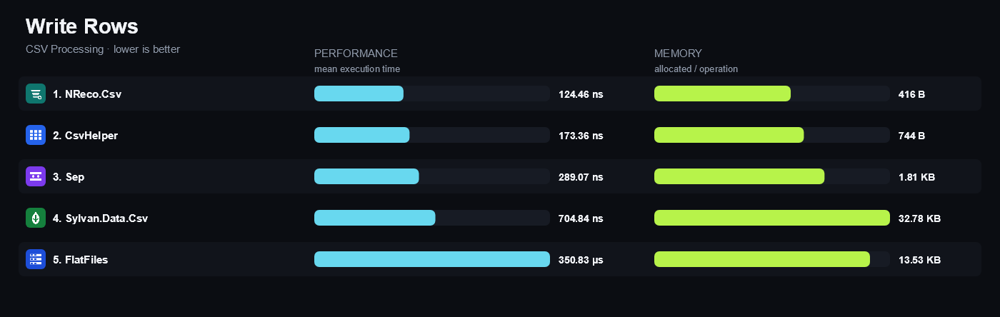
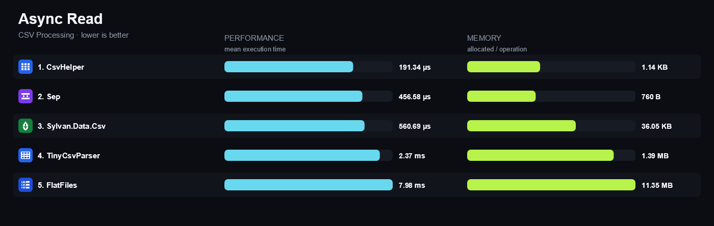

<!-- Generated by build/Templates/CategoryReport.cshtml. Do not edit this file directly. -->

[← .NET Matrix](../../README.md) · [Open the interactive matrix →](https://matrix.dev-team.org/?category=csv-processing)

# CSV Processing

<blockquote>
<strong><a href="https://matrix.dev-team.org/?category=csv-processing&amp;library=Sep">Sep</a></strong> leads the current rating · 6 libraries · 10 scenarios
</blockquote>

## Rating

In every scenario the fastest library scores 100 points and the one allocating
least scores 100 more; four times slower is half the points, and an unsupported
scenario is worth nothing. Time and memory reach **1000**
each here, so the maximum is **2000**.
See [workflows/rating.md](../../workflows/rating.md).

| # | Library | Scenarios | Time | Memory | Points | Group wins |
|---:|---|---:|---:|---:|---:|---|
| 1 | [**Sep**](https://matrix.dev-team.org/?category=csv-processing&library=Sep) | 10/10 | 848 | 947 | 1795 | gold in Correctness, gold in Read, silver in Throughput, bronze in Write |
| 2 | [**CsvHelper**](https://matrix.dev-team.org/?category=csv-processing&library=CsvHelper) | 10/10 | 843 | 823 | 1666 | gold in Throughput, silver in Correctness, silver in Read, silver in Write |
| 3 | [**TinyCsvParser**](https://matrix.dev-team.org/?category=csv-processing&library=TinyCsvParser) | 9/10 | 446 | 313 | 759 | bronze in Correctness, bronze in Read |
| 4 | [**Sylvan.Data.Csv**](https://matrix.dev-team.org/?category=csv-processing&library=Sylvan.Data.Csv) | 9/10 | 433 | 221 | 654 | bronze in Throughput |
| 5 | [**NReco.Csv**](https://matrix.dev-team.org/?category=csv-processing&library=NReco.Csv) | 6/10 | 268 | 146 | 414 | gold in Write |
| 6 | [**FlatFiles**](https://matrix.dev-team.org/?category=csv-processing&library=FlatFiles) | 10/10 | 73 | 165 | 238 |  |

<strong>How the points were earned</strong> — every scenario, with the measurements behind it

Each row is one scenario. `Best` is the lowest result among the rated libraries
that completed it, and the points follow from the two figures beside them:
`100 × √((best + step) / (result + step))`, with a step of 1 ns for time and 24 B
for memory. A dash means the library did not complete the scenario, and it scores
nothing for it. Add the two Points columns over every scenario and you get the
rating above. The same breakdown appears as a hint on any points value in the
[application](https://matrix.dev-team.org/?category=csv-processing).

#### 1. Sep — 1795 of 2000

| Scenario | Time | Best | Points | Memory | Best | Points |
|---|---:|---:|---:|---:|---:|---:|
| Read Simple Rows | 468.73 ns | 468.73 ns | 100 | 1.2 KB | 1.2 KB | 100 |
| Read Typed Records | 501.9 ns | 501.9 ns | 100 | 1 KB | 1 KB | 100 |
| Read Large Dataset | 733.45 μs | 340.24 μs | 68.1 | 1016.27 KB | 1016.27 KB | 100 |
| Quoted Fields | 319.68 ns | 319.68 ns | 100 | 792 B | 792 B | 100 |
| Escaped Delimiters | 335.43 ns | 335.43 ns | 100 | 800 B | 800 B | 100 |
| Header Mapping | 538.2 ns | 538.2 ns | 100 | 1 KB | 1 KB | 100 |
| Custom Conversion | 228.4 ns | 228.4 ns | 100 | 560 B | 560 B | 100 |
| Streaming Read | 541.51 μs | 190.87 μs | 59.4 | 656 B | 656 B | 100 |
| Write Rows | 442.03 ns | 142.23 ns | 56.9 | 1.78 KB | 384 B | 47 |
| Async Read | 561.09 μs | 226.89 μs | 63.6 | 760 B | 760 B | 100 |

#### 2. CsvHelper — 1666 of 2000

| Scenario | Time | Best | Points | Memory | Best | Points |
|---|---:|---:|---:|---:|---:|---:|
| Read Simple Rows | 784.31 ns | 468.73 ns | 77.3 | 1.59 KB | 1.2 KB | 86.8 |
| Read Typed Records | 709.25 ns | 501.9 ns | 84.1 | 1.4 KB | 1 KB | 84.8 |
| Read Large Dataset | 340.24 μs | 340.24 μs | 100 | 1016.67 KB | 1016.27 KB | 100 |
| Quoted Fields | 647.48 ns | 319.68 ns | 70.3 | 1.38 KB | 792 B | 75.5 |
| Escaped Delimiters | 587.25 ns | 335.43 ns | 75.6 | 1.11 KB | 800 B | 84.3 |
| Header Mapping | 730.83 ns | 538.2 ns | 85.8 | 1.4 KB | 1 KB | 84.8 |
| Custom Conversion | 445.09 ns | 228.4 ns | 71.7 | 1.04 KB | 560 B | 73.3 |
| Streaming Read | 190.87 μs | 190.87 μs | 100 | 1.04 KB | 656 B | 79.1 |
| Write Rows | 233.61 ns | 142.23 ns | 78.1 | 744 B | 384 B | 72.9 |
| Async Read | 226.89 μs | 226.89 μs | 100 | 1.14 KB | 760 B | 81.1 |

#### 3. TinyCsvParser — 759 of 2000

| Scenario | Time | Best | Points | Memory | Best | Points |
|---|---:|---:|---:|---:|---:|---:|
| Read Simple Rows | 1.25 μs | 468.73 ns | 61.3 | 5.56 KB | 1.2 KB | 46.7 |
| Read Typed Records | 1.4 μs | 501.9 ns | 59.8 | 5.3 KB | 1 KB | 43.9 |
| Read Large Dataset | 2.29 ms | 340.24 μs | 38.5 | 2.91 MB | 1016.27 KB | 58.4 |
| Quoted Fields | 939.04 ns | 319.68 ns | 58.4 | 4.87 KB | 792 B | 40.4 |
| Escaped Delimiters | 1.08 μs | 335.43 ns | 55.9 | 4.98 KB | 800 B | 40.1 |
| Header Mapping | 1.31 μs | 538.2 ns | 64.2 | 5.3 KB | 1 KB | 43.9 |
| Custom Conversion | 829.96 ns | 228.4 ns | 52.5 | 4.32 KB | 560 B | 36.2 |
| Streaming Read | 2.61 ms | 190.87 μs | 27 | 2.75 MB | 656 B | 1.535 |
| Write Rows | — | 142.23 ns | 0 | — | 384 B | 0 |
| Async Read | 2.9 ms | 226.89 μs | 28 | 1.39 MB | 760 B | 2.323 |

#### 4. Sylvan.Data.Csv — 654 of 2000

| Scenario | Time | Best | Points | Memory | Best | Points |
|---|---:|---:|---:|---:|---:|---:|
| Read Simple Rows | 2.27 μs | 468.73 ns | 45.4 | 35.38 KB | 1.2 KB | 18.6 |
| Read Typed Records | 2.38 μs | 501.9 ns | 46 | 35.11 KB | 1 KB | 17.1 |
| Read Large Dataset | 686.03 μs | 340.24 μs | 70.4 | 1.03 MB | 1016.27 KB | 98.4 |
| Quoted Fields | 2.01 μs | 319.68 ns | 40 | 34.34 KB | 792 B | 15.2 |
| Escaped Delimiters | 2.86 μs | 335.43 ns | 34.3 | 34.3 KB | 800 B | 15.3 |
| Header Mapping | 2.32 μs | 538.2 ns | 48.2 | 35.11 KB | 1 KB | 17.1 |
| Custom Conversion | — | 228.4 ns | 0 | — | 560 B | 0 |
| Streaming Read | 521 μs | 190.87 μs | 60.5 | 34.75 KB | 656 B | 13.8 |
| Write Rows | 2.05 μs | 142.23 ns | 26.5 | 32.78 KB | 384 B | 11 |
| Async Read | 598.87 μs | 226.89 μs | 61.6 | 36.05 KB | 760 B | 14.6 |

#### 5. NReco.Csv — 414 of 2000

| Scenario | Time | Best | Points | Memory | Best | Points |
|---|---:|---:|---:|---:|---:|---:|
| Read Simple Rows | 3.83 μs | 468.73 ns | 35 | 81.01 KB | 1.2 KB | 12.3 |
| Read Typed Records | — | 501.9 ns | 0 | — | 1 KB | 0 |
| Read Large Dataset | — | 340.24 μs | 0 | — | 1016.27 KB | 0 |
| Quoted Fields | 3.5 μs | 319.68 ns | 30.3 | 80.72 KB | 792 B | 9.934 |
| Escaped Delimiters | 3.8 μs | 335.43 ns | 29.8 | 80.63 KB | 800 B | 9.989 |
| Header Mapping | 4.3 μs | 538.2 ns | 35.4 | 81.15 KB | 1 KB | 11.2 |
| Custom Conversion | — | 228.4 ns | 0 | — | 560 B | 0 |
| Streaming Read | 1.33 ms | 190.87 μs | 37.9 | 1017.93 KB | 656 B | 2.554 |
| Write Rows | 142.23 ns | 142.23 ns | 100 | 384 B | 384 B | 100 |
| Async Read | — | 226.89 μs | 0 | — | 760 B | 0 |

#### 6. FlatFiles — 238 of 2000

| Scenario | Time | Best | Points | Memory | Best | Points |
|---|---:|---:|---:|---:|---:|---:|
| Read Simple Rows | 551.51 μs | 468.73 ns | 2.918 | 22.22 KB | 1.2 KB | 23.4 |
| Read Typed Records | 570.18 μs | 501.9 ns | 2.97 | 22.63 KB | 1 KB | 21.3 |
| Read Large Dataset | 6.47 ms | 340.24 μs | 22.9 | 8.59 MB | 1016.27 KB | 34 |
| Quoted Fields | 527.72 μs | 319.68 ns | 2.465 | 20.46 KB | 792 B | 19.7 |
| Escaped Delimiters | 525.82 μs | 335.43 ns | 2.529 | 20.79 KB | 800 B | 19.7 |
| Header Mapping | 1.32 ms | 538.2 ns | 2.018 | 68.8 KB | 1 KB | 12.2 |
| Custom Conversion | 876.13 μs | 228.4 ns | 1.618 | 23.53 KB | 560 B | 15.6 |
| Streaming Read | 6.52 ms | 190.87 μs | 17.1 | 8.44 MB | 656 B | 0.876 |
| Write Rows | 631.46 μs | 142.23 ns | 1.506 | 12.32 KB | 384 B | 18 |
| Async Read | 8.38 ms | 226.89 μs | 16.5 | 11.35 MB | 760 B | 0.812 |

## Benchmark overview

**Read**

<strong>More overview charts (3)</strong>

#### Correctness

#### Throughput

#### Write

## Compared libraries (6)

<table>
<tr>
<td width="64"></td>
<td><strong><a href="https://joshclose.github.io/CsvHelper/">CsvHelper</a></strong> 34.1.0 A widely used CSV library with record mapping, type conversion, and synchronous and asynchronous readers and writers.</td>
<td width="100" align="right"><a href="https://matrix.dev-team.org/?category=csv-processing&amp;library=CsvHelper">Compare →</a></td>
</tr>
<tr>
<td width="64"></td>
<td><strong><a href="https://github.com/jehugaleahsa/FlatFiles">FlatFiles</a></strong> 5.0.4 A CSV reader and writer with schema inference, strongly typed class mapping, custom column mappings, and synchronous and asynchronous reads.</td>
<td width="100" align="right"><a href="https://matrix.dev-team.org/?category=csv-processing&amp;library=FlatFiles">Compare →</a></td>
</tr>
<tr>
<td width="64"></td>
<td><strong><a href="https://github.com/nreco/csv">NReco.Csv</a></strong> 1.0.3 A lightweight RFC 4180 CSV reader and writer that exposes every field as a string and provides no typed mapping.</td>
<td width="100" align="right"><a href="https://matrix.dev-team.org/?category=csv-processing&amp;library=NReco.Csv">Compare →</a></td>
</tr>
<tr>
<td width="64"></td>
<td><strong><a href="https://github.com/nietras/Sep">Sep</a></strong> 0.18.0 A modern SIMD-accelerated separated-values reader and writer with span-based conversion and async enumeration.</td>
<td width="100" align="right"><a href="https://matrix.dev-team.org/?category=csv-processing&amp;library=Sep">Compare →</a></td>
</tr>
<tr>
<td width="64"></td>
<td><strong><a href="https://github.com/MarkPflug/Sylvan/blob/main/docs/Csv.md">Sylvan.Data.Csv</a></strong> 1.4.4 A high-performance forward-only CSV data reader and writer with strongly typed accessors and asynchronous I/O.</td>
<td width="100" align="right"><a href="https://matrix.dev-team.org/?category=csv-processing&amp;library=Sylvan.Data.Csv">Compare →</a></td>
</tr>
<tr>
<td width="64"></td>
<td><strong><a href="https://github.com/TinyCsvParser/TinyCsvParser">TinyCsvParser</a></strong> 3.0.13 A strongly typed CSV parser with declarative property mapping, custom converters, lazy streaming, and asynchronous readers.</td>
<td width="100" align="right"><a href="https://matrix.dev-team.org/?category=csv-processing&amp;library=TinyCsvParser">Compare →</a></td>
</tr>
</table>

## Benchmark scenarios (10)

### 01 · Read Simple Rows

Parses three CSV records and materializes every field as text.

### 02 · Read Typed Records

Parses three CSV records and materializes typed scalar values.

### 03 · Read Large Dataset

Parses and materializes 10,000 typed CSV records.

### 04 · Quoted Fields

Parses doubled quote escapes inside quoted CSV fields.

### 05 · Escaped Delimiters

Parses quoted fields containing a comma or an LF newline.

### 06 · Header Mapping

Maps a reordered CSV header to the correct typed record members.

### 07 · Custom Conversion

Converts sku-NNNN fields to the matrix-owned ProductCode value type.

### 08 · Streaming Read

Aggregates 10,000 typed rows with forward-only reading and no row materialization.

### 09 · Write Rows

Writes three records with a header to an exact LF-terminated CSV string.

### 10 · Async Read

Asynchronously aggregates 10,000 typed CSV rows through the library async API.

