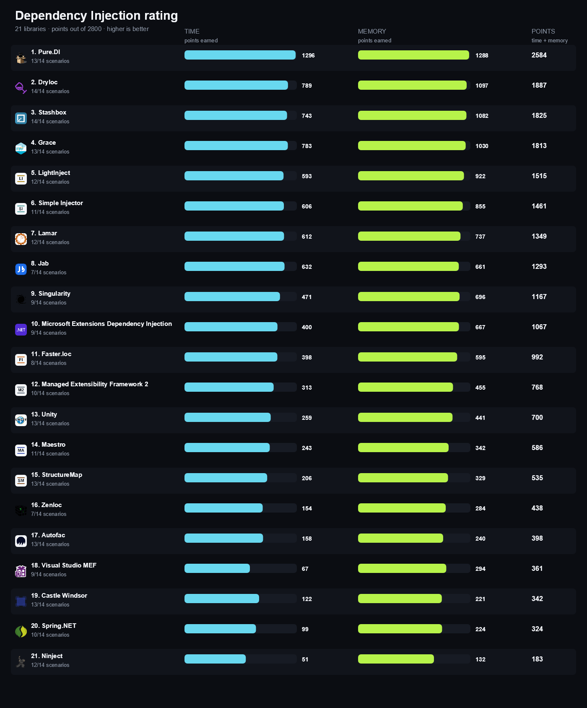
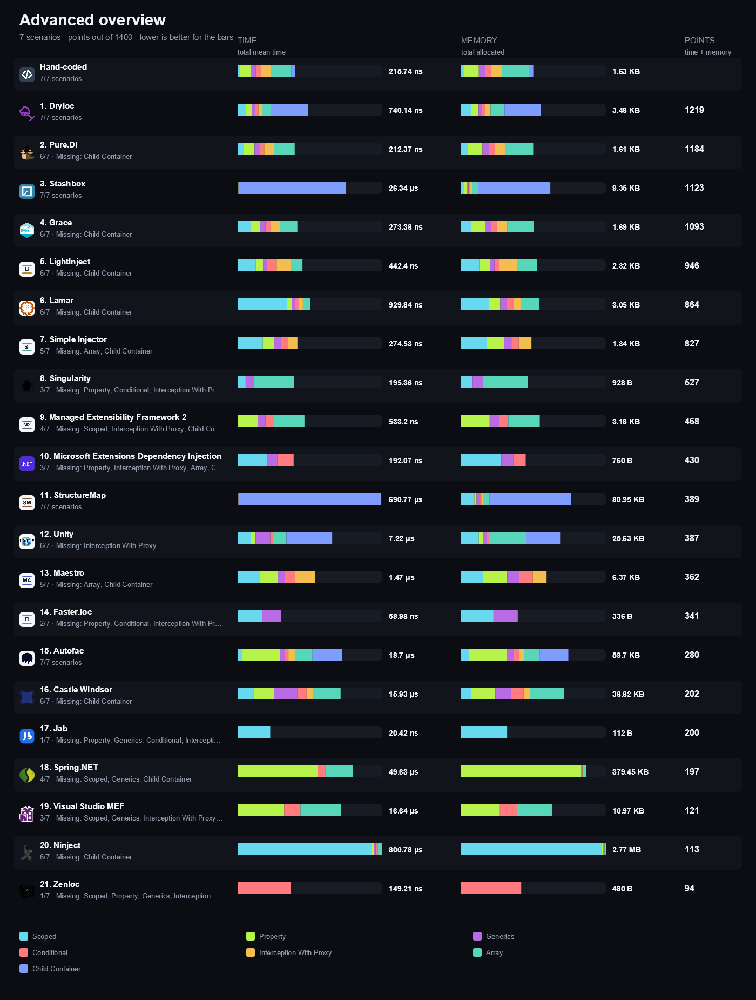
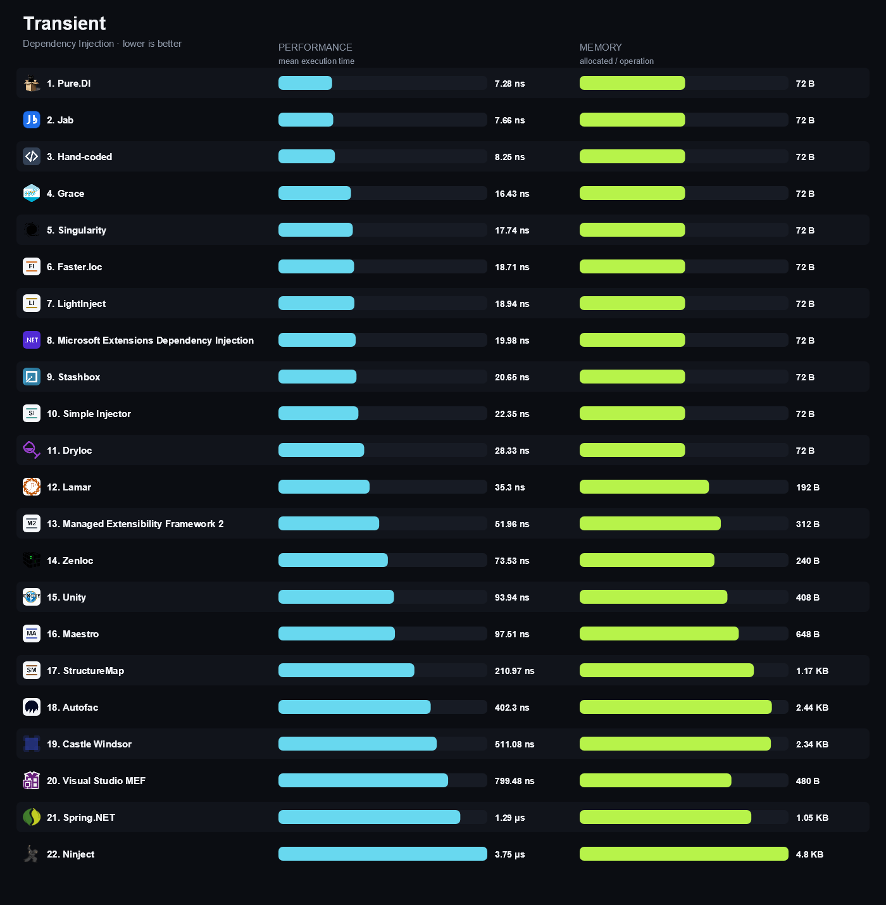
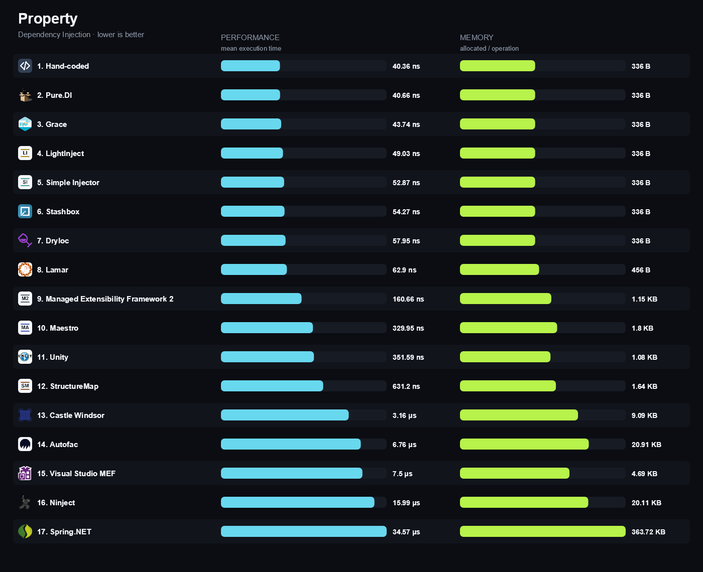
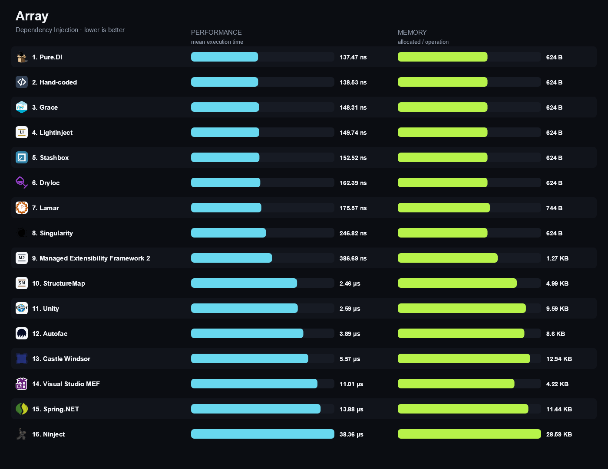

<!-- Generated by build/Templates/CategoryReport.cshtml. Do not edit this file directly. -->

[← .NET Matrix](../../README.md) · [Open the interactive matrix →](https://matrix.dev-team.org/?category=dependency-injection)

# Dependency Injection

<blockquote>
<strong><a href="https://matrix.dev-team.org/?category=dependency-injection&amp;library=Pure.DI">Pure.DI</a></strong> leads the current rating · 22 libraries · 15 scenarios
</blockquote>

## Rating

In every scenario the fastest library scores 100 points and the one allocating
least scores 100 more; four times slower is half the points, and an unsupported
scenario is worth nothing. Time and memory reach **1400**
each here, so the maximum is **2800**.
See [workflows/rating.md](../../workflows/rating.md).

| # | Library | Scenarios | Time | Memory | Points | Group wins |
|---:|---|---:|---:|---:|---:|---|
| 1 | [**Pure.DI**](https://matrix.dev-team.org/?category=dependency-injection&library=Pure.DI) | 13/14 | 1296 | 1288 | 2584 | gold in Basic, gold in Prepare, silver in Advanced |
| 2 | [**DryIoc**](https://matrix.dev-team.org/?category=dependency-injection&library=DryIoc) | 14/14 | 789 | 1097 | 1887 | gold in Advanced, bronze in Prepare |
| 3 | [**Stashbox**](https://matrix.dev-team.org/?category=dependency-injection&library=Stashbox) | 14/14 | 743 | 1082 | 1825 | bronze in Advanced |
| 4 | [**Grace**](https://matrix.dev-team.org/?category=dependency-injection&library=Grace) | 13/14 | 783 | 1030 | 1813 | bronze in Basic |
| 5 | [**LightInject**](https://matrix.dev-team.org/?category=dependency-injection&library=LightInject) | 12/14 | 593 | 922 | 1515 |  |
| 6 | [**Simple Injector**](https://matrix.dev-team.org/?category=dependency-injection&library=SimpleInjector) | 11/14 | 606 | 855 | 1461 |  |
| 7 | [**Lamar**](https://matrix.dev-team.org/?category=dependency-injection&library=Lamar) | 12/14 | 612 | 737 | 1349 |  |
| 8 | [**Jab**](https://matrix.dev-team.org/?category=dependency-injection&library=Jab) | 7/14 | 632 | 661 | 1293 | silver in Basic, silver in Prepare |
| 9 | [**Singularity**](https://matrix.dev-team.org/?category=dependency-injection&library=Singularity) | 9/14 | 471 | 696 | 1167 |  |
| 10 | [**Microsoft Extensions Dependency Injection**](https://matrix.dev-team.org/?category=dependency-injection&library=Microsoft.DI) | 9/14 | 400 | 667 | 1067 |  |
| 11 | [**Faster.Ioc**](https://matrix.dev-team.org/?category=dependency-injection&library=Faster.Ioc) | 8/14 | 398 | 595 | 992 |  |
| 12 | [**Managed Extensibility Framework 2**](https://matrix.dev-team.org/?category=dependency-injection&library=MEF2) | 10/14 | 313 | 455 | 768 |  |
| 13 | [**Unity**](https://matrix.dev-team.org/?category=dependency-injection&library=Unity) | 13/14 | 259 | 441 | 700 |  |
| 14 | [**Maestro**](https://matrix.dev-team.org/?category=dependency-injection&library=Maestro) | 11/14 | 243 | 342 | 586 |  |
| 15 | [**StructureMap**](https://matrix.dev-team.org/?category=dependency-injection&library=StructureMap) | 13/14 | 206 | 329 | 535 |  |
| 16 | [**ZenIoc**](https://matrix.dev-team.org/?category=dependency-injection&library=ZenIoc) | 7/14 | 154 | 284 | 438 |  |
| 17 | [**Autofac**](https://matrix.dev-team.org/?category=dependency-injection&library=Autofac) | 13/14 | 158 | 240 | 398 |  |
| 18 | [**Visual Studio MEF**](https://matrix.dev-team.org/?category=dependency-injection&library=VS.MEF) | 9/14 | 67 | 294 | 361 |  |
| 19 | [**Castle Windsor**](https://matrix.dev-team.org/?category=dependency-injection&library=Windsor) | 13/14 | 122 | 221 | 342 |  |
| 20 | [**Spring.NET**](https://matrix.dev-team.org/?category=dependency-injection&library=Spring) | 10/14 | 99 | 224 | 324 |  |
| 21 | [**Ninject**](https://matrix.dev-team.org/?category=dependency-injection&library=Ninject) | 12/14 | 51 | 132 | 183 |  |

<strong>How the points were earned</strong> — every scenario, with the measurements behind it

Each row is one scenario. `Best` is the lowest result among the rated libraries
that completed it, and the points follow from the two figures beside them:
`100 × √((best + step) / (result + step))`, with a step of 1 ns for time and 24 B
for memory. A dash means the library did not complete the scenario, and it scores
nothing for it. Add the two Points columns over every scenario and you get the
rating above. The same breakdown appears as a hint on any points value in the
[application](https://matrix.dev-team.org/?category=dependency-injection).

#### 1. Pure.DI — 2584 of 2800

| Scenario | Time | Best | Points | Memory | Best | Points |
|---|---:|---:|---:|---:|---:|---:|
| Singleton | 1.47 ns | 1.47 ns | 100 | 0 B | 0 B | 100 |
| Transient | 15.61 ns | 15.61 ns | 100 | 72 B | 72 B | 100 |
| PerResolve | 15.49 ns | 15.49 ns | 100 | 56 B | 56 B | 100 |
| Scoped | 39.97 ns | 36.86 ns | 96.1 | 152 B | 112 B | 87.9 |
| Combined | 37.11 ns | 37.11 ns | 100 | 168 B | 168 B | 100 |
| Complex | 90.56 ns | 90.56 ns | 100 | 360 B | 360 B | 100 |
| Property | 71.32 ns | 71.32 ns | 100 | 336 B | 336 B | 100 |
| Generics | 31.65 ns | 31.65 ns | 100 | 144 B | 144 B | 100 |
| Array | 135.98 ns | 135.98 ns | 100 | 624 B | 624 B | 100 |
| Conditional | 33.32 ns | 33.32 ns | 100 | 144 B | 144 B | 100 |
| Child Container | — | 809.66 ns | 0 | — | 1.59 KB | 0 |
| Interception With Proxy | 76.07 ns | 76.07 ns | 100 | 248 B | 248 B | 100 |
| Prepare And Register | 0 ns | 0 ns | 100 | 0 B | 0 B | 100 |
| Prepare And Register And Simple Resolve | 6.75 ns | 6.75 ns | 100 | 24 B | 24 B | 100 |

#### 2. DryIoc — 1887 of 2800

| Scenario | Time | Best | Points | Memory | Best | Points |
|---|---:|---:|---:|---:|---:|---:|
| Singleton | 35.08 ns | 1.47 ns | 26.2 | 0 B | 0 B | 100 |
| Transient | 95.24 ns | 15.61 ns | 41.5 | 72 B | 72 B | 100 |
| PerResolve | 380.47 μs | 15.49 ns | 0.658 | 1.65 KB | 56 B | 21.6 |
| Scoped | 164.33 ns | 36.86 ns | 47.9 | 448 B | 112 B | 53.7 |
| Combined | 72.89 ns | 37.11 ns | 71.8 | 168 B | 168 B | 100 |
| Complex | 120.53 ns | 90.56 ns | 86.8 | 360 B | 360 B | 100 |
| Property | 107.59 ns | 71.32 ns | 81.6 | 336 B | 336 B | 100 |
| Generics | 66.92 ns | 31.65 ns | 69.3 | 144 B | 144 B | 100 |
| Array | 174.05 ns | 135.98 ns | 88.5 | 624 B | 624 B | 100 |
| Conditional | 67.69 ns | 33.32 ns | 70.7 | 144 B | 144 B | 100 |
| Child Container | 809.66 ns | 809.66 ns | 100 | 1.59 KB | 1.59 KB | 100 |
| Interception With Proxy | 84.28 ns | 76.07 ns | 95.1 | 248 B | 248 B | 100 |
| Prepare And Register | 1.4 μs | 0 ns | 2.672 | 2.42 KB | 0 B | 9.79 |
| Prepare And Register And Simple Resolve | 1.75 μs | 6.75 ns | 6.654 | 3.04 KB | 24 B | 12.4 |

#### 3. Stashbox — 1825 of 2800

| Scenario | Time | Best | Points | Memory | Best | Points |
|---|---:|---:|---:|---:|---:|---:|
| Singleton | 109.81 ns | 1.47 ns | 14.9 | 0 B | 0 B | 100 |
| Transient | 92.25 ns | 15.61 ns | 42.2 | 72 B | 72 B | 100 |
| PerResolve | 66.49 ns | 15.49 ns | 49.4 | 192 B | 56 B | 60.9 |
| Scoped | 117.04 ns | 36.86 ns | 56.6 | 304 B | 112 B | 64.4 |
| Combined | 78.87 ns | 37.11 ns | 69.1 | 168 B | 168 B | 100 |
| Complex | 180.95 ns | 90.56 ns | 70.9 | 360 B | 360 B | 100 |
| Property | 94.37 ns | 71.32 ns | 87.1 | 336 B | 336 B | 100 |
| Generics | 55.89 ns | 31.65 ns | 75.8 | 144 B | 144 B | 100 |
| Array | 155.44 ns | 135.98 ns | 93.6 | 624 B | 624 B | 100 |
| Conditional | 57.38 ns | 33.32 ns | 76.7 | 144 B | 144 B | 100 |
| Child Container | 106.98 μs | 809.66 ns | 8.705 | 7.59 KB | 1.59 KB | 46 |
| Interception With Proxy | 81.84 ns | 76.07 ns | 96.5 | 248 B | 248 B | 100 |
| Prepare And Register | 5.09 μs | 0 ns | 1.401 | 8.77 KB | 0 B | 5.164 |
| Prepare And Register And Simple Resolve | 210.32 μs | 6.75 ns | 0.607 | 14.93 KB | 24 B | 5.599 |

#### 4. Grace — 1813 of 2800

| Scenario | Time | Best | Points | Memory | Best | Points |
|---|---:|---:|---:|---:|---:|---:|
| Singleton | 75.71 ns | 1.47 ns | 18 | 0 B | 0 B | 100 |
| Transient | 74.71 ns | 15.61 ns | 46.8 | 72 B | 72 B | 100 |
| PerResolve | 111.08 ns | 15.49 ns | 38.4 | 296 B | 56 B | 50 |
| Scoped | 116.14 ns | 36.86 ns | 56.8 | 232 B | 112 B | 72.9 |
| Combined | 52.85 ns | 37.11 ns | 84.1 | 168 B | 168 B | 100 |
| Complex | 108.22 ns | 90.56 ns | 91.6 | 360 B | 360 B | 100 |
| Property | 86.47 ns | 71.32 ns | 90.9 | 336 B | 336 B | 100 |
| Generics | 46.48 ns | 31.65 ns | 82.9 | 144 B | 144 B | 100 |
| Array | 151.06 ns | 135.98 ns | 94.9 | 624 B | 624 B | 100 |
| Conditional | 47.18 ns | 33.32 ns | 84.4 | 144 B | 144 B | 100 |
| Child Container | — | 809.66 ns | 0 | — | 1.59 KB | 0 |
| Interception With Proxy | 89.06 ns | 76.07 ns | 92.5 | 248 B | 248 B | 100 |
| Prepare And Register | 11.43 μs | 0 ns | 0.935 | 21.66 KB | 0 B | 3.288 |
| Prepare And Register And Simple Resolve | 209.54 μs | 6.75 ns | 0.608 | 32.77 KB | 24 B | 3.781 |

#### 5. LightInject — 1515 of 2800

| Scenario | Time | Best | Points | Memory | Best | Points |
|---|---:|---:|---:|---:|---:|---:|
| Singleton | 51.84 ns | 1.47 ns | 21.6 | 0 B | 0 B | 100 |
| Transient | 80.97 ns | 15.61 ns | 45 | 72 B | 72 B | 100 |
| PerResolve | — | 15.49 ns | 0 | — | 56 B | 0 |
| Scoped | 262.92 ns | 36.86 ns | 37.9 | 568 B | 112 B | 47.9 |
| Combined | 90.09 ns | 37.11 ns | 64.7 | 168 B | 168 B | 100 |
| Complex | 266.2 ns | 90.56 ns | 58.5 | 360 B | 360 B | 100 |
| Property | 94.89 ns | 71.32 ns | 86.8 | 336 B | 336 B | 100 |
| Generics | 50.82 ns | 31.65 ns | 79.4 | 144 B | 144 B | 100 |
| Array | 155.3 ns | 135.98 ns | 93.6 | 624 B | 624 B | 100 |
| Conditional | 211.62 ns | 33.32 ns | 40.2 | 144 B | 144 B | 100 |
| Child Container | — | 809.66 ns | 0 | — | 1.59 KB | 0 |
| Interception With Proxy | 186.55 ns | 76.07 ns | 64.1 | 560 B | 248 B | 68.2 |
| Prepare And Register | 11.85 μs | 0 ns | 0.919 | 33.65 KB | 0 B | 2.638 |
| Prepare And Register And Simple Resolve | 665.73 μs | 6.75 ns | 0.341 | 44.07 KB | 24 B | 3.26 |

#### 6. Simple Injector — 1461 of 2800

| Scenario | Time | Best | Points | Memory | Best | Points |
|---|---:|---:|---:|---:|---:|---:|
| Singleton | 33.84 ns | 1.47 ns | 26.6 | 0 B | 0 B | 100 |
| Transient | 47.44 ns | 15.61 ns | 58.6 | 72 B | 72 B | 100 |
| PerResolve | — | 15.49 ns | 0 | — | 56 B | 0 |
| Scoped | 245.89 ns | 36.86 ns | 39.2 | 504 B | 112 B | 50.8 |
| Combined | 67.16 ns | 37.11 ns | 74.8 | 168 B | 168 B | 100 |
| Complex | 120.29 ns | 90.56 ns | 86.9 | 360 B | 360 B | 100 |
| Property | 107.81 ns | 71.32 ns | 81.5 | 336 B | 336 B | 100 |
| Generics | 59.92 ns | 31.65 ns | 73.2 | 144 B | 144 B | 100 |
| Array | — | 135.98 ns | 0 | — | 624 B | 0 |
| Conditional | 67.58 ns | 33.32 ns | 70.7 | 144 B | 144 B | 100 |
| Child Container | — | 809.66 ns | 0 | — | 1.59 KB | 0 |
| Interception With Proxy | 86.98 ns | 76.07 ns | 93.6 | 248 B | 248 B | 100 |
| Prepare And Register | 68.18 μs | 0 ns | 0.383 | 69.29 KB | 0 B | 1.839 |
| Prepare And Register And Simple Resolve | 267.28 μs | 6.75 ns | 0.538 | 104.89 KB | 24 B | 2.114 |

#### 7. Lamar — 1349 of 2800

| Scenario | Time | Best | Points | Memory | Best | Points |
|---|---:|---:|---:|---:|---:|---:|
| Singleton | 42.27 ns | 1.47 ns | 23.9 | 120 B | 0 B | 40.8 |
| Transient | 65.46 ns | 15.61 ns | 50 | 192 B | 72 B | 66.7 |
| PerResolve | — | 15.49 ns | 0 | — | 56 B | 0 |
| Scoped | 1.44 μs | 36.86 ns | 16.2 | 1.08 KB | 112 B | 34.7 |
| Combined | 85.23 ns | 37.11 ns | 66.5 | 288 B | 168 B | 78.4 |
| Complex | 136.67 ns | 90.56 ns | 81.6 | 480 B | 360 B | 87.3 |
| Property | 117.78 ns | 71.32 ns | 78 | 456 B | 336 B | 86.6 |
| Generics | 97.71 ns | 31.65 ns | 57.5 | 264 B | 144 B | 76.4 |
| Array | 192.04 ns | 135.98 ns | 84.2 | 744 B | 624 B | 91.9 |
| Conditional | 81.36 ns | 33.32 ns | 64.6 | 264 B | 144 B | 76.4 |
| Child Container | — | 809.66 ns | 0 | — | 1.59 KB | 0 |
| Interception With Proxy | 96.76 ns | 76.07 ns | 88.8 | 288 B | 248 B | 93.4 |
| Prepare And Register | 143.44 μs | 0 ns | 0.264 | 62.91 KB | 0 B | 1.93 |
| Prepare And Register And Simple Resolve | 165.94 μs | 6.75 ns | 0.683 | 63.65 KB | 24 B | 2.713 |

#### 8. Jab — 1293 of 2800

| Scenario | Time | Best | Points | Memory | Best | Points |
|---|---:|---:|---:|---:|---:|---:|
| Singleton | 2.47 ns | 1.47 ns | 84.5 | 0 B | 0 B | 100 |
| Transient | 15.74 ns | 15.61 ns | 99.6 | 72 B | 72 B | 100 |
| PerResolve | — | 15.49 ns | 0 | — | 56 B | 0 |
| Scoped | 36.86 ns | 36.86 ns | 100 | 112 B | 112 B | 100 |
| Combined | 38.91 ns | 37.11 ns | 97.7 | 168 B | 168 B | 100 |
| Complex | 94.87 ns | 90.56 ns | 97.7 | 360 B | 360 B | 100 |
| Property | — | 71.32 ns | 0 | — | 336 B | 0 |
| Generics | — | 31.65 ns | 0 | — | 144 B | 0 |
| Array | — | 135.98 ns | 0 | — | 624 B | 0 |
| Conditional | — | 33.32 ns | 0 | — | 144 B | 0 |
| Child Container | — | 809.66 ns | 0 | — | 1.59 KB | 0 |
| Interception With Proxy | — | 76.07 ns | 0 | — | 248 B | 0 |
| Prepare And Register | 0 ns | 0 ns | 100 | 0 B | 0 B | 100 |
| Prepare And Register And Simple Resolve | 27.03 ns | 6.75 ns | 52.6 | 104 B | 24 B | 61.2 |

#### 9. Singularity — 1167 of 2800

| Scenario | Time | Best | Points | Memory | Best | Points |
|---|---:|---:|---:|---:|---:|---:|
| Singleton | 76.57 ns | 1.47 ns | 17.9 | 0 B | 0 B | 100 |
| Transient | 84.89 ns | 15.61 ns | 44 | 72 B | 72 B | 100 |
| PerResolve | — | 15.49 ns | 0 | — | 56 B | 0 |
| Scoped | 52.97 ns | 36.86 ns | 83.7 | 160 B | 112 B | 86 |
| Combined | 54.78 ns | 37.11 ns | 82.7 | 168 B | 168 B | 100 |
| Complex | 112.8 ns | 90.56 ns | 89.7 | 360 B | 360 B | 100 |
| Property | — | 71.32 ns | 0 | — | 336 B | 0 |
| Generics | 52.32 ns | 31.65 ns | 78.3 | 144 B | 144 B | 100 |
| Array | 256.28 ns | 135.98 ns | 73 | 624 B | 624 B | 100 |
| Conditional | — | 33.32 ns | 0 | — | 144 B | 0 |
| Child Container | — | 809.66 ns | 0 | — | 1.59 KB | 0 |
| Interception With Proxy | — | 76.07 ns | 0 | — | 248 B | 0 |
| Prepare And Register | 8.66 μs | 0 ns | 1.075 | 12.49 KB | 0 B | 4.327 |
| Prepare And Register And Simple Resolve | 62.1 μs | 6.75 ns | 1.117 | 15.67 KB | 24 B | 5.466 |

#### 10. Microsoft Extensions Dependency Injection — 1067 of 2800

| Scenario | Time | Best | Points | Memory | Best | Points |
|---|---:|---:|---:|---:|---:|---:|
| Singleton | 25.37 ns | 1.47 ns | 30.6 | 0 B | 0 B | 100 |
| Transient | 94.45 ns | 15.61 ns | 41.7 | 72 B | 72 B | 100 |
| PerResolve | — | 15.49 ns | 0 | — | 56 B | 0 |
| Scoped | 210.47 ns | 36.86 ns | 42.3 | 472 B | 112 B | 52.4 |
| Combined | 56.17 ns | 37.11 ns | 81.7 | 168 B | 168 B | 100 |
| Complex | 126.85 ns | 90.56 ns | 84.6 | 360 B | 360 B | 100 |
| Property | — | 71.32 ns | 0 | — | 336 B | 0 |
| Generics | 65.51 ns | 31.65 ns | 70.1 | 144 B | 144 B | 100 |
| Array | — | 135.98 ns | 0 | — | 624 B | 0 |
| Conditional | 198.83 ns | 33.32 ns | 41.4 | 144 B | 144 B | 100 |
| Child Container | — | 809.66 ns | 0 | — | 1.59 KB | 0 |
| Interception With Proxy | — | 76.07 ns | 0 | — | 248 B | 0 |
| Prepare And Register | 1.87 μs | 0 ns | 2.313 | 6.05 KB | 0 B | 6.21 |
| Prepare And Register And Simple Resolve | 2.5 μs | 6.75 ns | 5.568 | 6.8 KB | 24 B | 8.29 |

#### 11. Faster.Ioc — 992 of 2800

| Scenario | Time | Best | Points | Memory | Best | Points |
|---|---:|---:|---:|---:|---:|---:|
| Singleton | 81.13 ns | 1.47 ns | 17.4 | 0 B | 0 B | 100 |
| Transient | 82.34 ns | 15.61 ns | 44.6 | 72 B | 72 B | 100 |
| PerResolve | — | 15.49 ns | 0 | — | 56 B | 0 |
| Scoped | 63.48 ns | 36.86 ns | 76.6 | 192 B | 112 B | 79.3 |
| Combined | 56.07 ns | 37.11 ns | 81.7 | 168 B | 168 B | 100 |
| Complex | 109.19 ns | 90.56 ns | 91.2 | 360 B | 360 B | 100 |
| Property | — | 71.32 ns | 0 | — | 336 B | 0 |
| Generics | 46.99 ns | 31.65 ns | 82.5 | 144 B | 144 B | 100 |
| Array | — | 135.98 ns | 0 | — | 624 B | 0 |
| Conditional | — | 33.32 ns | 0 | — | 144 B | 0 |
| Child Container | — | 809.66 ns | 0 | — | 1.59 KB | 0 |
| Interception With Proxy | — | 76.07 ns | 0 | — | 248 B | 0 |
| Prepare And Register | 1.2 μs | 0 ns | 2.884 | 4.36 KB | 0 B | 7.313 |
| Prepare And Register And Simple Resolve | 131.96 μs | 6.75 ns | 0.766 | 7.41 KB | 24 B | 7.939 |

#### 12. Managed Extensibility Framework 2 — 768 of 2800

| Scenario | Time | Best | Points | Memory | Best | Points |
|---|---:|---:|---:|---:|---:|---:|
| Singleton | 151.49 ns | 1.47 ns | 12.7 | 360 B | 0 B | 25 |
| Transient | 176.71 ns | 15.61 ns | 30.6 | 312 B | 72 B | 53.5 |
| PerResolve | — | 15.49 ns | 0 | — | 56 B | 0 |
| Scoped | — | 36.86 ns | 0 | — | 112 B | 0 |
| Combined | 192.65 ns | 37.11 ns | 44.4 | 528 B | 168 B | 59 |
| Complex | 375.93 ns | 90.56 ns | 49.3 | 1.05 KB | 360 B | 59 |
| Property | 515.93 ns | 71.32 ns | 37.4 | 1.15 KB | 336 B | 54.8 |
| Generics | 190.79 ns | 31.65 ns | 41.3 | 384 B | 144 B | 64.2 |
| Array | 464 ns | 135.98 ns | 54.3 | 1.27 KB | 624 B | 70.1 |
| Conditional | 191.42 ns | 33.32 ns | 42.2 | 384 B | 144 B | 64.2 |
| Child Container | — | 809.66 ns | 0 | — | 1.59 KB | 0 |
| Interception With Proxy | — | 76.07 ns | 0 | — | 248 B | 0 |
| Prepare And Register | 105.72 μs | 0 ns | 0.308 | 44.45 KB | 0 B | 2.296 |
| Prepare And Register And Simple Resolve | 219.41 μs | 6.75 ns | 0.594 | 56.7 KB | 24 B | 2.875 |

#### 13. Unity — 700 of 2800

| Scenario | Time | Best | Points | Memory | Best | Points |
|---|---:|---:|---:|---:|---:|---:|
| Singleton | 161.98 ns | 1.47 ns | 12.3 | 336 B | 0 B | 25.8 |
| Transient | 229.68 ns | 15.61 ns | 26.8 | 408 B | 72 B | 47.1 |
| PerResolve | 340.15 ns | 15.49 ns | 22 | 808 B | 56 B | 31 |
| Scoped | 2.05 μs | 36.86 ns | 13.6 | 4.57 KB | 112 B | 17 |
| Combined | 564.71 ns | 37.11 ns | 26 | 792 B | 168 B | 48.5 |
| Complex | 1.46 μs | 90.56 ns | 25 | 1.66 KB | 360 B | 47.1 |
| Property | 714.08 ns | 71.32 ns | 31.8 | 1.08 KB | 336 B | 56.5 |
| Generics | 2.19 μs | 31.65 ns | 12.2 | 1008 B | 144 B | 40.3 |
| Array | 2.54 μs | 135.98 ns | 23.2 | 9.59 KB | 624 B | 25.7 |
| Conditional | 419.28 ns | 33.32 ns | 28.6 | 624 B | 144 B | 50.9 |
| Child Container | 7.06 μs | 809.66 ns | 33.9 | 8.81 KB | 1.59 KB | 42.7 |
| Interception With Proxy | — | 76.07 ns | 0 | — | 248 B | 0 |
| Prepare And Register | 8.86 μs | 0 ns | 1.062 | 19.28 KB | 0 B | 3.484 |
| Prepare And Register And Simple Resolve | 13.74 μs | 6.75 ns | 2.374 | 21.89 KB | 24 B | 4.625 |

#### 14. Maestro — 586 of 2800

| Scenario | Time | Best | Points | Memory | Best | Points |
|---|---:|---:|---:|---:|---:|---:|
| Singleton | 239.61 ns | 1.47 ns | 10.1 | 720 B | 0 B | 18 |
| Transient | 260.46 ns | 15.61 ns | 25.2 | 648 B | 72 B | 37.8 |
| PerResolve | — | 15.49 ns | 0 | — | 56 B | 0 |
| Scoped | 919.06 ns | 36.86 ns | 20.3 | 1.63 KB | 112 B | 28.3 |
| Combined | 411.26 ns | 37.11 ns | 30.4 | 1.24 KB | 168 B | 38.5 |
| Complex | 999.94 ns | 90.56 ns | 30.2 | 2.79 KB | 360 B | 36.5 |
| Property | 811.19 ns | 71.32 ns | 29.8 | 1.8 KB | 336 B | 43.9 |
| Generics | 275.43 ns | 31.65 ns | 34.4 | 912 B | 144 B | 42.4 |
| Array | — | 135.98 ns | 0 | — | 624 B | 0 |
| Conditional | 417.27 ns | 33.32 ns | 28.6 | 1.01 KB | 144 B | 39.9 |
| Child Container | — | 809.66 ns | 0 | — | 1.59 KB | 0 |
| Interception With Proxy | 771.68 ns | 76.07 ns | 31.6 | 1.03 KB | 248 B | 50.2 |
| Prepare And Register | 18.92 μs | 0 ns | 0.727 | 27.62 KB | 0 B | 2.912 |
| Prepare And Register And Simple Resolve | 19.51 μs | 6.75 ns | 1.992 | 28.62 KB | 24 B | 4.046 |

#### 15. StructureMap — 535 of 2800

| Scenario | Time | Best | Points | Memory | Best | Points |
|---|---:|---:|---:|---:|---:|---:|
| Singleton | 753.93 ns | 1.47 ns | 5.725 | 2.58 KB | 0 B | 9.492 |
| Transient | 449.05 ns | 15.61 ns | 19.2 | 1.17 KB | 72 B | 28 |
| PerResolve | — | 15.49 ns | 0 | — | 56 B | 0 |
| Scoped | 6.36 μs | 36.86 ns | 7.714 | 9.67 KB | 112 B | 11.7 |
| Combined | 1.58 μs | 37.11 ns | 15.5 | 2.86 KB | 168 B | 25.5 |
| Complex | 3.48 μs | 90.56 ns | 16.2 | 4.64 KB | 360 B | 28.4 |
| Property | 1.35 μs | 71.32 ns | 23.1 | 1.64 KB | 336 B | 46 |
| Generics | 1.33 μs | 31.65 ns | 15.7 | 2.63 KB | 144 B | 24.9 |
| Array | 3.7 μs | 135.98 ns | 19.2 | 4.99 KB | 624 B | 35.5 |
| Conditional | 853.43 ns | 33.32 ns | 20 | 1.38 KB | 144 B | 34.2 |
| Child Container | 852.6 μs | 809.66 ns | 3.084 | 57.88 KB | 1.59 KB | 16.7 |
| Interception With Proxy | 217.03 ns | 76.07 ns | 59.5 | 624 B | 248 B | 64.8 |
| Prepare And Register | 73.7 μs | 0 ns | 0.368 | 60.82 KB | 0 B | 1.963 |
| Prepare And Register And Simple Resolve | 1.03 ms | 6.75 ns | 0.274 | 100.43 KB | 24 B | 2.16 |

#### 16. ZenIoc — 438 of 2800

| Scenario | Time | Best | Points | Memory | Best | Points |
|---|---:|---:|---:|---:|---:|---:|
| Singleton | 122.31 ns | 1.47 ns | 14.2 | 168 B | 0 B | 35.4 |
| Transient | 142.24 ns | 15.61 ns | 34.1 | 240 B | 72 B | 60.3 |
| PerResolve | — | 15.49 ns | 0 | — | 56 B | 0 |
| Scoped | — | 36.86 ns | 0 | — | 112 B | 0 |
| Combined | 319.32 ns | 37.11 ns | 34.5 | 504 B | 168 B | 60.3 |
| Complex | 730.48 ns | 90.56 ns | 35.4 | 1.17 KB | 360 B | 56 |
| Property | — | 71.32 ns | 0 | — | 336 B | 0 |
| Generics | — | 31.65 ns | 0 | — | 144 B | 0 |
| Array | — | 135.98 ns | 0 | — | 624 B | 0 |
| Conditional | 310.08 ns | 33.32 ns | 33.2 | 480 B | 144 B | 57.7 |
| Child Container | — | 809.66 ns | 0 | — | 1.59 KB | 0 |
| Interception With Proxy | — | 76.07 ns | 0 | — | 248 B | 0 |
| Prepare And Register | 3.71 μs | 0 ns | 1.642 | 4.48 KB | 0 B | 7.211 |
| Prepare And Register And Simple Resolve | 66.57 μs | 6.75 ns | 1.079 | 8.93 KB | 24 B | 7.235 |

#### 17. Autofac — 398 of 2800

| Scenario | Time | Best | Points | Memory | Best | Points |
|---|---:|---:|---:|---:|---:|---:|
| Singleton | 413.99 ns | 1.47 ns | 7.722 | 1.92 KB | 0 B | 11 |
| Transient | 919.85 ns | 15.61 ns | 13.4 | 2.44 KB | 72 B | 19.5 |
| PerResolve | — | 15.49 ns | 0 | — | 56 B | 0 |
| Scoped | 1.77 μs | 36.86 ns | 14.6 | 4.5 KB | 112 B | 17.1 |
| Combined | 2.11 μs | 37.11 ns | 13.4 | 4.48 KB | 168 B | 20.4 |
| Complex | 5.08 μs | 90.56 ns | 13.4 | 9.05 KB | 360 B | 20.3 |
| Property | 14.49 μs | 71.32 ns | 7.064 | 20.91 KB | 336 B | 13 |
| Generics | 1.86 μs | 31.65 ns | 13.2 | 3.91 KB | 144 B | 20.4 |
| Array | 6.62 μs | 135.98 ns | 14.4 | 8.6 KB | 624 B | 27.1 |
| Conditional | 1.58 μs | 33.32 ns | 14.7 | 3.16 KB | 144 B | 22.7 |
| Child Container | 11.78 μs | 809.66 ns | 26.2 | 16.04 KB | 1.59 KB | 31.7 |
| Interception With Proxy | 2.46 μs | 76.07 ns | 17.7 | 2.58 KB | 248 B | 32 |
| Prepare And Register | 52.22 μs | 0 ns | 0.438 | 48.17 KB | 0 B | 2.205 |
| Prepare And Register And Simple Resolve | 53.73 μs | 6.75 ns | 1.201 | 49.85 KB | 24 B | 3.066 |

#### 18. Visual Studio MEF — 361 of 2800

| Scenario | Time | Best | Points | Memory | Best | Points |
|---|---:|---:|---:|---:|---:|---:|
| Singleton | 96.52 ns | 1.47 ns | 15.9 | 0 B | 0 B | 100 |
| Transient | 1.8 μs | 15.61 ns | 9.614 | 480 B | 72 B | 43.6 |
| PerResolve | — | 15.49 ns | 0 | — | 56 B | 0 |
| Scoped | — | 36.86 ns | 0 | — | 112 B | 0 |
| Combined | 5.57 μs | 37.11 ns | 8.268 | 2.11 KB | 168 B | 29.6 |
| Complex | 17.03 μs | 90.56 ns | 7.332 | 6.52 KB | 360 B | 23.9 |
| Property | 14.54 μs | 71.32 ns | 7.053 | 4.69 KB | 336 B | 27.3 |
| Generics | — | 31.65 ns | 0 | — | 144 B | 0 |
| Array | 13.42 μs | 135.98 ns | 10.1 | 4.22 KB | 624 B | 38.6 |
| Conditional | 5.32 μs | 33.32 ns | 8.029 | 2.06 KB | 144 B | 28 |
| Child Container | — | 809.66 ns | 0 | — | 1.59 KB | 0 |
| Interception With Proxy | — | 76.07 ns | 0 | — | 248 B | 0 |
| Prepare And Register | 607.59 μs | 0 ns | 0.128 | 180.86 KB | 0 B | 1.138 |
| Prepare And Register And Simple Resolve | 502.64 μs | 6.75 ns | 0.393 | 180.4 KB | 24 B | 1.612 |

#### 19. Castle Windsor — 342 of 2800

| Scenario | Time | Best | Points | Memory | Best | Points |
|---|---:|---:|---:|---:|---:|---:|
| Singleton | 268.59 ns | 1.47 ns | 9.58 | 984 B | 0 B | 15.4 |
| Transient | 1.06 μs | 15.61 ns | 12.5 | 2.34 KB | 72 B | 19.9 |
| PerResolve | 1.93 μs | 15.49 ns | 9.23 | 3.03 KB | 56 B | 16 |
| Scoped | 4.28 μs | 36.86 ns | 9.398 | 3.79 KB | 112 B | 18.7 |
| Combined | 3.67 μs | 37.11 ns | 10.2 | 5.34 KB | 168 B | 18.7 |
| Complex | 9.65 μs | 90.56 ns | 9.738 | 12.42 KB | 360 B | 17.4 |
| Property | 7.13 μs | 71.32 ns | 10.1 | 9.09 KB | 336 B | 19.6 |
| Generics | 7.22 μs | 31.65 ns | 6.722 | 5.84 KB | 144 B | 16.7 |
| Array | 8.43 μs | 135.98 ns | 12.7 | 12.94 KB | 624 B | 22.1 |
| Conditional | 3.36 μs | 33.32 ns | 10.1 | 4.8 KB | 144 B | 18.4 |
| Child Container | — | 809.66 ns | 0 | — | 1.59 KB | 0 |
| Interception With Proxy | 1.81 μs | 76.07 ns | 20.6 | 2.36 KB | 248 B | 33.4 |
| Prepare And Register | 161.35 μs | 0 ns | 0.249 | 76.2 KB | 0 B | 1.754 |
| Prepare And Register And Simple Resolve | 157.05 μs | 6.75 ns | 0.702 | 77.28 KB | 24 B | 2.463 |

#### 20. Spring.NET — 324 of 2800

| Scenario | Time | Best | Points | Memory | Best | Points |
|---|---:|---:|---:|---:|---:|---:|
| Singleton | 1.1 μs | 1.47 ns | 4.742 | 432 B | 0 B | 22.9 |
| Transient | 2.66 μs | 15.61 ns | 7.899 | 1.05 KB | 72 B | 29.5 |
| PerResolve | — | 15.49 ns | 0 | — | 56 B | 0 |
| Scoped | — | 36.86 ns | 0 | — | 112 B | 0 |
| Combined | 7.9 μs | 37.11 ns | 6.944 | 4.59 KB | 168 B | 20.2 |
| Complex | 18.64 μs | 90.56 ns | 7.008 | 13.9 KB | 360 B | 16.4 |
| Property | 68.23 μs | 71.32 ns | 3.256 | 363.72 KB | 336 B | 3.109 |
| Generics | — | 31.65 ns | 0 | — | 144 B | 0 |
| Array | 22.24 μs | 135.98 ns | 7.847 | 11.44 KB | 624 B | 23.5 |
| Conditional | 6.72 μs | 33.32 ns | 7.145 | 3.91 KB | 144 B | 20.4 |
| Child Container | — | 809.66 ns | 0 | — | 1.59 KB | 0 |
| Interception With Proxy | 293.84 ns | 76.07 ns | 51.1 | 392 B | 248 B | 80.9 |
| Prepare And Register | 5.57 μs | 0 ns | 1.34 | 16.23 KB | 0 B | 3.797 |
| Prepare And Register And Simple Resolve | 17.56 μs | 6.75 ns | 2.1 | 39.98 KB | 24 B | 3.423 |

#### 21. Ninject — 183 of 2800

| Scenario | Time | Best | Points | Memory | Best | Points |
|---|---:|---:|---:|---:|---:|---:|
| Singleton | 2.07 μs | 1.47 ns | 3.457 | 2.23 KB | 0 B | 10.2 |
| Transient | 7.18 μs | 15.61 ns | 4.811 | 4.8 KB | 72 B | 13.9 |
| PerResolve | — | 15.49 ns | 0 | — | 56 B | 0 |
| Scoped | 1.08 ms | 36.86 ns | 0.591 | 1.97 MB | 112 B | 0.811 |
| Combined | 17.51 μs | 37.11 ns | 4.665 | 13.17 KB | 168 B | 11.9 |
| Complex | 42.79 μs | 90.56 ns | 4.626 | 32.25 KB | 360 B | 10.8 |
| Property | 28.63 μs | 71.32 ns | 5.026 | 20.11 KB | 336 B | 13.2 |
| Generics | 19.5 μs | 31.65 ns | 4.092 | 14.98 KB | 144 B | 10.5 |
| Array | 49.05 μs | 135.98 ns | 5.284 | 28.59 KB | 624 B | 14.9 |
| Conditional | 15 μs | 33.32 ns | 4.783 | 10.27 KB | 144 B | 12.6 |
| Child Container | — | 809.66 ns | 0 | — | 1.59 KB | 0 |
| Interception With Proxy | 4.4 μs | 76.07 ns | 13.2 | 3.44 KB | 248 B | 27.7 |
| Prepare And Register | 284.63 μs | 0 ns | 0.187 | 33.74 KB | 0 B | 2.635 |
| Prepare And Register And Simple Resolve | 508.63 μs | 6.75 ns | 0.39 | 46.83 KB | 24 B | 3.163 |

## Benchmark overview

**Basic**

<strong>More overview charts (2)</strong>

#### Advanced

#### Prepare

## Compared libraries (22)

<table>
<tr>
<td width="64"></td>
<td><strong><a href="https://autofac.readthedocs.io/en/latest/">Autofac</a></strong> 9.3.4 A flexible inversion of control container for building extensible .NET applications.</td>
<td width="100" align="right"><a href="https://matrix.dev-team.org/?category=dependency-injection&amp;library=Autofac">Compare →</a></td>
</tr>
<tr>
<td width="64"></td>
<td><strong><a href="https://github.com/castleproject/Windsor/blob/master/docs/README.md">Castle Windsor</a></strong> 6.0.0 The Castle Project container, with bound lifestyles and Castle DynamicProxy interception.</td>
<td width="100" align="right"><a href="https://matrix.dev-team.org/?category=dependency-injection&amp;library=Windsor">Compare →</a></td>
</tr>
<tr>
<td width="64"></td>
<td><strong><a href="https://github.com/dadhi/DryIoc/blob/master/docs/DryIoc.Docs/README.md">DryIoc</a></strong> 5.4.3 A fast, small and feature-rich container with expression-compiled resolution and rich reuse options.</td>
<td width="100" align="right"><a href="https://matrix.dev-team.org/?category=dependency-injection&amp;library=DryIoc">Compare →</a></td>
</tr>
<tr>
<td width="64"></td>
<td><strong><a href="https://github.com/Wsm2110/Faster.Ioc#readme">Faster.Ioc</a></strong> 5.0.0 A minimalistic container focused on the shortest possible resolve path.</td>
<td width="100" align="right"><a href="https://matrix.dev-team.org/?category=dependency-injection&amp;library=Faster.Ioc">Compare →</a></td>
</tr>
<tr>
<td width="64"></td>
<td><strong><a href="https://github.com/ipjohnson/Grace/wiki">Grace</a></strong> 7.2.1 A container with a fluent registration model, per-object-graph lifestyles and decorator support.</td>
<td width="100" align="right"><a href="https://matrix.dev-team.org/?category=dependency-injection&amp;library=Grace">Compare →</a></td>
</tr>
<tr>
<td width="64"></td>
<td><strong>Hand-coded</strong> Direct dependency injection written in C# without a container.</td>
<td width="100" align="right"><a href="https://matrix.dev-team.org/?category=dependency-injection&amp;library=HandCoded">Compare →</a></td>
</tr>
<tr>
<td width="64"></td>
<td><strong><a href="https://github.com/pakrym/jab#readme">Jab</a></strong> 0.12.0 A compile-time dependency injection container whose composition is generated as C# source during compilation.</td>
<td width="100" align="right"><a href="https://matrix.dev-team.org/?category=dependency-injection&amp;library=Jab">Compare →</a></td>
</tr>
<tr>
<td width="64"></td>
<td><strong><a href="https://jasperfx.github.io/lamar/">Lamar</a></strong> 16.0.0 The successor to StructureMap, built around runtime code generation.</td>
<td width="100" align="right"><a href="https://matrix.dev-team.org/?category=dependency-injection&amp;library=Lamar">Compare →</a></td>
</tr>
<tr>
<td width="64"></td>
<td><strong><a href="https://www.lightinject.net/">LightInject</a></strong> 7.1.1 A lightweight container with an ultra-small API surface and its own interception package.</td>
<td width="100" align="right"><a href="https://matrix.dev-team.org/?category=dependency-injection&amp;library=LightInject">Compare →</a></td>
</tr>
<tr>
<td width="64"></td>
<td><strong><a href="https://github.com/JonasSamuelsson/Maestro#readme">Maestro</a></strong> 3.6.6 A small container with a fluent configuration API and pluggable activation interceptors.</td>
<td width="100" align="right"><a href="https://matrix.dev-team.org/?category=dependency-injection&amp;library=Maestro">Compare →</a></td>
</tr>
<tr>
<td width="64"></td>
<td><strong><a href="https://learn.microsoft.com/dotnet/framework/mef/">Managed Extensibility Framework 2</a></strong> 11.0.0 The lightweight Managed Extensibility Framework composition engine shipped as System.Composition.</td>
<td width="100" align="right"><a href="https://matrix.dev-team.org/?category=dependency-injection&amp;library=MEF2">Compare →</a></td>
</tr>
<tr>
<td width="64"></td>
<td><strong><a href="https://learn.microsoft.com/dotnet/core/extensions/dependency-injection">Microsoft Extensions Dependency Injection</a></strong> 11.0.0 The built-in .NET dependency injection container and its service collection abstractions.</td>
<td width="100" align="right"><a href="https://matrix.dev-team.org/?category=dependency-injection&amp;library=Microsoft.DI">Compare →</a></td>
</tr>
<tr>
<td width="64"></td>
<td><strong><a href="https://github.com/ninject/Ninject/wiki">Ninject</a></strong> 3.3.6 A container built around fluent bindings, contextual conditions and pluggable extensions.</td>
<td width="100" align="right"><a href="https://matrix.dev-team.org/?category=dependency-injection&amp;library=Ninject">Compare →</a></td>
</tr>
<tr>
<td width="64"></td>
<td><strong><a href="https://github.com/DevTeam/Pure.DI#readme">Pure.DI</a></strong> 2.5.9 A compile-time dependency injection framework that generates strongly typed compositions.</td>
<td width="100" align="right"><a href="https://matrix.dev-team.org/?category=dependency-injection&amp;library=Pure.DI">Compare →</a></td>
</tr>
<tr>
<td width="64"></td>
<td><strong><a href="https://docs.simpleinjector.org/">Simple Injector</a></strong> 5.6.0 A fast, opinionated dependency injection library that promotes explicit configuration and maintainable application design.</td>
<td width="100" align="right"><a href="https://matrix.dev-team.org/?category=dependency-injection&amp;library=SimpleInjector">Compare →</a></td>
</tr>
<tr>
<td width="64"></td>
<td><strong><a href="https://github.com/Barsonax/Singularity#readme">Singularity</a></strong> 0.18.0 An expression-tree based container that validates the whole object graph when the container is built.</td>
<td width="100" align="right"><a href="https://matrix.dev-team.org/?category=dependency-injection&amp;library=Singularity">Compare →</a></td>
</tr>
<tr>
<td width="64"></td>
<td><strong><a href="https://www.springframework.net/">Spring.NET</a></strong> 3.1.0 The Spring.NET application framework and its XML or code configured object factory.</td>
<td width="100" align="right"><a href="https://matrix.dev-team.org/?category=dependency-injection&amp;library=Spring">Compare →</a></td>
</tr>
<tr>
<td width="64"></td>
<td><strong><a href="https://z4kn4fein.github.io/stashbox/">Stashbox</a></strong> 5.21.0 A fast container with per-request lifetimes, conditional registrations and child containers.</td>
<td width="100" align="right"><a href="https://matrix.dev-team.org/?category=dependency-injection&amp;library=Stashbox">Compare →</a></td>
</tr>
<tr>
<td width="64"></td>
<td><strong><a href="https://structuremap.github.io/">StructureMap</a></strong> 4.7.1 A mature container with a fluent registry DSL, nested containers and decorators.</td>
<td width="100" align="right"><a href="https://matrix.dev-team.org/?category=dependency-injection&amp;library=StructureMap">Compare →</a></td>
</tr>
<tr>
<td width="64"></td>
<td><strong><a href="https://unitycontainer.org/">Unity</a></strong> 5.11.10 The Unity container, offering per-resolve lifetimes and hierarchical child containers.</td>
<td width="100" align="right"><a href="https://matrix.dev-team.org/?category=dependency-injection&amp;library=Unity">Compare →</a></td>
</tr>
<tr>
<td width="64"></td>
<td><strong><a href="https://github.com/microsoft/vs-mef/blob/main/doc/index.md">Visual Studio MEF</a></strong> 18.9.89 The Visual Studio composition engine, a fast attribute-driven MEF implementation.</td>
<td width="100" align="right"><a href="https://matrix.dev-team.org/?category=dependency-injection&amp;library=VS.MEF">Compare →</a></td>
</tr>
<tr>
<td width="64"></td>
<td><strong><a href="https://github.com/zenmvvm/ZenIoc#readme">ZenIoc</a></strong> 1.0.1 A tiny container with compiled registrations, named resolution and nested containers.</td>
<td width="100" align="right"><a href="https://matrix.dev-team.org/?category=dependency-injection&amp;library=ZenIoc">Compare →</a></td>
</tr>
</table>

## Benchmark scenarios (15)

### 01 · Singleton

Registers three singleton services and resolves each of them repeatedly. Every resolve of the same service must return the same instance.

### 02 · Transient

Registers three transient services and resolves each of them repeatedly. Every resolve must create a new instance, never reusing an earlier one.

### 03 · PerResolve

Resolves an object graph that asks for the same dependency twice. Both requests inside one resolution share an instance, while the next resolution gets a new one.

### 04 · Scoped

Resolves scoped services inside explicit scopes. One instance per scope, different instances across scopes, and scope-owned disposables are disposed when the scope ends.

### 05 · Combined

Resolves three roots that mix singleton and transient dependencies. The singleton is shared across every root while each transient dependency is distinct.

### 06 · Complex

Registers and resolves three multi-level object graphs, checking that every nested dependency has the expected implementation type and lifetime.

### 07 · Property

Resolves three roots that carry writable service properties. The container, or its intended property-injection extension, must assign them during activation.

### 08 · Generics

Registers one open generic service mapping and resolves roots closed over int, float and object. Registering every closed type separately does not count.

### 09 · IEnumerable

Injects a sequence of five plugin implementations and requires it to be genuinely lazy: nothing is created until enumeration, and every enumeration yields new transients.

*Not rated: Too few rated libraries implement genuine lazy enumeration for this to be a competitive result; the scenario was measured and drawn in no chart group before it briefly entered one by accident. (3 of 21 rated libraries support this.)*

### 10 · Array

Resolves three roots that materialise their injected sequence of five plugins into an array while the root is being activated.

### 11 · Conditional

Gives each of three consumers a different implementation of one contract, chosen through the metadata, key, predicate or consumer-context mechanism of the library.

### 12 · Child Container

Creates a real nested child container that inherits the registrations of its parent and can add or override them without changing the parent.

### 13 · Interception With Proxy

Resolves a service through the interception or activation extension point of the library. The result must be a proxy whose interceptor proceeds to the real target.

### 14 · Prepare And Register

Measures creating the container and registering the whole prescribed graph, without resolving anything from it.

### 15 · Prepare And Register And Simple Resolve

Measures the same setup as Prepare And Register, followed by a single resolve of one singleton root.

