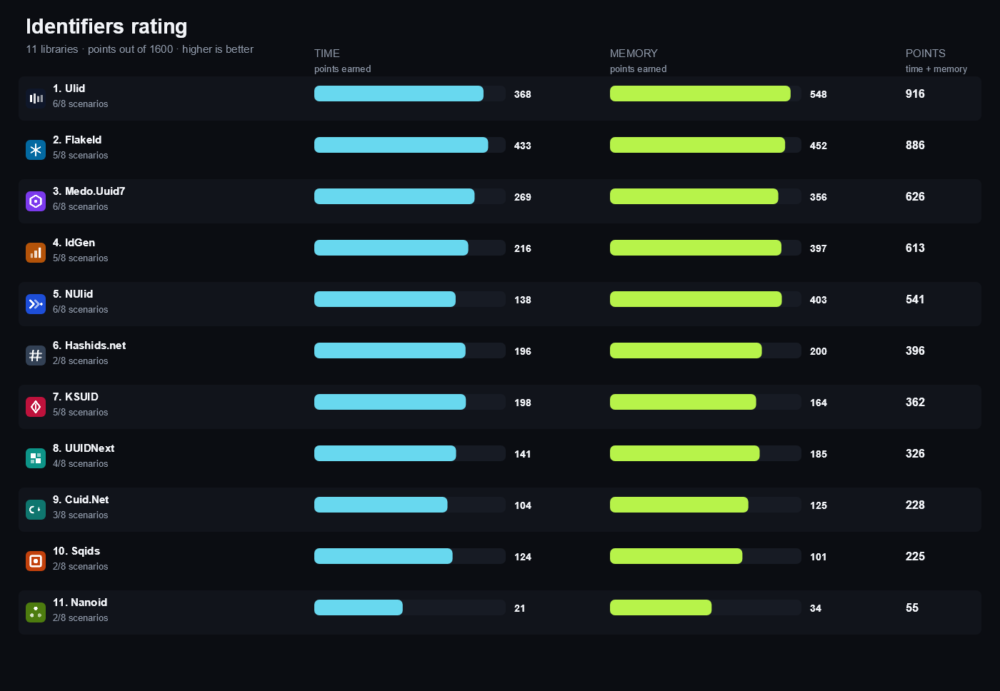
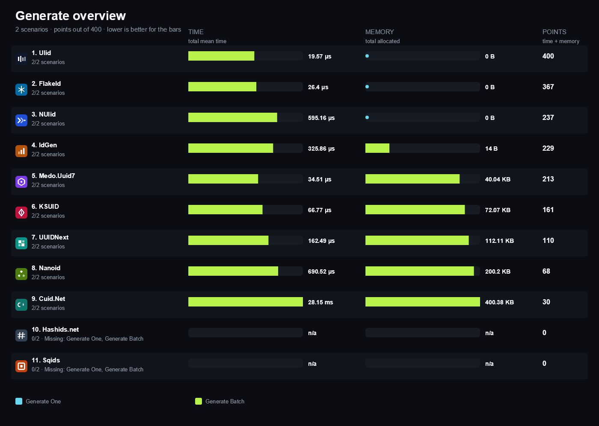
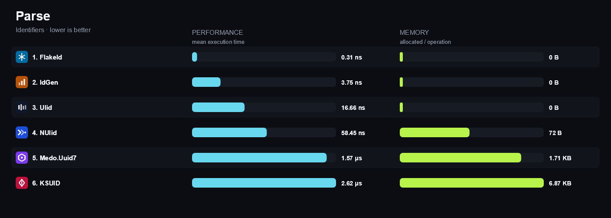

<!-- Generated by build/Templates/CategoryReport.cshtml. Do not edit this file directly. -->

[← .NET Matrix](../../README.md) · [Open the interactive matrix →](https://matrix.dev-team.org/?category=identifiers)

# Identifiers

<blockquote>
<strong><a href="https://matrix.dev-team.org/?category=identifiers&amp;library=Ulid">Ulid</a></strong> leads the current rating · 11 libraries · 8 scenarios
</blockquote>

## Rating

In every scenario the fastest library scores 100 points and the one allocating
least scores 100 more; four times slower is half the points, and an unsupported
scenario is worth nothing. Time and memory reach **800**
each here, so the maximum is **1600**.
See [workflows/rating.md](../../workflows/rating.md).

| # | Library | Scenarios | Time | Memory | Points | Group wins |
|---:|---|---:|---:|---:|---:|---|
| 1 | [**Ulid**](https://matrix.dev-team.org/?category=identifiers&library=Ulid) | 6/8 | 418 | 548 | 966 | gold in Generate, gold in Time, silver in Convert, bronze in Codec |
| 2 | [**FlakeId**](https://matrix.dev-team.org/?category=identifiers&library=FlakeId) | 5/8 | 401 | 452 | 853 | gold in Convert, silver in Generate, bronze in Codec |
| 3 | [**Medo.Uuid7**](https://matrix.dev-team.org/?category=identifiers&library=Medo.Uuid7) | 6/8 | 316 | 356 | 672 | silver in Time, bronze in Codec |
| 4 | [**IdGen**](https://matrix.dev-team.org/?category=identifiers&library=IdGen) | 5/8 | 229 | 396 | 625 | bronze in Codec, bronze in Convert |
| 5 | [**NUlid**](https://matrix.dev-team.org/?category=identifiers&library=NUlid) | 6/8 | 163 | 403 | 566 | bronze in Codec, bronze in Generate |
| 6 | [**Hashids.net**](https://matrix.dev-team.org/?category=identifiers&library=Hashids.net) | 2/8 | 190 | 200 | 390 | gold in Codec |
| 7 | [**KSUID**](https://matrix.dev-team.org/?category=identifiers&library=Ksuid) | 5/8 | 216 | 164 | 380 | bronze in Codec |
| 8 | [**UUIDNext**](https://matrix.dev-team.org/?category=identifiers&library=UUIDNext) | 4/8 | 162 | 185 | 347 | bronze in Codec, bronze in Time |
| 9 | [**Cuid.Net**](https://matrix.dev-team.org/?category=identifiers&library=Cuid.Net) | 3/8 | 105 | 125 | 230 | bronze in Codec |
| 10 | [**Sqids**](https://matrix.dev-team.org/?category=identifiers&library=Sqids) | 2/8 | 125 | 101 | 226 | silver in Codec |
| 11 | [**Nanoid**](https://matrix.dev-team.org/?category=identifiers&library=Nanoid) | 2/8 | 34 | 34 | 68 | bronze in Codec |

<strong>How the points were earned</strong> — every scenario, with the measurements behind it

Each row is one scenario. `Best` is the lowest result among the rated libraries
that completed it, and the points follow from the two figures beside them:
`100 × √((best + step) / (result + step))`, with a step of 1 ns for time and 24 B
for memory. A dash means the library did not complete the scenario, and it scores
nothing for it. Add the two Points columns over every scenario and you get the
rating above. The same breakdown appears as a hint on any points value in the
[application](https://matrix.dev-team.org/?category=identifiers).

#### 1. Ulid — 966 of 1600

| Scenario | Time | Best | Points | Memory | Best | Points |
|---|---:|---:|---:|---:|---:|---:|
| Generate One | 19.26 ns | 19.26 ns | 100 | 0 B | 0 B | 100 |
| Generate Batch | 19.55 μs | 19.55 μs | 100 | 0 B | 0 B | 100 |
| Format | 22.47 ns | 1.36 ns | 31.7 | 80 B | 0 B | 48 |
| Parse | 14.38 ns | 2.06 ns | 44.6 | 0 B | 0 B | 100 |
| Extract Timestamp | 2.39 ns | 1.37 ns | 83.5 | 0 B | 0 B | 100 |
| Encode Numbers | — | 1.07 μs | 0 | — | 48 B | 0 |
| Decode Numbers | — | 1.76 μs | 0 | — | 56 B | 0 |
| Sortable Order | 774.94 ns | 264.95 ns | 58.5 | 0 B | 0 B | 100 |

#### 2. FlakeId — 853 of 1600

| Scenario | Time | Best | Points | Memory | Best | Points |
|---|---:|---:|---:|---:|---:|---:|
| Generate One | 29.81 ns | 19.26 ns | 81.1 | 0 B | 0 B | 100 |
| Generate Batch | 26.37 μs | 19.55 μs | 86.1 | 0 B | 0 B | 100 |
| Format | 19.58 ns | 1.36 ns | 33.9 | 64 B | 0 B | 52.2 |
| Parse | 2.06 ns | 2.06 ns | 100 | 0 B | 0 B | 100 |
| Extract Timestamp | — | 1.37 ns | 0 | — | 0 B | 0 |
| Encode Numbers | — | 1.07 μs | 0 | — | 48 B | 0 |
| Decode Numbers | — | 1.76 μs | 0 | — | 56 B | 0 |
| Sortable Order | 264.95 ns | 264.95 ns | 100 | 0 B | 0 B | 100 |

#### 3. Medo.Uuid7 — 672 of 1600

| Scenario | Time | Best | Points | Memory | Best | Points |
|---|---:|---:|---:|---:|---:|---:|
| Generate One | 35.47 ns | 19.26 ns | 74.5 | 40 B | 0 B | 61.2 |
| Generate Batch | 34.48 μs | 19.55 μs | 75.3 | 40 KB | 0 B | 2.42 |
| Format | 23.71 ns | 1.36 ns | 30.9 | 96 B | 0 B | 44.7 |
| Parse | 126 ns | 2.06 ns | 15.5 | 80 B | 0 B | 48 |
| Extract Timestamp | 4.06 ns | 1.37 ns | 68.4 | 0 B | 0 B | 100 |
| Encode Numbers | — | 1.07 μs | 0 | — | 48 B | 0 |
| Decode Numbers | — | 1.76 μs | 0 | — | 56 B | 0 |
| Sortable Order | 1.02 μs | 264.95 ns | 51 | 0 B | 0 B | 100 |

#### 4. IdGen — 625 of 1600

| Scenario | Time | Best | Points | Memory | Best | Points |
|---|---:|---:|---:|---:|---:|---:|
| Generate One | 315.05 ns | 19.26 ns | 25.3 | 0 B | 0 B | 100 |
| Generate Batch | 325.55 μs | 19.55 μs | 24.5 | 14 B | 0 B | 79.5 |
| Format | 261.87 ns | 1.36 ns | 9.481 | 824 B | 0 B | 16.8 |
| Parse | 3.56 ns | 2.06 ns | 81.9 | 0 B | 0 B | 100 |
| Extract Timestamp | 2.06 ns | 1.37 ns | 87.9 | 0 B | 0 B | 100 |
| Encode Numbers | — | 1.07 μs | 0 | — | 48 B | 0 |
| Decode Numbers | — | 1.76 μs | 0 | — | 56 B | 0 |
| Sortable Order | — | 264.95 ns | 0 | — | 0 B | 0 |

#### 5. NUlid — 566 of 1600

| Scenario | Time | Best | Points | Memory | Best | Points |
|---|---:|---:|---:|---:|---:|---:|
| Generate One | 571.5 ns | 19.26 ns | 18.8 | 0 B | 0 B | 100 |
| Generate Batch | 594.59 μs | 19.55 μs | 18.1 | 0 B | 0 B | 100 |
| Format | 22.09 ns | 1.36 ns | 32 | 80 B | 0 B | 48 |
| Parse | 52.56 ns | 2.06 ns | 23.9 | 72 B | 0 B | 50 |
| Extract Timestamp | 11.75 ns | 1.37 ns | 43.1 | 0 B | 0 B | 100 |
| Encode Numbers | — | 1.07 μs | 0 | — | 48 B | 0 |
| Decode Numbers | — | 1.76 μs | 0 | — | 56 B | 0 |
| Sortable Order | 3.54 μs | 264.95 ns | 27.4 | 9.96 KB | 0 B | 4.845 |

#### 6. Hashids.net — 390 of 1600

| Scenario | Time | Best | Points | Memory | Best | Points |
|---|---:|---:|---:|---:|---:|---:|
| Generate One | — | 19.26 ns | 0 | — | 0 B | 0 |
| Generate Batch | — | 19.55 μs | 0 | — | 0 B | 0 |
| Format | — | 1.36 ns | 0 | — | 0 B | 0 |
| Parse | — | 2.06 ns | 0 | — | 0 B | 0 |
| Extract Timestamp | — | 1.37 ns | 0 | — | 0 B | 0 |
| Encode Numbers | 1.07 μs | 1.07 μs | 100 | 48 B | 48 B | 100 |
| Decode Numbers | 2.19 μs | 1.76 μs | 89.6 | 56 B | 56 B | 100 |
| Sortable Order | — | 264.95 ns | 0 | — | 0 B | 0 |

#### 7. KSUID — 380 of 1600

| Scenario | Time | Best | Points | Memory | Best | Points |
|---|---:|---:|---:|---:|---:|---:|
| Generate One | 64.76 ns | 19.26 ns | 55.5 | 72 B | 0 B | 50 |
| Generate Batch | 66.7 μs | 19.55 μs | 54.1 | 72 KB | 0 B | 1.804 |
| Format | 2.58 μs | 1.36 ns | 3.026 | 6.3 KB | 0 B | 6.09 |
| Parse | 2.49 μs | 2.06 ns | 3.503 | 6.86 KB | 0 B | 5.835 |
| Extract Timestamp | 1.37 ns | 1.37 ns | 100 | 0 B | 0 B | 100 |
| Encode Numbers | — | 1.07 μs | 0 | — | 48 B | 0 |
| Decode Numbers | — | 1.76 μs | 0 | — | 56 B | 0 |
| Sortable Order | — | 264.95 ns | 0 | — | 0 B | 0 |

#### 8. UUIDNext — 347 of 1600

| Scenario | Time | Best | Points | Memory | Best | Points |
|---|---:|---:|---:|---:|---:|---:|
| Generate One | 193.27 ns | 19.26 ns | 32.3 | 112 B | 0 B | 42 |
| Generate Batch | 162.29 μs | 19.55 μs | 34.7 | 112 KB | 0 B | 1.446 |
| Format | — | 1.36 ns | 0 | — | 0 B | 0 |
| Parse | — | 2.06 ns | 0 | — | 0 B | 0 |
| Extract Timestamp | 45.17 ns | 1.37 ns | 22.6 | 112 B | 0 B | 42 |
| Encode Numbers | — | 1.07 μs | 0 | — | 48 B | 0 |
| Decode Numbers | — | 1.76 μs | 0 | — | 56 B | 0 |
| Sortable Order | 511.52 ns | 264.95 ns | 72 | 0 B | 0 B | 100 |

#### 9. Cuid.Net — 230 of 1600

| Scenario | Time | Best | Points | Memory | Best | Points |
|---|---:|---:|---:|---:|---:|---:|
| Generate One | 27.52 μs | 19.26 ns | 2.714 | 400 B | 0 B | 23.8 |
| Generate Batch | 28.12 ms | 19.55 μs | 2.637 | 399.99 KB | 0 B | 0.765 |
| Format | 1.36 ns | 1.36 ns | 100 | 0 B | 0 B | 100 |
| Parse | — | 2.06 ns | 0 | — | 0 B | 0 |
| Extract Timestamp | — | 1.37 ns | 0 | — | 0 B | 0 |
| Encode Numbers | — | 1.07 μs | 0 | — | 48 B | 0 |
| Decode Numbers | — | 1.76 μs | 0 | — | 56 B | 0 |
| Sortable Order | — | 264.95 ns | 0 | — | 0 B | 0 |

#### 10. Sqids — 226 of 1600

| Scenario | Time | Best | Points | Memory | Best | Points |
|---|---:|---:|---:|---:|---:|---:|
| Generate One | — | 19.26 ns | 0 | — | 0 B | 0 |
| Generate Batch | — | 19.55 μs | 0 | — | 0 B | 0 |
| Format | — | 1.36 ns | 0 | — | 0 B | 0 |
| Parse | — | 2.06 ns | 0 | — | 0 B | 0 |
| Extract Timestamp | — | 1.37 ns | 0 | — | 0 B | 0 |
| Encode Numbers | 16.7 μs | 1.07 μs | 25.3 | 680 B | 48 B | 32 |
| Decode Numbers | 1.76 μs | 1.76 μs | 100 | 144 B | 56 B | 69 |
| Sortable Order | — | 264.95 ns | 0 | — | 0 B | 0 |

#### 11. Nanoid — 68 of 1600

| Scenario | Time | Best | Points | Memory | Best | Points |
|---|---:|---:|---:|---:|---:|---:|
| Generate One | 652.59 ns | 19.26 ns | 17.6 | 200 B | 0 B | 32.7 |
| Generate Batch | 689.87 μs | 19.55 μs | 16.8 | 200 KB | 0 B | 1.082 |
| Format | — | 1.36 ns | 0 | — | 0 B | 0 |
| Parse | — | 2.06 ns | 0 | — | 0 B | 0 |
| Extract Timestamp | — | 1.37 ns | 0 | — | 0 B | 0 |
| Encode Numbers | — | 1.07 μs | 0 | — | 48 B | 0 |
| Decode Numbers | — | 1.76 μs | 0 | — | 56 B | 0 |
| Sortable Order | — | 264.95 ns | 0 | — | 0 B | 0 |

## Benchmark overview

**Generate**

<strong>More overview charts (3)</strong>

#### Convert

#### Time

#### Codec

## Compared libraries (11)

<table>
<tr>
<td width="64"></td>
<td><strong><a href="https://github.com/MatthewKing/cuid.net">Cuid.Net</a></strong> 7.1.0 A CUID2 implementation that produces collision-resistant random identifiers whose length is chosen by the caller.</td>
<td width="100" align="right"><a href="https://matrix.dev-team.org/?category=identifiers&amp;library=Cuid.Net">Compare →</a></td>
</tr>
<tr>
<td width="64"></td>
<td><strong><a href="https://github.com/martindevans/FlakeId">FlakeId</a></strong> 1.3.2 A Snowflake-like 64-bit identifier generator with an embedded timestamp, datacenter and worker identity.</td>
<td width="100" align="right"><a href="https://matrix.dev-team.org/?category=identifiers&amp;library=FlakeId">Compare →</a></td>
</tr>
<tr>
<td width="64"></td>
<td><strong><a href="https://github.com/ullmark/hashids.net">Hashids.net</a></strong> 1.7.0 An obfuscating encoder that turns integer sequences into short unique strings and back.</td>
<td width="100" align="right"><a href="https://matrix.dev-team.org/?category=identifiers&amp;library=Hashids.net">Compare →</a></td>
</tr>
<tr>
<td width="64"></td>
<td><strong><a href="https://github.com/RobThree/IdGen">IdGen</a></strong> 3.0.7 A Twitter Snowflake style generator producing 64-bit time-ordered identifiers with configurable structure.</td>
<td width="100" align="right"><a href="https://matrix.dev-team.org/?category=identifiers&amp;library=IdGen">Compare →</a></td>
</tr>
<tr>
<td width="64"></td>
<td><strong><a href="https://github.com/segmentio/ksuid">KSUID</a></strong> 1.0.0 A .NET implementation of K-Sortable Unique Identifiers with a 32-bit timestamp and 128-bit payload.</td>
<td width="100" align="right"><a href="https://matrix.dev-team.org/?category=identifiers&amp;library=Ksuid">Compare →</a></td>
</tr>
<tr>
<td width="64"></td>
<td><strong><a href="https://github.com/Medo64/Medo.Uuid7">Medo.Uuid7</a></strong> 3.4.0 A small RFC 9562 UUID version 7 implementation with timestamp extraction and monotonic generation.</td>
<td width="100" align="right"><a href="https://matrix.dev-team.org/?category=identifiers&amp;library=Medo.Uuid7">Compare →</a></td>
</tr>
<tr>
<td width="64"></td>
<td><strong><a href="https://github.com/codeyu/nanoid-net">Nanoid</a></strong> 3.1.0 A compact URL-safe random string identifier generator using a configurable alphabet.</td>
<td width="100" align="right"><a href="https://matrix.dev-team.org/?category=identifiers&amp;library=Nanoid">Compare →</a></td>
</tr>
<tr>
<td width="64"></td>
<td><strong><a href="https://github.com/ulid/spec">NUlid</a></strong> 1.7.3 A ULID implementation derived from the original specification with parsing and monotonic generation support.</td>
<td width="100" align="right"><a href="https://matrix.dev-team.org/?category=identifiers&amp;library=NUlid">Compare →</a></td>
</tr>
<tr>
<td width="64"></td>
<td><strong><a href="https://sqids.org/dotnet">Sqids</a></strong> 3.2.1 A library that encodes one or more numbers into short URL-safe strings and decodes them back.</td>
<td width="100" align="right"><a href="https://matrix.dev-team.org/?category=identifiers&amp;library=Sqids">Compare →</a></td>
</tr>
<tr>
<td width="64"></td>
<td><strong><a href="https://github.com/Cysharp/Ulid">Ulid</a></strong> 1.4.1 A fast, allocation-conscious Cysharp implementation of Universally Unique Lexicographically Sortable Identifiers.</td>
<td width="100" align="right"><a href="https://matrix.dev-team.org/?category=identifiers&amp;library=Ulid">Compare →</a></td>
</tr>
<tr>
<td width="64"></td>
<td><strong><a href="https://github.com/mareek/UUIDNext">UUIDNext</a></strong> 4.2.4 A UUID generator for .NET providing time-ordered version 7 and database-friendly sequential GUIDs.</td>
<td width="100" align="right"><a href="https://matrix.dev-team.org/?category=identifiers&amp;library=UUIDNext">Compare →</a></td>
</tr>
</table>

## Benchmark scenarios (8)

### 01 · Generate One

Creates one identifier with the library default configuration.

### 02 · Generate Batch

Fills a preallocated array of 1,024 identifiers.

### 03 · Format

Converts a pre-generated identifier into its canonical text.

### 04 · Parse

Reconstructs an identifier from its canonical representation.

### 05 · Extract Timestamp

Reads the creation time embedded in a pre-generated identifier.

### 06 · Encode Numbers

Maps a fixed number sequence to a short string.

### 07 · Decode Numbers

Maps a string back to the number sequence that produced it.

### 08 · Sortable Order

Compares adjacent identifiers generated at increasing timestamps to prove ordinal order follows time.

