<!-- Generated by build/Templates/CategoryReport.cshtml. Do not edit this file directly. -->

[← .NET Matrix](../../README.md) · [Open the interactive matrix →](https://matrix.dev-team.org/?category=json-serialization)

# JSON Serialization

<blockquote>
<strong><a href="https://matrix.dev-team.org/?category=json-serialization&amp;library=SpanJson">SpanJson</a></strong> leads the current rating · 4 libraries · 14 scenarios
</blockquote>

## Rating

In every scenario the fastest library scores 100 points and the one allocating
least scores 100 more; four times slower is half the points, and an unsupported
scenario is worth nothing. Time and memory reach **1300**
each here, so the maximum is **2600**.
See [workflows/rating.md](../../workflows/rating.md).

[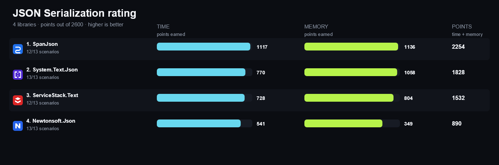](https://matrix.dev-team.org/?category=json-serialization)

| # | Library | Scenarios | Time | Memory | Points | Group wins |
|---:|---|---:|---:|---:|---:|---|
| 1 | [**SpanJson**](https://matrix.dev-team.org/?category=json-serialization&library=SpanJson) | 12/13 | 1117 | 1136 | 2254 | gold in Basic, gold in Collections, gold in Nested, gold in Stream, silver in Advanced, silver in Prepare |
| 2 | [**System.Text.Json**](https://matrix.dev-team.org/?category=json-serialization&library=System.Text.Json) | 13/13 | 770 | 1058 | 1828 | gold in Advanced, silver in Basic, silver in Collections, silver in Stream, bronze in Nested, bronze in Prepare |
| 3 | [**ServiceStack.Text**](https://matrix.dev-team.org/?category=json-serialization&library=ServiceStack.Text) | 12/13 | 728 | 804 | 1532 | gold in Prepare, silver in Nested, bronze in Advanced, bronze in Basic, bronze in Collections, bronze in Stream |
| 4 | [**Newtonsoft.Json**](https://matrix.dev-team.org/?category=json-serialization&library=Newtonsoft.Json) | 13/13 | 541 | 349 | 890 |  |

<strong>How the points were earned</strong> — every scenario, with the measurements behind it

Each row is one scenario. `Best` is the lowest result among the rated libraries
that completed it, and the points follow from the two figures beside them:
`100 × √((best + step) / (result + step))`, with a step of 1 ns for time and 24 B
for memory. A dash means the library did not complete the scenario, and it scores
nothing for it. Add the two Points columns over every scenario and you get the
rating above. The same breakdown appears as a hint on any points value in the
[application](https://matrix.dev-team.org/?category=json-serialization).

#### 1. SpanJson — 2254 of 2600

| Scenario | Time | Best | Points | Memory | Best | Points |
|---|---:|---:|---:|---:|---:|---:|
| Serialize Simple Object | 78.19 ns | 78.19 ns | 100 | 96 B | 96 B | 100 |
| Deserialize Simple Object | 77.41 ns | 77.41 ns | 100 | 64 B | 64 B | 100 |
| Serialize Nested Object | 141.17 ns | 141.17 ns | 100 | 192 B | 192 B | 100 |
| Deserialize Nested Object | 206.26 ns | 206.26 ns | 100 | 296 B | 296 B | 100 |
| Serialize Collection | 195.3 ns | 195.3 ns | 100 | 248 B | 248 B | 100 |
| Deserialize Collection | 304.92 ns | 304.92 ns | 100 | 240 B | 240 B | 100 |
| Serialize Dictionary | 150.7 ns | 150.7 ns | 100 | 144 B | 88 B | 81.6 |
| Deserialize Dictionary | 158.37 ns | 158.37 ns | 100 | 312 B | 312 B | 100 |
| Enum Round Trip | 84.58 ns | 84.58 ns | 100 | 88 B | 88 B | 100 |
| Custom Converter Round Trip | 114.07 ns | 114.07 ns | 100 | 120 B | 120 B | 100 |
| Polymorphic Round Trip | — | 1.77 μs | 0 | — | 1.32 KB | 0 |
| UTF-8 Stream Round Trip | 198.34 ns | 198.34 ns | 100 | 280 B | 280 B | 100 |
| Prepare Serializer | 31.96 ns | 0 ns | 17.4 | 56 B | 0 B | 54.8 |

#### 2. System.Text.Json — 1828 of 2600

| Scenario | Time | Best | Points | Memory | Best | Points |
|---|---:|---:|---:|---:|---:|---:|
| Serialize Simple Object | 201.86 ns | 78.19 ns | 62.5 | 96 B | 96 B | 100 |
| Deserialize Simple Object | 257.99 ns | 77.41 ns | 55 | 64 B | 64 B | 100 |
| Serialize Nested Object | 450.07 ns | 141.17 ns | 56.1 | 504 B | 192 B | 64 |
| Deserialize Nested Object | 662.73 ns | 206.26 ns | 55.9 | 768 B | 296 B | 63.6 |
| Serialize Collection | 564.56 ns | 195.3 ns | 58.9 | 560 B | 248 B | 68.2 |
| Deserialize Collection | 863.57 ns | 304.92 ns | 59.5 | 800 B | 240 B | 56.6 |
| Serialize Dictionary | 205.73 ns | 150.7 ns | 85.7 | 88 B | 88 B | 100 |
| Deserialize Dictionary | 346.24 ns | 158.37 ns | 67.7 | 312 B | 312 B | 100 |
| Enum Round Trip | 342.63 ns | 84.58 ns | 49.9 | 88 B | 88 B | 100 |
| Custom Converter Round Trip | 330.45 ns | 114.07 ns | 58.9 | 120 B | 120 B | 100 |
| Polymorphic Round Trip | 1.77 μs | 1.77 μs | 100 | 1.32 KB | 1.32 KB | 100 |
| UTF-8 Stream Round Trip | 568.42 ns | 198.34 ns | 59.2 | 280 B | 280 B | 100 |
| Prepare Serializer | 15.82 μs | 0 ns | 0.795 | 7.45 KB | 0 B | 5.599 |

#### 3. ServiceStack.Text — 1532 of 2600

| Scenario | Time | Best | Points | Memory | Best | Points |
|---|---:|---:|---:|---:|---:|---:|
| Serialize Simple Object | 341.74 ns | 78.19 ns | 48.1 | 336 B | 96 B | 57.7 |
| Deserialize Simple Object | 208.91 ns | 77.41 ns | 61.1 | 112 B | 64 B | 80.4 |
| Serialize Nested Object | 696.1 ns | 141.17 ns | 45.2 | 792 B | 192 B | 51.4 |
| Deserialize Nested Object | 591.48 ns | 206.26 ns | 59.1 | 320 B | 296 B | 96.4 |
| Serialize Collection | 897.47 ns | 195.3 ns | 46.7 | 1000 B | 248 B | 51.5 |
| Deserialize Collection | 817.45 ns | 304.92 ns | 61.1 | 472 B | 240 B | 73 |
| Serialize Dictionary | 210.2 ns | 150.7 ns | 84.8 | 288 B | 88 B | 59.9 |
| Deserialize Dictionary | 296.93 ns | 158.37 ns | 73.1 | 424 B | 312 B | 86.6 |
| Enum Round Trip | 339.78 ns | 84.58 ns | 50.1 | 336 B | 88 B | 55.8 |
| Custom Converter Round Trip | 346.67 ns | 114.07 ns | 57.5 | 392 B | 120 B | 58.8 |
| Polymorphic Round Trip | — | 1.77 μs | 0 | — | 1.32 KB | 0 |
| UTF-8 Stream Round Trip | 1.19 μs | 198.34 ns | 40.8 | 2.8 KB | 280 B | 32.4 |
| Prepare Serializer | 0 ns | 0 ns | 100 | 0 B | 0 B | 100 |

#### 4. Newtonsoft.Json — 890 of 2600

| Scenario | Time | Best | Points | Memory | Best | Points |
|---|---:|---:|---:|---:|---:|---:|
| Serialize Simple Object | 384.51 ns | 78.19 ns | 45.3 | 1.41 KB | 96 B | 28.6 |
| Deserialize Simple Object | 630.25 ns | 77.41 ns | 35.2 | 2.61 KB | 64 B | 18.1 |
| Serialize Nested Object | 653.34 ns | 141.17 ns | 46.6 | 1.63 KB | 192 B | 35.8 |
| Deserialize Nested Object | 1.15 μs | 206.26 ns | 42.5 | 2.89 KB | 296 B | 32.7 |
| Serialize Collection | 951.61 ns | 195.3 ns | 45.4 | 1.83 KB | 248 B | 37.9 |
| Deserialize Collection | 1.61 μs | 304.92 ns | 43.6 | 2.99 KB | 240 B | 29.2 |
| Serialize Dictionary | 384.69 ns | 150.7 ns | 62.7 | 1.48 KB | 88 B | 27 |
| Deserialize Dictionary | 673.17 ns | 158.37 ns | 48.6 | 2.83 KB | 312 B | 33.9 |
| Enum Round Trip | 1.05 μs | 84.58 ns | 28.6 | 4.68 KB | 88 B | 15.2 |
| Custom Converter Round Trip | 981.23 ns | 114.07 ns | 34.2 | 4.68 KB | 120 B | 17.3 |
| Polymorphic Round Trip | 3.88 μs | 1.77 μs | 67.5 | 7.79 KB | 1.32 KB | 41.5 |
| UTF-8 Stream Round Trip | 1.22 μs | 198.34 ns | 40.3 | 4.13 KB | 280 B | 26.8 |
| Prepare Serializer | 53.76 μs | 0 ns | 0.431 | 11.64 KB | 0 B | 4.482 |

## Benchmark overview

**Basic**

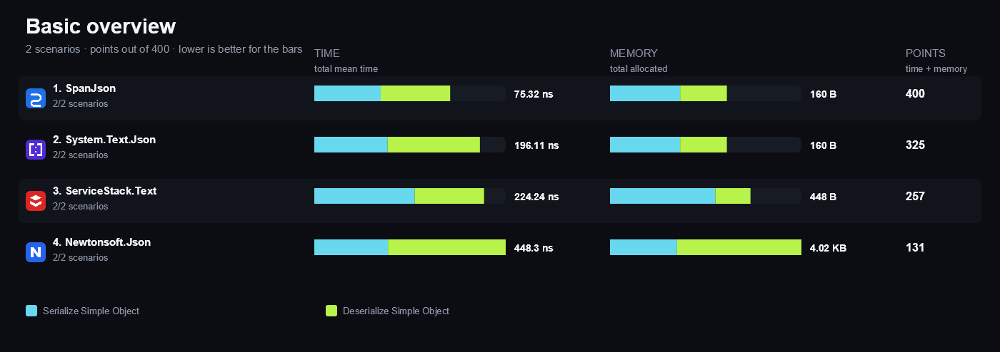

<strong>More overview charts (5)</strong>

#### Nested

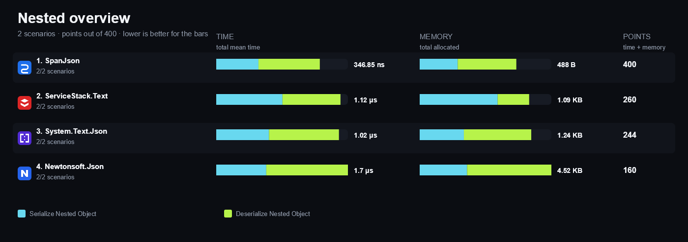

#### Collections

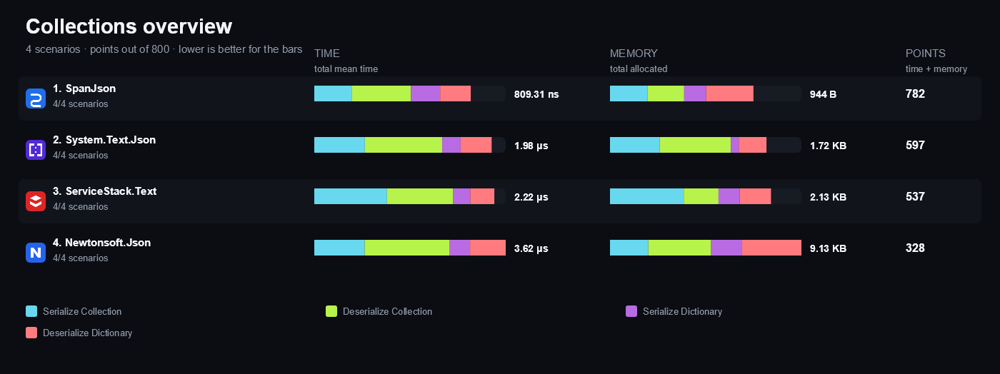

#### Advanced

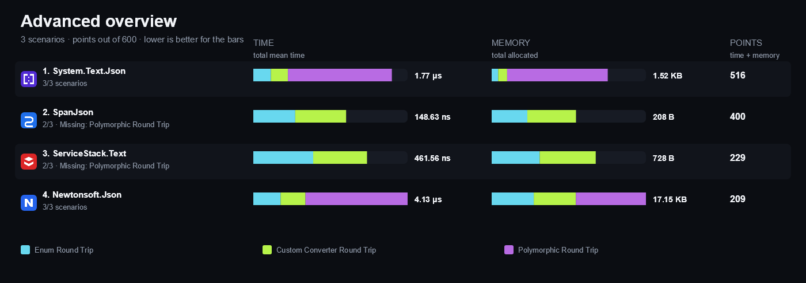

#### Stream

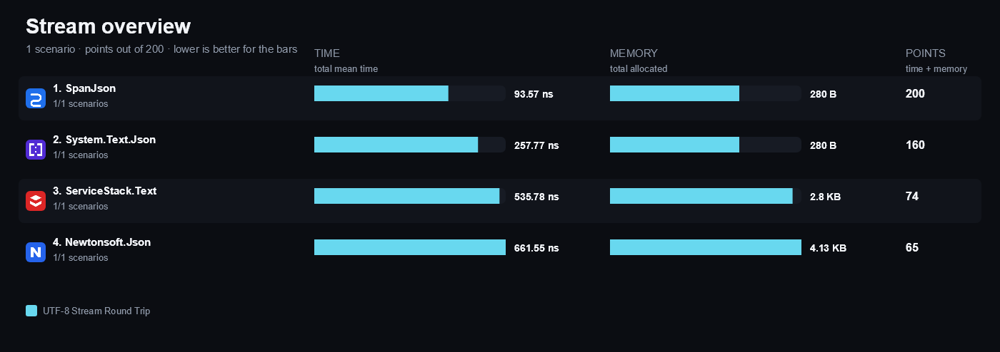

#### Prepare

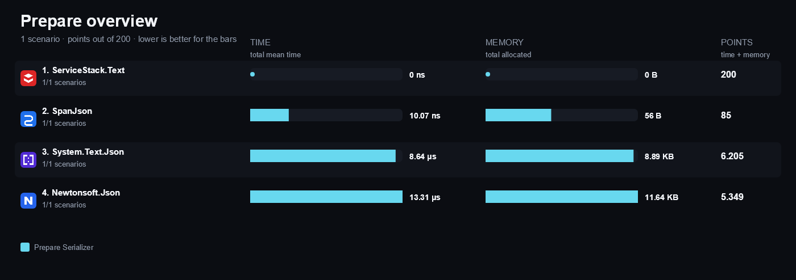

## Compared libraries (4)

<table>
<tr>
<td width="64"></td>
<td><strong><a href="https://www.newtonsoft.com/json/help/html/Introduction.htm">Newtonsoft.Json</a></strong> 13.0.4 A mature JSON framework for .NET with configurable contracts, converters, and streaming readers and writers.</td>
<td width="100" align="right"><a href="https://matrix.dev-team.org/?category=json-serialization&amp;library=Newtonsoft.Json">Compare →</a></td>
</tr>
<tr>
<td width="64"></td>
<td><strong><a href="https://docs.servicestack.net/text">ServiceStack.Text</a></strong> 10.5.0 A high-performance text library with typed JSON, stream, collection, and type-specific serialization APIs.</td>
<td width="100" align="right"><a href="https://matrix.dev-team.org/?category=json-serialization&amp;library=ServiceStack.Text">Compare →</a></td>
</tr>
<tr>
<td width="64"></td>
<td><strong><a href="https://github.com/Tornhoof/SpanJson">SpanJson</a></strong> 4.2.1 A reflection-driven JSON serializer that builds per-resolver formatters over Span&lt;byte&gt; and Span&lt;char&gt; readers and writers.</td>
<td width="100" align="right"><a href="https://matrix.dev-team.org/?category=json-serialization&amp;library=SpanJson">Compare →</a></td>
</tr>
<tr>
<td width="64"></td>
<td><strong><a href="https://learn.microsoft.com/dotnet/standard/serialization/system-text-json/overview">System.Text.Json</a></strong> The reflection-based and source-generated JSON serializer included with .NET.</td>
<td width="100" align="right"><a href="https://matrix.dev-team.org/?category=json-serialization&amp;library=System.Text.Json">Compare →</a></td>
</tr>
</table>

## Benchmark scenarios (14)

### 01 · Serialize Simple Object

Serializes one scalar object to a compact JSON string.

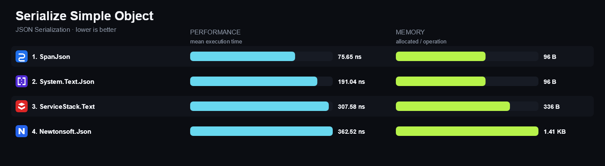

### 02 · Deserialize Simple Object

Deserializes one compact JSON object and validates every scalar member.

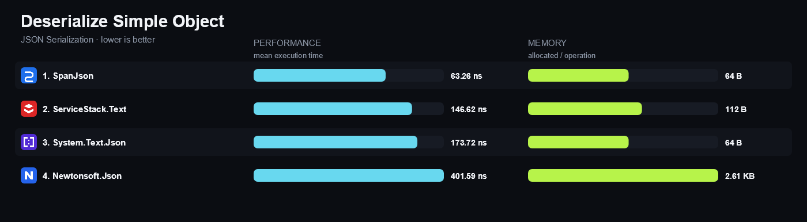

### 03 · Serialize Nested Object

Serializes an order, customer, and address object graph.

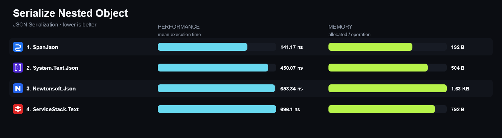

### 04 · Deserialize Nested Object

Deserializes and materializes an order, customer, and address object graph.

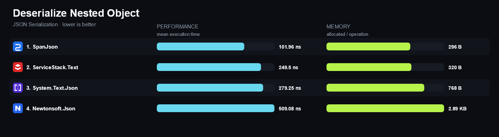

### 05 · Serialize Collection

Serializes three ordered objects to a compact JSON array.

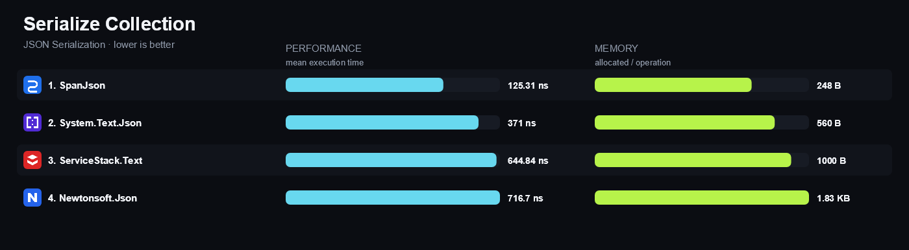

### 06 · Deserialize Collection

Deserializes a compact JSON array to three ordered objects.

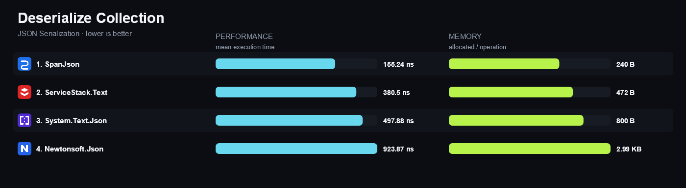

### 07 · Serialize Dictionary

Serializes three ordered string and integer entries to a JSON object.

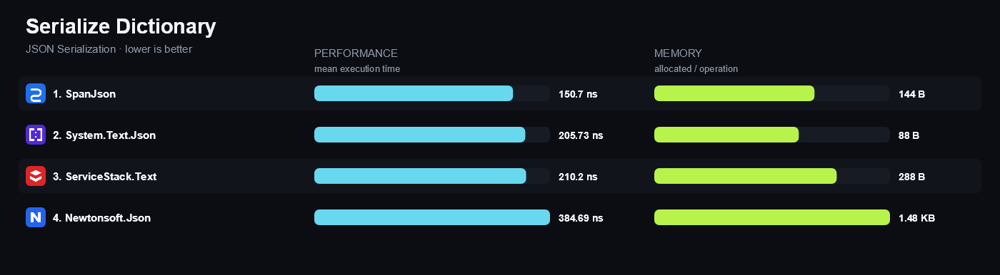

### 08 · Deserialize Dictionary

Deserializes a JSON object to three ordinal string and integer entries.

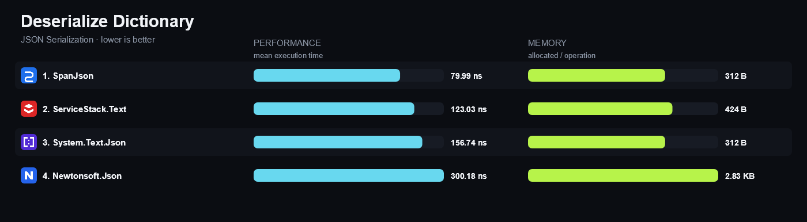

### 09 · Enum Round Trip

Serializes an enum as its string name and deserializes it back.

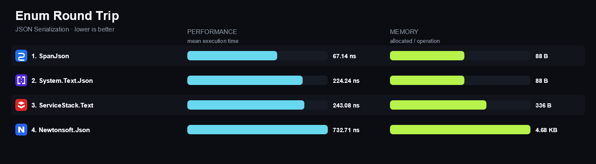

### 10 · Custom Converter Round Trip

Serializes a strongly typed identifier as a JSON string and deserializes it back.

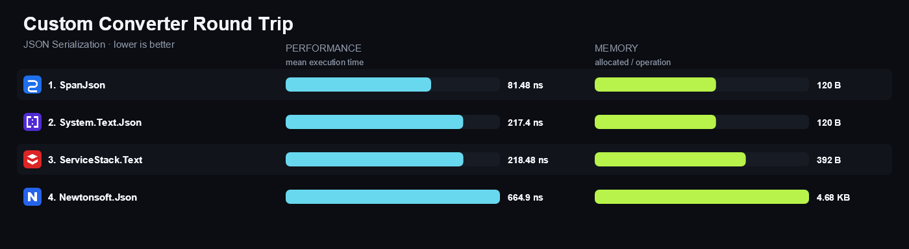

### 11 · Polymorphic Round Trip

Round-trips a base-type collection through safe cat and dog discriminators.

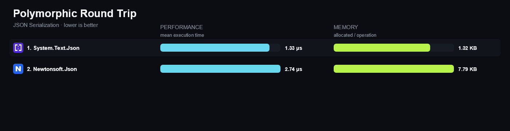

### 12 · UTF-8 Stream Round Trip

Serializes a simple object to a new UTF-8 memory stream and deserializes it back.

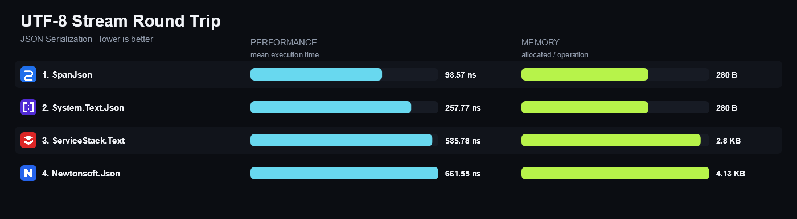

### 13 · Source Generation Round Trip

Round-trips a simple object with compile-time generated JSON metadata.

*Not rated: With this few rated entrants, the reference is a library's own result, not a result earned against a competitor, so the full 200 points would not reflect a win. (1 of 4 rated libraries support this.)*

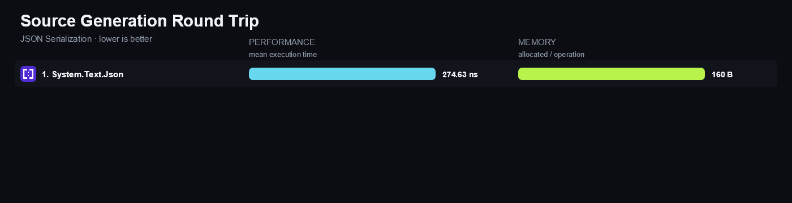

### 14 · Prepare Serializer

Creates fresh serializer settings and explicit type metadata without serializing data.

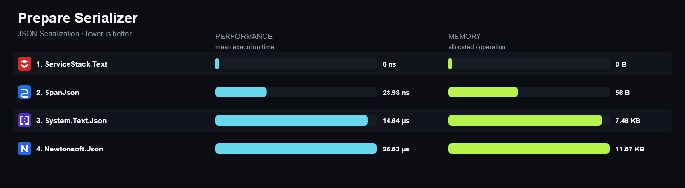

