<!-- Generated by build/Templates/CategoryReport.cshtml. Do not edit this file directly. -->

[← .NET Matrix](../../README.md) · [Open the interactive matrix →](https://matrix.dev-team.org/?category=linq-queries)

# LINQ Queries

<blockquote>
<strong><a href="https://matrix.dev-team.org/?category=linq-queries&amp;library=ZLinq">ZLinq</a></strong> leads the current rating · 6 libraries · 18 scenarios
</blockquote>

## Rating

In every scenario the fastest library scores 100 points and the one allocating
least scores 100 more; four times slower is half the points, and an unsupported
scenario is worth nothing. Time and memory reach **1700**
each here, so the maximum is **3400**.
See [workflows/rating.md](../../workflows/rating.md).

[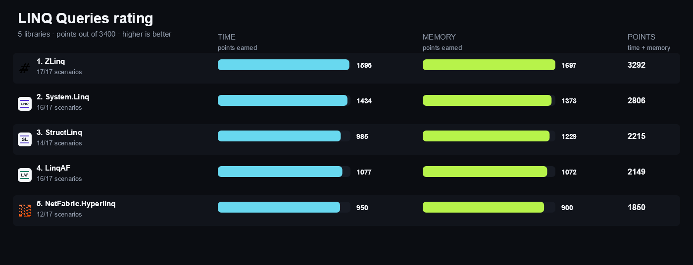](https://matrix.dev-team.org/?category=linq-queries)

| # | Library | Scenarios | Time | Memory | Points | Group wins |
|---:|---|---:|---:|---:|---:|---|
| 1 | [**ZLinq**](https://matrix.dev-team.org/?category=linq-queries&library=ZLinq) | 17/17 | 1593 | 1689 | 3283 | gold in Advanced, gold in Core, gold in Sequences, gold in Sources, silver in Partitioning |
| 2 | [**System.Linq**](https://matrix.dev-team.org/?category=linq-queries&library=System.Linq) | 16/17 | 1456 | 1370 | 2826 | gold in Partitioning, silver in Advanced, silver in Core, bronze in Sequences, bronze in Sources |
| 3 | [**StructLinq**](https://matrix.dev-team.org/?category=linq-queries&library=StructLinq) | 14/17 | 961 | 1244 | 2205 | silver in Sequences, bronze in Core |
| 4 | [**LinqAF**](https://matrix.dev-team.org/?category=linq-queries&library=LinqAF) | 16/17 | 1079 | 1072 | 2150 | bronze in Advanced |
| 5 | [**NetFabric.Hyperlinq**](https://matrix.dev-team.org/?category=linq-queries&library=NetFabric.Hyperlinq) | 12/17 | 925 | 900 | 1826 | silver in Sources, bronze in Partitioning |

<strong>How the points were earned</strong> — every scenario, with the measurements behind it

Each row is one scenario. `Best` is the lowest result among the rated libraries
that completed it, and the points follow from the two figures beside them:
`100 × √((best + step) / (result + step))`, with a step of 1 ns for time and 24 B
for memory. A dash means the library did not complete the scenario, and it scores
nothing for it. Add the two Points columns over every scenario and you get the
rating above. The same breakdown appears as a hint on any points value in the
[application](https://matrix.dev-team.org/?category=linq-queries).

#### 1. ZLinq — 3283 of 3400

| Scenario | Time | Best | Points | Memory | Best | Points |
|---|---:|---:|---:|---:|---:|---:|
| Filter and Count | 9.82 μs | 9.82 μs | 100 | 0 B | 0 B | 100 |
| Project To Array | 4.62 μs | 4.62 μs | 100 | 39.09 KB | 39.09 KB | 100 |
| Filter, Project, Materialize | 8.11 μs | 6.03 μs | 86.2 | 9.83 KB | 9.83 KB | 100 |
| Chained Pipeline | 12.36 μs | 8.55 μs | 83.2 | 3.93 KB | 3.93 KB | 100 |
| List Source | 11.26 μs | 11.26 μs | 100 | 13.07 KB | 13.07 KB | 100 |
| Opaque Source | 31.11 μs | 25.13 μs | 89.9 | 13.1 KB | 13.1 KB | 100 |
| Span Source | 14.09 μs | 14.09 μs | 100 | 13.07 KB | 13.07 KB | 100 |
| Paged Slice | 265.08 ns | 262.39 ns | 99.5 | 3.93 KB | 3.93 KB | 100 |
| Any Match | 3.04 μs | 2.97 μs | 98.9 | 0 B | 0 B | 100 |
| First Match | 2.38 μs | 2.26 μs | 97.4 | 0 B | 0 B | 100 |
| Flatten Nested Sequences | 27.17 μs | 6.24 μs | 47.9 | 39.09 KB | 39.09 KB | 100 |
| Distinct Values | 38.93 μs | 34.66 μs | 94.4 | 3.98 KB | 3.96 KB | 99.7 |
| Zip Pairs | 15.42 μs | 15.42 μs | 100 | 39.09 KB | 39.09 KB | 100 |
| Aggregate | 3.39 μs | 3.39 μs | 100 | 0 B | 0 B | 100 |
| Ordered Top N | 40.13 μs | 37 μs | 96 | 264 B | 208 B | 89.8 |
| Group and Aggregate | 95.66 μs | 95.66 μs | 100 | 130.59 KB | 130.59 KB | 100 |
| Join and Project | 78.42 μs | 78.42 μs | 100 | 129.19 KB | 129.19 KB | 100 |

#### 2. System.Linq — 2826 of 3400

| Scenario | Time | Best | Points | Memory | Best | Points |
|---|---:|---:|---:|---:|---:|---:|
| Filter and Count | 9.89 μs | 9.82 μs | 99.7 | 48 B | 0 B | 57.7 |
| Project To Array | 5.01 μs | 4.62 μs | 96 | 39.13 KB | 39.09 KB | 99.9 |
| Filter, Project, Materialize | 6.03 μs | 6.03 μs | 100 | 9.93 KB | 9.83 KB | 99.5 |
| Chained Pipeline | 14.69 μs | 8.55 μs | 76.3 | 4.14 KB | 3.93 KB | 97.4 |
| List Source | 12.08 μs | 11.26 μs | 96.6 | 13.22 KB | 13.07 KB | 99.4 |
| Opaque Source | 25.13 μs | 25.13 μs | 100 | 13.22 KB | 13.1 KB | 99.6 |
| Span Source | — | 14.09 μs | 0 | — | 13.07 KB | 0 |
| Paged Slice | 262.39 ns | 262.39 ns | 100 | 4.02 KB | 3.93 KB | 98.8 |
| Any Match | 2.98 μs | 2.97 μs | 99.8 | 0 B | 0 B | 100 |
| First Match | 2.35 μs | 2.26 μs | 98.2 | 0 B | 0 B | 100 |
| Flatten Nested Sequences | 6.24 μs | 6.24 μs | 100 | 39.18 KB | 39.09 KB | 99.9 |
| Distinct Values | 76.1 μs | 34.66 μs | 67.5 | 179.31 KB | 3.96 KB | 14.9 |
| Zip Pairs | 71.2 μs | 15.42 μs | 46.5 | 39.24 KB | 39.09 KB | 99.8 |
| Aggregate | 3.43 μs | 3.39 μs | 99.4 | 0 B | 0 B | 100 |
| Ordered Top N | 37 μs | 37 μs | 100 | 78.56 KB | 208 B | 5.369 |
| Group and Aggregate | 117.71 μs | 95.66 μs | 90.1 | 131.29 KB | 130.59 KB | 99.7 |
| Join and Project | 105.67 μs | 78.42 μs | 86.1 | 134.83 KB | 129.19 KB | 97.9 |

#### 3. StructLinq — 2205 of 3400

| Scenario | Time | Best | Points | Memory | Best | Points |
|---|---:|---:|---:|---:|---:|---:|
| Filter and Count | 12.97 μs | 9.82 μs | 87 | 32 B | 0 B | 65.5 |
| Project To Array | 10.68 μs | 4.62 μs | 65.8 | 39.09 KB | 39.09 KB | 100 |
| Filter, Project, Materialize | 29.67 μs | 6.03 μs | 45.1 | 9.9 KB | 9.83 KB | 99.6 |
| Chained Pipeline | 13.59 μs | 8.55 μs | 79.3 | 4.03 KB | 3.93 KB | 98.7 |
| List Source | 15.69 μs | 11.26 μs | 84.7 | 13.1 KB | 13.07 KB | 99.9 |
| Opaque Source | 30.07 μs | 25.13 μs | 91.4 | 13.13 KB | 13.1 KB | 99.9 |
| Span Source | — | 14.09 μs | 0 | — | 13.07 KB | 0 |
| Paged Slice | 730.92 ns | 262.39 ns | 60 | 3.99 KB | 3.93 KB | 99.2 |
| Any Match | 8.45 μs | 2.97 μs | 59.3 | 32 B | 0 B | 65.5 |
| First Match | 4.7 μs | 2.26 μs | 69.3 | 32 B | 0 B | 65.5 |
| Flatten Nested Sequences | 40.38 μs | 6.24 μs | 39.3 | 54.74 KB | 39.09 KB | 84.5 |
| Distinct Values | 34.66 μs | 34.66 μs | 100 | 3.96 KB | 3.96 KB | 100 |
| Zip Pairs | 25.01 μs | 15.42 μs | 78.5 | 39.15 KB | 39.09 KB | 99.9 |
| Aggregate | 6.25 μs | 3.39 μs | 73.6 | 32 B | 0 B | 65.5 |
| Ordered Top N | 473.36 μs | 37 μs | 28 | 208 B | 208 B | 100 |
| Group and Aggregate | — | 95.66 μs | 0 | — | 130.59 KB | 0 |
| Join and Project | — | 78.42 μs | 0 | — | 129.19 KB | 0 |

#### 4. LinqAF — 2150 of 3400

| Scenario | Time | Best | Points | Memory | Best | Points |
|---|---:|---:|---:|---:|---:|---:|
| Filter and Count | 10.44 μs | 9.82 μs | 97 | 0 B | 0 B | 100 |
| Project To Array | 30.58 μs | 4.62 μs | 38.9 | 151.38 KB | 39.09 KB | 50.8 |
| Filter, Project, Materialize | 8.47 μs | 6.03 μs | 84.4 | 32.27 KB | 9.83 KB | 55.2 |
| Chained Pipeline | 8.55 μs | 8.55 μs | 100 | 3.93 KB | 3.93 KB | 100 |
| List Source | 27.23 μs | 11.26 μs | 64.3 | 45.31 KB | 13.07 KB | 53.7 |
| Opaque Source | 40.56 μs | 25.13 μs | 78.7 | 45.34 KB | 13.1 KB | 53.8 |
| Span Source | — | 14.09 μs | 0 | — | 13.07 KB | 0 |
| Paged Slice | 2.52 μs | 262.39 ns | 32.4 | 3.93 KB | 3.93 KB | 100 |
| Any Match | 2.97 μs | 2.97 μs | 100 | 0 B | 0 B | 100 |
| First Match | 2.26 μs | 2.26 μs | 100 | 0 B | 0 B | 100 |
| Flatten Nested Sequences | 83.98 μs | 6.24 μs | 27.3 | 151.38 KB | 39.09 KB | 50.8 |
| Distinct Values | 247.92 μs | 34.66 μs | 37.4 | 246.72 KB | 3.96 KB | 12.7 |
| Zip Pairs | 35.67 μs | 15.42 μs | 65.8 | 151.38 KB | 39.09 KB | 50.8 |
| Aggregate | 3.41 μs | 3.39 μs | 99.8 | 0 B | 0 B | 100 |
| Ordered Top N | 317.87 μs | 37 μs | 34.1 | 257.15 KB | 208 B | 2.968 |
| Group and Aggregate | 230.79 μs | 95.66 μs | 64.4 | 194.73 KB | 130.59 KB | 81.9 |
| Join and Project | 266.3 μs | 78.42 μs | 54.3 | 374.57 KB | 129.19 KB | 58.7 |

#### 5. NetFabric.Hyperlinq — 1826 of 3400

| Scenario | Time | Best | Points | Memory | Best | Points |
|---|---:|---:|---:|---:|---:|---:|
| Filter and Count | 12.48 μs | 9.82 μs | 88.7 | 0 B | 0 B | 100 |
| Project To Array | 10.85 μs | 4.62 μs | 65.3 | 39.09 KB | 39.09 KB | 100 |
| Filter, Project, Materialize | 9.61 μs | 6.03 μs | 79.2 | 32.27 KB | 9.83 KB | 55.2 |
| Chained Pipeline | 15.34 μs | 8.55 μs | 74.7 | 8.3 KB | 3.93 KB | 68.9 |
| List Source | 17.96 μs | 11.26 μs | 79.2 | 29.48 KB | 13.07 KB | 66.6 |
| Opaque Source | 27.96 μs | 25.13 μs | 94.8 | 29.52 KB | 13.1 KB | 66.7 |
| Span Source | 14.63 μs | 14.09 μs | 98.1 | 29.48 KB | 13.07 KB | 66.6 |
| Paged Slice | 932.9 ns | 262.39 ns | 53.1 | 3.93 KB | 3.93 KB | 100 |
| Any Match | 4.47 μs | 2.97 μs | 81.6 | 0 B | 0 B | 100 |
| First Match | 2.36 μs | 2.26 μs | 97.8 | 0 B | 0 B | 100 |
| Flatten Nested Sequences | 35.25 μs | 6.24 μs | 42.1 | 103.7 KB | 39.09 KB | 61.4 |
| Distinct Values | 69.2 μs | 34.66 μs | 70.8 | 179.22 KB | 3.96 KB | 14.9 |
| Zip Pairs | — | 15.42 μs | 0 | — | 39.09 KB | 0 |
| Aggregate | — | 3.39 μs | 0 | — | 0 B | 0 |
| Ordered Top N | — | 37 μs | 0 | — | 208 B | 0 |
| Group and Aggregate | — | 95.66 μs | 0 | — | 130.59 KB | 0 |
| Join and Project | — | 78.42 μs | 0 | — | 129.19 KB | 0 |

## Benchmark overview

**Core**

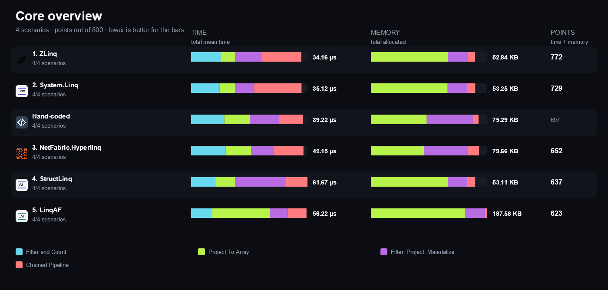

<strong>More overview charts (4)</strong>

#### Sources

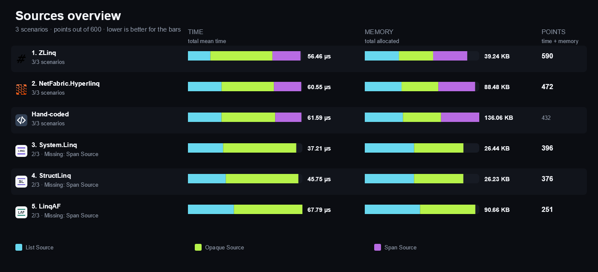

#### Partitioning

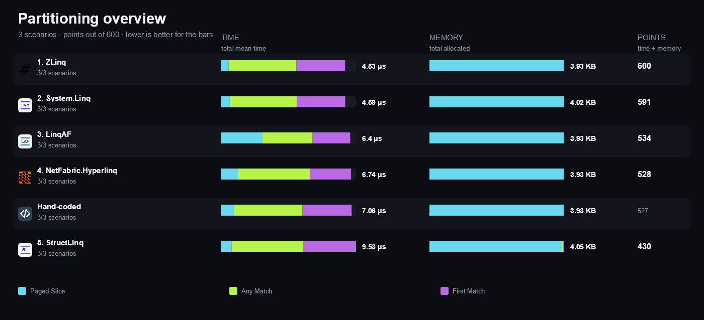

#### Sequences

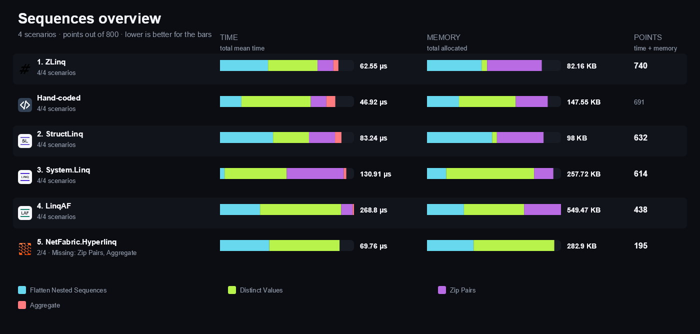

#### Advanced

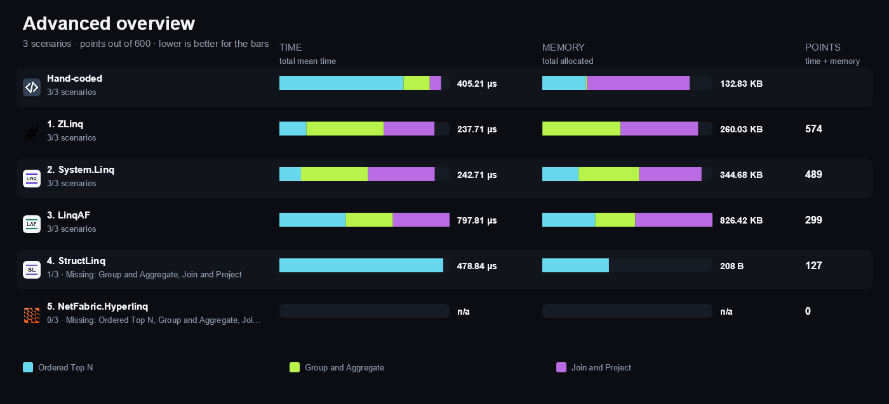

## Compared libraries (6)

<table>
<tr>
<td width="64"></td>
<td><strong>Hand-coded</strong> Direct loops written in C# without any query library.</td>
<td width="100" align="right"><a href="https://matrix.dev-team.org/?category=linq-queries&amp;library=HandCoded">Compare →</a></td>
</tr>
<tr>
<td width="64"></td>
<td><strong><a href="https://github.com/kevin-montrose/LinqAF#readme">LinqAF</a></strong> 3.0.0 A low-allocation re-implementation of LINQ-to-Objects that shadows the System.Linq operators and returns struct enumerables. Last released in 2019.</td>
<td width="100" align="right"><a href="https://matrix.dev-team.org/?category=linq-queries&amp;library=LinqAF">Compare →</a></td>
</tr>
<tr>
<td width="64"></td>
<td><strong><a href="https://github.com/NetFabric/NetFabric.Hyperlinq#readme">NetFabric.Hyperlinq</a></strong> 3.0.0-beta9 A value-enumerable LINQ implementation with span sources and low-allocation pipelines. The compared version is a prerelease.</td>
<td width="100" align="right"><a href="https://matrix.dev-team.org/?category=linq-queries&amp;library=NetFabric.Hyperlinq">Compare →</a></td>
</tr>
<tr>
<td width="64"></td>
<td><strong><a href="https://github.com/reegeek/StructLinq#readme">StructLinq</a></strong> 0.28.2 A struct-based LINQ implementation with optional struct predicates that avoid delegate indirection. Last released in 2022.</td>
<td width="100" align="right"><a href="https://matrix.dev-team.org/?category=linq-queries&amp;library=StructLinq">Compare →</a></td>
</tr>
<tr>
<td width="64"></td>
<td><strong><a href="https://learn.microsoft.com/dotnet/api/system.linq">System.Linq</a></strong> The LINQ-to-Objects implementation included with .NET, exposing the Enumerable operators over IEnumerable sequences.</td>
<td width="100" align="right"><a href="https://matrix.dev-team.org/?category=linq-queries&amp;library=System.Linq">Compare →</a></td>
</tr>
<tr>
<td width="64"></td>
<td><strong><a href="https://github.com/Cysharp/ZLinq#readme">ZLinq</a></strong> 1.6.1 A zero-allocation LINQ implementation built on struct enumerators, with span and SIMD support and a complete operator surface.</td>
<td width="100" align="right"><a href="https://matrix.dev-team.org/?category=linq-queries&amp;library=ZLinq">Compare →</a></td>
</tr>
</table>

## Benchmark scenarios (18)

### 01 · Filter and Count

Filters 10,000 integers with a predicate and counts the survivors.

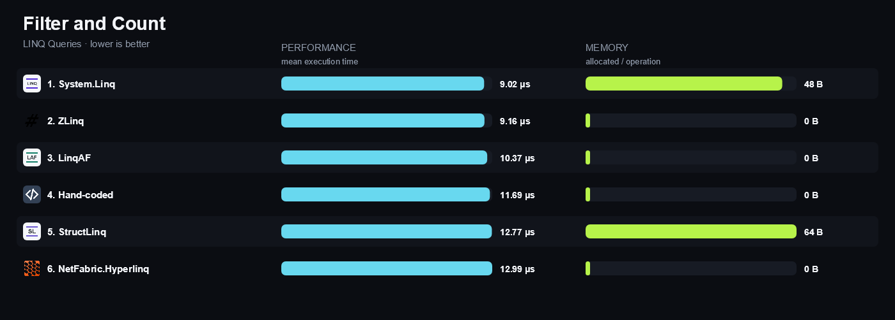

### 02 · Project To Array

Projects 10,000 integers through a selector and materializes a new array.

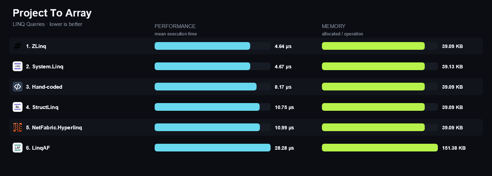

### 03 · Filter, Project, Materialize

Filters 5,000 orders by amount, projects one property, and materializes a list.

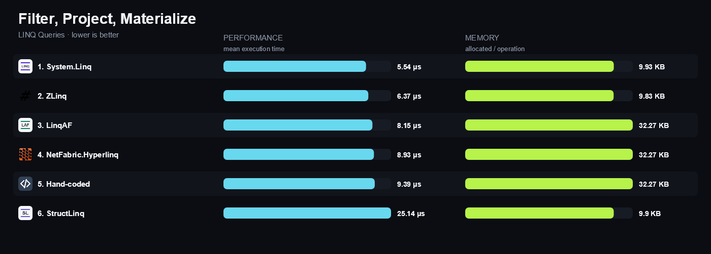

### 04 · Chained Pipeline

Composes a filter, a projection, a second filter, and a limit into one four-stage query.

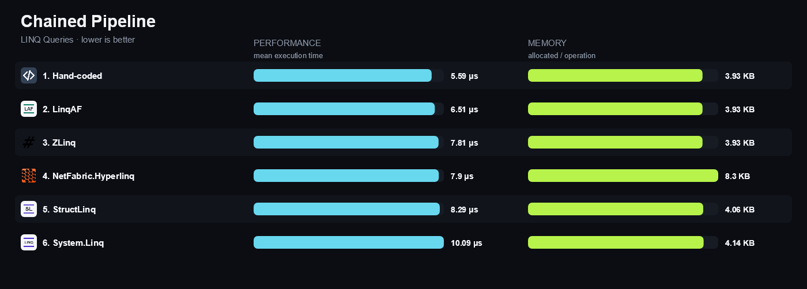

### 05 · List Source

Runs the canonical filter and projection over a List&lt;int&gt;.

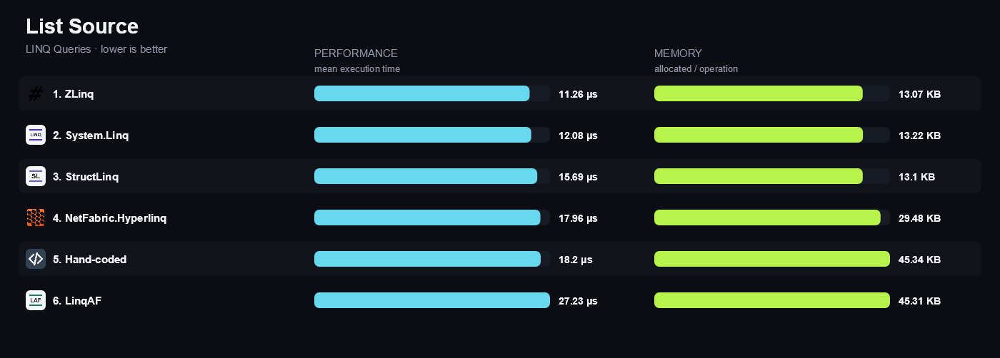

### 06 · Opaque Source

Runs the same query over an IEnumerable&lt;int&gt; exposing no count, indexer, or array.

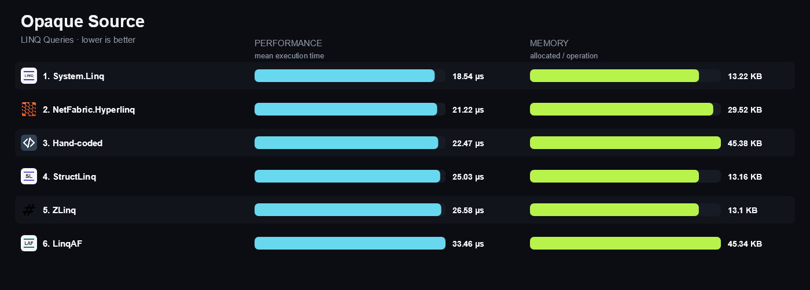

### 07 · Span Source

Runs the same query over a ReadOnlySpan&lt;int&gt;.

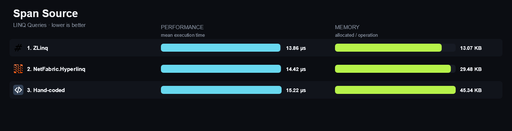

### 08 · Paged Slice

Skips 4,000 integers, takes the next 1,000, and materializes them.

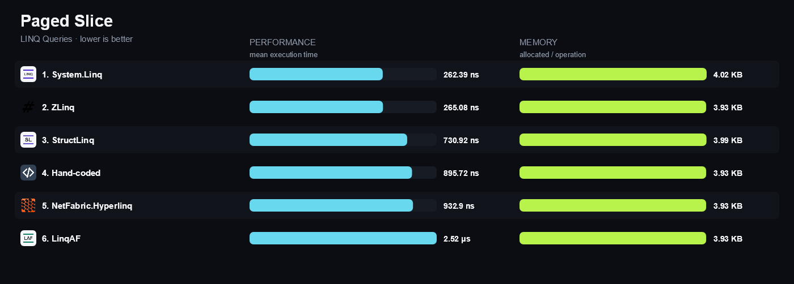

### 09 · Any Match

Reports whether any of 10,000 integers satisfies a predicate first met at index 9,500.

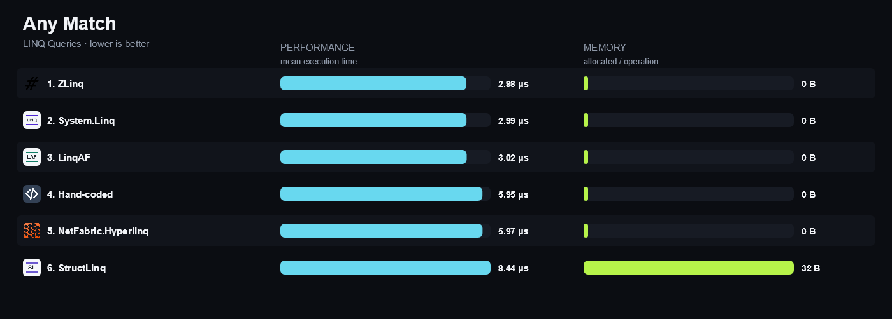

### 10 · First Match

Returns the first of 5,000 orders satisfying a predicate first met at index 4,500.

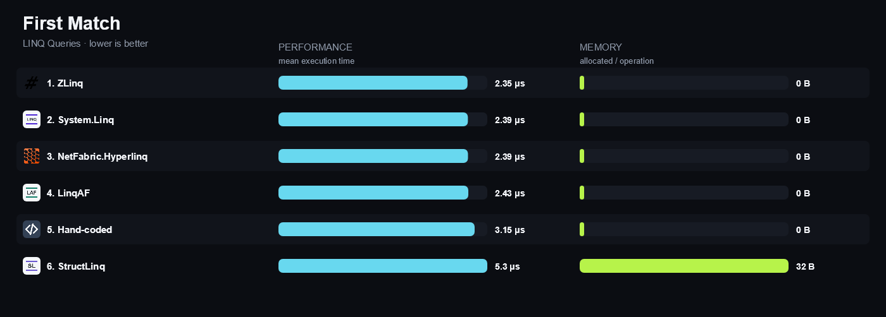

### 11 · Flatten Nested Sequences

Flattens 500 inner arrays of 20 integers and materializes the result.

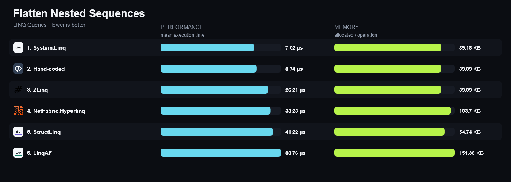

### 12 · Distinct Values

Reduces 10,000 integers containing 1,000 distinct values to the distinct set.

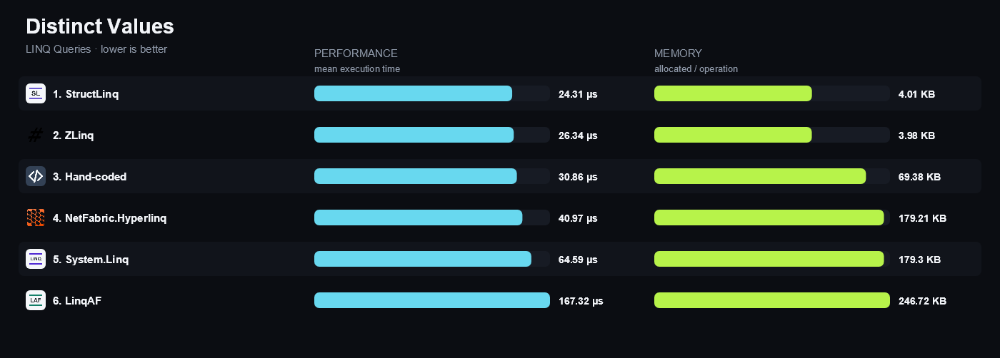

### 13 · Zip Pairs

Pairs two sequences of 10,000 integers and materializes the products.

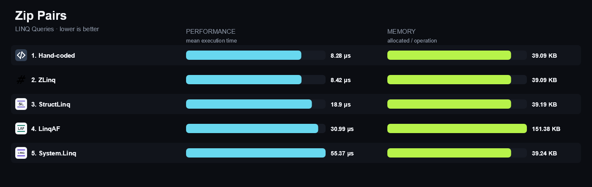

### 14 · Aggregate

Folds 10,000 integers with a caller-supplied accumulator and a seed.

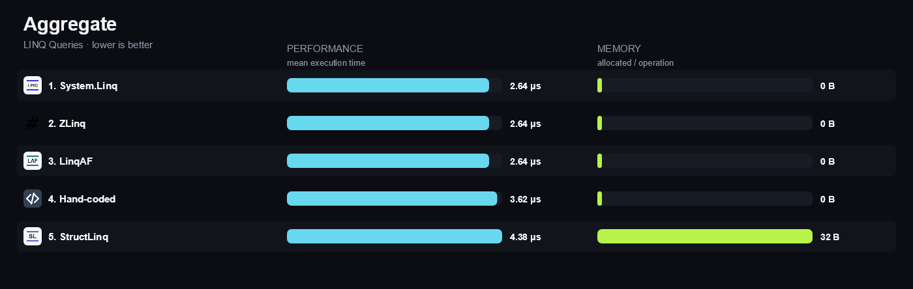

### 15 · Ordered Top N

Orders 5,000 orders by descending amount and materializes the identifiers of the top 20.

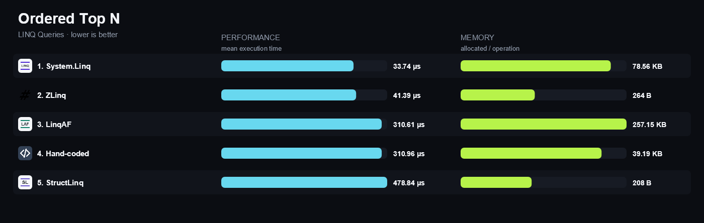

### 16 · Group and Aggregate

Groups 5,000 orders by region and produces one summed total per region.

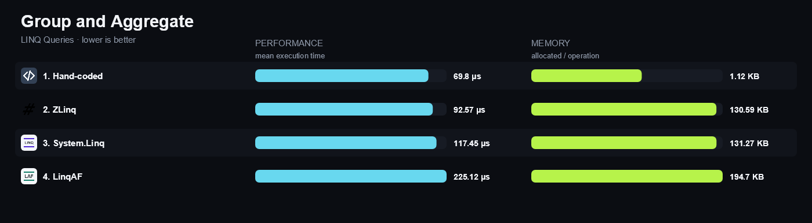

### 17 · Join and Project

Joins 5,000 orders to 500 customers on the customer key and projects the pairs.

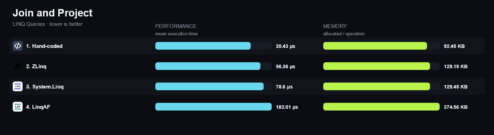

### 18 · Struct Predicate Filter

Filters and counts 10,000 integers with a struct-typed predicate instead of a delegate.

*Not rated: With this few rated entrants, the reference is a library's own result, not a result earned against a competitor, so the full 200 points would not reflect a win. (1 of 5 rated libraries support this.)*

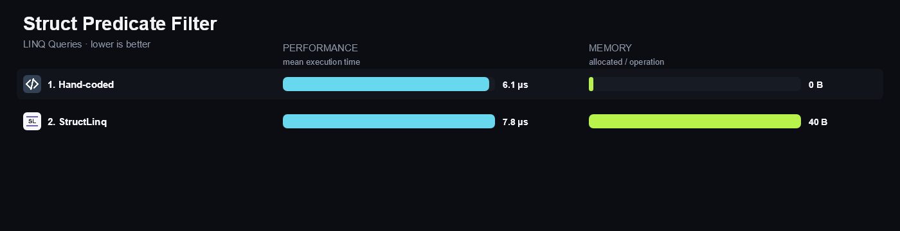

