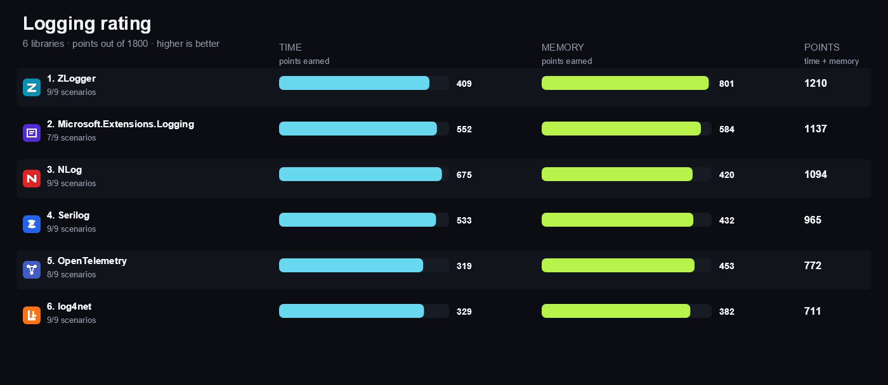

<!-- Generated by build/Templates/CategoryReport.cshtml. Do not edit this file directly. -->

[← .NET Matrix](../../README.md) · [Open the interactive matrix →](https://matrix.dev-team.org/?category=logging)

# Logging

<blockquote>
<strong><a href="https://matrix.dev-team.org/?category=logging&amp;library=ZLogger">ZLogger</a></strong> leads the current rating · 6 libraries · 9 scenarios
</blockquote>

## Rating

In every scenario the fastest library scores 100 points and the one allocating
least scores 100 more; four times slower is half the points, and an unsupported
scenario is worth nothing. Time and memory reach **900**
each here, so the maximum is **1800**.
See [workflows/rating.md](../../workflows/rating.md).

| # | Library | Scenarios | Time | Memory | Points | Group wins |
|---:|---|---:|---:|---:|---:|---|
| 1 | [**ZLogger**](https://matrix.dev-team.org/?category=logging&library=ZLogger) | 9/9 | 409 | 801 | 1210 | silver in Core, silver in Structured |
| 2 | [**Microsoft.Extensions.Logging**](https://matrix.dev-team.org/?category=logging&library=Microsoft.Extensions.Logging) | 7/9 | 552 | 584 | 1137 | gold in Structured |
| 3 | [**NLog**](https://matrix.dev-team.org/?category=logging&library=NLog) | 9/9 | 675 | 420 | 1094 | gold in Core, bronze in Prepare, bronze in Structured |
| 4 | [**Serilog**](https://matrix.dev-team.org/?category=logging&library=Serilog) | 9/9 | 533 | 432 | 965 | gold in Prepare |
| 5 | [**OpenTelemetry**](https://matrix.dev-team.org/?category=logging&library=OpenTelemetry) | 8/9 | 319 | 453 | 772 | bronze in Core |
| 6 | [**log4net**](https://matrix.dev-team.org/?category=logging&library=log4net) | 9/9 | 329 | 382 | 711 | silver in Prepare |

<strong>How the points were earned</strong> — every scenario, with the measurements behind it

Each row is one scenario. `Best` is the lowest result among the rated libraries
that completed it, and the points follow from the two figures beside them:
`100 × √((best + step) / (result + step))`, with a step of 1 ns for time and 24 B
for memory. A dash means the library did not complete the scenario, and it scores
nothing for it. Add the two Points columns over every scenario and you get the
rating above. The same breakdown appears as a hint on any points value in the
[application](https://matrix.dev-team.org/?category=logging).

#### 1. ZLogger — 1210 of 1800

| Scenario | Time | Best | Points | Memory | Best | Points |
|---|---:|---:|---:|---:|---:|---:|
| Disabled Log | 1.75 ns | 0 ns | 60.3 | 0 B | 0 B | 100 |
| Simple Message | 170.36 ns | 16.98 ns | 32.4 | 0 B | 0 B | 100 |
| Structured Properties | 170.35 ns | 43.91 ns | 51.2 | 0 B | 0 B | 100 |
| Exception | 152.35 ns | 17.86 ns | 35.1 | 0 B | 0 B | 100 |
| Scope Or Context | 270.31 ns | 73.44 ns | 52.4 | 336 B | 120 B | 63.2 |
| Template Rendering | 173.07 ns | 36.15 ns | 46.2 | 0 B | 0 B | 100 |
| Buffered Logging | 666.03 ns | 83.62 ns | 35.6 | 0 B | 0 B | 100 |
| Prepare Logger | 28 μs | 971.27 ns | 18.6 | 21.27 KB | 3.07 KB | 38.1 |
| Formatted Output | 305.84 ns | 181.76 ns | 77.2 | 0 B | 0 B | 100 |

#### 2. Microsoft.Extensions.Logging — 1137 of 1800

| Scenario | Time | Best | Points | Memory | Best | Points |
|---|---:|---:|---:|---:|---:|---:|
| Disabled Log | 6.87 ns | 0 ns | 35.6 | 0 B | 0 B | 100 |
| Simple Message | 16.98 ns | 16.98 ns | 100 | 0 B | 0 B | 100 |
| Structured Properties | 43.91 ns | 43.91 ns | 100 | 88 B | 0 B | 46.3 |
| Exception | 17.86 ns | 17.86 ns | 100 | 0 B | 0 B | 100 |
| Scope Or Context | 73.44 ns | 73.44 ns | 100 | 120 B | 120 B | 100 |
| Template Rendering | 36.15 ns | 36.15 ns | 100 | 0 B | 0 B | 100 |
| Buffered Logging | — | 83.62 ns | 0 | — | 0 B | 0 |
| Prepare Logger | 34.89 μs | 971.27 ns | 16.7 | 21.18 KB | 3.07 KB | 38.2 |
| Formatted Output | — | 181.76 ns | 0 | — | 0 B | 0 |

#### 3. NLog — 1094 of 1800

| Scenario | Time | Best | Points | Memory | Best | Points |
|---|---:|---:|---:|---:|---:|---:|
| Disabled Log | 0 ns | 0 ns | 100 | 0 B | 0 B | 100 |
| Simple Message | 51.79 ns | 16.98 ns | 58.4 | 120 B | 0 B | 40.8 |
| Structured Properties | 96.63 ns | 43.91 ns | 67.8 | 248 B | 0 B | 29.7 |
| Exception | 54.26 ns | 17.86 ns | 58.4 | 120 B | 0 B | 40.8 |
| Scope Or Context | 102.97 ns | 73.44 ns | 84.6 | 248 B | 120 B | 72.8 |
| Template Rendering | 95.56 ns | 36.15 ns | 62 | 232 B | 0 B | 30.6 |
| Buffered Logging | 83.62 ns | 83.62 ns | 100 | 120 B | 0 B | 40.8 |
| Prepare Logger | 5.13 μs | 971.27 ns | 43.5 | 24.45 KB | 3.07 KB | 35.6 |
| Formatted Output | 181.76 ns | 181.76 ns | 100 | 272 B | 0 B | 28.5 |

#### 4. Serilog — 965 of 1800

| Scenario | Time | Best | Points | Memory | Best | Points |
|---|---:|---:|---:|---:|---:|---:|
| Disabled Log | 0.37 ns | 0 ns | 85.4 | 0 B | 0 B | 100 |
| Simple Message | 88.46 ns | 16.98 ns | 44.8 | 160 B | 0 B | 36.1 |
| Structured Properties | 193.08 ns | 43.91 ns | 48.1 | 448 B | 0 B | 22.5 |
| Exception | 92.93 ns | 17.86 ns | 44.8 | 160 B | 0 B | 36.1 |
| Scope Or Context | 229.19 ns | 73.44 ns | 56.9 | 544 B | 120 B | 50.4 |
| Template Rendering | 199.66 ns | 36.15 ns | 43 | 432 B | 0 B | 22.9 |
| Buffered Logging | 681.93 ns | 83.62 ns | 35.2 | 160 B | 0 B | 36.1 |
| Prepare Logger | 971.27 ns | 971.27 ns | 100 | 3.07 KB | 3.07 KB | 100 |
| Formatted Output | 326.32 ns | 181.76 ns | 74.7 | 296 B | 0 B | 27.4 |

#### 5. OpenTelemetry — 772 of 1800

| Scenario | Time | Best | Points | Memory | Best | Points |
|---|---:|---:|---:|---:|---:|---:|
| Disabled Log | 6.8 ns | 0 ns | 35.8 | 0 B | 0 B | 100 |
| Simple Message | 114.45 ns | 16.98 ns | 39.5 | 48 B | 0 B | 57.7 |
| Structured Properties | 234.41 ns | 43.91 ns | 43.7 | 216 B | 0 B | 31.6 |
| Exception | 112.97 ns | 17.86 ns | 40.7 | 48 B | 0 B | 57.7 |
| Scope Or Context | 196.47 ns | 73.44 ns | 61.4 | 168 B | 120 B | 86.6 |
| Template Rendering | 242.1 ns | 36.15 ns | 39.1 | 112 B | 0 B | 42 |
| Buffered Logging | 317.64 ns | 83.62 ns | 51.5 | 48 B | 0 B | 57.7 |
| Prepare Logger | 202.89 μs | 971.27 ns | 6.922 | 81.32 KB | 3.07 KB | 19.5 |
| Formatted Output | — | 181.76 ns | 0 | — | 0 B | 0 |

#### 6. log4net — 711 of 1800

| Scenario | Time | Best | Points | Memory | Best | Points |
|---|---:|---:|---:|---:|---:|---:|
| Disabled Log | 9.19 ns | 0 ns | 31.3 | 0 B | 0 B | 100 |
| Simple Message | 256.21 ns | 16.98 ns | 26.4 | 160 B | 0 B | 36.1 |
| Structured Properties | 333.47 ns | 43.91 ns | 36.6 | 336 B | 0 B | 25.8 |
| Exception | 255.72 ns | 17.86 ns | 27.1 | 160 B | 0 B | 36.1 |
| Scope Or Context | 512.37 ns | 73.44 ns | 38.1 | 896 B | 120 B | 39.6 |
| Template Rendering | 286.47 ns | 36.15 ns | 35.9 | 272 B | 0 B | 28.5 |
| Buffered Logging | 623.23 ns | 83.62 ns | 36.8 | 840 B | 0 B | 16.7 |
| Prepare Logger | 13.27 μs | 971.27 ns | 27.1 | 6.79 KB | 3.07 KB | 67.4 |
| Formatted Output | 375.06 ns | 181.76 ns | 69.7 | 210 B | 0 B | 32 |

## Benchmark overview

**Core**

<strong>More overview charts (2)</strong>

#### Structured

#### Prepare

## Compared libraries (6)

<table>
<tr>
<td width="64"></td>
<td><strong><a href="https://logging.apache.org/log4net/">log4net</a></strong> 3.4.0 A mature Apache logging framework with hierarchical repositories, contextual properties, layouts, and appenders.</td>
<td width="100" align="right"><a href="https://matrix.dev-team.org/?category=logging&amp;library=log4net">Compare →</a></td>
</tr>
<tr>
<td width="64"></td>
<td><strong><a href="https://learn.microsoft.com/dotnet/core/extensions/logging">Microsoft.Extensions.Logging</a></strong> 10.0.11 The standard .NET logging abstraction and logger factory with providers, filtering, structured state, and scopes.</td>
<td width="100" align="right"><a href="https://matrix.dev-team.org/?category=logging&amp;library=Microsoft.Extensions.Logging">Compare →</a></td>
</tr>
<tr>
<td width="64"></td>
<td><strong><a href="https://nlog-project.org/">NLog</a></strong> 6.2.0 A configurable logging platform with structured events, scope context, targets, layouts, and asynchronous wrappers.</td>
<td width="100" align="right"><a href="https://matrix.dev-team.org/?category=logging&amp;library=NLog">Compare →</a></td>
</tr>
<tr>
<td width="64"></td>
<td><strong><a href="https://opentelemetry.io/docs/languages/dotnet/logs/">OpenTelemetry</a></strong> 1.18.0 The OpenTelemetry .NET logging provider and processing pipeline for collecting, enriching, batching, and exporting MEL log records.</td>
<td width="100" align="right"><a href="https://matrix.dev-team.org/?category=logging&amp;library=OpenTelemetry">Compare →</a></td>
</tr>
<tr>
<td width="64"></td>
<td><strong><a href="https://serilog.net/">Serilog</a></strong> 4.4.0 A structured event logger with message templates, contextual enrichment, and a broad sink ecosystem.</td>
<td width="100" align="right"><a href="https://matrix.dev-team.org/?category=logging&amp;library=Serilog">Compare →</a></td>
</tr>
<tr>
<td width="64"></td>
<td><strong><a href="https://github.com/Cysharp/ZLogger">ZLogger</a></strong> 2.5.10 A source-generated and interpolated-string logger built on Microsoft.Extensions.Logging with UTF-8 and processor APIs.</td>
<td width="100" align="right"><a href="https://matrix.dev-team.org/?category=logging&amp;library=ZLogger">Compare →</a></td>
</tr>
</table>

## Benchmark scenarios (9)

### 01 · Disabled Log

Submits an Information event to a logger whose minimum level is Warning.

### 02 · Simple Message

Delivers one literal Information message to an in-memory sink.

### 03 · Structured Properties

Delivers one event with independently queryable OrderId and ElapsedMs properties.

### 04 · Exception

Delivers one Error event retaining the original exception metadata.

### 05 · Scope Or Context

Creates a temporary RequestId context and captures it on one event.

### 06 · Template Rendering

Formats amount 12.5 and customer Ada through the logger template API.

### 07 · Buffered Logging

Enqueues one event to a library-provided async or buffering wrapper and validates delivery after flush. Measures the cost of accepting the event; the remaining delivery work happens on a background thread.

### 08 · Prepare Logger

Creates, verifies, and releases one Information-enabled logger with an in-memory sink.

### 09 · Formatted Output

Formats one event synchronously into a bounded in-memory sink.

