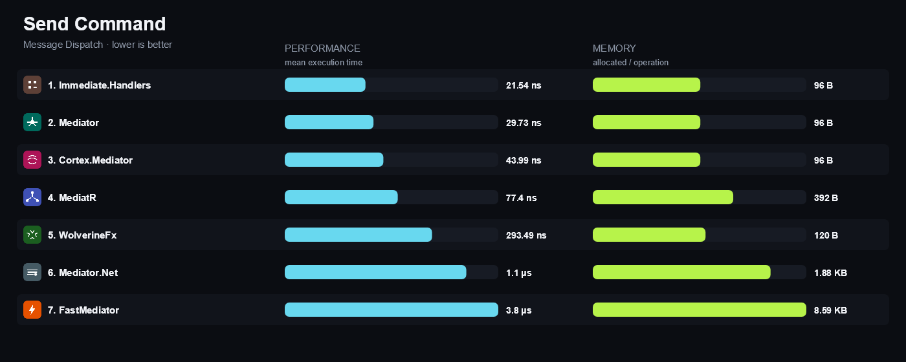
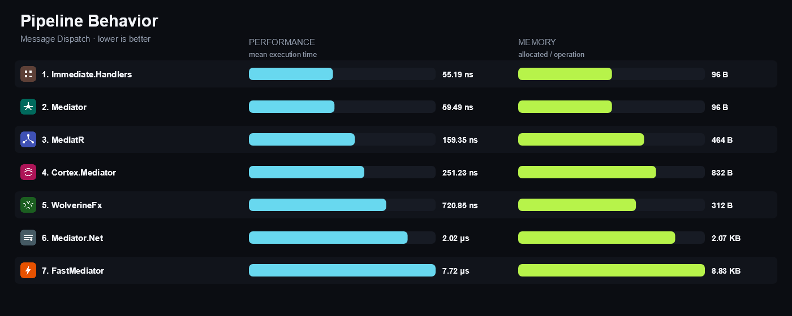

<!-- Generated by build/Templates/CategoryReport.cshtml. Do not edit this file directly. -->

[← .NET Matrix](../../README.md) · [Open the interactive matrix →](https://matrix.dev-team.org/?category=message-dispatch)

# Message Dispatch

<blockquote>
<strong><a href="https://matrix.dev-team.org/?category=message-dispatch&amp;library=Mediator">Mediator</a></strong> leads the current rating · 7 libraries · 8 scenarios
</blockquote>

## Rating

In every scenario the fastest library scores 100 points and the one allocating
least scores 100 more; four times slower is half the points, and an unsupported
scenario is worth nothing. Time and memory reach **800**
each here, so the maximum is **1600**.
See [workflows/rating.md](../../workflows/rating.md).

| # | Library | Scenarios | Time | Memory | Points | Group wins |
|---:|---|---:|---:|---:|---:|---|
| 1 | [**Mediator**](https://matrix.dev-team.org/?category=message-dispatch&library=Mediator) | 8/8 | 691 | 747 | 1438 | gold in Notification, gold in Pipeline, silver in Dispatch, silver in Generated, silver in Setup |
| 2 | [**Immediate.Handlers**](https://matrix.dev-team.org/?category=message-dispatch&library=Immediate.Handlers) | 7/8 | 665 | 648 | 1313 | gold in Dispatch, gold in Generated, gold in Setup, silver in Pipeline |
| 3 | [**MediatR**](https://matrix.dev-team.org/?category=message-dispatch&library=MediatR) | 7/8 | 386 | 349 | 735 | bronze in Dispatch, bronze in Generated, bronze in Pipeline |
| 4 | [**Cortex.Mediator**](https://matrix.dev-team.org/?category=message-dispatch&library=Cortex.Mediator) | 7/8 | 361 | 359 | 720 | bronze in Generated, bronze in Notification |
| 5 | [**WolverineFx**](https://matrix.dev-team.org/?category=message-dispatch&library=WolverineFx) | 6/8 | 162 | 363 | 525 | silver in Notification, bronze in Generated |
| 6 | [**Mediator.Net**](https://matrix.dev-team.org/?category=message-dispatch&library=Mediator.Net) | 7/8 | 149 | 176 | 325 | bronze in Generated, bronze in Setup |
| 7 | [**FastMediator**](https://matrix.dev-team.org/?category=message-dispatch&library=FastMediator) | 6/8 | 98 | 80 | 177 | bronze in Generated |

<strong>How the points were earned</strong> — every scenario, with the measurements behind it

Each row is one scenario. `Best` is the lowest result among the rated libraries
that completed it, and the points follow from the two figures beside them:
`100 × √((best + step) / (result + step))`, with a step of 1 ns for time and 24 B
for memory. A dash means the library did not complete the scenario, and it scores
nothing for it. Add the two Points columns over every scenario and you get the
rating above. The same breakdown appears as a hint on any points value in the
[application](https://matrix.dev-team.org/?category=message-dispatch).

#### 1. Mediator — 1438 of 1600

| Scenario | Time | Best | Points | Memory | Best | Points |
|---|---:|---:|---:|---:|---:|---:|
| Send Command | 67.66 ns | 51.07 ns | 87.1 | 96 B | 96 B | 100 |
| Send Query | 58.77 ns | 45.84 ns | 88.5 | 96 B | 96 B | 100 |
| Publish Notification | 29.34 ns | 29.34 ns | 100 | 96 B | 96 B | 100 |
| Pipeline Behavior | 59.49 ns | 55.19 ns | 96.4 | 96 B | 96 B | 100 |
| Exception Behavior | 1.84 μs | 1.84 μs | 100 | 392 B | 392 B | 100 |
| Async Handler | 751.78 ns | 751.78 ns | 100 | 415 B | 415 B | 100 |
| Source Generated Dispatch | 57.41 ns | 43.84 ns | 87.6 | 96 B | 96 B | 100 |
| Register | 43.99 μs | 4.41 μs | 31.7 | 35.72 KB | 7.89 KB | 47.1 |

#### 2. Immediate.Handlers — 1313 of 1600

| Scenario | Time | Best | Points | Memory | Best | Points |
|---|---:|---:|---:|---:|---:|---:|
| Send Command | 51.07 ns | 51.07 ns | 100 | 96 B | 96 B | 100 |
| Send Query | 45.84 ns | 45.84 ns | 100 | 96 B | 96 B | 100 |
| Publish Notification | — | 29.34 ns | 0 | — | 96 B | 0 |
| Pipeline Behavior | 55.19 ns | 55.19 ns | 100 | 96 B | 96 B | 100 |
| Exception Behavior | 4.08 μs | 1.84 μs | 67.1 | 1.25 KB | 392 B | 56.5 |
| Async Handler | 786.65 ns | 751.78 ns | 97.8 | 502 B | 415 B | 91.4 |
| Source Generated Dispatch | 43.84 ns | 43.84 ns | 100 | 96 B | 96 B | 100 |
| Register | 4.41 μs | 4.41 μs | 100 | 7.89 KB | 7.89 KB | 100 |

#### 3. MediatR — 735 of 1600

| Scenario | Time | Best | Points | Memory | Best | Points |
|---|---:|---:|---:|---:|---:|---:|
| Send Command | 213.37 ns | 51.07 ns | 49.3 | 392 B | 96 B | 53.7 |
| Send Query | 172.32 ns | 45.84 ns | 52 | 464 B | 96 B | 49.6 |
| Publish Notification | 496.42 ns | 29.34 ns | 24.7 | 1.28 KB | 96 B | 30 |
| Pipeline Behavior | 159.35 ns | 55.19 ns | 59.2 | 464 B | 96 B | 49.6 |
| Exception Behavior | 2.06 μs | 1.84 μs | 94.5 | 928 B | 392 B | 66.1 |
| Async Handler | 780.73 ns | 751.78 ns | 98.1 | 520 B | 415 B | 89.8 |
| Source Generated Dispatch | — | 43.84 ns | 0 | — | 96 B | 0 |
| Register | 636.32 μs | 4.41 μs | 8.328 | 719.93 KB | 7.89 KB | 10.5 |

#### 4. Cortex.Mediator — 720 of 1600

| Scenario | Time | Best | Points | Memory | Best | Points |
|---|---:|---:|---:|---:|---:|---:|
| Send Command | 100.39 ns | 51.07 ns | 71.7 | 96 B | 96 B | 100 |
| Send Query | 264.65 ns | 45.84 ns | 42 | 832 B | 96 B | 37.4 |
| Publish Notification | 220.85 ns | 29.34 ns | 37 | 512 B | 96 B | 47.3 |
| Pipeline Behavior | 251.23 ns | 55.19 ns | 47.2 | 832 B | 96 B | 37.4 |
| Exception Behavior | 2.5 μs | 1.84 μs | 85.8 | 1.17 KB | 392 B | 58.3 |
| Async Handler | 1.49 μs | 751.78 ns | 71 | 1.06 KB | 415 B | 62.9 |
| Source Generated Dispatch | — | 43.84 ns | 0 | — | 96 B | 0 |
| Register | 1.06 ms | 4.41 μs | 6.439 | 332.14 KB | 7.89 KB | 15.4 |

#### 5. WolverineFx — 525 of 1600

| Scenario | Time | Best | Points | Memory | Best | Points |
|---|---:|---:|---:|---:|---:|---:|
| Send Command | 501.4 ns | 51.07 ns | 32.2 | 120 B | 96 B | 91.3 |
| Send Query | 755.14 ns | 45.84 ns | 24.9 | 312 B | 96 B | 59.8 |
| Publish Notification | 572.93 ns | 29.34 ns | 23 | 168 B | 96 B | 79.1 |
| Pipeline Behavior | 720.85 ns | 55.19 ns | 27.9 | 312 B | 96 B | 59.8 |
| Exception Behavior | — | 1.84 μs | 0 | — | 392 B | 0 |
| Async Handler | 2.73 μs | 751.78 ns | 52.5 | 940 B | 415 B | 67.5 |
| Source Generated Dispatch | — | 43.84 ns | 0 | — | 96 B | 0 |
| Register | 14.39 ms | 4.41 μs | 1.751 | 2.85 MB | 7.89 KB | 5.205 |

#### 6. Mediator.Net — 325 of 1600

| Scenario | Time | Best | Points | Memory | Best | Points |
|---|---:|---:|---:|---:|---:|---:|
| Send Command | 2.05 μs | 51.07 ns | 15.9 | 1.88 KB | 96 B | 24.8 |
| Send Query | 2.1 μs | 45.84 ns | 14.9 | 2.07 KB | 96 B | 23.7 |
| Publish Notification | 2.96 μs | 29.34 ns | 10.1 | 2.36 KB | 96 B | 22.2 |
| Pipeline Behavior | 2.02 μs | 55.19 ns | 16.7 | 2.07 KB | 96 B | 23.7 |
| Exception Behavior | 17.11 μs | 1.84 μs | 32.8 | 6.14 KB | 392 B | 25.7 |
| Async Handler | 4.79 μs | 751.78 ns | 39.6 | 2.66 KB | 415 B | 40 |
| Source Generated Dispatch | — | 43.84 ns | 0 | — | 96 B | 0 |
| Register | 118.93 μs | 4.41 μs | 19.3 | 304.7 KB | 7.89 KB | 16.1 |

#### 7. FastMediator — 177 of 1600

| Scenario | Time | Best | Points | Memory | Best | Points |
|---|---:|---:|---:|---:|---:|---:|
| Send Command | 7.79 μs | 51.07 ns | 8.177 | 8.59 KB | 96 B | 11.7 |
| Send Query | 7.75 μs | 45.84 ns | 7.774 | 8.57 KB | 96 B | 11.7 |
| Publish Notification | — | 29.34 ns | 0 | — | 96 B | 0 |
| Pipeline Behavior | 7.72 μs | 55.19 ns | 8.532 | 8.83 KB | 96 B | 11.5 |
| Exception Behavior | 10.08 μs | 1.84 μs | 42.7 | 9.12 KB | 392 B | 21.1 |
| Async Handler | 8.35 μs | 751.78 ns | 30 | 9.48 KB | 415 B | 21.2 |
| Source Generated Dispatch | — | 43.84 ns | 0 | — | 96 B | 0 |
| Register | 242.66 ms | 4.41 μs | 0.426 | 12.4 MB | 7.89 KB | 2.496 |

## Benchmark overview

**Dispatch**

<strong>More overview charts (4)</strong>

#### Notification

#### Pipeline

#### Generated

#### Setup

## Compared libraries (7)

<table>
<tr>
<td width="64"></td>
<td><strong><a href="https://github.com/Cortex-Mediator/Cortex.Mediator">Cortex.Mediator</a></strong> 3.1.2 A mediator that separates commands, queries and notifications and offers pipeline behaviors for each of them.</td>
<td width="100" align="right"><a href="https://matrix.dev-team.org/?category=message-dispatch&amp;library=Cortex.Mediator">Compare →</a></td>
</tr>
<tr>
<td width="64"></td>
<td><strong><a href="https://github.com/SelcukGurca/FastMediator">FastMediator</a></strong> 2.0.1 A mediator focused on cached delegates and low allocation dispatch for requests and notifications.</td>
<td width="100" align="right"><a href="https://matrix.dev-team.org/?category=message-dispatch&amp;library=FastMediator">Compare →</a></td>
</tr>
<tr>
<td width="64"></td>
<td><strong><a href="https://github.com/ImmediatePlatform/Immediate.Handlers">Immediate.Handlers</a></strong> 4.4.0 A source generator that turns annotated handler methods into a dispatcher resolved from dependency injection, with no runtime reflection.</td>
<td width="100" align="right"><a href="https://matrix.dev-team.org/?category=message-dispatch&amp;library=Immediate.Handlers">Compare →</a></td>
</tr>
<tr>
<td width="64"></td>
<td><strong><a href="https://github.com/martinothamar/Mediator">Mediator</a></strong> 3.0.2 A source-generated mediator whose dispatch code is generated at compile time for lower overhead than runtime reflection.</td>
<td width="100" align="right"><a href="https://matrix.dev-team.org/?category=message-dispatch&amp;library=Mediator">Compare →</a></td>
</tr>
<tr>
<td width="64"></td>
<td><strong><a href="https://github.com/mayuanyang/Mediator.Net">Mediator.Net</a></strong> 5.0.0 A mediator with configurable command, event and request pipelines built from explicit middleware.</td>
<td width="100" align="right"><a href="https://matrix.dev-team.org/?category=message-dispatch&amp;library=Mediator.Net">Compare →</a></td>
</tr>
<tr>
<td width="64"></td>
<td><strong><a href="https://github.com/jbogard/MediatR">MediatR</a></strong> 15.0.0 A well-known in-process mediator that dispatches requests and notifications to discovered handlers through dependency injection.</td>
<td width="100" align="right"><a href="https://matrix.dev-team.org/?category=message-dispatch&amp;library=MediatR">Compare →</a></td>
</tr>
<tr>
<td width="64"></td>
<td><strong><a href="https://wolverinefx.net/">WolverineFx</a></strong> 6.65.1 A message bus and mediator whose in-process invocation path runs handlers without a transport.</td>
<td width="100" align="right"><a href="https://matrix.dev-team.org/?category=message-dispatch&amp;library=WolverineFx">Compare →</a></td>
</tr>
</table>

## Benchmark scenarios (8)

### 01 · Send Command

Dispatches one command and counts how many times its handler ran.

### 02 · Send Query

Dispatches one query and returns the answer its handler computed.

### 03 · Publish Notification

Publishes one notification to three handlers of the same type.

### 04 · Pipeline Behavior

Dispatches one query through an application-supplied pipeline behavior.

### 05 · Exception Behavior

Dispatches a query whose handler throws and recovers through the exception extension point.

### 06 · Async Handler

Awaits one query handler that completes asynchronously.

### 07 · Source Generated Dispatch

Dispatches one query through a compile-time generated registry.

### 08 · Register

Builds the container, registers the handlers and resolves the dispatcher.

