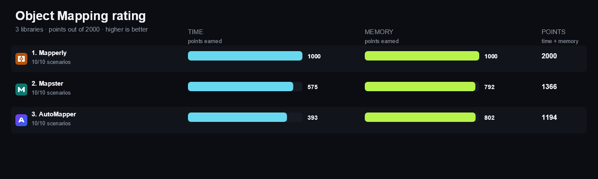
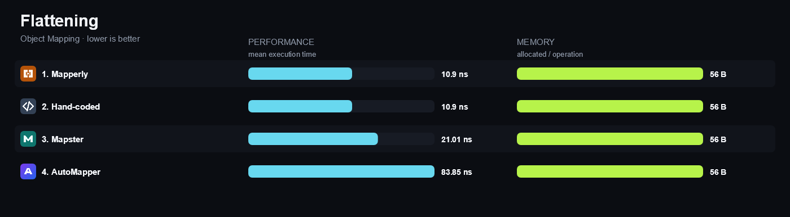
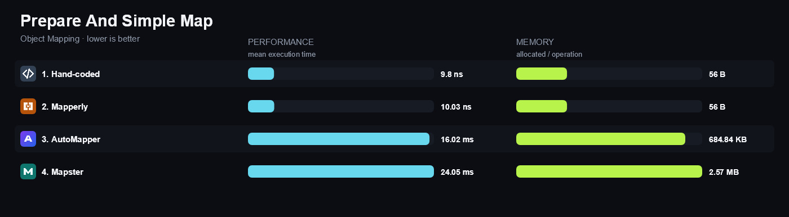

<!-- Generated by build/Templates/CategoryReport.cshtml. Do not edit this file directly. -->

[← .NET Matrix](../../README.md) · [Open the interactive matrix →](https://matrix.dev-team.org/?category=object-mapping)

# Object Mapping

<blockquote>
<strong><a href="https://matrix.dev-team.org/?category=object-mapping&amp;library=Mapperly">Mapperly</a></strong> leads the current rating · 4 libraries · 10 scenarios
</blockquote>

## Rating

In every scenario the fastest library scores 100 points and the one allocating
least scores 100 more; four times slower is half the points, and an unsupported
scenario is worth nothing. Time and memory reach **1000**
each here, so the maximum is **2000**.
See [workflows/rating.md](../../workflows/rating.md).

| # | Library | Scenarios | Time | Memory | Points | Group wins |
|---:|---|---:|---:|---:|---:|---|
| 1 | [**Mapperly**](https://matrix.dev-team.org/?category=object-mapping&library=Mapperly) | 10/10 | 1000 | 1000 | 2000 | gold in Advanced, gold in Basic, gold in Prepare |
| 2 | [**Mapster**](https://matrix.dev-team.org/?category=object-mapping&library=Mapster) | 10/10 | 592 | 792 | 1384 | silver in Advanced, silver in Basic, bronze in Prepare |
| 3 | [**AutoMapper**](https://matrix.dev-team.org/?category=object-mapping&library=AutoMapper) | 10/10 | 424 | 802 | 1226 | silver in Prepare, bronze in Advanced, bronze in Basic |

<strong>How the points were earned</strong> — every scenario, with the measurements behind it

Each row is one scenario. `Best` is the lowest result among the rated libraries
that completed it, and the points follow from the two figures beside them:
`100 × √((best + step) / (result + step))`, with a step of 1 ns for time and 24 B
for memory. A dash means the library did not complete the scenario, and it scores
nothing for it. Add the two Points columns over every scenario and you get the
rating above. The same breakdown appears as a hint on any points value in the
[application](https://matrix.dev-team.org/?category=object-mapping).

#### 1. Mapperly — 2000 of 2000

| Scenario | Time | Best | Points | Memory | Best | Points |
|---|---:|---:|---:|---:|---:|---:|
| Simple Object | 5.15 ns | 5.15 ns | 100 | 56 B | 56 B | 100 |
| Nested Object | 28.31 ns | 28.31 ns | 100 | 248 B | 248 B | 100 |
| Collection | 581 ns | 581 ns | 100 | 6.27 KB | 6.27 KB | 100 |
| Flattening | 6.08 ns | 6.08 ns | 100 | 56 B | 56 B | 100 |
| Map To Existing | 2.48 ns | 2.48 ns | 100 | 0 B | 0 B | 100 |
| Null Handling | 5.74 ns | 5.74 ns | 100 | 40 B | 40 B | 100 |
| Custom Conversion | 31.51 ns | 31.51 ns | 100 | 88 B | 88 B | 100 |
| Polymorphic Mapping | 20.94 ns | 20.94 ns | 100 | 144 B | 144 B | 100 |
| Prepare Configuration | 0 ns | 0 ns | 100 | 0 B | 0 B | 100 |
| Prepare And Simple Map | 5.43 ns | 5.43 ns | 100 | 56 B | 56 B | 100 |

#### 2. Mapster — 1384 of 2000

| Scenario | Time | Best | Points | Memory | Best | Points |
|---|---:|---:|---:|---:|---:|---:|
| Simple Object | 9.94 ns | 5.15 ns | 75 | 56 B | 56 B | 100 |
| Nested Object | 37.95 ns | 28.31 ns | 86.8 | 248 B | 248 B | 100 |
| Collection | 730.67 ns | 581 ns | 89.2 | 6.27 KB | 6.27 KB | 100 |
| Flattening | 11 ns | 6.08 ns | 76.8 | 56 B | 56 B | 100 |
| Map To Existing | 7.53 ns | 2.48 ns | 63.9 | 0 B | 0 B | 100 |
| Null Handling | 16.82 ns | 5.74 ns | 61.5 | 40 B | 40 B | 100 |
| Custom Conversion | 47.92 ns | 31.51 ns | 81.5 | 112 B | 88 B | 90.7 |
| Polymorphic Mapping | 65.91 ns | 20.94 ns | 57.3 | 144 B | 144 B | 100 |
| Prepare Configuration | 11.13 ms | 0 ns | 0.03 | 2.23 MB | 0 B | 0.321 |
| Prepare And Simple Map | 11.59 ms | 5.43 ns | 0.074 | 2.35 MB | 56 B | 0.57 |

#### 3. AutoMapper — 1226 of 2000

| Scenario | Time | Best | Points | Memory | Best | Points |
|---|---:|---:|---:|---:|---:|---:|
| Simple Object | 39.7 ns | 5.15 ns | 38.9 | 56 B | 56 B | 100 |
| Nested Object | 62.5 ns | 28.31 ns | 67.9 | 248 B | 248 B | 100 |
| Collection | 667.03 ns | 581 ns | 93.3 | 6.27 KB | 6.27 KB | 100 |
| Flattening | 36.4 ns | 6.08 ns | 43.5 | 56 B | 56 B | 100 |
| Map To Existing | 34.21 ns | 2.48 ns | 31.4 | 0 B | 0 B | 100 |
| Null Handling | 41.57 ns | 5.74 ns | 39.8 | 40 B | 40 B | 100 |
| Custom Conversion | 59.21 ns | 31.51 ns | 73.5 | 88 B | 88 B | 100 |
| Polymorphic Mapping | 173.26 ns | 20.94 ns | 35.5 | 144 B | 144 B | 100 |
| Prepare Configuration | 8.56 ms | 0 ns | 0.034 | 649.82 KB | 0 B | 0.601 |
| Prepare And Simple Map | 9.18 ms | 5.43 ns | 0.084 | 687.5 KB | 56 B | 1.066 |

## Benchmark overview

**Basic**

<strong>More overview charts (2)</strong>

#### Advanced

#### Prepare

## Compared libraries (4)

<table>
<tr>
<td width="64"></td>
<td><strong><a href="https://docs.automapper.io/">AutoMapper</a></strong> 17.0.0 A convention-based object-object mapper with runtime configuration and compiled mapping plans.</td>
<td width="100" align="right"><a href="https://matrix.dev-team.org/?category=object-mapping&amp;library=AutoMapper">Compare →</a></td>
</tr>
<tr>
<td width="64"></td>
<td><strong>Hand-coded</strong> Direct object mapping written in C# without a mapping library.</td>
<td width="100" align="right"><a href="https://matrix.dev-team.org/?category=object-mapping&amp;library=HandCoded">Compare →</a></td>
</tr>
<tr>
<td width="64"></td>
<td><strong><a href="https://mapperly.riok.app/">Mapperly</a></strong> 4.3.1 A source generator that creates readable object mapping code at compile time.</td>
<td width="100" align="right"><a href="https://matrix.dev-team.org/?category=object-mapping&amp;library=Mapperly">Compare →</a></td>
</tr>
<tr>
<td width="64"></td>
<td><strong><a href="https://github.com/MapsterMapper/Mapster/wiki">Mapster</a></strong> 10.0.14 An object mapper with runtime configuration, expression compilation, and projection support.</td>
<td width="100" align="right"><a href="https://matrix.dev-team.org/?category=object-mapping&amp;library=Mapster">Compare →</a></td>
</tr>
</table>

## Benchmark scenarios (10)

### 01 · Simple Object

Maps one object with scalar values to a newly allocated destination object.

### 02 · Nested Object

Maps an order with nested customer and address objects to a new destination graph.

### 03 · Collection

Maps an array of 100 objects while preserving count, order and member values.

### 04 · Flattening

Maps nested customer values into a flat order summary through member-path configuration.

### 05 · Map To Existing

Overwrites a supplied destination object and returns that same instance.

### 06 · Null Handling

Preserves null text, nested object and collection members in the destination.

### 07 · Custom Conversion

Maps string values through registered code and invariant decimal conversions.

### 08 · Polymorphic Mapping

Maps a base array containing cats and dogs to matching destination runtime types.

### 09 · Prepare Configuration

Creates the complete mapper configuration and eagerly prepares its runtime mapping plans.

### 10 · Prepare And Simple Map

Creates the complete mapper configuration and maps one simple object.

