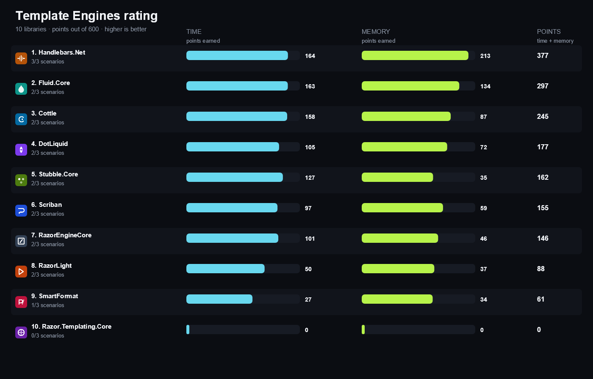
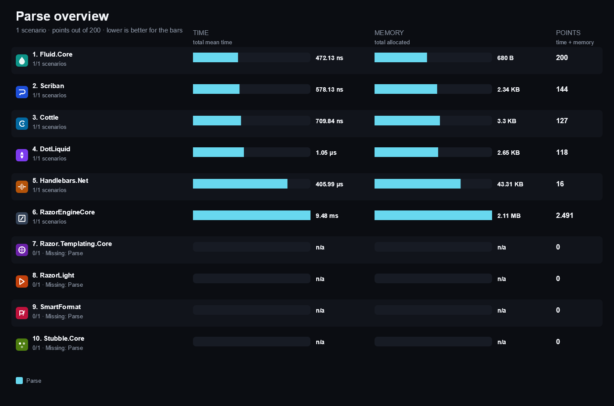
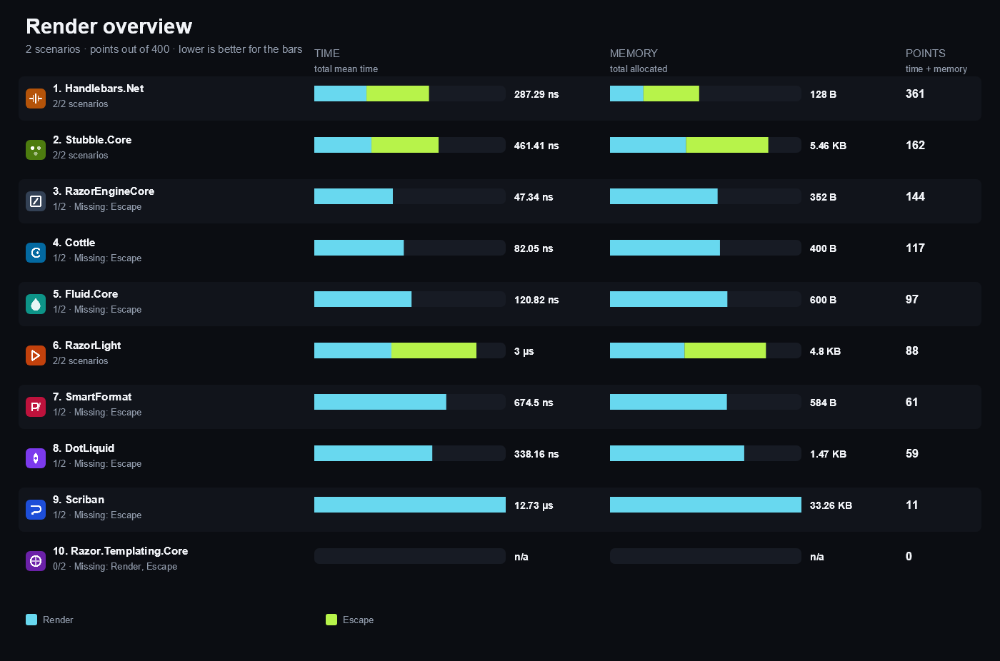
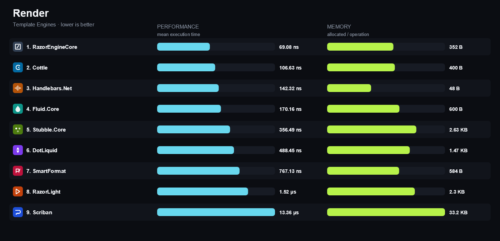
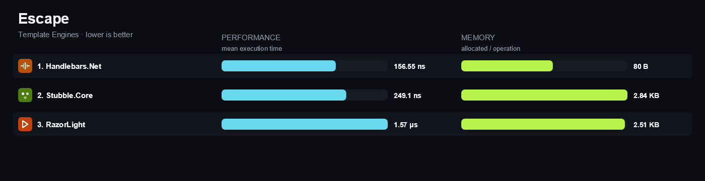

<!-- Generated by build/Templates/CategoryReport.cshtml. Do not edit this file directly. -->

[← .NET Matrix](../../README.md) · [Open the interactive matrix →](https://matrix.dev-team.org/?category=template-engines)

# Template Engines

<blockquote>
<strong><a href="https://matrix.dev-team.org/?category=template-engines&amp;library=Handlebars.Net">Handlebars.Net</a></strong> leads the current rating · 10 libraries · 3 scenarios
</blockquote>

## Rating

In every scenario the fastest library scores 100 points and the one allocating
least scores 100 more; four times slower is half the points, and an unsupported
scenario is worth nothing. Time and memory reach **300**
each here, so the maximum is **600**.
See [workflows/rating.md](../../workflows/rating.md).

| # | Library | Scenarios | Time | Memory | Points | Group wins |
|---:|---|---:|---:|---:|---:|---|
| 1 | [**Handlebars.Net**](https://matrix.dev-team.org/?category=template-engines&library=Handlebars.Net) | 3/3 | 173 | 213 | 386 | gold in Render |
| 2 | [**Fluid.Core**](https://matrix.dev-team.org/?category=template-engines&library=Fluid.Core) | 2/3 | 164 | 134 | 298 | gold in Parse |
| 3 | [**Cottle**](https://matrix.dev-team.org/?category=template-engines&library=Cottle) | 2/3 | 153 | 87 | 239 | bronze in Parse |
| 4 | [**DotLiquid**](https://matrix.dev-team.org/?category=template-engines&library=DotLiquid) | 2/3 | 101 | 72 | 174 |  |
| 5 | [**Stubble.Core**](https://matrix.dev-team.org/?category=template-engines&library=Stubble.Core) | 2/3 | 112 | 35 | 147 | silver in Render |
| 6 | [**Scriban**](https://matrix.dev-team.org/?category=template-engines&library=Scriban) | 2/3 | 88 | 59 | 146 | silver in Parse |
| 7 | [**RazorEngineCore**](https://matrix.dev-team.org/?category=template-engines&library=RazorEngineCore) | 2/3 | 101 | 46 | 146 | bronze in Render |
| 8 | [**RazorLight**](https://matrix.dev-team.org/?category=template-engines&library=RazorLight) | 2/3 | 55 | 37 | 92 |  |
| 9 | [**SmartFormat**](https://matrix.dev-team.org/?category=template-engines&library=SmartFormat) | 1/3 | 30 | 34 | 65 |  |
| 10 | [**Razor.Templating.Core**](https://matrix.dev-team.org/?category=template-engines&library=Razor.Templating.Core) | 0/3 | 0 | 0 | 0 |  |

<strong>How the points were earned</strong> — every scenario, with the measurements behind it

Each row is one scenario. `Best` is the lowest result among the rated libraries
that completed it, and the points follow from the two figures beside them:
`100 × √((best + step) / (result + step))`, with a step of 1 ns for time and 24 B
for memory. A dash means the library did not complete the scenario, and it scores
nothing for it. Add the two Points columns over every scenario and you get the
rating above. The same breakdown appears as a hint on any points value in the
[application](https://matrix.dev-team.org/?category=template-engines).

#### 1. Handlebars.Net — 386 of 600

| Scenario | Time | Best | Points | Memory | Best | Points |
|---|---:|---:|---:|---:|---:|---:|
| Parse | 501.11 μs | 481.66 ns | 3.104 | 43.32 KB | 680 B | 12.6 |
| Render | 142.32 ns | 69.08 ns | 69.9 | 48 B | 48 B | 100 |
| Escape | 178.59 ns | 178.59 ns | 100 | 80 B | 80 B | 100 |

#### 2. Fluid.Core — 298 of 600

| Scenario | Time | Best | Points | Memory | Best | Points |
|---|---:|---:|---:|---:|---:|---:|
| Parse | 481.66 ns | 481.66 ns | 100 | 680 B | 680 B | 100 |
| Render | 170.16 ns | 69.08 ns | 64 | 600 B | 48 B | 34 |
| Escape | — | 178.59 ns | 0 | — | 80 B | 0 |

#### 3. Cottle — 239 of 600

| Scenario | Time | Best | Points | Memory | Best | Points |
|---|---:|---:|---:|---:|---:|---:|
| Parse | 934.63 ns | 481.66 ns | 71.8 | 3.3 KB | 680 B | 45.5 |
| Render | 106.63 ns | 69.08 ns | 80.7 | 400 B | 48 B | 41.2 |
| Escape | — | 178.59 ns | 0 | — | 80 B | 0 |

#### 4. DotLiquid — 174 of 600

| Scenario | Time | Best | Points | Memory | Best | Points |
|---|---:|---:|---:|---:|---:|---:|
| Parse | 1.2 μs | 481.66 ns | 63.3 | 2.65 KB | 680 B | 50.7 |
| Render | 488.45 ns | 69.08 ns | 37.8 | 1.47 KB | 48 B | 21.7 |
| Escape | — | 178.59 ns | 0 | — | 80 B | 0 |

#### 5. Stubble.Core — 147 of 600

| Scenario | Time | Best | Points | Memory | Best | Points |
|---|---:|---:|---:|---:|---:|---:|
| Parse | — | 481.66 ns | 0 | — | 680 B | 0 |
| Render | 356.49 ns | 69.08 ns | 44.3 | 2.63 KB | 48 B | 16.3 |
| Escape | 394.25 ns | 178.59 ns | 67.4 | 2.84 KB | 80 B | 18.8 |

#### 6. Scriban — 146 of 600

| Scenario | Time | Best | Points | Memory | Best | Points |
|---|---:|---:|---:|---:|---:|---:|
| Parse | 741.42 ns | 481.66 ns | 80.6 | 2.34 KB | 680 B | 54 |
| Render | 13.36 μs | 69.08 ns | 7.242 | 33.2 KB | 48 B | 4.6 |
| Escape | — | 178.59 ns | 0 | — | 80 B | 0 |

#### 7. RazorEngineCore — 146 of 600

| Scenario | Time | Best | Points | Memory | Best | Points |
|---|---:|---:|---:|---:|---:|---:|
| Parse | 7.81 ms | 481.66 ns | 0.786 | 2.11 MB | 680 B | 1.784 |
| Render | 69.08 ns | 69.08 ns | 100 | 352 B | 48 B | 43.8 |
| Escape | — | 178.59 ns | 0 | — | 80 B | 0 |

#### 8. RazorLight — 92 of 600

| Scenario | Time | Best | Points | Memory | Best | Points |
|---|---:|---:|---:|---:|---:|---:|
| Parse | — | 481.66 ns | 0 | — | 680 B | 0 |
| Render | 1.52 μs | 69.08 ns | 21.5 | 2.3 KB | 48 B | 17.4 |
| Escape | 1.62 μs | 178.59 ns | 33.3 | 2.51 KB | 80 B | 20 |

#### 9. SmartFormat — 65 of 600

| Scenario | Time | Best | Points | Memory | Best | Points |
|---|---:|---:|---:|---:|---:|---:|
| Parse | — | 481.66 ns | 0 | — | 680 B | 0 |
| Render | 767.13 ns | 69.08 ns | 30.2 | 584 B | 48 B | 34.4 |
| Escape | — | 178.59 ns | 0 | — | 80 B | 0 |

#### 10. Razor.Templating.Core — 0 of 600

| Scenario | Time | Best | Points | Memory | Best | Points |
|---|---:|---:|---:|---:|---:|---:|
| Parse | — | 481.66 ns | 0 | — | 680 B | 0 |
| Render | — | 69.08 ns | 0 | — | 48 B | 0 |
| Escape | — | 178.59 ns | 0 | — | 80 B | 0 |

## Benchmark overview

**Parse**

<strong>More overview charts (1)</strong>

#### Render

## Compared libraries (10)

<table>
<tr>
<td width="64"></td>
<td><strong><a href="https://github.com/remyvdwerf/Cottle">Cottle</a></strong> 2.1.0 A lightweight template engine with a bracket syntax and parsed document reuse.</td>
<td width="100" align="right"><a href="https://matrix.dev-team.org/?category=template-engines&amp;library=Cottle">Compare →</a></td>
</tr>
<tr>
<td width="64"></td>
<td><strong><a href="https://github.com/dotliquid/dotliquid">DotLiquid</a></strong> 2.3.260 A pure .NET port of the Ruby Liquid template language.</td>
<td width="100" align="right"><a href="https://matrix.dev-team.org/?category=template-engines&amp;library=DotLiquid">Compare →</a></td>
</tr>
<tr>
<td width="64"></td>
<td><strong><a href="https://github.com/sebastienros/fluid">Fluid.Core</a></strong> 3.0.0 An embeddable Liquid template engine that parses once and renders many times.</td>
<td width="100" align="right"><a href="https://matrix.dev-team.org/?category=template-engines&amp;library=Fluid.Core">Compare →</a></td>
</tr>
<tr>
<td width="64"></td>
<td><strong><a href="https://github.com/Handlebars-Net/Handlebars.Net">Handlebars.Net</a></strong> 2.4.3 A Mustache-compatible Handlebars implementation with a compiled template delegate and HTML escaping by default.</td>
<td width="100" align="right"><a href="https://matrix.dev-team.org/?category=template-engines&amp;library=Handlebars.Net">Compare →</a></td>
</tr>
<tr>
<td width="64"></td>
<td><strong><a href="https://github.com/soundaranbu/Razor.Templating.Core">Razor.Templating.Core</a></strong> 3.1.0 A library that renders Razor views by name through the ASP.NET Core view engine.</td>
<td width="100" align="right"><a href="https://matrix.dev-team.org/?category=template-engines&amp;library=Razor.Templating.Core">Compare →</a></td>
</tr>
<tr>
<td width="64"></td>
<td><strong><a href="https://github.com/adoconnection/RazorEngineCore">RazorEngineCore</a></strong> 2026.1.1 A small Razor engine that compiles a template string with Roslyn into a reusable compiled template.</td>
<td width="100" align="right"><a href="https://matrix.dev-team.org/?category=template-engines&amp;library=RazorEngineCore">Compare →</a></td>
</tr>
<tr>
<td width="64"></td>
<td><strong><a href="https://github.com/toddams/RazorLight">RazorLight</a></strong> 2.3.1 A Razor engine that compiles templates through Roslyn and caches the compiled result.</td>
<td width="100" align="right"><a href="https://matrix.dev-team.org/?category=template-engines&amp;library=RazorLight">Compare →</a></td>
</tr>
<tr>
<td width="64"></td>
<td><strong><a href="https://github.com/scriban/scriban">Scriban</a></strong> 7.6.1 A fast Liquid and Handlebars flavoured engine with an optional scripting mode and reusable parsed templates.</td>
<td width="100" align="right"><a href="https://matrix.dev-team.org/?category=template-engines&amp;library=Scriban">Compare →</a></td>
</tr>
<tr>
<td width="64"></td>
<td><strong><a href="https://github.com/axuno/SmartFormat">SmartFormat</a></strong> 3.6.2 A string composition engine that extends string.Format syntax with named placeholders and formatters.</td>
<td width="100" align="right"><a href="https://matrix.dev-team.org/?category=template-engines&amp;library=SmartFormat">Compare →</a></td>
</tr>
<tr>
<td width="64"></td>
<td><strong><a href="https://github.com/stubbleorg/stubble">Stubble.Core</a></strong> 1.10.8 A Mustache engine with a configurable parser cache and HTML escaping by default.</td>
<td width="100" align="right"><a href="https://matrix.dev-team.org/?category=template-engines&amp;library=Stubble.Core">Compare →</a></td>
</tr>
</table>

## Benchmark scenarios (3)

### 01 · Parse

Turns template source into the engine's reusable template without rendering it.

### 02 · Render

Renders a template prepared in setup with a model into the final text.

### 03 · Escape

Renders text containing markup, which the engine must HTML-escape.

