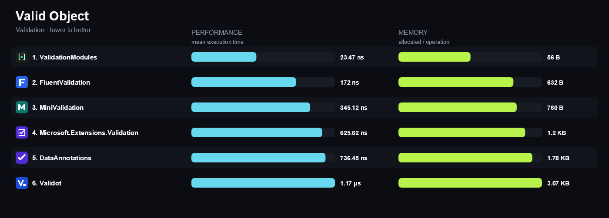
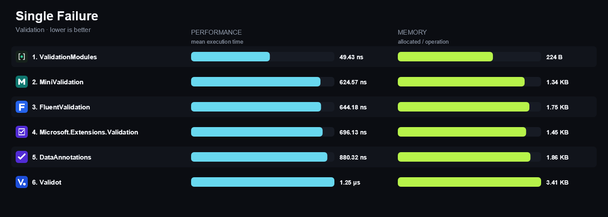
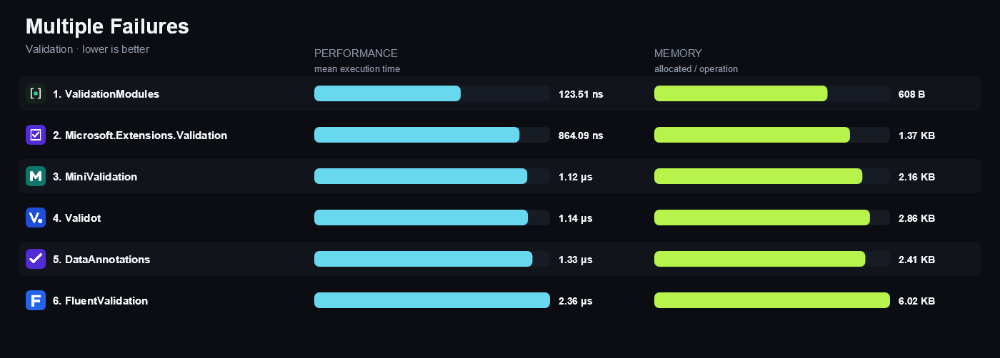
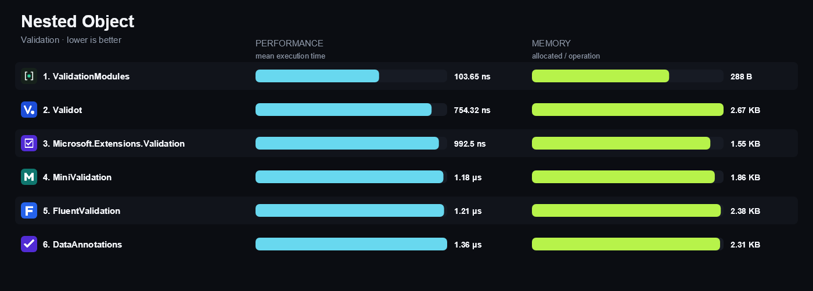
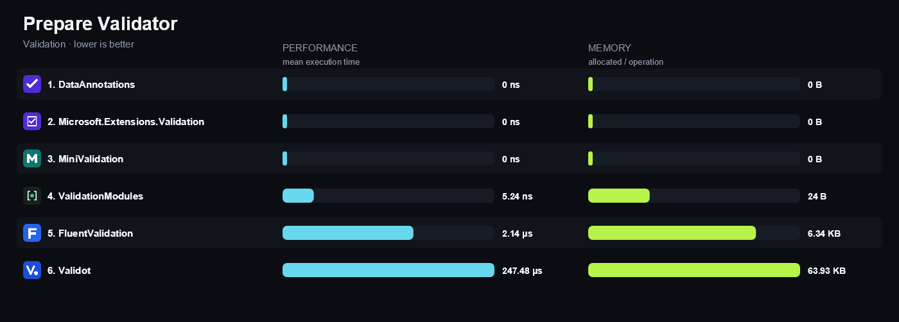

<!-- Generated by build/Templates/CategoryReport.cshtml. Do not edit this file directly. -->

[← .NET Matrix](../../README.md) · [Open the interactive matrix →](https://matrix.dev-team.org/?category=validation)

# Validation

<blockquote>
<strong><a href="https://matrix.dev-team.org/?category=validation&amp;library=ValidationModules">ValidationModules</a></strong> leads the current rating · 6 libraries · 10 scenarios
</blockquote>

## Rating

In every scenario the fastest library scores 100 points and the one allocating
least scores 100 more; four times slower is half the points, and an unsupported
scenario is worth nothing. Time and memory reach **900**
each here, so the maximum is **1800**.
See [workflows/rating.md](../../workflows/rating.md).

| # | Library | Scenarios | Time | Memory | Points | Group wins |
|---:|---|---:|---:|---:|---:|---|
| 1 | [**ValidationModules**](https://matrix.dev-team.org/?category=validation&library=ValidationModules) | 9/9 | 840 | 871 | 1711 | gold in Basic, gold in Object Graph, gold in Rules |
| 2 | [**DataAnnotations**](https://matrix.dev-team.org/?category=validation&library=DataAnnotations) | 9/9 | 324 | 430 | 754 | gold in Prepare, silver in Rules |
| 3 | [**MiniValidation**](https://matrix.dev-team.org/?category=validation&library=MiniValidation) | 8/9 | 318 | 400 | 718 | gold in Prepare, silver in Basic, silver in Object Graph |
| 4 | [**Microsoft.Extensions.Validation**](https://matrix.dev-team.org/?category=validation&library=Microsoft.Extensions.Validation) | 8/9 | 304 | 396 | 699 | gold in Prepare, bronze in Basic, bronze in Object Graph |
| 5 | [**FluentValidation**](https://matrix.dev-team.org/?category=validation&library=FluentValidation) | 9/9 | 224 | 282 | 506 | bronze in Rules |
| 6 | [**Validot**](https://matrix.dev-team.org/?category=validation&library=Validot) | 7/9 | 185 | 184 | 369 |  |

<strong>How the points were earned</strong> — every scenario, with the measurements behind it

Each row is one scenario. `Best` is the lowest result among the rated libraries
that completed it, and the points follow from the two figures beside them:
`100 × √((best + step) / (result + step))`, with a step of 1 ns for time and 24 B
for memory. A dash means the library did not complete the scenario, and it scores
nothing for it. Add the two Points columns over every scenario and you get the
rating above. The same breakdown appears as a hint on any points value in the
[application](https://matrix.dev-team.org/?category=validation).

#### 1. ValidationModules — 1711 of 1800

| Scenario | Time | Best | Points | Memory | Best | Points |
|---|---:|---:|---:|---:|---:|---:|
| Valid Object | 23.47 ns | 23.47 ns | 100 | 56 B | 56 B | 100 |
| Single Failure | 49.43 ns | 49.43 ns | 100 | 224 B | 224 B | 100 |
| Multiple Failures | 101.38 ns | 101.38 ns | 100 | 608 B | 608 B | 100 |
| Nested Object | 69.89 ns | 69.89 ns | 100 | 288 B | 288 B | 100 |
| Collection | 123.63 ns | 123.63 ns | 100 | 464 B | 464 B | 100 |
| Conditional Rule | 41.51 ns | 41.51 ns | 100 | 224 B | 224 B | 100 |
| Custom Rule | 41.16 ns | 41.16 ns | 100 | 224 B | 224 B | 100 |
| Stop On First Failure | 44.98 ns | 44.98 ns | 100 | 224 B | 224 B | 100 |
| Prepare Validator | 5.24 ns | 0 ns | 40 | 24 B | 0 B | 70.7 |

#### 2. DataAnnotations — 754 of 1800

| Scenario | Time | Best | Points | Memory | Best | Points |
|---|---:|---:|---:|---:|---:|---:|
| Valid Object | 736.45 ns | 23.47 ns | 18.2 | 1.78 KB | 56 B | 20.8 |
| Single Failure | 880.32 ns | 49.43 ns | 23.9 | 1.86 KB | 224 B | 35.9 |
| Multiple Failures | 1.26 μs | 101.38 ns | 28.5 | 2.39 KB | 608 B | 50.6 |
| Nested Object | 1.05 μs | 69.89 ns | 26 | 2.29 KB | 288 B | 36.3 |
| Collection | 2.24 μs | 123.63 ns | 23.6 | 5.22 KB | 464 B | 30.2 |
| Conditional Rule | 344.33 ns | 41.51 ns | 35.1 | 1.18 KB | 224 B | 44.9 |
| Custom Rule | 505.1 ns | 41.16 ns | 28.9 | 1.07 KB | 224 B | 47.1 |
| Stop On First Failure | 284.66 ns | 44.98 ns | 40.1 | 576 B | 224 B | 64.3 |
| Prepare Validator | 0 ns | 0 ns | 100 | 0 B | 0 B | 100 |

#### 3. MiniValidation — 718 of 1800

| Scenario | Time | Best | Points | Memory | Best | Points |
|---|---:|---:|---:|---:|---:|---:|
| Valid Object | 345.12 ns | 23.47 ns | 26.6 | 760 B | 56 B | 31.9 |
| Single Failure | 624.57 ns | 49.43 ns | 28.4 | 1.34 KB | 224 B | 42.2 |
| Multiple Failures | 1.08 μs | 101.38 ns | 30.8 | 2.16 KB | 608 B | 53.1 |
| Nested Object | 832.94 ns | 69.89 ns | 29.2 | 1.86 KB | 288 B | 40.2 |
| Collection | 1.5 μs | 123.63 ns | 28.8 | 2.77 KB | 464 B | 41.3 |
| Conditional Rule | 216.75 ns | 41.51 ns | 44.2 | 1008 B | 224 B | 49 |
| Custom Rule | 480.63 ns | 41.16 ns | 29.6 | 1.31 KB | 224 B | 42.6 |
| Stop On First Failure | — | 44.98 ns | 0 | — | 224 B | 0 |
| Prepare Validator | 0 ns | 0 ns | 100 | 0 B | 0 B | 100 |

#### 4. Microsoft.Extensions.Validation — 699 of 1800

| Scenario | Time | Best | Points | Memory | Best | Points |
|---|---:|---:|---:|---:|---:|---:|
| Valid Object | 625.62 ns | 23.47 ns | 19.8 | 1.2 KB | 56 B | 25.3 |
| Single Failure | 696.13 ns | 49.43 ns | 26.9 | 1.45 KB | 224 B | 40.5 |
| Multiple Failures | 1.04 μs | 101.38 ns | 31.4 | 2.06 KB | 608 B | 54.4 |
| Nested Object | 832.55 ns | 69.89 ns | 29.2 | 1.84 KB | 288 B | 40.5 |
| Collection | 2.25 μs | 123.63 ns | 23.5 | 4.48 KB | 464 B | 32.5 |
| Conditional Rule | 256.27 ns | 41.51 ns | 40.6 | 904 B | 224 B | 51.7 |
| Custom Rule | 405.72 ns | 41.16 ns | 32.2 | 936 B | 224 B | 50.8 |
| Stop On First Failure | — | 44.98 ns | 0 | — | 224 B | 0 |
| Prepare Validator | 0 ns | 0 ns | 100 | 0 B | 0 B | 100 |

#### 5. FluentValidation — 506 of 1800

| Scenario | Time | Best | Points | Memory | Best | Points |
|---|---:|---:|---:|---:|---:|---:|
| Valid Object | 172 ns | 23.47 ns | 37.6 | 632 B | 56 B | 34.9 |
| Single Failure | 644.18 ns | 49.43 ns | 28 | 1.75 KB | 224 B | 37 |
| Multiple Failures | 2.14 μs | 101.38 ns | 21.8 | 5.99 KB | 608 B | 32 |
| Nested Object | 862.62 ns | 69.89 ns | 28.7 | 2.38 KB | 288 B | 35.6 |
| Collection | 2.53 μs | 123.63 ns | 22.2 | 6.56 KB | 464 B | 26.9 |
| Conditional Rule | 572.84 ns | 41.51 ns | 27.2 | 1.76 KB | 224 B | 36.9 |
| Custom Rule | 568.59 ns | 41.16 ns | 27.2 | 1.84 KB | 224 B | 36 |
| Stop On First Failure | 547.5 ns | 44.98 ns | 29 | 1.75 KB | 224 B | 37 |
| Prepare Validator | 2.14 μs | 0 ns | 2.161 | 6.34 KB | 0 B | 6.067 |

#### 6. Validot — 369 of 1800

| Scenario | Time | Best | Points | Memory | Best | Points |
|---|---:|---:|---:|---:|---:|---:|
| Valid Object | 1.17 μs | 23.47 ns | 14.5 | 3.07 KB | 56 B | 15.9 |
| Single Failure | 1.25 μs | 49.43 ns | 20.1 | 3.41 KB | 224 B | 26.5 |
| Multiple Failures | 991.15 ns | 101.38 ns | 32.1 | 2.85 KB | 608 B | 46.3 |
| Nested Object | 479.32 ns | 69.89 ns | 38.4 | 2.67 KB | 288 B | 33.6 |
| Collection | — | 123.63 ns | 0 | — | 464 B | 0 |
| Conditional Rule | 266.72 ns | 41.51 ns | 39.8 | 2.67 KB | 224 B | 30 |
| Custom Rule | 265.88 ns | 41.16 ns | 39.7 | 2.67 KB | 224 B | 30 |
| Stop On First Failure | — | 44.98 ns | 0 | — | 224 B | 0 |
| Prepare Validator | 247.48 μs | 0 ns | 0.201 | 63.93 KB | 0 B | 1.914 |

## Benchmark overview

**Basic**

<strong>More overview charts (3)</strong>

#### Object Graph

#### Rules

#### Prepare

## Compared libraries (6)

<table>
<tr>
<td width="64"></td>
<td><strong><a href="https://learn.microsoft.com/dotnet/api/system.componentmodel.dataannotations">DataAnnotations</a></strong> The validation attributes and validation APIs included with the .NET framework.</td>
<td width="100" align="right"><a href="https://matrix.dev-team.org/?category=validation&amp;library=DataAnnotations">Compare →</a></td>
</tr>
<tr>
<td width="64"></td>
<td><strong><a href="https://docs.fluentvalidation.net/">FluentValidation</a></strong> 12.2.0 A strongly typed validation library with fluent rules, nested validators, cascade modes, and asynchronous validation.</td>
<td width="100" align="right"><a href="https://matrix.dev-team.org/?category=validation&amp;library=FluentValidation">Compare →</a></td>
</tr>
<tr>
<td width="64"></td>
<td><strong><a href="https://learn.microsoft.com/aspnet/core/validation/overview">Microsoft.Extensions.Validation</a></strong> 11.0.0 The official source-generated validation infrastructure for DataAnnotations-based object graph validation outside ASP.NET Core.</td>
<td width="100" align="right"><a href="https://matrix.dev-team.org/?category=validation&amp;library=Microsoft.Extensions.Validation">Compare →</a></td>
</tr>
<tr>
<td width="64"></td>
<td><strong><a href="https://github.com/DamianEdwards/MiniValidation">MiniValidation</a></strong> 0.10.0 A minimal DataAnnotations-based validator with recursive object graph traversal and cycle detection.</td>
<td width="100" align="right"><a href="https://matrix.dev-team.org/?category=validation&amp;library=MiniValidation">Compare →</a></td>
</tr>
<tr>
<td width="64"></td>
<td><strong><a href="https://ipjohnson.github.io/ValidationModules/">ValidationModules</a></strong> 1.2.0 A build-time validation library whose source generator compiles constraint attributes and rules classes into straight-line validators that use no runtime reflection.</td>
<td width="100" align="right"><a href="https://matrix.dev-team.org/?category=validation&amp;library=ValidationModules">Compare →</a></td>
</tr>
<tr>
<td width="64"></td>
<td><strong><a href="https://github.com/bartoszlenar/Validot#readme">Validot</a></strong> 2.6.0 A performance-first validation library whose declarative fluent specification compiles into a single validator covering members, nested models and collections.</td>
<td width="100" align="right"><a href="https://matrix.dev-team.org/?category=validation&amp;library=Validot">Compare →</a></td>
</tr>
</table>

## Benchmark scenarios (10)

### 01 · Valid Object

Validates one object whose scalar properties satisfy every rule.

### 02 · Single Failure

Validates one object and returns its single property failure.

### 03 · Multiple Failures

Validates one object and materializes three independent property failures.

### 04 · Nested Object

Traverses a nested object and reports the complete failing property path.

### 05 · Collection

Traverses three collection elements and reports an indexed failure path.

### 06 · Conditional Rule

Applies a tax ID rule only when the input represents a business.

### 07 · Custom Rule

Applies a custom predicate that accepts only even integer codes.

### 08 · Stop On First Failure

Stops validation after the first failing rule in the declared order.

### 09 · Async Validation

Runs a deterministic asynchronous availability rule through the library async API.

*Not rated: With this few rated entrants, the reference is a library's own result, not a result earned against a competitor, so the full 200 points would not reflect a win. (2 of 6 rated libraries support this.)*

### 10 · Prepare Validator

Creates the complete scalar validator or rule graph without validating an input.

