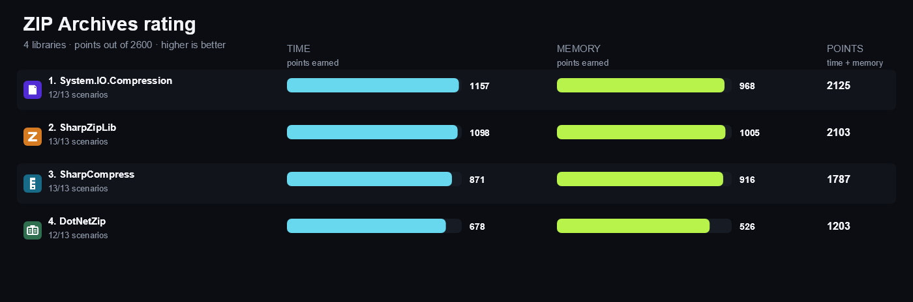
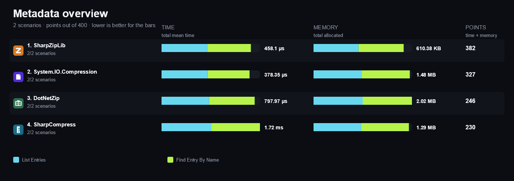
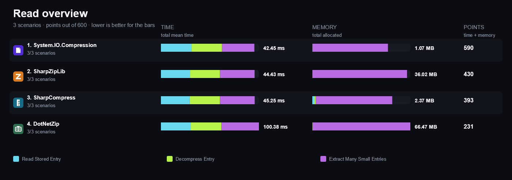
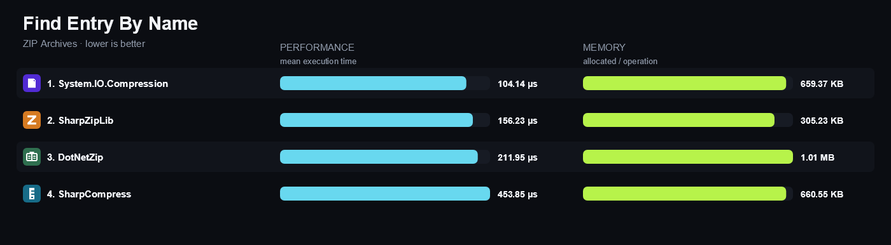
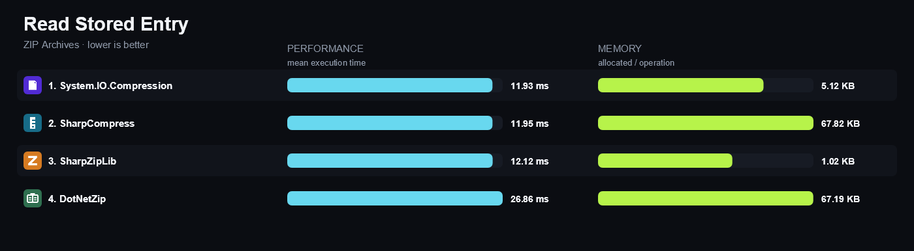
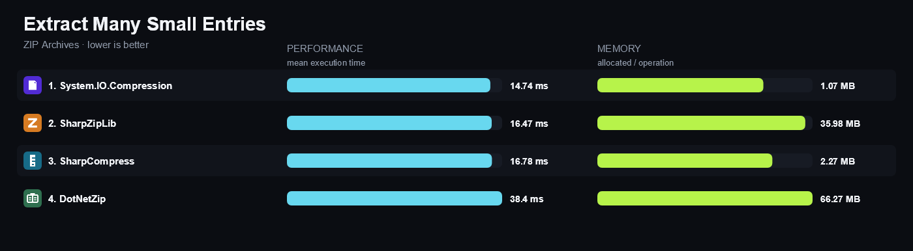

<!-- Generated by build/Templates/CategoryReport.cshtml. Do not edit this file directly. -->

[← .NET Matrix](../../README.md) · [Open the interactive matrix →](https://matrix.dev-team.org/?category=zip-archives)

# ZIP Archives

<blockquote>
<strong><a href="https://matrix.dev-team.org/?category=zip-archives&amp;library=System.IO.Compression">System.IO.Compression</a></strong> leads the current rating · 4 libraries · 13 scenarios
</blockquote>

## Rating

In every scenario the fastest library scores 100 points and the one allocating
least scores 100 more; four times slower is half the points, and an unsupported
scenario is worth nothing. Time and memory reach **1300**
each here, so the maximum is **2600**.
See [workflows/rating.md](../../workflows/rating.md).

| # | Library | Scenarios | Time | Memory | Points | Group wins |
|---:|---|---:|---:|---:|---:|---|
| 1 | [**System.IO.Compression**](https://matrix.dev-team.org/?category=zip-archives&library=System.IO.Compression) | 12/13 | 1170 | 968 | 2137 | gold in Read, gold in Write, silver in Metadata, bronze in Advanced |
| 2 | [**SharpZipLib**](https://matrix.dev-team.org/?category=zip-archives&library=SharpZipLib) | 13/13 | 1120 | 1005 | 2126 | gold in Advanced, gold in Metadata, silver in Read, silver in Write |
| 3 | [**SharpCompress**](https://matrix.dev-team.org/?category=zip-archives&library=SharpCompress) | 13/13 | 886 | 916 | 1802 | silver in Advanced, bronze in Read, bronze in Write |
| 4 | [**DotNetZip**](https://matrix.dev-team.org/?category=zip-archives&library=DotNetZip) | 12/13 | 741 | 526 | 1267 | bronze in Metadata |

<strong>How the points were earned</strong> — every scenario, with the measurements behind it

Each row is one scenario. `Best` is the lowest result among the rated libraries
that completed it, and the points follow from the two figures beside them:
`100 × √((best + step) / (result + step))`, with a step of 1 ns for time and 24 B
for memory. A dash means the library did not complete the scenario, and it scores
nothing for it. Add the two Points columns over every scenario and you get the
rating above. The same breakdown appears as a hint on any points value in the
[application](https://matrix.dev-team.org/?category=zip-archives).

#### 1. System.IO.Compression — 2137 of 2600

| Scenario | Time | Best | Points | Memory | Best | Points |
|---|---:|---:|---:|---:|---:|---:|
| List Entries | 144.13 μs | 144.13 μs | 100 | 659.41 KB | 305.15 KB | 68 |
| Find Entry By Name | 136.93 μs | 136.93 μs | 100 | 659.37 KB | 305.23 KB | 68 |
| Read Stored Entry | 11.93 ms | 11.93 ms | 100 | 5.12 KB | 1.02 KB | 45 |
| Decompress Entry | 12.16 ms | 12.16 ms | 100 | 5.38 KB | 5.38 KB | 100 |
| Extract Many Small Entries | 12.47 ms | 12.47 ms | 100 | 987.53 KB | 987.53 KB | 100 |
| Create Stored Archive | 171.52 μs | 171.52 μs | 100 | 645.86 KB | 645.86 KB | 100 |
| Create Deflate Fast Archive | 503.43 μs | 503.43 μs | 100 | 329.69 KB | 329.69 KB | 100 |
| Create Deflate Optimal Archive | 927.06 μs | 927.06 μs | 100 | 193.67 KB | 193.67 KB | 100 |
| Create Many Small Entries | 5.32 ms | 5.32 ms | 100 | 12.66 MB | 12.66 MB | 100 |
| Append Entry | 171.51 μs | 171.51 μs | 100 | 394.87 KB | 394.87 KB | 100 |
| Sequential Non-Seekable Read | 15.4 ms | 14.01 ms | 95.4 | 16.84 MB | 458.66 KB | 16.3 |
| Read Zip64 Archive | 46.62 ms | 25.77 ms | 74.3 | 39.39 MB | 19.5 MB | 70.4 |
| Read AES Encrypted Entry | — | 915.88 μs | 0 | — | 9.81 KB | 0 |

#### 2. SharpZipLib — 2126 of 2600

| Scenario | Time | Best | Points | Memory | Best | Points |
|---|---:|---:|---:|---:|---:|---:|
| List Entries | 177.58 μs | 144.13 μs | 90.1 | 305.15 KB | 305.15 KB | 100 |
| Find Entry By Name | 186.63 μs | 136.93 μs | 85.7 | 305.23 KB | 305.23 KB | 100 |
| Read Stored Entry | 12.12 ms | 11.93 ms | 99.2 | 1.02 KB | 1.02 KB | 100 |
| Decompress Entry | 12.46 ms | 12.16 ms | 98.8 | 41.05 KB | 5.38 KB | 36.3 |
| Extract Many Small Entries | 13.78 ms | 12.47 ms | 95.1 | 35.98 MB | 987.53 KB | 16.4 |
| Create Stored Archive | 286.99 μs | 171.52 μs | 77.3 | 957.7 KB | 645.86 KB | 82.1 |
| Create Deflate Fast Archive | 1.8 ms | 503.43 μs | 52.9 | 622.91 KB | 329.69 KB | 72.8 |
| Create Deflate Optimal Archive | 2.12 ms | 927.06 μs | 66.1 | 621.27 KB | 193.67 KB | 55.8 |
| Create Many Small Entries | 7.02 ms | 5.32 ms | 87.1 | 13.99 MB | 12.66 MB | 95.1 |
| Append Entry | 175.82 μs | 171.51 μs | 98.8 | 398.18 KB | 394.87 KB | 99.6 |
| Sequential Non-Seekable Read | 14.01 ms | 14.01 ms | 100 | 458.66 KB | 458.66 KB | 100 |
| Read Zip64 Archive | 25.77 ms | 25.77 ms | 100 | 19.5 MB | 19.5 MB | 100 |
| Read AES Encrypted Entry | 1.91 ms | 915.88 μs | 69.2 | 43.91 KB | 9.81 KB | 47.3 |

#### 3. SharpCompress — 1802 of 2600

| Scenario | Time | Best | Points | Memory | Best | Points |
|---|---:|---:|---:|---:|---:|---:|
| List Entries | 641.43 μs | 144.13 μs | 47.4 | 660.69 KB | 305.15 KB | 68 |
| Find Entry By Name | 653.02 μs | 136.93 μs | 45.8 | 660.55 KB | 305.23 KB | 68 |
| Read Stored Entry | 11.95 ms | 11.93 ms | 99.9 | 67.82 KB | 1.02 KB | 12.4 |
| Decompress Entry | 12.63 ms | 12.16 ms | 98.1 | 33.56 KB | 5.38 KB | 40.1 |
| Extract Many Small Entries | 14.36 ms | 12.47 ms | 93.2 | 2.27 MB | 987.53 KB | 65.2 |
| Create Stored Archive | 882.3 μs | 171.52 μs | 44.1 | 646.26 KB | 645.86 KB | 100 |
| Create Deflate Fast Archive | 2.46 ms | 503.43 μs | 45.3 | 345.05 KB | 329.69 KB | 97.7 |
| Create Deflate Optimal Archive | 2.83 ms | 927.06 μs | 57.3 | 344.6 KB | 193.67 KB | 75 |
| Create Many Small Entries | 19.49 ms | 5.32 ms | 52.2 | 12.69 MB | 12.66 MB | 99.9 |
| Append Entry | 904.76 μs | 171.51 μs | 43.5 | 721.95 KB | 394.87 KB | 74 |
| Sequential Non-Seekable Read | 14.61 ms | 14.01 ms | 97.9 | 2.28 MB | 458.66 KB | 44.3 |
| Read Zip64 Archive | 68.01 ms | 25.77 ms | 61.6 | 38.07 MB | 19.5 MB | 71.6 |
| Read AES Encrypted Entry | 915.88 μs | 915.88 μs | 100 | 9.81 KB | 9.81 KB | 100 |

#### 4. DotNetZip — 1267 of 2600

| Scenario | Time | Best | Points | Memory | Best | Points |
|---|---:|---:|---:|---:|---:|---:|
| List Entries | 259.18 μs | 144.13 μs | 74.6 | 1.01 MB | 305.15 KB | 54.3 |
| Find Entry By Name | 255.78 μs | 136.93 μs | 73.2 | 1.01 MB | 305.23 KB | 54.3 |
| Read Stored Entry | 26.86 ms | 11.93 ms | 66.6 | 67.19 KB | 1.02 KB | 12.5 |
| Decompress Entry | 27.15 ms | 12.16 ms | 66.9 | 135.79 KB | 5.38 KB | 20 |
| Extract Many Small Entries | 32.27 ms | 12.47 ms | 62.2 | 66.27 MB | 987.53 KB | 12.1 |
| Create Stored Archive | 914.1 μs | 171.52 μs | 43.3 | 895.61 KB | 645.86 KB | 84.9 |
| Create Deflate Fast Archive | 2.76 ms | 503.43 μs | 42.7 | 1.7 MB | 329.69 KB | 43.5 |
| Create Deflate Optimal Archive | 3.07 ms | 927.06 μs | 55 | 1.57 MB | 193.67 KB | 34.7 |
| Create Many Small Entries | 26.91 ms | 5.32 ms | 44.5 | 54.39 MB | 12.66 MB | 48.2 |
| Append Entry | 195.87 μs | 171.51 μs | 93.6 | 700.79 KB | 394.87 KB | 75.1 |
| Sequential Non-Seekable Read | — | 14.01 ms | 0 | — | 458.66 KB | 0 |
| Read Zip64 Archive | 77.34 ms | 25.77 ms | 57.7 | 54.71 MB | 19.5 MB | 59.7 |
| Read AES Encrypted Entry | 2.5 ms | 915.88 μs | 60.5 | 138.1 KB | 9.81 KB | 26.7 |

## Benchmark overview

**Metadata**

<strong>More overview charts (3)</strong>

#### Read

#### Write

#### Advanced

## Compared libraries (4)

<table>
<tr>
<td width="64"></td>
<td><strong><a href="https://github.com/haf/DotNetZip.Semverd/wiki">DotNetZip</a></strong> 1.16.0 A managed ZIP library with stored and deflate entries, Zip64, WinZip AES encryption, forward-only reads, and archive updates.</td>
<td width="100" align="right"><a href="https://matrix.dev-team.org/?category=zip-archives&amp;library=DotNetZip">Compare →</a></td>
</tr>
<tr>
<td width="64"></td>
<td><strong><a href="https://github.com/adamhathcock/sharpcompress/blob/master/docs/USAGE.md">SharpCompress</a></strong> 0.50.10 A fully managed archive library with random-access, forward-only, non-seekable, encrypted, and asynchronous ZIP APIs.</td>
<td width="100" align="right"><a href="https://matrix.dev-team.org/?category=zip-archives&amp;library=SharpCompress">Compare →</a></td>
</tr>
<tr>
<td width="64"></td>
<td><strong><a href="https://icsharpcode.github.io/SharpZipLib/">SharpZipLib</a></strong> 1.4.2 A mature managed compression library supporting ZIP, Zip64, stored and deflate entries, streaming, and AES encryption.</td>
<td width="100" align="right"><a href="https://matrix.dev-team.org/?category=zip-archives&amp;library=SharpZipLib">Compare →</a></td>
</tr>
<tr>
<td width="64"></td>
<td><strong><a href="https://learn.microsoft.com/dotnet/api/system.io.compression">System.IO.Compression</a></strong> The ZIP implementation included with .NET, exposing ZipArchive, ZipArchiveEntry, and ZipFile APIs.</td>
<td width="100" align="right"><a href="https://matrix.dev-team.org/?category=zip-archives&amp;library=System.IO.Compression">Compare →</a></td>
</tr>
</table>

## Benchmark scenarios (13)

### 01 · List Entries

Opens a ZIP archive and enumerates 1,000 entry names and sizes.

### 02 · Find Entry By Name

Opens a 1,000-entry ZIP archive and locates its final entry by exact name.

### 03 · Read Stored Entry

Opens and reads one uncompressed 4 MiB ZIP entry.

### 04 · Decompress Entry

Opens and inflates one 4 MiB deflated ZIP entry.

### 05 · Extract Many Small Entries

Opens and reads all 1,000 small entries from a ZIP archive.

### 06 · Create Stored Archive

Creates a stored ZIP archive containing a deterministic mixed corpus.

### 07 · Create Deflate Fast Archive

Creates a Deflate level 1 ZIP archive containing the deterministic mixed corpus.

### 08 · Create Deflate Optimal Archive

Creates a Deflate level 6 ZIP archive containing the deterministic mixed corpus.

### 09 · Create Many Small Entries

Creates a stored ZIP archive containing 1,000 small files.

### 10 · Append Entry

Opens an existing ZIP archive for update and appends one stored entry.

### 11 · Sequential Non-Seekable Read

Reads all entries through a forward-only ZIP API from a non-seekable stream.

### 12 · Read Zip64 Archive

Opens and enumerates a Zip64 archive containing 65,536 entries.

### 13 · Read AES Encrypted Entry

Opens and decrypts one AES-256 encrypted ZIP entry.

